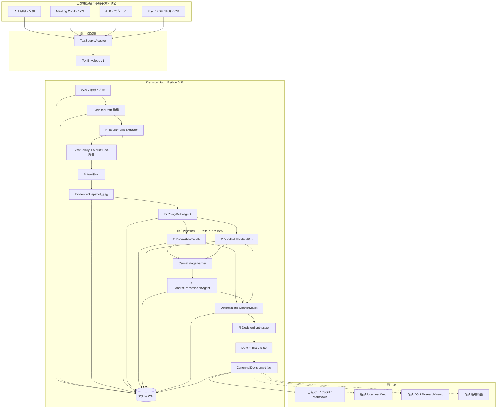
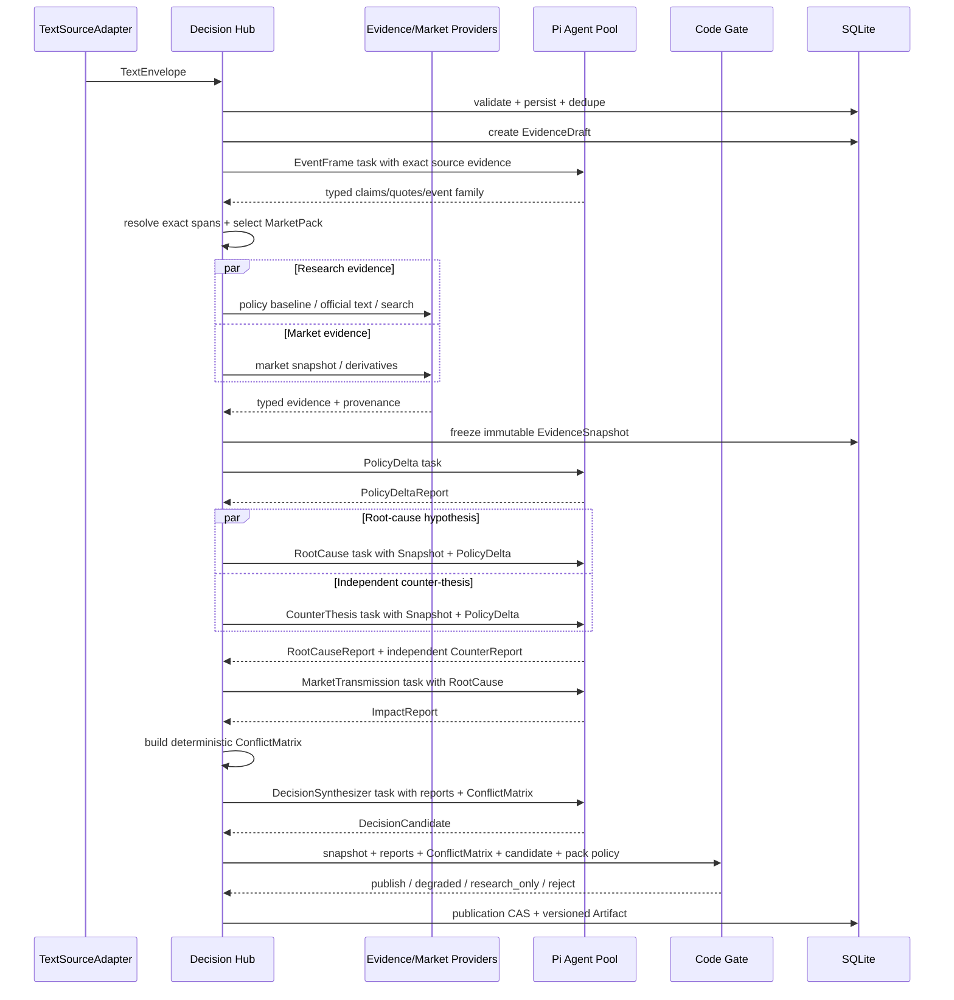

# Decision Hub 最终技术架构

> 状态：Text-Core First 仍有效；本文的 `asyncio Coordinator + 固定 Pi 角色链` 已于 2026-08-23 被长期维护性审查退回，禁止直接作为实施基线  
> 日期：2026-08-23（Asia/Shanghai）  
> 部署目标：Windows 本机、单 owner、中央单实例、外部高质量 LLM  
> 首个 Domain Pack：Powell/FOMC -> BTC + 国际黄金；分别输出 `0-30m` 和 `1-3d`  
> 调查与讨论原始记录：[DSH_RESEARCH_DECISION_LOG.md](./DSH_RESEARCH_DECISION_LOG.md)

> **维护性纠偏：** 用户补充了每天多次运行、长期异常恢复、策略/领域热演进、开放式多 Agent、DSH 会话归档和持续网络监听等完整生命周期要求。这些要求已经满足正式 Workflow Runtime 的引入条件。当前推荐改为 `LangGraph 顶层生命周期图 + 可版本化 Strategy Subgraph + Pi SDK AgentRuntime + DSH Research Workbench + Alert Legacy Strategy`。新方案正在第 33 节登记；本文后续章节保留为一次已否决方案的契约审计材料，其中 Evidence/Gate/Artifact 不变量仍可复用，但“不使用 LangGraph”和固定工作流结论不再有效。

---

## 0. 先纠正主次关系

系统第一阶段不做 ASR，也不先做日历、新闻监听、通知或完整 Web。

第一阶段只做这一条纵向链：

```text
一段已经存在的文本
  -> 标准化文本契约
  -> 可回源证据
  -> 冻结分析快照
  -> 多 Agent 根因分析
  -> 决策合成
  -> 代码 Gate
  -> 可审计决策结果
```

ASR、直播字幕、新闻、日历、网页、PDF、图片 OCR 和人工粘贴都只是上游来源。它们以后各自实现一个 `TextSourceAdapter`，统一产出 `TextEnvelope`；文本进入 Core 后，后面的分析链完全不知道它原来是音频还是网页。

因此：

- 当前不改 Meeting Copilot 的 ASR 模型；
- 当前不评测中文或英文 ASR；
- 当前不接实时新闻和日历 daemon；
- 当前不开发通知；
- 当前先用人工文本或已保存转写把核心决策链跑通。

这不是纯 `LLM + Prompt`。LLM 只存在于受限的分析节点；证据身份、版本、运行状态、超时、发布、撤回和风险门禁全部由普通代码控制。

---

## 1. 一句话架构结论

最终架构是：

```text
Python Decision Hub
  + Pydantic 严格契约
  + SQLite 唯一业务账本
  + Alert 已有证据/市场/结构化决策能力
  + Pi 普通 Agent 实现多个独立分析角色
  + asyncio 实现固定、有界的并发阶段
  + 模型外 deterministic Gate
  + 可插拔 TextSource / Evidence / Market / Pack / Runtime
```

框架分工不是 `Pi / DSH / LangGraph` 三选一：

| 组件 | 首版位置 | 精确职责 | 是否拥有最终发布权 |
|---|---|---|---|
| Decision Hub | 正式主系统 | 文本、证据、版本、编排、状态、Gate、Artifact、回放 | 是，且只允许代码 Gate 后发布 |
| Pi SDK | 正式 Agent Runtime | 执行独立的政策变化、根因、传导和反方分析角色 | 否 |
| Alert | 领域能力库 | 抽取市场/Search Provider、领域模型、Evidence/Risk Gate 和测试，不运行原产品主链 | 否 |
| `crypto-macro-decision` | Domain Doctrine | 提供根因链方法、数据优先级、因子和输出语义 | 否 |
| DSH | 后续人工研究台 | Skill/MCP/Subagent 深研，输出独立 `ResearchMemo` | 否 |
| LangGraph | 首版不引入 | 以后只有出现真正的长流程/动态图需求才评估 | 否 |

首版进程拓扑固定为一个主进程加两个受管子进程：

```text
1. Python decision-hub
2. Node pi-worker-1
3. Node pi-worker-2
```

现有 Meeting Pi bridge 是 single-inflight；Python 端有锁，Node 端也逐请求 `await`，所以一个 sidecar 不能实现 RootCause/Counter 并行。首版直接固定 `PiWorkerPool(size=2)`：串行阶段使用任意一个空闲 worker，唯一的双路并行各占一个。这里复用每个 worker 的监督/JSONL骨架，只新增一个很薄的 Python pool，不把“并发数”留到实现时再猜。

不需要 Redis、PostgreSQL、Kafka、Celery、Temporal、DBOS、LangGraph Server、Aegra 或 Kubernetes。

---

## 2. 从文本到结果的完整架构图



需要特别看清四个边界：

1. `TextSourceAdapter` 到 `TextEnvelope` 为止，来源工作就结束了。
2. 公网搜索和市场补证只能发生在 `EvidenceSnapshot` 冻结之前。
3. `EventFrameExtractor` 是冻结前唯一的 Pi 例外：只读已经持久化的 exact-source `EvidenceDraft`，且没有公网工具；其余 Pi Worker 只读 frozen `AnalysisInput/WorkerInputView`，不能边分析边修改证据。
4. LLM 只能生成候选报告；最后是否发布由代码 Gate 决定。

---

## 3. 单次文本分析的真实时序



一轮运行不会让 Agent 自由创建更多 Agent。角色、依赖、预算和成功条件由 Pack 中的 `AnalysisPlan` 显式声明，Coordinator 按计划真正创建独立 Agent 实例。

---

## 4. 每个节点到底怎么实现

| 阶段 | 输入 -> 输出 | 是否调用 LLM | 框架/技术 | 复用来源 | 失败处理 |
|---|---|---:|---|---|---|
| `accept_text` | `TextEnvelope -> AcceptedText` | 否 | Pydantic v2、SHA-256、SQLAlchemy transaction | Alert hashing 思路 | Schema 非法进入 quarantine，不调用模型 |
| `build_evidence` | `AcceptedText -> EvidenceDraft` | 否 | Pydantic、稳定 segment/span locator | Alert `EvidencePacket`、Meeting transcript span | 无出处/span 的摘要不能冒充事实证据 |
| `extract_event_frame` | `EventFrameInputView(EvidenceDraft) -> EventFrame` | 是，Pi typed worker | Pi Agent Core；只开放 `finish_event_frame`；完整请求 180KB 上限 | Meeting exact-span 思想 + Alert structured-output经验 | 超限或 Python 无法把 quote 解析回唯一 span 时 fail closed；不得静默截断/补写 |
| `route_pack` | `EventFrame + adapter hint -> RoutedEvent` | 默认否 | allowlisted YAML registry + 规则 fallback | 新建薄层 | 路由不确定时只允许人工选择或 `research_only` |
| `plan_enrichment` | `RoutedEvent + EventFrame + EvidenceDraft -> QueryPlan` | 默认否 | Pack 固定 requirements/query templates；只在无法形成查询时可选一次 typed worker | Alert search provider 思路 | 失败退回 Pack 固定查询，不阻塞已有文本 |
| `collect_context` | `QueryPlan -> EvidenceItem[]` | Provider 相关 | `httpx`、Alert Search Provider、市场 API；`TaskGroup` 并发 | Alert `providers/search.py`、OKX Provider | 超时记录 missing/stale 和 confidence cap |
| `freeze_snapshot` | `EvidenceDraft + context -> EvidenceSnapshot` | 否 | SQLite transaction、canonical JSON hash | Alert frozen/replay 思路 | 冻结失败则不启动任何 Agent |
| `policy_delta` | `AnalysisInput -> PolicyDeltaReport` | 是，Pi Agent | Pi Agent Core、只读工具、终止工具 | Pi + Macro Skill doctrine | 缺少前次表述/共识时必须输出 `unknown` |
| `root_cause` | Snapshot + delta -> `RootCauseReport` | 是，Pi Agent | Pi Agent Core | Macro Skill 根因链 | 失败时不发布方向性决策，只保留 research artifact |
| `counter_thesis` | Snapshot + delta -> `CounterReport` | 是，Pi Agent | 独立 Pi state，与 RootCause 并行；看不到 RootCause 输出 | Macro Skill `why-not-opposite` | 高重要性事件失败则 `research_only`；低重要性可按 Pack 降级 |
| `market_transmission` | Snapshot + delta + root -> `ImpactReport` | 是，Pi Agent | Pi Agent Core；等待并行因果阶段完成后运行 | Alert 市场字段 + Market Pack | 某资产关键数据缺失只阻断该资产/周期 |
| `build_conflict_matrix` | typed reports -> `ConflictMatrix` | 否 | 纯 Python，按 Claim/Evidence/condition ID 对齐 | 新建薄层 | 未解决的方向冲突必须显式进入 Candidate，不得静默丢弃 |
| `synthesize` | reports + ConflictMatrix -> `DecisionCandidate` | 是，Pi typed worker | 只开放 `finish_decision`；复用 Alert 决策字段/约束 | Alert `MarketAnalysis` 思想与测试 | 最多一次格式修复；仍失败则 `research_only` |
| `gate` | Snapshot + reports + ConflictMatrix + candidate -> `GateResult` | 否 | Pydantic + 纯 Python policies | Alert evidence/risk/side-effect Gate | fail closed：降级、研究态或拒绝 |
| `commit` | Gate result -> `CanonicalDecisionArtifact` | 否 | SQLAlchemy、SQLite unique key、publication CAS | Alert Artifact/outbox 思路 | 旧 generation 永远不能覆盖新结果 |

### 4.1 这不是重新造 Agent 框架

新代码不实现以下内容：

- 模型流式调用；
- tool-call loop；
- 工具参数校验；
- Agent 消息状态；
- Token/成本统计；
- abort/steer；
- 并行工具执行。

这些全部由 Pi 普通 `Agent` 提供。

Python Coordinator 只实现业务不可替代的固定控制流：冻结哪份证据、运行哪些声明好的角色、何时超时、如何降级、哪个 generation 有资格发布。这部分即使用 LangGraph、DSH 或 Temporal 也仍然必须定义。

### 4.2 Coordinator 的实际复杂度

核心控制流应接近下面的代码，而不是一个自研通用 Workflow 平台：

```python
async def run_text_decision(run_id: str) -> None:
    accepted = await accept_text(run_id)
    draft = await build_evidence(accepted)
    extractor_view = build_event_frame_input_view(draft)
    event_frame = await run_pi_worker("event_frame", extractor_view)
    routed = await route_pack(event_frame, accepted.event_hint)

    async with asyncio.TaskGroup() as group:
        research = group.create_task(
            collect_provider_safe("research", draft, routed)
        )
        market = group.create_task(
            collect_provider_safe("market", draft, routed)
        )

    snapshot = await freeze_snapshot(
        draft,
        research.result(),
        market.result(),
    )

    delta = await run_worker_safe("policy_delta", snapshot)

    async with asyncio.TaskGroup() as group:
        root_task = group.create_task(
            run_worker_safe("root_cause", snapshot, delta)
        )
        counter_task = group.create_task(
            run_worker_safe("counter_thesis", snapshot, delta)
        )

    impact = await run_worker_safe(
        "market_transmission", snapshot, delta, root_task.result()
    )
    conflicts = build_conflict_matrix(
        root_task.result(), impact, counter_task.result()
    )
    candidate = await run_worker_safe(
        "decision_synthesis", snapshot, delta,
        root_task.result(), impact, counter_task.result(), conflicts,
    )
    reports = [delta, root_task.result(), counter_task.result(), impact]
    result = apply_gate(snapshot, reports, conflicts, candidate)
    await publish_with_compare_and_swap(run_id, result)
```

每个节点完成后，把 `output_hash + output_ref + run.phase + updated_at` 放进同一个 SQLite 事务。进程重启时从最后一个成功 phase 恢复；外部模型结果未知时创建新 attempt，不声称模型调用 exactly-once；最终由 publication CAS 保证只有一个 canonical Artifact。

`TaskGroup` 的默认异常语义会取消 sibling，所以并行节点不能把预期故障直接抛出。`run_worker_safe` / `collect_provider_safe` 必须把 timeout、Provider unavailable、模型 transport、Schema invalid 等预期失败转换成 typed `WorkerResult` / `ProviderOutcome(status, error_code, retryability)`；只有代码不变量破坏和进程级 programming error 才向外抛并取消整组。

发布矩阵固定为：

| 缺失项 | 结果上限 |
|---|---|
| EventFrame 非法、Snapshot 未冻结、generation/hash 不一致 | `rejected` |
| PolicyDelta 缺失 | 可保存根因研究，但禁止“相对预期变化”和正式方向，`research_only` |
| RootCause 缺失 | `research_only` |
| 某资产/周期的 required market evidence 或 Transmission 缺失 | 只将该 view 标成 `research_only`；没有任何合格 view 时整份 Artifact `research_only` |
| 高重要性事件 Counter 缺失 | `research_only` |
| 普通事件 optional Counter/Provider 缺失 | `degraded`，并应用 Pack confidence cap |
| Synthesizer 无合法 Candidate | 保存 WorkerReports，Artifact `research_only` |
| Gate 硬失败 | `rejected` 或 `stale/retracted`，模型无权放行 |

---

## 5. 文本入口契约

所有上游必须产生同一个 `TextEnvelope v1`：

```json
{
  "schema_version": "text-envelope/v1",
  "envelope_id": "txt_01...",
  "source": {
    "adapter_id": "manual",
    "source_kind": "manual|transcript|news|official_release|document",
    "origin_id": "federal-reserve",
    "source_uri": "https://... or null",
    "authority": "primary|reputable|aggregator|unconfirmed",
    "license_class": "public_terms|trial|contract_required|local_private"
  },
  "event_hint": {
    "event_id": "evt_... or null",
    "family": "fed_policy_communication_v1",
    "actor_ids": ["fed:chair"],
    "materiality": "high"
  },
  "language": "en-US",
  "published_at": "2026-08-23T12:00:00Z",
  "received_at": "2026-08-23T12:00:01Z",
  "finality": "partial|final|revision",
  "revision_id": "rev_...",
  "supersedes": null,
  "body": "Original text, never a model-written summary.",
  "segments": [
    {
      "segment_id": "seg_001",
      "start_char": 0,
      "end_char": 132,
      "speaker": "Fed Chair",
      "start_ms": null,
      "end_ms": null
    }
  ],
  "content_hash": "sha256:..."
}
```

规则：

- `body` 必须是来源原文或转写原文，不能是 LLM 摘要；
- 人工文本没有 segments 时，Adapter 按段落生成稳定 segment；
- Transcript 保留时间 span、speaker、final/revision；
- 新闻保留原始发布者、URL、发布时间和聚合链；
- 规范化文本与原文都保存，不能因清洗破坏引用定位；
- `partial` 只可预热或形成研究态结果；`final/revision` 才能进入正式发布 Gate；
- 同一个 `content_hash + source identity + revision` 幂等写入。

### 5.1 Adapter 接口

```python
class TextSourceAdapter(Protocol):
    adapter_id: str

    async def to_text_envelopes(
        self,
        source_ref: SourceRef,
    ) -> AsyncIterator[TextEnvelope]: ...
```

首版只实现：

1. `ManualTextAdapter`：人工粘贴或 `.txt/.md` 文件；
2. `SavedTranscriptAdapter`：读取 Meeting Copilot 已导出的保存转写。

后续再实现：

- `TalktraceSseAdapter`；
- `OfficialReleaseAdapter`；
- `NewsFeedAdapter`；
- `PdfTextAdapter`；
- `OcrTextAdapter`。

Core 不直接读取 Meeting Copilot 私有数据库，不直接处理 PCM 音频。

---

## 6. Evidence 与 Claim 必须分开

### 6.1 Evidence 是来源事实

```json
{
  "evidence_id": "ev_...",
  "kind": "text_span|web|policy_baseline|market",
  "origin_id": "federal-reserve",
  "independence_group": "fed-primary",
  "authority": "primary",
  "finality": "final",
  "quote_or_value": "exact quote or typed market value",
  "locator": {
    "envelope_id": "txt_...",
    "segment_id": "seg_001",
    "start_char": 12,
    "end_char": 98,
    "canonical_url": "https://... or null"
  },
  "published_at": "...",
  "retrieved_at": "...",
  "freshness": "fresh|stale|unknown",
  "content_hash": "sha256:..."
}
```

### 6.2 Claim 是模型对 Evidence 的解释

```json
{
  "claim_id": "claim_...",
  "claim_type": "known_fact|inference|scenario",
  "text": "...",
  "evidence_ids": ["ev_..."],
  "confidence": "low|medium|high"
}
```

模型可以新增 Claim，不能新增 Evidence。Gate 必须验证：

- `evidence_id` 存在于当前冻结快照；
- 引用 quote 与原始 segment/span 一致；
- Market value 的 provider、instrument 和时间有效；
- `known_fact` 不允许只引用推论或未确认来源；
- 两个转载同一原始报道的 Provider 只算一个独立来源。

### 6.3 EvidenceSnapshot

`EvidenceSnapshot` 是一次分析唯一允许读取的输入：

```text
snapshot_id
event_id
generation
cutoff_at
text evidence
policy baseline evidence
web/official evidence
market evidence
market_pack id + version
provider/prompt/tool versions
snapshot_hash
```

Snapshot 一旦冻结不可修改。新文本、正式修订、新闻更正或新的行情 reaction checkpoint 会创建下一代 Snapshot。旧 Agent 即使更晚完成，也会因 generation fencing 和 publication CAS 被标记 `stale`，不能覆盖新结果。

### 6.4 EventFrame 不是 Evidence

`EventFrame` 是 `EventFrameExtractor` 对原文的结构化理解：

```text
event_family / actors[] / event_time / materiality
observed_claims[]:
  claim_id / normalized_statement / exact_quote / segment_id
  fact_or_interpretation / modality / negation / ambiguity
numbers[]:
  raw_text / normalized_decimal / unit / period
explicit_forward_guidance[] / context_requirements[]
```

模型只返回 `exact_quote + segment_id`，不让模型自报 character offset。Python 在规范化正文中做唯一匹配并生成真正的 `EvidenceItem(text_span)`；span 同时锁定 source revision、speaker、modality、negation、原始数字文本、规范化 decimal 和 unit。找不到、命中多处无法消歧、否定词丢失或数值/unit 对不上时，该 Claim 不进入正式分析。EventFrame 自身和解析版本会写入 `AnalysisInput` 并参与 run hash，但不会因为“是模型输出”就升级成来源事实。

冻结前的 EventFrame 也不能绕过跨进程输入边界。Hub 先用纯代码从 `EvidenceDraft` 生成一个只包含 exact source 的 `EventFrameInputView`：

```text
draft_id / source_revision / source_content_hash
view_id / view_hash / selector_version
selected_segment_ids[] / omitted_segment_ids[]
exact_text_segments[]
adapter_event_hint
```

它不包含模型摘要，也不允许公网工具。大小限制针对**序列化后的整条 JSONL WorkerRequest**，固定为 `MAX_SERIALIZED_PI_REQUEST_BYTES = 180_000`，而不是允许 view 自身占满 180KB。Hub 必须先以与 Node 相同的 UTF-8 JSON 序列化规则测量完整协议行；超限返回 `event_frame_input_too_large`，不得静默截断。首版 Adapter 应把实时增量或人工材料切成有稳定 segment/revision 的事件文本；超长整份文档需要显式 focus range，否则只保存审计记录并拒绝方向性运行。以后有真实需求时再增加确定性 chunk extractor/content RPC，不在首版暗中做模型摘要压缩。

### 6.5 AnalysisInput 是冻结后的统一业务输入

```text
schema_version
event_id / generation / cutoff_at
event_frame + event_frame_hash + extractor_config_hash
snapshot_id / snapshot_hash
market_pack_id + version
analysis_plan_id + version
assets[] / horizons[]
position_context: explicit position | flat house-view default
profile: fast | deep
worker_view_plan_hash
ordered_worker_selector_versions[]
worker_runtime_config_bundle_hash
analysis_input_hash
execution_context (不进入 analysis_input_hash):
  provisional_run_id / attempt / trace_id / deadline_at / requested_at
```

未提供持仓时明确使用 `flat house-view`，不能让模型猜用户仓位。`analysis_input_hash` 只覆盖上面的语义输入；provisional ID、attempt、trace、wall-clock deadline/request time 等执行字段明确排除，否则同一 Snapshot 的一次恢复就会错误产生新 canonical run。所有冻结后 Worker 都从同一个 `AnalysisInput` 派生 role-specific view。冻结时只能确定 view plan/selector 和 Runtime 配置，不能提前声称已经存在具体 `WorkerInputView`：Root/Counter 的 view 依赖 PolicyDelta，Transmission 依赖 RootCause，Synthesis 又依赖所有报告和 ConflictMatrix。Pack、Prompt、模型、工具、Schema 或 selector 配置变化都会改变 canonical run key；具体 view 和上游报告则进入派发级 input hash。

---

## 7. 多 Agent 的具体实现

### 7.1 为什么现在会真正运行多个 Agent

原 Skill 的问题是：Prompt 写了“多 Agent 根因链”，但运行时没有硬性创建角色，所以模型可能只模拟角色，甚至完全跳过。

新方案把角色写入 `AnalysisPlan`，由 Coordinator 显式执行：

```yaml
plan_id: fed_crypto_gold_fast_v1

stages:
  - worker: policy_delta
    runtime: pi
    required: true
    timeout_seconds: 18
  - parallel:
      stage_id: causal_hypotheses
      join: collect_all_typed_outcomes
      workers:
        - worker: root_cause
          runtime: pi
          depends_on: [policy_delta]
          required: true
          timeout_seconds: 25
        - worker: counter_thesis
          runtime: pi
          depends_on: [policy_delta]
          required_if: "materiality >= high"
          timeout_seconds: 20
  - worker: market_transmission
    runtime: pi
    depends_on: [policy_delta, causal_hypotheses]
    required: true
    timeout_seconds: 25
  - deterministic: build_conflict_matrix
    depends_on: [root_cause, market_transmission, counter_thesis]

synthesis:
  runtime: pi
  depends_on: [build_conflict_matrix]
  allowed_tools: [finish_decision]
  timeout_seconds: 12
```

这份配置只允许在固定阶段内添加白名单 Worker，不允许插件提交任意代码或任意 DAG。`collect_all_typed_outcomes` 是硬屏障：required、optional、failed、skipped 都必须先形成 typed outcome，Transmission 才能开始；它不会因为 Counter 被跳过而永久等待。`synthesis.depends_on` 也必须由 Plan validator 解析成 ConflictMatrix 完成后的硬依赖，不能只依靠 YAML 书写顺序。

### 7.2 四个分析角色

| 角色 | 只回答什么 | 明确不回答什么 |
|---|---|---|
| `PolicyDeltaAgent` | 当前原话相对前次表述、正式预期和市场共识改变了什么 | 没有 prior evidence 时不猜共识 |
| `RootCauseAgent` | 构建主因果假设：`observable -> prior -> immediate cause -> deeper driver -> confirmation/invalidation` | 不写反方结论，不直接发布、下单或联网 |
| `MarketTransmissionAgent` | 根因如何传到 BTC、黄金、利率、DXY、VIX，并区分周期 | 不把相关性写成已证实因果 |
| `CounterThesisAgent` | 在看不到 RootCause 输出的情况下，独立构建 priced-in、反向市场反应、替代因果链和最强证伪条件 | 不做形式化 bull/bear 投票，不复述主因果链 |

另有两个 typed model worker，但不承担独立观点：`EventFrameExtractor` 只从原文提取 Claim，`DecisionSynthesizer` 只合并上述报告。`CounterThesisAgent` 是高重要性事件必需角色；低重要性/低预算模式可以跳过，但 Artifact 必须显示该角色未运行及对应 confidence cap。

### 7.3 Pi 的接入方式

使用已经成熟的普通 `Agent`：

- Node.js `>=22.19.0`；
- 固定 `@earendil-works/pi-agent-core@0.84.2`；
- 固定 `@earendil-works/pi-ai@0.84.2`；
- 每个角色一个独立 Agent state；
- 每个 run 的所有 WorkerInputView 都从同一个 Snapshot、声明过的上游报告和固定 selector 确定性派生；
- 独立 system prompt、工具白名单、最大轮数、最大工具数、Token 预算和 deadline；
- 通过 `beforeToolCall` / `afterToolCall` 做权限和审计；
- 通过 AbortSignal 中止超时任务；
- 记录模型、Token、成本、耗时和工具调用。

Pi 普通 `Agent` 不替 Hub 决定业务预算。薄 Runtime Adapter 用 `beforeToolCall` 计数和白名单、用 `shouldStopAfterTurn` 强制最大轮数并在捕获有效 finish report 后停止、用 `AbortController` 执行总 deadline、用 `pi-ai` 的每次 `maxTokens` 和累计 usage 执行 Token cap。`finish_report` 返回 `terminate: true`；即使模型在同一 batch 还调用了读取工具，已捕获报告也会在 turn 结束时停止，不额外消耗一个模型轮次。

首版不使用：

- Pi 完整 Coding CLI；
- `read/bash/edit/write` coding tools；
- Pi experimental protocol/server；
- Pi 新 `AgentHarness`。

原因不是主观偏好。`v0.84.2` 中新 `AgentHarness` 的 `prompt`、`skill`、`resume`、`abort`、`watch`、lane 等关键方法仍返回 `HarnessNotImplemented`，不能把设计文档当成已完成能力。

### 7.4 Pi Worker 的只读工具

```text
get_evidence(ids)
find_evidence(query, kinds, limit)
request_enrichment(query, reason)
finish_report(report)
```

边界：

- Python 把经过 Pydantic 验证、带 `snapshot_hash` 的冻结 Evidence bundle 随 `WorkerRequest` 通过 JSONL 发送给 Node；每个 Agent 的工具闭包只绑定该内存 bundle；
- `get_evidence` 是按 ID 的内存读取；`find_evidence` 对该 bundle 的 manifest 做有界词法查询，不访问 Hub 数据库或公网；
- `request_enrichment` 只返回请求，不能把新网页注入当前运行；
- Hub 可在当前运行结束后补证并生成 successor Snapshot；
- `finish_report` 是唯一成功终止工具，返回 `terminate: true`；
- 禁止 Shell、文件写入、任意公网、SQLite 写入、通知和交易接口。

公共请求信封不是只传一个无法读取的 `snapshot_id`，而是携带一个从冻结 Snapshot 确定性派生的 `WorkerInputView`：

```text
protocol / request_id / run_id / worker_id / worker_version
snapshot_id / snapshot_hash
worker_input_view:
  view_id / view_hash / selector_version
  selected_evidence_ids[] / omitted_evidence_ids[]
  evidence_manifest[]
  evidence_items[]
event_frame
prior_reports[]
allowed_tools[]
deadline_ms / max_turns / max_tool_calls / max_output_tokens
output_schema_id / prompt_version / model_config_hash
```

完整 `EvidenceSnapshot` 永远保存在 Hub；Node 读取的是角色专属 `WorkerInputView`。现有 bridge 请求上限约 `200_000` bytes，因此首版固定 `MAX_SERIALIZED_PI_REQUEST_BYTES = 180_000` 留出协议余量。这个上限检查的是 UTF-8 序列化后的**完整 JSONL 请求**，包含 view、EventFrame、上游报告、Schema 和协议 metadata；view 的可用预算必须由 `request_budgeter` 扣除这些固定开销后计算。Selector 优先包含 EventFrame 引用、Pack required evidence、该角色依赖的报告和原始 exact spans，并记录 selected/omitted IDs、selector version 和 `view_hash`。

绝不静默截断：若 required evidence 或 required upstream report 放不进完整请求上限，fast run 直接 `research_only` 并记录 `worker_input_too_large`；以后确有大文档需求时再增加 content RPC 或 deep runtime。这样既能复用 Meeting bridge 的监督和 JSONL 测试骨架，也不会错误宣称复用了其 200KB、single-inflight 的 coach runtime 本体。

具体 view 只能在对应 Worker 派发前生成，因此它不进入冻结时的 canonical run key。冻结后的 Worker 每次派发另算：

```text
worker_attempt_input_hash = sha256(rfc8785_jcs({
  canonical_run_key,
  worker_id_and_version,
  view_hash,
  ordered_upstream_report_hashes,
  source_and_compiled_schema_hash,
  attempt_runtime_config_hash
}))
```

EventFrame 发生在 canonical run key 之前，单独使用：

```text
extractor_attempt_input_hash = sha256(rfc8785_jcs({
  source_identity_and_revision,
  source_content_hash,
  event_frame_input_view_hash,
  extractor_prompt_tool_model_schema_config_hash
}))
```

EventFrame 的 output/config hashes 随后进入 canonical run key。不能用尚未生成的 run key 反过来标识 EventFrame 调用。

每个模型输出外再包一层 `WorkerReportEnvelope`：

```text
worker_id / worker_version / attempt_id
extractor_attempt_input_hash  # required only for event_frame_draft
worker_attempt_input_hash     # required only for frozen_snapshot
input_scope: event_frame_draft | frozen_snapshot
draft_id / source_revision / source_content_hash  # EventFrame only
snapshot_id / snapshot_hash                       # frozen workers only
view_id / view_hash
ordered_upstream_report_hashes[]
source_schema_hash / compiled_schema_hash
output_hash / status / error_code / payload_ref
```

Gate 必须验证 view 属于当前 run/worker、required Evidence 没有出现在 omitted IDs、报告引用的 Evidence 全在 selected IDs 中，并且上游报告 hash 与 Plan 依赖完全一致。

同一 Worker 节点不做并发 hedging：只有前一 attempt 明确失败或标记 `unknown` 后才能重试。第一个在 deadline 内通过 Node Schema、Python Pydantic 和节点语义校验的报告，用 node-output CAS 写入 `phase_output.selected_report_id/hash`；后到或重复结果只保留为 audit attempt。所有下游节点只读取这个已选择的 report ref，避免恢复或重试时“随便拿最后一份输出”。

### 7.5 结构化输出不是解析 Markdown

```text
Python Pydantic Model
  -> model_json_schema()
  -> 构建时导出并锁定 JSON Schema/hash
  -> Node 加载为 Pi finish_report Tool parameters
  -> Pi 对 raw JSON Schema 做参数校验
  -> JSONL 返回 Python
  -> Pydantic model_validate()
  -> Gate 再做语义校验
```

Pi `v0.84.2` 的 `validateToolArguments` 已显式支持没有 TypeBox kind 标记的 raw JSON Schema，但模型 Provider 的 strict/constrained 模式不一定接受 `$defs/$ref/allOf/oneOf`。因此 Schema 不是运行时临时转换，而是一个 lockfile 前的 `SchemaCompiler` 构建步骤：

1. Pydantic 导出 source Schema 和 hash；
2. 针对目标 Provider 能力确定性 dereference/normalize，生成 compiled Schema 和 hash；
3. 同一组 valid/invalid golden samples 必须同时通过 Python Pydantic 与 Pi `validateToolArguments` 的正反验证；
4. WorkerRequest 记录 source/compiled schema hash；运行时禁止改写 Schema；
5. Provider 仍不接受时直接 capability fail，改走兼容 Provider，而不是退化成解析 Markdown JSON。

DeepSeek 使用普通 function tool + Pi 参数校验 + 最多一次格式修复；最终仍由 Python拒绝非法报告。Python 与 TypeScript 不分别手写两份字段定义。

### 7.6 四个核心报告

`PolicyDeltaReport`：

```text
observed_statements[]
prior_baseline[]
surprise_deltas[]
unchanged_points[]
ambiguities[]
missing_evidence[]
每项 evidence_ids[]
```

`RootCauseReport`：

```text
known_facts[]
inferences[]
unconfirmed_scenarios[]
chains[]:
  observable_fact
  prior_expectation
  immediate_cause
  deeper_driver
  transmission_channels[]
  confirmation
  invalidation
  evidence_ids[]
missing_evidence[]
enrichment_requests[]
confidence_cap
```

`MarketImpactReport`：

```text
asset_views[]:
  asset_id
  horizon
  direction: bullish|bearish|neutral|mixed
  magnitude
  transmission_steps[]
  priced_in_assessment
  confirmation_conditions[]
  invalidation_conditions[]
  evidence_ids[]
  confidence_cap
cross_asset_conflicts[]
```

`CounterReport`：

```text
priced_in_challenges[]
market_reaction_conflicts[]
alternative_chains[]
strongest_opposite_chain:
  chain_id / nodes[] / evidence_ids[]
strongest_disconfirming_fact
unsupported_claim_ids[]
required_invalidations[]
evidence_ids[]
confidence_cap
```

`ConflictMatrix` 由代码生成，不由 Synthesizer 自选是否展示：

```text
matrix_id / builder_version / matrix_hash
run_id / snapshot_hash / ordered_input_report_hashes[]
aligned_claim_ids[]
agreements[]
contradictions[]:
  subject / root_claim_id / counter_claim_id / impact_claim_id
  evidence_ids[] / resolution: resolved|unresolved
missing_counterparts[]
direction_conflicts_by_asset_horizon[]
```

Synthesizer 必须逐项消费该矩阵；任何 unresolved、decision-changing conflict 都进入 Artifact 和 confidence cap，Gate 验证数量与 ID 完整，防止合成模型静默忽略反方。

`DecisionCandidate` 和最终 Artifact 都必须保存 `conflict_matrix_id`、`conflict_matrix_hash` 与 `unresolved_decision_changing_conflict_ids[]`。Gate 对这三个集合与持久化矩阵做完全相等比较，而不是只检查合成文本里是否出现“存在分歧”四个字。

---

## 8. DecisionSynthesizer 和 Gate

### 8.1 Synthesizer 不是 Judge Agent

`DecisionSynthesizer`：

- 不联网；
- 不搜索；
- 不调用 MCP；
- 不创建 Agent；
- 不投票；
- 不修改 Worker 原始报告；
- 只把同一 Snapshot 的结构化报告和代码生成的 ConflictMatrix 映射为一个 `DecisionCandidate`。

实现上仍使用 Pi 普通 `Agent`，但只开放 `finish_decision`，因此通常一轮完成，不具备搜索或其他副作用。输入是同一 generation 的 EventFrame、Snapshot manifest、四份 typed report 和持久化 ConflictMatrix；输出 Schema 从 Pydantic 导出。

这里不会直接调用 Alert 的 `create_market_analysis_agent`：现有 `MarketAnalysis` 绑定单一 Crypto `Symbol`、单 horizon，并缺少逐 Claim Evidence ID，直接套用会把新架构重新锁死。复用的是它已经验证过的 action/risk 字段、manual-execution 约束、secret redaction、失败测试和 Gate 语义；这些被参数化为新的 `DecisionCandidate`，而不是再保留一条 Alert baseline 主链。

如果 Synthesizer 失败，不能找第二个 Judge 覆盖错误；系统保存各 WorkerReport，并输出 `research_only`。

### 8.2 Gate 才是正式裁决

Gate 是普通 Python 代码，至少检查：

1. Schema、枚举、资产、周期和版本合法；
2. Snapshot、run key、WorkerReport、ConflictMatrix 和 Candidate 属于同一 generation；
3. 每个 WorkerReport 绑定当前 run 的合法 input view/attempt hash，且每个 decision-changing Claim 引用的 Evidence 都位于该 view 与当前 Snapshot；
4. quote/span/URL/hash/provider/time 可回源；
5. Market Pack 必需数据满足 freshness；
6. 关键突发事实满足一手来源或两个独立可信 origin；
7. known fact、inference、scenario 没有混写；
8. 最强反链、确认条件和失效条件存在；最强反链必须按 ID 引用当前 `CounterReport`，不能由 Synthesizer 另写一条；
9. Candidate/Artifact 的 ConflictMatrix ID/hash 和 unresolved conflict ID 集合与持久化矩阵完全一致，decision-changing 矛盾未被静默删除；
10. 置信度没有超过缺失数据对应 cap；
11. `partial` 未越权成为正式方向；
12. 输出只允许 `manual_execution_required=true`；
13. 没有自动交易或其他副作用；
14. 新旧版本差异和 supersede/retract 原因完整；
15. publication CAS 仍指向最新 eligible generation。

Gate 只允许输出：

```text
publish
degraded
research_only
reject
supersede
retract
stale
deduplicated
```

生产链没有 LLM Judge。LLM Judge 只能用于离线评测两个版本，不能控制发布。

---

## 9. 最终输出长什么样

一个事件 generation 生成一份 Artifact，其中每个 `asset + horizon` 是独立 view；同时只能有一个 `primary_decision`。这样既能比较 BTC/XAU 和两个周期，又不会给出四个互相争夺“主建议”的动作：

```json
{
  "artifact_id": "art_...",
  "event_id": "evt_...",
  "snapshot_id": "snap_...",
  "generation": 3,
  "market_pack": "crypto_gold_fed_v1@1.0.0",
  "status": "published|degraded|research_only|superseded|retracted",
  "event_summary": "...",
  "policy_delta": ["..."],
  "root_cause_chain": ["..."],
  "strongest_opposite_chain": {
    "source_counter_report_id": "rpt_counter_...",
    "source_counter_chain_id": "counter_chain_...",
    "nodes": ["..."],
    "evidence_ids": ["ev_..."]
  },
  "market_regime": "...",
  "conflict_matrix_id": "cmx_...",
  "conflict_matrix_hash": "sha256:...",
  "unresolved_decision_changing_conflict_ids": [],
  "asset_views": [
    {
      "asset": "BTC",
      "horizon": "0-30m",
      "direction": "bullish|bearish|neutral|mixed",
      "confirmation_conditions": [],
      "invalidation_conditions": [],
      "subjective_confidence": 0.0
    },
    {"asset": "XAU", "horizon": "0-30m"},
    {"asset": "BTC", "horizon": "1-3d"},
    {"asset": "XAU", "horizon": "1-3d"}
  ],
  "primary_decision": {
    "instrument": "BTC-USDT-SWAP",
    "horizon": "0-30m",
    "action_schema_version": "crypto_manual_action/v1",
    "main_action": "trigger long",
    "subjective_probability": 0.0,
    "entry_or_trigger": {},
    "stop_or_invalidation": {},
    "targets": [],
    "position_size_class": "none|light|standard",
    "manual_execution_required": true,
    "next_review_at": "..."
  },
  "secondary_watch_triggers": [],
  "missing_facts": [],
  "confidence_is_calibrated": false,
  "evidence_ids": ["ev_..."],
  "worker_reports": ["rpt_..."],
  "gate_result": {},
  "supersedes": null,
  "created_at": "..."
}
```

页面或 CLI 展示顺序固定为：

1. 发生了什么；
2. 相对预期改变了什么；
3. 根因链；
4. BTC 与黄金各周期影响；
5. 最强反向解释；
6. 哪些信号确认；
7. 什么条件推翻；
8. 缺什么数据和置信度上限；
9. 点击每条 Claim 查看原文、URL、时间或 transcript span；
10. 当前结果是正式、降级、研究态、已被替代还是已撤回。

Pydantic validator 和 Gate 必须共同执行以下约束：

1. `asset_views` 的 `(asset, horizon)` key 不得重复；`published/degraded` 时必须与 Market Pack 声明的 required pair set 完全相等，数据不足的 pair 也要显式保留并标记 view status，不能静默缺项；
2. `published/degraded` 必须恰好有一个 `primary_decision`，且它映射到恰好一个合格 AssetView；`research_only` 时为 `null`，`rejected` run 不创建 current Artifact；
3. `primary_decision.main_action` 是按 `action_schema_version` 加载的 Pack Pydantic 枚举，不是自由字符串，不允许“多/空都行”或斜杠组合；条件逻辑进入 trigger/invalidation；
4. `strongest_opposite_chain` 必须引用 `counter_thesis` 角色的原始 report/chain/evidence IDs；Counter 未运行时它必须为 `null`，并按发布矩阵降级或进入研究态；
5. 没有足够历史样本前，`subjective_confidence`/`subjective_probability` 必须在 `0..1` 且标为主观、未校准，`confidence_is_calibrated` 强制为 `false`，不能伪装成回测胜率或统计概率。

---

## 10. 现有项目具体复用什么

### 10.1 Meeting Copilot

首个文本核心阶段只复用输出契约，不碰 ASR：

- `canonical_transcript.py`：`partial/final/revision` 的权威等级、segment 投影和原文保留；
- `asr_live_events.py`：Evidence span、final/revision 事件语义和 SSE 经验；
- `v2_persistence.py`：revision/canonical transcript 的持久化语义；
- 保存的 `TranscriptReport/EvidenceSpan`：作为首批输入 fixture；
- 历史 `pi_coach_bridge`：复用 JSONL、request ID、ready/error、timeout/abort 和 faux-provider contract-test 骨架。

不复用：

- 会议纪要、行动项和会议业务 Prompt；
- 当前实时建议调度逻辑；
- Meeting Copilot 私有 SQLite 作为 Hub 数据库；
- 音频采集与 ASR 作为第一阶段依赖。

后续接直播时，Meeting Copilot 只需把 `canonical_transcript` 通过文件或 SSE 映射成 `TextEnvelope`。

### 10.2 crypto-manual-alert

优先评估独立抽取或通过薄 Adapter 复用；下面是源码级候选，不代表现在可以把整个 V2 包直接加入运行时。每项必须先通过 dependency/import smoke 和对应测试，未通过时只迁移最小 runtime-neutral helper：

- `backend/src/crypto_alert_v2/domain/models.py`
  - `MarketSnapshot`、Research/Evidence 基础字段
  - `EvidenceVerdict`
  - `RiskVerdict`
  - `ArtifactProvenance`
- `backend/src/crypto_alert_v2/domain/evidence_policy.py`
- `backend/src/crypto_alert_v2/domain/risk_policy.py`
- `backend/src/crypto_alert_v2/providers/search.py`
  - `WebEvidence`
  - `BuiltinWebSearchProvider`
  - `TavilySearchProvider`
- `backend/src/crypto_alert_v2/agents/research.py`
  - citation 到真实 URL 的 materialization
- legacy 包中的：
  - `EvidencePacket`
  - `ToolBudget`
  - `SourceFreshness`
  - `ToolCallArtifact`
  - hashing/replay/outcome 方法
- OKX 等已验证市场 Provider。

需要参数化后复用，不能宣称原样 import：

- `MarketAnalysis`：当前是单 Crypto symbol、单 horizon；迁移 action、risk、invalidation、manual execution 字段和测试到 Pack-aware `DecisionCandidate`；
- `check_evidence_sufficiency`：当前按固定 Crypto market/macro 字段判断；抽成 `MarketPack.required_evidence` 驱动；
- `apply_risk_policy`：保留纯函数和 fail-closed 结构，扩展到 `asset + horizon` scope；
- `create_market_analysis_agent`：只作为旧行为与 Prompt 约束参考，正式模型调用统一由 Pi typed worker 执行；
- `CitedResearchCollector`：若依赖完整 V2 runtime，则只抽 citation materialization helper 和相应测试，不启动 Product Graph。

明确不复用：

- Tenant/User/Workspace/Membership/OIDC/NextAuth；
- 每用户 Thread/Task/Run/Monitor；
- Aegra、LangGraph Server、remote cron、Redis、双 PostgreSQL；
- entitlement、计费、Memory、Improvement、完整 HITL Inbox；
- 整张 V2 Product Graph；
- 名义上的七 Agent shadow；
- Alert baseline 与 Pi A/B 作为进入文本闭环之前的必经路径；
- 现有 `RootCauseLocalWorker` 作为正式根因 Agent。

现有 `RootCauseLocalWorker` 主要依据 `macro_event`、funding、OI 和搜索标题，用规则拼接 direct/second-order causes；这套代码适合 fixture 和回归样本，不足以承担“演讲措辞 -> 预期差 -> 深层驱动 -> 跨资产传导”的自主研究。这个角色由 Pi Agent 接管，但它外围的 Evidence、Budget、Gate 和审计能力保留。

也不建议 fork Alert V2 后从 3 万多行产品层中删到能跑。新 Hub 只引入少量 runtime-neutral 代码和明确 Adapter。

这项选择不是从零重写 Alert 的分析层。源码审计显示，`create_market_analysis_agent` 本身主要是把固定 `MarketAnalysis`、Crypto system prompt、middleware 和 retry 交给 LangChain `create_agent`；真正值得保留的业务资产是 typed market/research 数据、citation materialization、action/risk 字段、Evidence/Risk policy、Provider、审计字段和大量失败测试。Pi 已提供新的 Agent Loop，因此继续保留 Alert Agent runtime 只会得到第二套 loop/provider/repair 语义，而不会免除新领域 Schema 和因果逻辑。

明确的“保留/替换”关系是：

| Alert 已有部分 | 新系统处理 |
|---|---|
| Search/OKX/market/research typed Provider | 直接抽取或薄适配 |
| Evidence/Risk pure policies 与测试 | 参数化 required evidence/asset/horizon 后复用 |
| `MarketAnalysis` action/risk/invalidation/manual 字段 | 迁入 `DecisionCandidate`，保留字段级回归测试 |
| `create_market_analysis_agent` 的 loop/repair wrapper | 由 Pi `Agent + finish_report + SchemaCompiler` 替代，不再并行运行一条 baseline |
| legacy/V2 历史输出 | 作为离线回归 fixture，不是上线前必须维护的第二生产路径 |
| PolicyDelta、深根因、独立反链、跨资产传导 | 现有 Alert 没有，需要新增；这正是本项目的业务增量 |

这样复用的是已经有价值且有测试的部分，替换的是过浅或与单 Crypto/单 horizon 强耦合的部分；不会为了“看起来复用了整个项目”把多用户壳和旧 Agent runtime 一并拖回来。

### 10.3 crypto-macro-decision

这个项目的价值不是“再作为一段大 Prompt 调一次”。它要拆成：

| Skill 内容 | 落地位置 |
|---|---|
| 根因链方法 | Pi Worker doctrine + `RootCauseReport` Schema |
| 事实/推论/情景分离 | Claim Schema + Gate |
| 数据源优先级 | EvidenceProvider policy |
| indicator sweep | Market Pack required/optional fields |
| derivatives checklist | Crypto Market Pack |
| why-not-opposite | `CounterThesisAgent` required output |
| canonical action enum | DecisionArtifact Schema |
| freshness/confidence cap | 代码 Gate |
| 模板 | UI/Markdown renderer |

自然语言仍可作为 Agent 指导，但任何“必须执行”的要求都进入 Schema、Plan 或 Gate。这样 Skill 不遵守时，运行会失败或降级，不会悄悄省略多 Agent/根因链。

### 10.4 Pi 与 DSH

Pi 真实进入正式文本主链，运行多个分析角色，不是长期放在所谓 shadow 中。

DSH 首版不进入 canonical path，原因是：

- 当前正式 npm/tag 是 `0.1.1-rc.2`，官方仍标为 Developer Preview；
- Workflow 没有完整中间 checkpoint/崩溃恢复、保存/嵌套 workflow 和跨 subagent 总 Token 预算；
- Python bundled runtime 没有 Windows wheel；
- DSH 自己已经通过 `dsh-llm-pi-ai` 使用 Pi 的模型 Provider 层，但它拥有自己的 Agent Loop；
- 若把完整 Pi Agent 再嵌进 DSH，会形成双 Agent Loop、双 session 和双 tool lifecycle。

后续正确接法：

```text
DSH Web / Skill / MCP / Subagent
  -> Hub Read-only API
  -> event / snapshot / evidence / artifact / health
  -> write ResearchMemo only
```

DSH 可以帮助人工深研、临时追问、比较情景和研究新 Pack；它不能覆盖 canonical Artifact。未来 DSH 稳定且回放证明更好时，可以实现一个独立 `WorkerRuntime`，但同一个 Worker 只能选择 DSH 或 Pi 的一个 Agent Loop。

---

## 11. 为什么不使用 LangGraph、Temporal 或 DBOS

### 11.1 首版不使用 LangGraph

当前工作流短、拓扑固定，只有两类并行：

- 多个 Evidence/Market Provider 并行；
- 一个固定阶段内的少量 Worker 并行。

`asyncio.TaskGroup + asyncio.timeout + Semaphore` 已经覆盖。

LangGraph 能替代的只是 edge dispatch、fan-out/join 和 checkpoint plumbing，但不能替代：

- Event revision/generation；
- immutable Snapshot；
- canonical run key；
- source freshness/quorum；
- publication CAS；
- Artifact version/supersede/retract；
- Pi tool budget；
- Evidence/Risk Gate。

引入后反而出现两份状态：

```text
LangGraph checkpoint
+
Decision Hub canonical run/artifact tables
```

两份状态无法天然在同一事务中完成“流程完成 + Artifact 赢得 publication CAS”。现有 Alert V2 Graph 又绑定其 `AnalysisRequest`、Provider runtime、多用户产品事件和远端持久化，不能原样拿来。

满足以下任一真实条件后再写 ADR：

- 小时/天级等待；
- 正式 HITL pause/resume；
- 三层以上条件循环；
- Domain Pack 确实需要不同动态图；
- 多机任务迁移；
- 手写恢复代码已经出现可测量故障。

### 11.2 不使用 Temporal/DBOS

它们解决的是更重的 durable execution、跨服务事务和长流程恢复。当前一台机器、一个 writer、秒到分钟级运行，用它们只会增加服务、数据库和部署面，不能提高分析质量。

---

## 12. 可插拔设计

### 12.1 允许插拔的接口

```python
class TextSourceAdapter(Protocol): ...
class EvidenceProvider(Protocol): ...
class MarketDataProvider(Protocol): ...
class WorkerRuntime(Protocol): ...
class DecisionSynthesizer(Protocol): ...
class MarketPack(Protocol): ...
class Notifier(Protocol): ...
```

首版 registry 是显式 Python registry + allowlisted YAML，不做插件市场，不热加载任意第三方代码。以后确实需要外部包时再使用标准 Python entry points。

### 12.2 不能插件化的核心不变量

- Evidence identity/hash；
- Snapshot freeze/version；
- canonical run key；
- generation fencing；
- Gate 基础规则；
- Artifact ledger；
- publication CAS；
- audit/supersede/retract 语义。

这些不能交给 Skill、Pi、DSH 或第三方插件替换。

### 12.3 Domain Pack

首个 Pack：

```yaml
pack_id: crypto_gold_fed_v1
version: 1.0.0
event_families: [fed_policy_communication_v1]
assets: [BTC, XAU]
horizons: [0-30m, 1-3d]

analysis_plan: fed_crypto_gold_fast_v1

required_evidence:
  - source_text
  - policy_baseline
  - btc_market
  - gold_market
  - us_2y_or_10y
  - dxy
  - vix

optional_evidence:
  - btc_funding
  - btc_open_interest
  - btc_basis
  - order_book

decision_schema: crypto_gold_manual_decision/v1
gate_policy: crypto_gold_fed_gate/v1
```

新增美股或 A 股不是复制整个系统，而是新增：

- `MarketPack`；
- 所需行情/基本面 Provider；
- 领域 doctrine；
- 资产和周期 Schema；
- Gate policy；
- replay cases。

中央文本、证据、Agent Runtime、Artifact 和发布机制不变。

---

## 13. 在线补证的正确位置

文本核心允许实时检索，但位置固定在 Snapshot 冻结前：

```text
Text EvidenceDraft
  -> Pack 固定查询模板
  -> 可选一次结构化 QueryPlanner
  -> 官方源 / SearchProvider / MarketProvider 并行
  -> 所有结果先保存为 EvidenceItem
  -> freeze EvidenceSnapshot
```

优先评估独立抽取或薄适配 Alert V2 已实现真实 citation annotation 的 `BuiltinWebSearchProvider` 和 `TavilySearchProvider`；完成 dependency/import smoke 前不得把完整 V2 runtime 作为依赖。不使用只生成伪 URL 的 legacy 路径。

Provider 可以是：

- 官方 Fed/BEA/BLS/Treasury 页面或 API；
- DeepSeek Responses Web Search；
- Tavily；
- 金十 MCP 查询；
- 以后获得授权的金十/Trading Economics feed；
- OKX/Binance 等市场 API；
- 合法跨资产行情 Provider。

但要区分：

- Web Search/MCP 是按请求补证，不是 24x7 push feed；
- 金十式秒级突发监控需要授权 WebSocket/feed，不能靠搜索轮询伪装；
- Search 结果必须有真实 URL、excerpt、发布时间/抓取时间和 hash；
- Replay 模式完全禁用公网，只读取历史 cutoff 前已经冻结的证据；
- Pi 若发现缺证，只提交 `EnrichmentRequest`，最多生成一个 fast successor，其余进入 deep revision，防止无限搜索。

这些 Provider 是下一阶段来源能力，不阻塞手工文本核心的实现。

---

## 14. 状态、存储和幂等

### 14.1 唯一业务账本

一份 `decision_hub.sqlite3`，SQLite WAL、foreign keys、busy timeout、单 writer queue、短事务。

技术：

- SQLAlchemy 2.0：模型、事务和 repository；
- Alembic：Schema migration；
- `aiosqlite`：async SQLite driver；
- Pydantic：API/跨进程契约；
- 本地内容寻址 blob 目录：长文本、原始响应和以后音频；DB 只存 ref/hash。

建议最小表：

| 表 | 用途 | 关键约束 |
|---|---|---|
| `text_envelope` | 原始/规范化文本和来源 | source identity + revision + content hash 唯一 |
| `canonical_event` | 事件、状态、generation | event fingerprint 唯一 |
| `evidence_item` | 可回源证据 | evidence ID/hash 不变 |
| `evidence_snapshot` | 冻结输入 | snapshot hash 唯一 |
| `analysis_run` | phase、attempt、deadline、nullable run key、dedupe target | 非空 canonical run key 用 partial unique index 唯一 |
| `phase_output` | 每个已提交 phase 的版本、output hash 和 payload ref；EventFrame 可引用对应 worker report | run + phase + output version 唯一 |
| `worker_input_view` | 从 Snapshot 派生的角色视图 | run + worker + view hash 唯一；保存 selected/omitted IDs |
| `worker_report` | `WorkerReportEnvelope` 与每个 Pi typed worker 原始结果 | run + worker + attempt 唯一；绑定 attempt input/output hash |
| `conflict_matrix` | 代码生成的主链/反链/传导冲突 | run + builder version 唯一；保存 matrix hash/payload ref |
| `decision_candidate` | Synthesizer 候选 | run + candidate version |
| `gate_result` | 代码裁决 | run + gate version |
| `decision_artifact` | 对外结果版本，内含分开的 asset/horizon views | event + pack + version |
| `artifact_asset_view` | Artifact 内每个资产/周期的可查询投影 | artifact + asset + horizon 唯一 |
| `current_artifact` | 当前可见指针 | event + pack 唯一；CAS |
| `research_memo` | DSH/人工深研 | 不影响 current artifact |
| `evaluation_case` | frozen replay 与标签 | case/input hash |

### 14.2 Run phase

```text
accepted
evidence_drafted
event_frame_complete
routed
enriching
snapshot_frozen
policy_delta_complete
causal_hypotheses_complete
transmission_complete
conflict_matrix_complete
decision_ready
gated
published
degraded
research_only
rejected
failed
stale
deduplicated
```

`published | degraded | research_only | rejected | failed | stale | deduplicated` 是互斥终态，不是依次执行的后续阶段。Gate verb `reject` 落库为 run phase `rejected`；`deduplicated` 可在 Snapshot admission 时直接结束，不会进入模型主链。

`causal_hypotheses_complete` 表示 RootCause 和 Counter 都已经形成 `success|failed|skipped` typed outcome，而不是二者都成功；required failure 可直接按发布矩阵进入终态。并行阶段内部的单个完成状态由 `worker_report` 保存，聚合 phase 只在 join barrier 完成后推进。`conflict_matrix_complete` 必须对应一条有版本和 hash 的 `conflict_matrix` 记录，恢复时不能凭内存对象猜测。

`run_id` 在接收文本时先作为 provisional tracking ID 创建，因为此时 EventFrame 和 Snapshot 尚不存在，无法计算 canonical run key。`snapshot_frozen` 的同一个 SQLite 事务中：

1. 固化 EventFrame、Snapshot、`AnalysisInput`、view plan 和 selector/config hashes；
2. 计算完整 canonical run key；
3. 通过非空 run key 的 unique index 争抢 canonical run；
4. 赢者继续分析；输者标记 `deduplicated` 并指向已有 canonical run；
5. generation 已落后则直接标记 `stale`。

这样不存在“先用不完整 key 启动模型，后面再猜是不是同一个 run”的循环依赖。

### 14.3 Canonical run key

```text
sha256(rfc8785_jcs({
  event_id,
  generation,
  event_frame_output_hash,
  event_frame_schema_prompt_model_tool_version,
  snapshot_hash,
  analysis_input_hash,
  worker_view_plan_hash,
  ordered_worker_selector_versions,
  market_pack_id_and_version,
  analysis_plan_version,
  worker_prompt_tool_model_schema_config_bundle_hash,
  conflict_matrix_builder_version,
  gate_policy_and_action_schema_version,
  pipeline_version
}))
```

跨 Python/Node 的 hash 使用 RFC 8785 JSON Canonicalization Scheme + SHA-256，不自行拼字符串；价格、比率和高精度市场数值在契约中使用规范化 decimal string，避免二进制浮点和 Unicode/键顺序造成漂移。EventFrame 在 Snapshot 之前决定路由，因此它的输出和 extractor 配置必须显式进入 `AnalysisInput`/run key，不能只靠 `snapshot_hash` 间接猜测。

canonical run key **不包含具体 WorkerInputView hash 或任何模型输出 hash**，因为下游 view 依赖上游报告，冻结时尚不存在；它只包含可在模型运行前确定的 view plan、selector 版本和完整 Runtime 配置。具体 view、upstream reports、ConflictMatrix 和 Candidate 的 hashes 分别进入 `worker_attempt_input_hash`、`WorkerReportEnvelope` 与 Artifact provenance。这样既能在昂贵模型调用前去重，也没有输出依赖输入 key 的循环。展示语言、页面筛选、通知目标和用户数量不进入 run key，因此一件公共事件只分析一次，所有页面和以后订阅者共享 Artifact。

---

## 15. 技术栈定案

版本是 2026-08-23 调查快照；实现时写入 lockfile，不使用浮动 `latest`。

| 层 | 选型 | 当前版本/边界 | 用途 |
|---|---|---|---|
| Core | Python | `3.12` | 业务主进程；与现有项目复用最大 |
| Contract | Pydantic | `2.13.4` | 严格 Schema、JSON Schema、跨进程校验 |
| Canonical hash | RFC 8785/JCS + SHA-256 | `rfc8785` 或兼容实现 | Python/Node 一致的 run/view/artifact hash，不自写 canonical JSON |
| Settings | pydantic-settings | `2.15.0` | Secret/Provider/Pack 配置 |
| API | FastAPI + Uvicorn | FastAPI `0.141.1` 调查快照 | CLI 后的 localhost API/SSE |
| HTTP | httpx | Alert 已使用 `0.28.1` | Provider、Search、SSE client |
| Storage | SQLite WAL | 单实例 | 唯一 canonical ledger |
| ORM/Migration | SQLAlchemy + Alembic | `2.0.52` / `1.19.1` 调查快照 | 避免自写数据库映射和迁移框架 |
| Concurrency | Python asyncio | 标准库 | `TaskGroup`、timeout、Semaphore |
| Retry | tenacity 或现有 Alert retry policy | 只用于幂等 Provider 读取 | 有界重试，不掩盖未知模型结果 |
| Alert extraction | dependency-light adapters | pinned user commit | Provider、领域字段、Gate、hash/replay 测试；不启动 Alert agent/product graph |
| Agent Runtime | Pi Agent Core | `0.84.2`、MIT | EventFrame、四个分析角色和 Synthesizer 统一走 typed worker |
| Pi Model Layer | Pi AI | `0.84.2` | DeepSeek/custom OpenAI-compatible `baseUrl` |
| Pi transport | JSONL stdio + `PiWorkerPool(size=2)` | 复用历史 bridge 的 supervisor/contract-test 骨架 | Python spawn 两个 single-inflight Node 子进程；180KB 完整序列化请求上限 |
| Local evidence lookup | bounded WorkerInputView manifest | 内存 map/filter | Agent 只在确定性 view 内按 ID/类型/词项查找；首版不需要向量库或 Node 访问 SQLite |
| Eval | pydantic-evals | `2.33.0`、MIT | 整条 Python pipeline 的 dataset/evaluator |
| Observability | OpenTelemetry Python/Node SDK | Python SDK `1.44.0` 调查快照 | run/event/snapshot 跨进程 trace |
| Local Web | Jinja2 + 少量 JS/SSE | 后续 | 不先引入 Next.js/React 多用户壳 |

明确不引入：

- PydanticAI：它是很好的全 Python Agent 替代方案，但与 Pi 并列会产生第二 Agent Runtime；只有放弃 Pi 时才采用；
- CrewAI/AutoGen：不解决证据审计和发布门，增加自治会话；
- Instructor：Pi tool schema + Pydantic 已覆盖结构化输出；
- Chroma/Qdrant/Elasticsearch：首版 Worker view 用内存有界词法查询；SQLite FTS5 只在以后人工查全库确有需求时评估，不进入 Agent 热路径；
- Langfuse self-host：会带入 ClickHouse 等服务；先用 OTel + 本地业务 Artifact；
- LangGraph/Temporal/DBOS：当前控制流不足以证明其必要性。

---

## 16. 最小代码结构

第一阶段只创建必要文件：

```text
decision-hub/
  pyproject.toml
  uv.lock
  README.md

  config/
    app.example.yaml
    models.example.yaml

  packs/
    crypto_gold_fed_v1/
      pack.yaml
      analysis_plan.yaml
      doctrine.md
      gate_policy.yaml

  src/decision_hub/
    app.py
    settings.py

    contracts/
      text.py
      evidence.py
      analysis.py
      decision.py

    sources/
      protocol.py
      manual_text.py
      saved_transcript.py

    evidence/
      builder.py
      snapshot.py
      input_views.py
      providers.py

    analysis/
      coordinator.py
      plan.py
      alert_library.py
      pi_runtime.py
      conflicts.py
      schema_compiler.py
      synthesizer.py

    gate/
      policies.py
      publication.py

    storage/
      models.py
      repositories.py
      database.py
      migrations/

    replay/
      runner.py
      evaluators.py

  runtimes/pi-worker/
    package.json
    package-lock.json
    src/runtime.mjs
    src/tools.mjs
    src/schema-loader.mjs

  tests/
    contracts/
    integration/
    replay/
    fixtures/
```

不会第一天创建 source daemon、日历、Web UI、通知、多用户或 ASR 目录。

---

## 17. 失败与降级

| 故障 | 系统行为 |
|---|---|
| `TextEnvelope` 非法 | quarantine；不调用模型 |
| EventFrame 完整序列化请求超过 180KB | `event_frame_input_too_large`；不截断、不调用模型，要求 Adapter 提供稳定事件切片/focus range |
| Pack 路由不确定 | 人工选择或 research-only；不让 LLM 自主决定高风险域 |
| QueryPlanner 失败 | 使用 Pack 固定查询模板 |
| Web Search 失败 | 使用已有文本继续，明确 missing/confidence cap |
| Policy baseline 缺失 | `surprise_delta=unknown`，不能编造市场预期 |
| Market Provider 缺某资产 | 只阻断该资产/周期 |
| EventFrame quote 无法回到唯一原文 span | 删除该 Claim；关键 Claim 全部失败则 reject，不补写“合理原话” |
| PolicyDeltaAgent 失败 | 根因可继续研究，但不能声称存在政策预期差 |
| RootCauseAgent 失败 | 默认不发布方向性结果 |
| CounterThesis 失败 | 高重要性事件 confidence cap；低重要性按 Pack 降级 |
| 一个 Pi worker 子进程崩溃 | 当前 attempt 失败；supervisor 重启该 worker；另一个不接管未知结果；同 run key 不创建第二个 canonical publication |
| 模型调用结果未知 | 新 attempt；不声称 exactly-once；publication CAS 防重复 |
| Synthesizer Schema 错 | 最多一次修复；仍错则 research-only |
| Gate 不通过 | research-only/reject，不能让另一个模型推翻 Gate |
| 新 revision 到达 | 新 generation；旧慢结果 stale |
| DSH 不可用 | 对正式主链零影响 |

---

## 18. 部署形态与最低配置

### 18.1 第一阶段文本核心

```text
Windows / Docker Desktop 或本机进程

decision-hub (Python)
  -> SQLite volume
  -> external model/search/market APIs
  -> pi-worker-1 / pi-worker-2 (Python spawn 的 Node stdio 子进程)
```

JSONL stdio 不能跨两个独立容器直连。首版要么原生同机运行，要么把 Python 与两个 Node 子进程放在同一个 Windows service/同一个容器中，由 Python 负责 spawn、ready handshake、health、kill/restart；不会把 Hub 和 worker 拆成两个 Docker service 后仍声称使用 stdio。

文本核心不需要 GPU。

| 档位 | CPU | 内存 | GPU | 磁盘 | 适用 |
|---|---:|---:|---:|---:|---|
| 可启动最低估算 | 2 vCPU | 4 GB | 不需要 | 10 GB | 手工文本、低并发、外部 LLM；不开 DSH/ASR |
| 本地实用配置 | 4 vCPU | 8 GB | 不需要 | 20-50 GB | 回放、固定双 Worker 并行、localhost Web |
| 用户当前主机 | CPU 型号未提供 | 32 GB | 4060 Ti 8 GB | 1 TB | 文本核心有大量余量；以后可本地 ASR |

这些是工程估算，不是官方最低要求。真实瓶颈主要是外部模型 RPM/TPM、网络 p95、搜索和行情 Provider，而不是 GPU。

### 18.2 海外 2C/4G 服务器

可以：

- 运行低并发纯文本 Hub；
- 做 API relay；
- 做通知和 health endpoint；
- 保存脱敏后的结果副本。

不建议首版使用它作为主链，因为会增加一次网络跳转、部署和故障面，且不能提高模型质量。先在 Windows 直接调用用户已有 `sub2api`/DeepSeek；只有真实网络失败率和 p95 证明需要时再加 relay。

### 18.3 后续 ASR

ASR 是独立 Adapter 能力：

- GPU 8 GB 只影响以后本地英语/中英混说 ASR 模型选择；
- Meeting Copilot 已验证中文链路继续保留；
- 英文模型以后通过独立 ASR Provider 接入；
- ASR 是否存在不改变本文任何一个核心 Schema、Agent 或 Gate。

---

## 19. 实施顺序

### Phase 0：契约与现有能力 smoke

只验证会阻塞纵向链的事实：

1. 固定 Pi `0.84.2`，跑通一个 `finish_report` Tool 的真实 DeepSeek/sub2api 调用；
2. 验证 timeout/abort/非法 Schema/进程崩溃；
3. 验证 Pydantic 导出的 union/`$defs` Schema 能被 Pi raw JSON Schema validator 接受；
4. 从一段手工文本生成合法 `TextEnvelope` 和 exact text Evidence；
5. 确认 Alert Search/Market Provider、Gate 和 hash helper 哪些能脱离多用户产品层运行。

这不是先建评测平台，而是确认要复用的零件真的可调用。

### Phase 1：第一条可用纵向链

交付：

```text
手工 Fed 文本
  -> TextEnvelope
  -> exact text Evidence
  -> Pi EventFrame
  -> MarketPack route
  -> Context enrichment + EvidenceSnapshot
  -> Pi PolicyDelta
  -> Pi RootCause || Pi CounterThesis
  -> Pi MarketTransmission
  -> deterministic ConflictMatrix
  -> Pi typed DecisionCandidate
  -> code Gate
  -> BTC/XAU 两周期 Artifact JSON/Markdown
```

Phase 1 完成时，系统已经能处理文本并给出完整结果，不需要等待 ASR、Web 或实时新闻。

### Phase 2：核心稳定性与回放

用 20-30 个真实历史事件验证：

- hawkish/dovish/符合预期/措辞模糊/Q&A 反转；
- BTC 与黄金同向或分化；
- 证据缺失、冲突和 model timeout；
- 不应给方向或应低置信的事件。

最低门槛：

| 指标 | 要求 |
|---|---|
| 结构化输出合法率 | `>=99%`；其余明确 failed |
| Published claim evidence coverage | `100%` 有 Evidence ID |
| 人工抽检回源正确率 | `>=95%` |
| Revision/CAS | 旧 generation 覆盖新结果次数为 0 |
| 根因深度 | 相对用户现有旧输出的盲评偏好率建议 `>=60%`，只作为改进指标，不作为另一条生产主链 |
| 幻觉 | critical unsupported claim 直接阻断 |
| 延迟 | `<=35s` 只是 fast profile 的首轮 benchmark target，不是当前承诺；按四个模型波次实测 p50/p95 后冻结。deep profile 首版不承诺数值 |
| 成本 | 记录每事件每 Worker Token/费用，前 10 场后冻结预算上限 |

20-30 个事件只能决定系统是否比旧方案更值得继续，不能证明长期盈利或概率已经校准。

### Phase 3：来源 Adapter 和本地页面

按价值逐个接：

1. Saved Transcript -> Talktrace SSE；
2. Fed 官方正文/日历；
3. 新闻/实时 feed 观察态接入（只落 Evidence，不自动发布）；
4. localhost Decision Desk；
5. 真实直播 final/revision。

### Phase 4：通知与领域扩展

核心效果稳定后再增加：

- Notification outbox -> 邮件/Bark/Telegram 等；
- DSH read-only research plugin；
- 美股/A 股 Market Pack；
- 海外 relay；
- 需要时的更复杂 workflow runtime。

---

## 20. 评测和可观测性

### 20.1 唯一整链评测框架

使用 `pydantic-evals`。它可以评测任意 Python stochastic function，不要求改用 PydanticAI。

评测顺序：

```text
确定性 Schema/引用/时间泄漏检查
  -> 历史事件人工标签
  -> 根因链、反链、失效条件和方向覆盖率
  -> 可选 LLM Judge 盲评
  -> 事后市场 Outcome
```

Pi 自己的 `vitest-evals` 以后只用于单独比较 Pi prompt/tool；首版不维护第二套整链评测系统。

### 20.2 可观测性

OpenTelemetry Python/Node 统一传递：

```text
run_id
event_id
generation
snapshot_hash
worker_id
runtime/model version
prompt/tool version
attempt
token/cost
latency
error code
```

OTel 只做 trace/metrics/logs。Evidence、WorkerReport、GateResult 和 Artifact 仍以 SQLite 业务记录为准。

---

## 21. 技术定案与仍需实测的参数

### 21.1 本方案已收口，不在编码中临时重选

- 文本核心优先，ASR/日历/新闻只是 Adapter；
- Windows 本地、中央单实例、单 owner；
- Python Decision Hub + SQLite；
- Pi 普通 Agent 是正式多 Agent Runtime；
- Alert 是领域能力库，不运行 baseline 主链，也不整体继承产品壳；
- DSH 是后置人工研究台，不进 canonical path；
- 首版不引入 LangGraph/Temporal/DBOS；
- 不做多用户、不按用户重复分析；
- 首域 Powell/FOMC -> BTC + XAU；
- `0-30m` 和 `1-3d` 分开；
- 外部模型优先，本地 GPU 不承担正式 LLM 推理；
- 无自动下单，只有人工执行建议；
- Gate 在模型外；
- 先完成文本纵向链，再接实时来源。

### 21.2 不需要用户先选，实施 smoke 决定

以下是实现结果，不是继续讨论架构：

1. DeepSeek 直连与 `sub2api` 对 streaming/function tool/Responses 的兼容性；
2. fast/deep 使用的具体模型、Token 预算和 p95；
3. Alert Search/Market Provider 哪些可原样复用，哪些需要薄适配；
4. Windows 上固定双 Node worker 的实际内存和启动/恢复开销；
5. Pydantic JSON Schema 中 `$defs`/union 是否需构建时 dereference；
6. 具体 freshness/confidence cap 数值和跨资产合法实时 Provider。

这些任何一项失败都只替换 Adapter/Runtime/配置，不推翻 TextEnvelope、EvidenceSnapshot、Gate、Artifact 和 Pack 架构。

---

## 22. 一手来源

### Pi / DSH / Workflow

- [Pi v0.84.2](https://github.com/earendil-works/pi/tree/v0.84.2)
- [Pi Agent Core](https://github.com/earendil-works/pi/blob/v0.84.2/packages/agent/README.md)
- [Pi AI tools](https://github.com/earendil-works/pi/blob/v0.84.2/packages/ai/README.md#tools)
- [Pi custom Provider](https://github.com/earendil-works/pi/blob/v0.84.2/packages/ai/README.md#createprovider)
- [Pi AgentHarness implementation status](https://github.com/earendil-works/pi/blob/v0.84.2/packages/agent/src/harness/agent-harness.ts#L347)
- [DeepSeek Harness](https://github.com/deepseek-ai/deepseek-harness/tree/dsh-v0.1.1-rc.2)
- [DSH architecture](https://github.com/deepseek-ai/deepseek-harness/blob/dsh-v0.1.1-rc.2/docs/architecture.zh.md)
- [DSH Pi model integration](https://github.com/deepseek-ai/deepseek-harness/blob/dsh-v0.1.1-rc.2/packages/llm/llm-pi-ai/README.zh.md)
- [DSH Workflow limitations](https://github.com/deepseek-ai/deepseek-harness/blob/dsh-v0.1.1-rc.2/packages/workflow/workflow/README.zh.md#已知限制与暂缓事项)
- [LangGraph](https://github.com/langchain-ai/langgraph)

### 用户现有项目

- [meeting-copilot pinned source](https://github.com/luguochang/meeting-copilot/tree/5cd0ed5a4dc15d24c7c9b8f466c6d632d3088eb2)
- [meeting-copilot historical Pi bridge](https://github.com/luguochang/meeting-copilot/tree/5d8bba9b15cd3a6540f6de8177496a61934d3259/code/agent_runtime/pi_coach_bridge)
- [crypto-manual-alert pinned source](https://github.com/luguochang/crypto-manual-alert/tree/9b370f4f3e87ef441ae84dc27368b987abbbb117)
- [Alert structured market analysis](https://github.com/luguochang/crypto-manual-alert/blob/9b370f4f3e87ef441ae84dc27368b987abbbb117/backend/src/crypto_alert_v2/agents/market_analysis.py)
- [Alert evidence policy](https://github.com/luguochang/crypto-manual-alert/blob/9b370f4f3e87ef441ae84dc27368b987abbbb117/backend/src/crypto_alert_v2/domain/evidence_policy.py)
- [Alert risk policy](https://github.com/luguochang/crypto-manual-alert/blob/9b370f4f3e87ef441ae84dc27368b987abbbb117/backend/src/crypto_alert_v2/domain/risk_policy.py)
- [Alert Search Providers](https://github.com/luguochang/crypto-manual-alert/blob/9b370f4f3e87ef441ae84dc27368b987abbbb117/backend/src/crypto_alert_v2/providers/search.py)
- [crypto-macro-decision pinned source](https://github.com/luguochang/crypto-macro-decision/tree/7dd8d784bf494051baf0642d2a90efbf6c929f9e)

### 评测与基础库

- [Pydantic](https://github.com/pydantic/pydantic)
- [pydantic-evals](https://github.com/pydantic/pydantic-ai/tree/main/pydantic_evals)
- [SQLAlchemy](https://github.com/sqlalchemy/sqlalchemy)
- [OpenTelemetry Python](https://github.com/open-telemetry/opentelemetry-python)
- [OpenTelemetry JS](https://github.com/open-telemetry/opentelemetry-js)

---

## 23. 最终实施判定

可以开始实施，但起点必须是 `ManualTextAdapter -> DecisionArtifact`，不是 ASR、日历、新闻、通知或 Web。

第一版真正要证明的是：

```text
同一份冻结文本和证据下，
明确运行的 Pi 多 Agent 是否能稳定产出更深、可引用、可证伪、分周期的市场判断，
同时在失败、修订和重复执行时保持可控。
```

这条链通过后，Meeting Copilot、实时新闻、日历和图片/PDF 都只是新增文本来源；美股和 A 股则只是新增 Domain/Market Pack。核心不需要重写。
