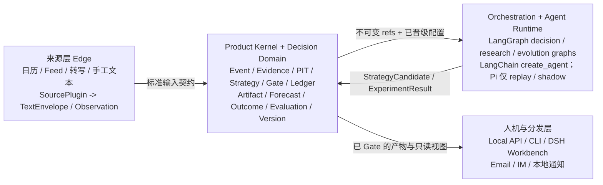
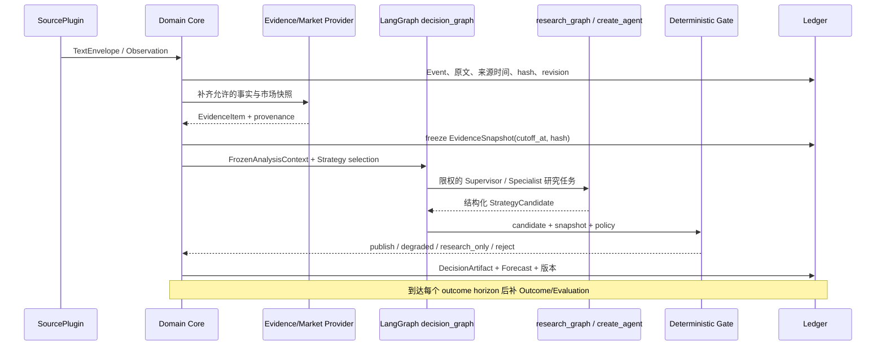
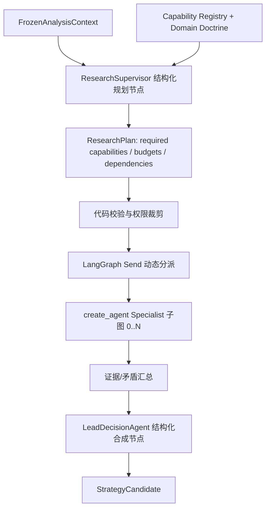
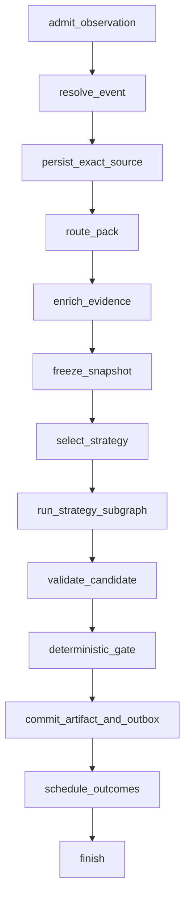
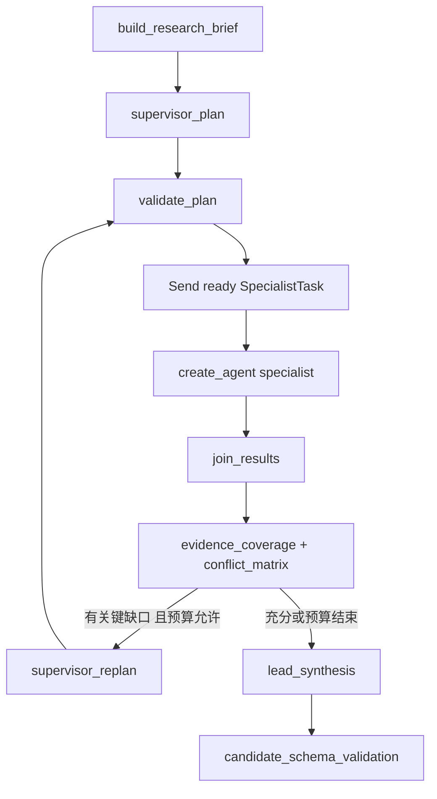
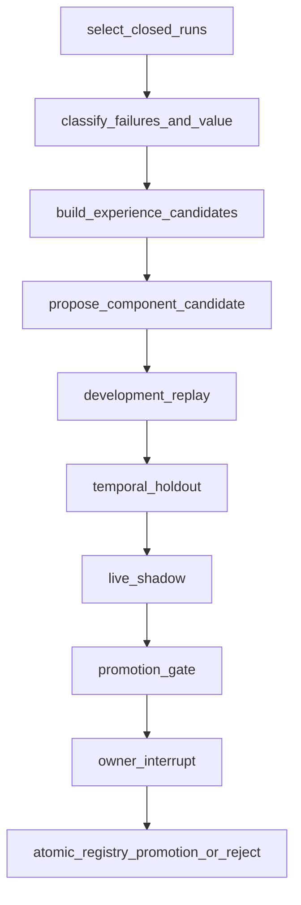

# Decision Hub 产品架构基线 V1

> **状态：R0 核心已完成；owner 已确认 OD-01～OD-16 推荐默认。本文件仍是架构、契约和边界的唯一基线。**
> **日期：2026-08-26（Asia/Shanghai）**  
> **适用对象：单 owner 的事件驱动市场决策产品；首个场景为宏观事件对 BTC 与国际黄金的影响。**  
> **实施规则：所有 R0-R3 都在同一架构、同一领域账本和同一公开契约上增加永久能力，不做“先做一套、后搬家”的阶段迁移。R0 文本核心已通过离线验收；ASR/音频只通过来源适配边界接入。**

## 1. 先定义产品，而不是先定义 Workflow 或 Agent

这个产品不是：

- 一条 Prompt；
- 一个多 Agent Workflow；
- 一个 DSH 插件或网页；
- 一个把新闻重新组织成漂亮报告的市场资讯工具；
- 一个自动下单机器人；
- 一个泛化的“万物 Agent 平台”。

本产品的定义是：

> 为一个明确的 owner，持续把有时间边界的事件证据转化为可证伪、可回放、可量化评估的市场预测和人工决策支持，并从后续实际结果中校准策略的事件驱动决策闭环。

产品真正交付的价值不是“模型给出结论”，而是以下闭环是否比人工临时搜索更快、更可靠：

```text
观察到事件
  -> 事件时点可得的证据快照（PIT）
  -> 有来源、有反方的研究与市场传导分析
  -> 代码约束的发布 Gate
  -> 有时效、触发条件、失效条件的 Forecast
  -> owner 人工执行或不执行
  -> 后续 Outcome、延迟、成本与基准测量
  -> 校准、回放、策略选择
```

这里的 `PIT`（point in time）是第一原则：任意一次判断只能使用在 `cutoff_at` 以前已可获得的材料。否则历史回放会把“事后才知道的信息”伪装成智能。

### 1.1 价值与边界

| 要求 | 本产品如何满足 | 明确不承诺 |
|---|---|---|
| 个人实际价值 | 每一份 Forecast 都在事件当时保存，之后按预定义窗口、实际费用和延迟测量 | 不承诺盈利或稳定超额收益 |
| 更快识别讲话/新闻 | 来源层负责低延迟文字输入；Core 负责在冻结快照后快速、可并行地研究 | 不把“快”误写成无证据的即时交易建议 |
| 更深层的市场解释 | 强制区分事实、推论、情景、反方与传导链 | 不为每个波动编造宏观故事 |
| 长期可维护 | 领域账本、契约、Gate、评测资产独立于 Agent Harness | 不把 DSH/Pi/LangGraph 的内部状态当成业务事实 |
| 后续扩展领域 | 决策产品新增 DecisionPack；其他产品新增独立 Domain Extension | 不复制 Product Kernel，也不先建泛用 Agent 平台 |
| 风险边界 | 默认 `manual_action` 或 `no_trade`，没有交易所下单权限 | 不做自动交易和多用户 SaaS |

## 2. 已确认的产品约束

以下内容已经来自此前讨论，不再作为本轮架构选择题：

| 约束 | 已确认结论 | 架构影响 |
|---|---|---|
| 使用者 | 单 owner、中央单实例 | 同一事件只分析一次，输出可推送给多个接收端；不做每用户重复推理 |
| 运行位置 | Windows 本机 24x7 为主 | Core、来源监听和本地 Web 均可在本机 Docker/原生进程运行 |
| 硬件 | RTX 4060 Ti 8GB、32GB RAM、1TB SSD；另有 2C/4G 海外小机 | 外部高质量 LLM 是默认；GPU 只为本地 ASR/小模型等可选能力，不是决策 Core 前提 |
| 模型/API | 可用 DeepSeek / sub2api 等 OpenAI-compatible API | 模型 Provider 走适配器；不将业务契约绑定到某一家模型 |
| 交易边界 | 不自动下单 | 输出是人工执行决策支持；评估可计算假设执行结果 |
| 输入优先级 | 先做文本到结果；语音、网页、新闻、日历只是文本来源 | Source Plugin 统一输出，不让下游知道文本来自 ASR、网页或手工粘贴 |
| 产品目标 | 先追求真实可验证的决策价值，同时形成可长期演进产品 | R0 从第一天落账 Forecast/Outcome，不能只评“报告更好看” |
| 代码资产 | 相关 GitHub 仓库均在 owner 授权范围 | 可以做适配与抽取；仍需按边界复用，不能整仓搬入 |
| 工程治理 | 中文长期文档、契约单一来源/codegen、协议先行、ADR、边界 CI；从 R0 起按单 owner 24x7 生产系统建设 | 禁止边写实现边定义字段、依赖聊天上下文补齐架构，或把 R0 做成不可恢复、不可升级的临时 PoC |

## 3. 关键架构结论

### 3.1 最终分层



分层不是为了“看起来企业化”，而是为了让每个可变部分有唯一、可测试的边界：

| 层/组件 | 负责什么 | 不负责什么 |
|---|---|---|
| Source Plane | 拉取、订阅、游标、重连、去重、转写、来源时间与原文保存 | 判断市场方向；让 LLM 24x7 空转“监听” |
| Domain Core | 事件、证据、快照、版本、账本、发布、Forecast、Outcome、评估 | Agent 会话、工具调用循环、DSH 页面实现 |
| LangGraph | `decision/research/evolution` 三张有状态图、检查点、恢复、中断、子图、动态 fan-out | 业务真相、市场数据、最终发布权 |
| LangChain Agent | 基于 LangGraph 的正式 Specialist tool loop、结构化输出和 middleware；避免手写 ReAct | Supervisor 的业务边界、账本、Gate 和产品评估 |
| Pi SDK | 实现同一 `AgentRuntime` 契约的可选 replay/shadow 候选；用数据证明优于默认后才可晋级 | 首版必需 sidecar、业务账本、自动发布 |
| DSH | owner 的研究工作台、Skill/MCP、临时深研、回放查看 | 自动化决策主流程、账本、最终 Gate 或调度器 |
| Gate | 检查证据、时间、冲突、风险、输出契约，决定发布级别 | 自由推理、代替模型做市场判断 |
| Observability Plane | 保存 Run/Step/Attempt、模型与工具调用、证据血缘、延迟、成本、错误和 Gate 命中；提供 Run Explorer | 用日志替代业务账本；把 Prompt/secret 无限制写入日志 |
| Evolution Engine | 从 Outcome、Evaluation、Feedback 和失败样本生成候选经验/版本，执行 replay、shadow、晋级和回滚 | 在线修改生产策略；让模型自行提升 Gate/权限/代码 |
| Version Registry | 保存 Pack、Strategy、Profile、Prompt、Skill、Provider policy、模型路由和 Gate 的不可变版本及状态 | 保存可变的“当前 Prompt”而不保留历史；绕过评测直接设为默认 |

### 3.2 单一正式运行路径：为什么首版不同时运行 Pi 和 LangGraph Agent

LangGraph 能实现有状态 Agent、工具循环、Supervisor、子图、动态并行、checkpoint、stream 和 human interrupt。LangChain 的 `create_agent` 本身构建在 LangGraph 上，提供成熟的 Agent/tool loop。因此首版没有必要再强制跨进程调用一个 Node Pi sidecar；那会制造两套 checkpoint、取消、错误、Trace、结构化输出和版本适配语义。

正式路径只保留一条：

```text
Python Product Kernel
  -> LangGraph decision_graph
      -> StrategyPlugin
          -> LangGraph research_graph
              -> Supervisor 结构化规划节点
              -> create_agent Specialist 子图
              -> Lead 结构化合成节点
      -> Deterministic Gate
      -> Ledger / Outbox / Outcome / Evaluation
```

各组件的取舍如下：

| 能力 | 选用 | 原因 |
|---|---|---|
| Specialist 工具循环、上下文、模型调用、结构化输出 | LangChain `create_agent` | 官方预构建 Agent API；底层仍是 LangGraph，不手写 ReAct loop |
| 长流程恢复、状态图、重试、interrupt、子图和动态并行 | LangGraph | 同一 Python runtime 统一 checkpoint、取消、Trace 和故障语义 |
| 人工临时检索、MCP、Skill、子 Agent 与本地可视化 | DSH | DSH 对研究体验很有价值，但其快速演进的会话/插件状态不能成为业务账本 |
| Agent runtime 对照或未来替换 | Pi adapter | 保持 `AgentRuntime` 契约；在同一 replay/holdout/shadow 上证明质量、成本或可靠性优势后才晋级 |
| 事实、证据版本、预测、结果、发布与评估 | 自有极薄 Domain Core | 这是产品资产与可迁移边界，任何 Harness 都不能替代 |

这不是排斥 Pi，而是拒绝“为了都用上而维护两套正式运行时”。`LangGraphAgentRuntime`、`PiAgentRuntime`、`ReplayAgentRuntime` 和 `FakeAgentRuntime` 实现同一 port；生产 active pointer 首版指向 LangGraph-native 实现。更换 runtime 不改 Event、Evidence、StrategyCandidate、Gate、Ledger 或评测数据。

自研范围只包含框架不能替代的部分：领域契约、PIT、权限、证据、Gate、Outcome、评测、版本和产品账本。Agent loop、图执行、checkpoint 与 Provider SDK 不自研。

### 3.3 不接受的两种方案

1. **DSH 插件先承载真实决策链，之后再抽取/迁移 Core。** 这会产生两套运行时、两套状态语义和不可验证的“原样迁移”承诺，违反不返工原则。
2. **一大段 Python `asyncio` 自己维护任务、重试、恢复和状态，再在上面不断补异常分支。** 这会把 LangGraph 已经解决的运行时问题重新写一遍，并使策略变化与错误处理纠缠。

R0 从第一天就是 Python Domain Core + LangGraph，DSH 从第一天就是一个可选 Workbench adapter；以后不发生角色翻转。

## 4. 业务闭环与不可变对象

### 4.1 从文本输入到结果的完整时序



任何文本来源都先归一到：

```text
TextEnvelope
  source_id, source_type, observed_at, published_at?, received_at,
  raw_text, language, event_hint?, source_url?, revision_of?, content_hash
```

之后来源层就结束职责。`Meeting Copilot`、本地/云 ASR、官方新闻、浏览器摘录、PDF OCR 或人工粘贴都只能产生 `TextEnvelope` / `Observation`，不能绕开冻结和 Gate 直接做交易结论。

### 4.2 领域账本的核心对象

这些对象从 R0 即为一等数据模型；不得用 Agent 对话文本或 DSH Session 代替：

| 对象 | 含义 | 最少关键字段 |
|---|---|---|
| `Event` / `Observation` | 外部事件及其进入系统的记录 | 类型、发生/发现时间、来源、去重键、严重度 |
| `EvidenceItem` | 可回源的原子证据 | 原文 span、URL/来源、`published_at`、`received_at`、可信度、hash |
| `EvidenceSnapshot` | 一次分析唯一允许使用的冻结证据集 | `cutoff_at`、Evidence IDs、市场快照、DecisionPack 版本、内容 hash |
| `AnalysisRun` | 一次可重放的策略运行 | snapshot、strategy/runtime/model 版本、状态、成本、时延、trace 链接 |
| `Case` | 某事件下正反因果假设和条件 | claim、证据引用、传导、反方、失效条件 |
| `DecisionArtifact` | 面向审计与阅读的研究结论 | 事实/推论/情景、引用、冲突、失效、修订、Gate 结果 |
| `Forecast` | 可被后续客观测量的市场声明 | 标的、方向/概率、horizon、`emitted_at`、`cutoff_at`、触发/失效条件、版本 |
| `Outcome` | 在预设时窗后观察到的事实 | 行情路径、最大不利/有利变动、费用、滑点、资金费、基准、数据质量 |
| `Evaluation` | 对预测和策略的评分 | 命中、Brier/校准、收益相关、延迟、覆盖率、失败原因 |
| `ActionPolicy` | owner 将市场结论映射为人工操作的独立规则 | `observe`、`trigger`、`manual_action`、`no_trade`、风险限额 |

**必须分离 `DecisionArtifact`、`Forecast` 和 `ActionPolicy`。**

- Artifact 是“我们知道什么、为什么这样推论、另一面是什么”；
- Forecast 是“在何时对何标的、何周期作了可测的声明”；
- ActionPolicy 是“owner 是否按自己的风险规则采取人工动作”。

未来即使有不同接收人或不同组合风险偏好，也只替换 `ActionPolicy`，不重复运行同一个市场研究。

## 5. 多 Agent 不是硬编码角色链

### 5.1 统一 StrategyPlugin 契约

策略是可替换的研究方法，而不是产品核心。所有策略必须使用同一输入和输出，不允许任一策略直接发布：

```text
FrozenAnalysisContext
  -> StrategyPlugin.run(...)
  -> StrategyCandidate
  -> Deterministic Gate
  -> DecisionArtifact + Forecast
```

`FrozenAnalysisContext` 只包含已经冻结的 PIT 证据、可用市场快照、DecisionPack 规则、预算和版本；策略默认不得搜索新材料或偷偷修改快照。

`StrategyCandidate` 必须结构化给出：

- 可定位的事实与 Evidence ID / span；
- 主因果链、传导链和最强反方链；
- 已确认事实、推论与未确认情景的明确分层；
- 标的/周期/方向或条件触发；
- 概率、置信度上限、失效条件、下一次复核时间；
- 数据缺失、冲突、策略版本与成本/延迟信息。

现有与未来策略统一纳入同一接口：

```text
StrategyPlugin
├── FixedEvidenceStrategy@v1
│   └── 可复现的“政策差 -> 根因 + 反方 -> 传导 -> 合成”基准图
├── LegacyAlertStrategy@v1
│   └── 从 crypto-manual-alert 提取、契约适配后的可复用分析能力
└── AgenticResearchStrategy@v1
    └── LangGraph ResearchSupervisor 根据事件和能力目录动态编排专家
```

固定五角色链不是最终“大脑”，而是一个稳定、可比较的基准策略。`LegacyAlertStrategy` 也不是把原项目的多用户应用嵌入进来，而是复用经过契约审计的 Provider、证据/风险规则、市场字段和测试资产。

生产运行只选择一个被批准的策略版本；双策略同跑仅用于回放、shadow 或 A/B 评估，不能让两份报告竞争发布。

### 5.2 AgenticResearchStrategy 的 Supervisor 如何工作

这是 agentic，而不是固定 Workflow，但也不是让 LLM 无边界地自行“拉团队”：



运行规则：

1. `ResearchSupervisor` 读到的不是任意 Shell/网络，而是 Frozen Context、Domain Doctrine 和可用能力目录。
2. 它输出受 Pydantic schema 限制的 `ResearchPlan`：要哪些能力、先后依赖、每项预算与成功条件；不能输出代码，也不能随意安装插件。
3. Core 校验计划：能力是否 allowlist、事件是否适用、总 token/时间预算是否超限、是否有循环依赖、是否触碰禁用数据或敏感工具。
4. LangGraph 使用 `Send` 将已批准任务动态 fan-out 给相应专家子图，负责 checkpoint、有限重试、deadline、interrupt 和汇合。
5. 每个专家由 `SpecialistAgentFactory` 使用 LangChain `create_agent` 创建；工具、Prompt、模型、middleware、结构化响应和预算都来自已晋级的 `SpecialistProfile` 版本，不手写 ReAct 循环。
6. 专家返回结构化 claim / evidence / condition / uncertainty；`LeadDecisionAgent` 只做一次有 schema 的合成，不拥有发布权。Supervisor 和 Lead 没有业务写权限，也不需要被伪装成具有任意工具循环的 Agent。
7. Gate 对 Candidate 做确定性检查。证据不足、冲突未解释、时效超限或关键市场数据缺失时，降级为 `research_only` 或拒绝发布，不用“更会写的模型”填洞。

### 5.3 SpecialistProfile 与 RolePlugin 的区别

不要同时维护 `roles.yaml`、`plan.ts`、`roles/*.ts` 三套角色真相。普通专家使用一个版本化的声明式注册表：

```text
SpecialistProfile
  = capabilities
  + applicability conditions
  + doctrine / Skill reference
  + allowed tools and data classes
  + input/output schema
  + budget / deadline / retry policy
```

示例能力包括 `policy_delta`、`expectation_pricing`、`macro_transmission`、`cross_asset_confirmation`、`derivatives_crowding`、`counter_thesis`、`supply_chain_exposure` 与 `data_quality`。Supervisor 根据能力需求选 Profile，而不是硬写“永远五个 Agent”。

只有确实需要自定义算法、特殊 Provider、专属工具或独立 LangGraph 子图时，才写 `RolePlugin`。它是代码插件，不是所有提示词都要变成插件。这样新增一个领域专家多数是添加 Profile、Doctrine 和测试，不需要改 Coordinator。

### 5.4 Skill、Plugin、Framework 各自的位置

| 名称 | 在本产品中的正确定位 | 不能承担的职责 |
|---|---|---|
| Skill / Doctrine | 领域知识、根因链语法、数据优先级、输出语义、反方审查规则 | 保证执行次数、强制输出 schema、持久化账本、发布约束 |
| Source/Provider Plugin | 接入日历、新闻、市场、转写、网页或通知 | 改写业务决策规则 |
| StrategyPlugin | 一种可评估的研究/推理方法 | 绕开证据冻结和 Gate |
| SpecialistProfile / RolePlugin | 被 Supervisor 选择的专家能力 | 自由创建任意 Agent 或无限调用工具 |
| LangChain Agent | LangGraph-native Specialist tool loop 和 middleware | 领域 Ledger、最终发布、自由扩权 |
| Pi SDK | 同一 `AgentRuntime` 下的可选 replay/shadow runtime | 首版强制 sidecar、领域 Ledger、最终发布 |
| LangGraph | 决策、研究、进化三张受控、有状态、可恢复的图 | 领域资产与市场事实 |
| DSH Plugin / MCP | 人机研究界面与 Core adapter | 自动化决策核心或多用户权限系统 |

### 5.5 三张正式 Graph：固定生命周期，动态研究策略

系统不是“一张把所有角色写死的 workflow”，也不是“一个 Supervisor 接管所有事情”。固定的是产品生命周期和安全边界；动态的是一次研究需要哪些能力、任务依赖和是否补一轮证据审查。

`decision_graph` 是唯一在线发布路径：



`agentic_research_subgraph` 是 `AgenticResearchStrategy` 的实现：



`evolution_graph` 只离线生成和评估候选，永不直接修改生产版本：



Graph 节点只调用 application service/port，不直接拼 SQL、不偷偷拉新数据、不直接发通知。比如 `deterministic_gate` 节点调用 `GateService.evaluate()`，`commit_artifact_and_outbox` 调用一个事务 use case；节点函数本身只负责读取 state ref、调用用例和返回状态增量。

### 5.6 Graph State 只保存执行状态，不保存业务真相

三张图分别使用窄 DTO，不共享一个不断膨胀的万能 state：

```text
DecisionState
  run_id, observation_id, event_id?, snapshot_id?, pack_ref?, strategy_ref?,
  candidate_ref?, gate_decision_id?, artifact_id?, status, error_ref?, budget_state

ResearchState
  run_id, snapshot_id, profile_registry_ref, plan_ref?, task_refs[],
  result_refs[], round, coverage_ref?, conflict_ref?, candidate_ref?, budget_state

EvolutionState
  experiment_id, baseline_ref, candidate_ref, dataset_refs[],
  report_refs[], shadow_ref?, promotion_decision_id?, status
```

允许进入 checkpoint 的只有小型、可序列化、无 secret 的执行字段和不可变对象引用。原文、Evidence、模型原始响应、工具结果、Artifact、Forecast、评测报告和版本 payload 先写权威存储/内容寻址存储，再把 ID/hash 放入 state。LangGraph checkpoint 可用于恢复“下一步做什么”，不能成为业务账本，也不能覆盖业务对象状态机。

同一个 `run_id` 对应稳定的 LangGraph `thread_id`；每次 node attempt 生成 `step_id/attempt`。进程在 checkpoint 后退出时由 recovery watchdog 查找账本中的非终态 Run，对照 checkpoint 恢复；如果外部副作用已提交，则依靠 idempotency key/CAS/outbox 返回既有结果，不重复发布。

### 5.7 Specialist 具体如何实现

`SpecialistAgentFactory` 是框架装配代码，不含 BTC 判断：

```python
class SpecialistAgentFactory:
    def build(self, profile: SpecialistProfileVersion) -> CompiledStateGraph:
        model = self.model_router.resolve(profile.model_policy_ref)
        tools = self.tool_registry.bind_allowed(profile.allowed_tool_ids)
        middleware = [
            ToolPermissionMiddleware(profile.allowed_tool_ids),
            BudgetMiddleware(profile.budget),
            DeadlineMiddleware(profile.deadline),
            RedactionAndTraceMiddleware(),
        ]
        return create_agent(
            model=model,
            tools=tools,
            system_prompt=self.prompt_store.render(profile.prompt_ref),
            response_format=SpecialistResult,
            middleware=middleware,
        )
```

上例是必须遵守的装配形态，不锁死第三方函数的细小参数名；实现时按 lockfile 中的 LangChain/LangGraph 精确版本写 adapter contract test。`SpecialistResult` 至少包含：

```text
facts[] / inferences[] / claims[] / evidence_refs[] / counterevidence[]
uncertainties[] / failure_modes[] / tool_trace_summary / status
```

`ResearchPlan.tasks[]` 不是自由文本角色名，而是结构化任务：

```text
task_id / capability_id / question / evidence_ids[] / allowed_tool_ids[]
expected_output_schema / dependencies[] / deadline_at / token_budget / cost_budget
```

Tool 调用必须先经过代码权限层：验证 `tool_id`、参数 schema、Snapshot 可见范围、deadline、预算和幂等键；工具没有账本写权限、通知权限、Shell 或任意网络权限。搜索/新证据不得暗中加入已冻结 Snapshot：若确需补证，当前研究返回 `evidence_gap`，由 `decision_graph` 建立新的 Evidence revision 和 Snapshot generation 后重新运行。

### 5.8 Supervisor、Reviewer、Judge 和 Gate 的最终关系

| 组件 | 是什么 | 是否能循环/用工具 | 权限 |
|---|---|---|---|
| ResearchSupervisor | `research_graph` 中一次或最多两轮的结构化规划节点 | 默认无工具；可 replan | 只能提 `ResearchPlan` |
| Specialist | `create_agent` 构建的受限 Agent 子图 | 可在预算内调用 allowlist 工具 | 只能产出 `SpecialistResult` |
| Counter-thesis / Data-quality Reviewer | 两类强制 capability，由不同 Profile 实现 | 与 Specialist 相同 | 只能指出反证、缺口和失败模式 |
| LeadDecisionAgent | 结构化单次合成节点 | 默认无工具 | 只能产出 `StrategyCandidate` |
| LLM Judge | 可选评测 grader，不在发布关键路径 | 只读固定输入 | 只能产出评分/理由，不能发布 |
| Deterministic Gate | 普通 Python policy/service | 无 LLM、无自由推理 | 唯一可决定 publish/degraded/research_only/reject |

所以答案不是“并行 Reviewer -> 固定 Judge -> Gate”这一条写死角色链。Reviewer 是可动态选择但高影响事件强制包含的能力；Lead 负责合成；可选 Judge 只参与离线质量评测；正式发布始终由确定性 Gate 裁决。

### 5.9 根因链与故障分支如何由代码保证

Skill/Doctrine 负责告诉模型“怎么分析”，`CapabilityRequirementPolicy + PlanValidator + CoverageService` 负责保证关键分析真的发生：

```text
Pack CapabilityRequirementPolicy(event_type, impact_level)
  -> required capabilities + dependency constraints + success predicates
  -> Supervisor ResearchPlan
  -> PlanValidator 检查 required subset / DAG / budget / allowlist
  -> SpecialistResult
  -> CoverageService 检查每个 capability 的有效结果和 Evidence refs
  -> ConflictMatrix 检查主张/反证/时间/来源冲突
  -> replan once or lead synthesis
```

首个 `crypto_macro` Pack 对 FOMC/Powell/CPI/NFP 高影响事件至少要求：`policy_or_data_delta`、`expectation_pricing`、`macro_transmission`、`counter_thesis`、`data_quality`；有可用行情时加入 `cross_asset_confirmation` 和 `derivatives_crowding`。Supervisor 可以增加或拆分任务，但不能删除 Pack 的 required capabilities。`PlanValidator` 还要求每个 task 指向问题、输入 Evidence、输出 schema、依赖和预算，禁止用“请深入分析”这类不可验收任务占位。

研究输出汇总成结构化 `CausalCase`，而不是只在 Markdown 中看起来像根因链：

```text
CausalCase
  observed_facts[]
  expectation_baseline[]
  surprise_or_trigger[]
  root_drivers[]
  transmission_edges[]
  confirmations[]
  market_implications[]
  counter_thesis[]
  invalidations[]
  evidence_refs[]
  unresolved_conflicts[]
```

故障不靠全局 `try/except` 补丁，而是统一 typed failure + graph routing：

| Failure 类型 | Graph 行为 | 最终行为 |
|---|---|---|
| Provider 限流/瞬时网络错误 | 仅幂等读取有限重试，再按 ProviderPolicy fallback | 记录 fallback；鲜度/质量不足则降级 |
| 模型超时/空答/截断 | 同一 attempt 失败；预算内最多一次模型 fallback | 使用已验证的部分结果或 `research_only/failed` |
| structured output 不合法 | 保存原始响应，执行一次 schema repair | 仍失败即拒绝；不无限重试 |
| Tool 未授权/参数越界 | ToolGate 立即 deny，无模型自我批准 | 记录 security failure；相关任务失败 |
| required capability 缺失 | CoverageService 阻止 Lead 直接发布，预算内 replan 一轮 | 仍缺失则 `research_only` |
| Evidence 冲突/过期 | ConflictMatrix/Gate 标注，不能由 Lead 静默消解 | 降低周期/置信度或拒绝方向性 Forecast |
| 总 deadline/cost 到达 | 取消未开始任务，等待/取消在途任务并 checkpoint | 只允许已有有效结果的显式降级，不后台补发 |
| 进程退出 | startup watchdog 对照 Run 状态与 checkpoint 恢复 | 幂等继续或确定性结束，不重复 Artifact/通知 |
| 编程错误/未知异常 | 不自动换 Prompt 掩盖；Run 标 `internal_error` 并保存 failure envelope | 进入 failure fixture/ADR 候选，修代码和回归测试 |

每类 Failure 的 `retryable/degradable/security_relevant/owner_visible` 属性由 `FailurePolicy` 版本化，节点只返回 typed outcome；新增错误处理必须先加 failure fixture 和 policy，不允许在任意节点散落特判。

## 6. 证据、因果、对抗与 Gate

### 6.1 因果不是一张写死的流程图

对市场决策来说，架构强制要求的不是固定顺序，而是每一份方向性候选都能回答：

```text
observable fact
  -> prior expectation / positioning
  -> immediate surprise or cause
  -> durable root driver
  -> macro / liquidity / supply-chain transmission
  -> first confirmation to watch
  -> market implication
  -> invalidation
```

Supervisor 可根据事件性质动态决定研究深度。比如：

- FOMC / Powell：政策变化、预期差、利率/实际利率/DXY、风险偏好、BTC 与黄金交叉确认、衍生品拥挤度；
- 地缘冲突：原始事实可靠性、油价/通胀预期、避险、供应链暴露、风险资产传导；
- 公司或产业事件：公司暴露、行业上下游、估值与资金流、A 股/美股/商品的不同传导。

但无论任务数量如何变化，`counter_thesis` 与 `data_quality` 都是高影响事件默认必需能力。它们可以由不同 Profile 实现，不能因为主结论写得顺就省掉。

### 6.2 Deterministic Gate

模型只产生候选，代码决定候选能否成为正式产物。最低 Gate 规则：

| 检查项 | 失败结果 |
|---|---|
| 每个关键事实没有 Evidence ID 与唯一 span | `reject` 或 `research_only` |
| 证据晚于 `cutoff_at` / 未标明时间 | `reject` |
| 缺少关键市场数据、数据过期或来源冲突 | 限制相应资产/周期的置信度，必要时 `research_only` |
| 主方向与最强反方存在未解释的冲突 | 不能发方向性 `manual_action` |
| 未写触发、失效、到期或下一次复核 | 不能生成 Forecast |
| Schema、策略版本、成本、来源版本不完整 | 不能正式发布 |
| 已有更高 generation 的同一 Event 修订 | 老运行不能覆盖新结果（CAS） |

Gate 的结果严格是 `publish`、`degraded`、`research_only` 或 `reject`。这比让一个固定 “Judge Agent” 最终裁决更可靠：Judge 可以作为研究证据或策略中的专家，但不能拥有发布权。

### 6.3 首个 Pack 的运行预算与置信度上限

为防止 Supervisor 无边界扩张，也防止未校准模型输出看似精确的高概率，`crypto_macro_gate@1` 建议采用以下初始硬约束：

| 项目 | 推荐默认 |
|---|---|
| Supervisor 最大研究轮次 | `2` |
| SpecialistTask 总数上限 | `8`；并发上限 `4` |
| 单个 Agent deadline | `60s` |
| 单次完整 Run deadline | `180s`；超时保留已验证证据并降级，不继续后台偷偷发布 |
| 单次 Run token 上限 | 输入+输出合计 `120k`，每个 Profile 另有独立预算 |
| 单次 Run 成本上限 | 默认 `USD 2.00` 等值；Provider 无法返回可靠 cost 时按 token/价目配置预估并记录 `estimated` |
| 未形成前瞻样本前的概率上限 | `0.65`；不得将主观概率描述为已校准概率 |
| 单一搜索摘要/未确认消息 | 只能作为 scenario，方向概率上限 `0.55`，不能单独触发 `manual_action` |
| 关键事实引用完整率 | `100%`；任一关键事实无法回到 Evidence span 则 `research_only` 或 `reject` |
| 高影响事件的反方与数据质量能力 | 两者缺一则 `research_only` |
| `30m` 市场数据鲜度 | 进入 Snapshot 时关键 OKX 数据不超过 `15s`；否则不能发布短线 `manual_action` |
| `24h/72h` 市场数据鲜度 | 进入 Snapshot 时不超过 `5m`；缺失跨资产确认时降低 confidence，不伪造方向确认 |

这些是第一版风险预算，不是永久真理。以后只能通过版本化 GatePolicy、replay/前瞻指标和 ADR 调整，不能为让某次报告“通过”而临时放宽。

## 7. 复用既有项目，但只复用可证明有价值的边界

| 资产 | 应复用的内容 | 不复用的内容 | 接入形式 |
|---|---|---|---|
| `meeting-copilot` | 已验证的转写采集、Transcript revision、时间戳和原文 span 思路 | 完整会议助手 UI、为决策重写其 ASR 主链 | `TranscriptSourcePlugin`；输出 `TextEnvelope` |
| `crypto-manual-alert` | 搜索/市场 Provider、引用与 Evidence/Risk policy、结构化分析字段、契约兼容的测试 | 多用户体系、每用户重复分析、其完整产品图 | `LegacyAlertStrategy` 与 Provider adapters |
| `crypto-macro-decision` | 宏观-加密 Doctrine、根因链、数据优先级、反方规则、市场术语、行动语义和评估 rubric | 仅靠 Skill 文本去强制多 Agent 的假设 | Versioned Domain Doctrine / evaluation policy |
| Pi | Agent SDK、Agent loop、统一 Provider 与 telemetry 的实现思想 | fork 源码、首版强制 Node sidecar 或把 Pi 当业务编排器 | 可选 `PiAgentRuntime`；仅 replay/shadow 证明优势后晋级 |
| DSH | MCP、Skill、人工 subagent 深研、决策桌面 UI、会话调查 | 账本、生产调度、自动 Gate、最终发布 | `ResearchWorkbenchAdapter` + Core MCP |
| LangGraph/LangChain | checkpoint、retry、interrupt、subgraph、动态 `Send`、预构建 Agent loop 与 middleware | 领域状态数据库或产品数据模型 | 正式 `WorkflowRuntime + LangGraphAgentRuntime` |

复用前每个候选模块必须通过四项审计：输入输出能否映射到公开契约、是否有可用测试、是否引入多用户/框架耦合、失败时是否可降级。不能通过审计的逻辑只作为研究参考，不进入 Core。

## 8. 技术栈与部署拓扑

### 8.1 首版稳定技术栈

| 层 | 选择 | 说明 |
|---|---|---|
| Domain Core / API | Python 3.12、FastAPI、Pydantic v2 | 领域模型、Local API、OpenAPI、schema 校验 |
| 业务持久化 | SQLite WAL + SQLAlchemy 2 + Alembic | 单 owner 本机可靠、可备份；Repository 与迁移脚本从 R0 保留 PostgreSQL 路径 |
| 流程运行时 | LangGraph `1.2.11`（lockfile 精确锁定；升级需 replay/ADR） | 策略子图、checkpoint、retry、动态 fan-out；不存业务真相 |
| 正式 Agent Runtime | LangChain `1.3.17` `create_agent`（lockfile 精确锁定，底层 LangGraph） | Specialist tool loop、structured output、middleware；与外层图共享 Python/Trace/取消语义 |
| 候选 Agent Runtime | Pi SDK adapter（非首版运行依赖） | 只在 replay/shadow 实验需要时部署 Node worker，不 fork Pi；不形成第二条生产链 |
| Provider I/O | `httpx`、WebSocket client、RSS/HTTP polling adapters | 连接、游标、重连、rate limit、去重、来源状态 |
| 本地界面 | 独立 `Decision Desk`（React + TypeScript + Vite）通过 Query API 读取页面视图；CLI 与 DSH 作为补充入口 | UI 只是账本的只读/受控入口，不是另一套业务系统；禁止前端直接读 SQL、LangGraph state 或原始事件流 |
| 通知 | Outbox + Email/IM/本地 Provider adapters | 通知只能消费已发布的 Artifact；不触发新分析 |
| 配置与密钥 | 环境变量/本机 secret store、版本化非敏感 Pack 配置 | API Key 不写入 Pack、Artifact 或 DSH Session |
| 容器 | Docker Compose（本机） | Core/worker 为正式必需进程；可选 Source、Pi shadow、Workbench 独立 profile 启动；Windows 音频捕获若需原生能力则为 host adapter |

这里的“精确版本锁定”是要求在实现时将 Python 与 Node 依赖固定到 lockfile，配合 Pi/DSH adapter 契约测试；不是以某个 `latest` 版本作为长期兼容承诺。

Decision Desk 的前端依赖边界固定为：

| 能力 | 采用 | 约束 |
|---|---|---|
| Server state/API cache | TanStack Query | 只缓存 Query/View DTO；不缓存业务写状态或 Harness session |
| 路由 | React Router | 路由对应产品视图，不对应数据库表 |
| DTO runtime validation | 生成的 Zod 镜像 | API 响应不通过 schema 校验就进入错误状态，不静默显示半结构化数据 |
| 表格/筛选 | TanStack Table | 只处理 View DTO，不直接读取 repository |
| 时间序列/结果图 | Apache ECharts | 只显示 Forecast/Outcome/成本等明确指标，图表配置不含 Gate 规则 |
| 证据/血缘关系 | 首版使用可折叠关系列表；需要图形交互时再引入 React Flow | 不为“可视化”把所有 lineage edge 一次渲染成蜘蛛网 |
| 图标/交互 | `lucide-react` | 图标按钮有 tooltip；不使用一堆文字胶囊模拟状态 |
| 样式 | CSS Modules 或稳定的项目级 CSS tokens | 页面视觉不承担业务状态判断；状态来自 View DTO |

前端不引入 DSH 的前端源码、会话存储、插件运行时或其内部 UI 状态。DSH 的可视化只通过 MCP/Query API 复用同一业务事实。

### 8.2 本机与云端职责

```text
Windows 本机（主运行环境）
  - Decision Hub Core + SQLite WAL + LangGraph checkpoints
  - Source workers / scheduler
  - LangGraph-native Agent runtime（同一 Python worker）
  - 可选 Pi Node shadow worker（默认不启动）
  - 可选本地 ASR、直播音频 capture
  - owner 的 Local API / DSH Decision Desk / 通知
  - 远程高质量 LLM 与授权数据 API

2C/4G 海外小机（可选边缘能力，不承载核心账本）
  - 轻量 webhook / relay / 反向代理 / 公网 source relay
  - 不持有唯一决策账本、不执行 GPU ASR、不承担重 Agent 并发
```

以外部 LLM/API 为主时，2C/4G 不应被误认为整个产品的合适主机；它可以支撑轻量 relay，但不适合承载本机直播、长期本地数据库和后续多来源研究。当前本机 32GB RAM、1TB SSD 足以运行 R0-R2；4060 Ti 8GB 足够给后续本地 ASR/小模型试验，但不应为了节省 API 而先把高质量推理降为 8GB 本地模型。

### 8.3 何时迁移 PostgreSQL，不迁移架构

SQLite WAL 是单 owner 本机的数据库选择，不是“R0 临时玩具”。当出现以下任一确定需求时，再用已有 migration / repository contract 迁移 PostgreSQL：跨机器高可用、多个独立 worker 高并发写入、长期大量市场 tick、需要远程只读服务或备份/恢复 SLO。迁移的是存储驱动和部署方式，`Event/Evidence/Snapshot/Forecast/Outcome` 契约及 API 都保持不变。

不在首版引入 DBOS、Temporal、Kafka、Redis、Kubernetes。它们只有在真实的队列、跨机补偿或大规模运行需求出现后才可基于账本事实评估；先引入只会制造第二个系统边界。

### 8.4 具体代码如何沉淀：目标仓库结构

上面的分层必须落到一个可检查的仓库结构中。推荐使用**一个模块化单仓库**，而不是一开始拆成多个微服务仓库。这样可以保持契约、迁移脚本、Pack、回放集和适配器在同一版本提交中，避免“文档说共享、代码各自复制”。

```text
decision-hub/
├── pyproject.toml                         # Python 依赖与工具锁定入口
├── uv.lock                                # Python lockfile
├── package.json                           # pnpm workspace/tooling 入口；不是正式 Agent runtime
├── pnpm-workspace.yaml                    # 只声明公开 TS package 与 decision-desk workspace
├── .python-version                         # Python 版本锁定
├── .node-version                           # Node 22 LTS 版本锁定
├── pnpm-lock.yaml                         # Node 工具与可选 adapter lockfile
├── contracts/                             # 跨模块/跨语言契约唯一来源
│   ├── schemas/                           # JSON Schema 2020-12，使用 YAML 编写
│   ├── events/                            # 事件 envelope/topic/version 定义
│   ├── policies/                          # Gate 等声明式 policy 参数 schema/config
│   └── versions.yaml                      # 契约版本与兼容性登记
├── apps/
│   ├── hub_api/                           # FastAPI 进程入口；不放领域规则（R0 已落地）
│   ├── hub_worker/                        # R0 outbox worker；scheduler/recovery loop 后续加入
│   ├── pi-shadow-worker/                  # 可选 Node Pi adapter；默认不部署
│   └── decision-desk/                     # 正式本地 Web 前端；不承载业务规则
├── packages/
│   ├── contracts_py/                      # codegen 的 Pydantic v2 镜像；禁止手改
│   ├── contracts_ts/                      # codegen 的 Zod/TS 镜像；禁止手改
│   ├── kernel/                             # 跨产品稳定内核
│   │   ├── domain/                         # Task/Run/Artifact/Review 等通用对象
│   │   ├── decision/                        # Event/Evidence/Forecast 等决策域扩展
│   │   ├── ports/                          # Protocol：Repository/Runtime/Provider 等
│   │   ├── application/                    # use case：admit/freeze/run/gate/commit
│   │   ├── persistence/                    # SQLAlchemy models、repositories、Alembic
│   │   ├── observability/                  # RunEvent、Trace correlation、lineage、redaction
│   │   ├── evolution/                      # Experience/Candidate/Experiment/Promotion
│   │   ├── policies/                       # 版本、CAS、发布等级等通用规则
│   │   └── public_api/                     # 只导出公开 use case/port，不定义重复 DTO
│   ├── orchestration/                      # 框架实现层；不属于纯 Kernel
│   │   └── langgraph/
│   │       ├── state/                      # Decision/Research/Evolution state DTO
│   │       ├── graphs/                     # 三张 graph builder
│   │       ├── nodes/                      # 薄 node -> application service/port
│   │       ├── routing/                    # condition、Send、replan/降级分支
│   │       └── checkpoint/                 # SQLite checkpointer、recovery watchdog
│   ├── runtime_adapters/
│   │   ├── langgraph_agent/                # 正式 create_agent runtime
│   │   │   ├── factory.py                  # SpecialistAgentFactory
│   │   │   ├── middleware.py               # deadline/budget/redaction/trace
│   │   │   ├── tool_gate.py                # 工具权限与 envelope
│   │   │   ├── structured_output.py        # SpecialistResult repair/validation
│   │   │   └── model_router.py             # OpenAI-compatible/model policy
│   │   ├── replay_runtime/                 # 确定性回放和契约测试 runtime
│   │   ├── fake_runtime/                   # CI 故障注入与确定性 trajectory
│   │   ├── single_call_runtime/            # 基线：一次结构化模型调用
│   │   └── pi_runtime/                     # 可选 Pi adapter；不把 Pi 类型泄漏到 kernel
│   ├── source_adapters/
│   │   ├── manual_text/
│   │   ├── transcript_meeting_copilot/
│   │   └── official_feeds/                 # R2 再加入日历/公告/新闻/行情
│   ├── provider_adapters/                   # search/market/calendar/news/notifier
│   ├── observability_adapters/
│   │   ├── local_sql/                       # 业务可观测 read model；R0 默认
│   │   ├── structured_log/                  # JSON 日志、secret redaction
│   │   └── otel/                            # OpenTelemetry；OTLP exporter 可选启用
│   ├── workbench_adapters/
│   │   ├── dsh_mcp/                         # Core MCP 与 ResearchMemo bridge
│   │   └── codex_dev/                       # 可选：研发任务入口，不是业务 runtime
│   ├── query_views/                         # 面向 API/UI 的只读 View DTO 与 QueryService
│   │   ├── run_inspector/                   # Overview/Timeline/Evidence/Gate/Cost/Outcome
│   │   ├── decision_desk/                   # Inbox/Decision/Forecast/Health/Assets
│   │   └── evolution/                       # Candidate/Experiment/Promotion 对比视图
│   ├── evals/                               # 通用评测执行层
│   │   ├── contracts/                       # Suite/Dataset/Metric/Report DTO
│   │   ├── datasets/                        # manifest、PIT loader、时间切分
│   │   ├── runners/                         # replay/live-shadow/canary runner
│   │   ├── graders/                         # deterministic/trajectory/LLM judge adapters
│   │   ├── metrics/                         # registry、聚合、置信区间/slice
│   │   ├── compare/                         # baseline-candidate 与 Promotion Gate
│   │   └── reports/                         # 不可变 EvaluationReport renderer
│   └── evolution_adapters/
│       ├── replay_experiment/               # baseline/candidate 时间切分回放
│       └── shadow_runner/                   # 影子运行，不发布、不通知
├── packs/
│   ├── crypto_macro/
│   │   ├── pack.yaml                        # DecisionPack manifest，唯一配置真相
│   │   ├── doctrine/                        # 宏观/加密方法与来源优先级
│   │   ├── profiles/                        # SpecialistProfile 声明
│   │   ├── strategies/                      # 固定基准与 Agentic strategy glue
│   │   ├── providers/                       # 领域 Provider 配置，不存 secret
│   │   ├── gates/                           # 置信度上限、资产/周期规则
│   │   ├── evaluation/                      # Forecast/Outcome 计分政策
│   │   └── fixtures/                        # PIT 样本、golden artifacts、outcomes
│   └── ppt/                                 # 后续独立 Pack；不依赖 crypto_macro
│       ├── pack.yaml
│       ├── profiles/
│       ├── renderers/
│       ├── evaluation/
│       └── fixtures/
├── migrations/                             # 只由 kernel 持有的数据库迁移
├── tools/
│   └── contract_codegen/                   # 生成、兼容性检查、镜像漂移检查
├── tests/
│   ├── contracts/                           # 所有 port/adapter 必过的契约测试
│   ├── kernel/                              # PIT、CAS、Gate、repository 单测
│   ├── packs/                               # 每个 Pack 的 schema/策略/gate 测试
│   ├── replay/                              # 时间切分回放、trajectory 与指标回归
│   ├── observability/                       # trace correlation、lineage、redaction、成本准确性
│   ├── evolution/                           # 污染隔离、晋级、回滚和权限测试
│   └── failure_modes/                       # provider stale、超时、冲突、重复发布
└── docs/
    ├── INDEX.md                             # 当前有效文档和模块地图
    ├── architecture/                       # 长期架构基线
    ├── decisions/                          # ADR：一项决策一个文件
    ├── contracts/                           # 生成的 JSON/OpenAPI 契约
    ├── modules/                             # 每个模块的 README、边界、维护入口
    ├── research/archive/                    # 原始调研，仅作历史证据
    └── runbooks/                            # 恢复、备份、source 健康检查
├── tmp/                                    # 草稿/探索/临时脚本；不得作为事实源
└── INDEX.md                                # 仓库入口和局部架构地图
```

这不是要求现在创建所有目录凑架构，而是**代码所有权边界和未来落点地图**。当前实际交付以 `INDEX.md`、`docs/IMPLEMENTATION_STATUS.md` 和各模块 README 为准；未落地的目录只在对应 Stage Charter 获批后创建。R0 已创建并使用 `kernel`、`orchestration/langgraph`、`langgraph_agent`、`replay_runtime`、`fake_runtime`、`manual_text`、SQLite read model 和固定 replay fixture；Pi、feed/source、DSH、evolution、通用 evals 和第二领域目录在真正有调用方时增加。未来增量在这些边界中添加实现，不迁走 R0 业务代码。`kernel/decision` 是当前 Decision Hub 的领域扩展，不代表未来所有产品都继承市场对象；跨产品 observability/evolution 只保存协议和生命周期，不包含 BTC 评分规则。

按阶段落地的文件所有权和主类型如下；`R0` 行是当前真实入口，`R1/R2` 行是获批后才创建的目标位置。可以在实现时拆小，但不得把职责反向合并进 Graph node 或 API route：

| 文件 | 主类型/函数 | 唯一职责 |
|---|---|---|
| `packages/kernel/decision_hub_kernel/application/admission.py`（R0） | `AdmissionService` | 输入幂等、Observation/Event admission |
| `packages/kernel/decision_hub_kernel/application/snapshot.py`（R0） | `SnapshotService` | Evidence 校验、PIT freeze、generation |
| `packages/kernel/decision_hub_kernel/application/run.py`（R0） | `RunService` | Run 状态机、版本 manifest、CAS |
| `packages/kernel/decision_hub_kernel/decision/gate.py`（R0） | `evaluate_gate()` | 执行命名 GatePolicy，返回逐条 rule 决定 |
| `packages/kernel/decision_hub_kernel/application/commit.py`（R0） | `CommitDecisionService` | Artifact/Forecast/RunEvent/outbox 单事务提交 |
| `packages/kernel/decision_hub_kernel/application/outcome.py`（R0） | `OutcomeService` | 到期标签、执行基准和数据质量 |
| `packages/kernel/decision_hub_kernel/application/promotion.py`（R2） | `PromotionService` | 校验 PromotionDecision，原子切换/回滚版本 |
| `packages/orchestration/langgraph/state/decision.py`（R0） | `DecisionState` | 窄 checkpoint state；不含 ORM/原文 |
| `packages/orchestration/langgraph/graphs/decision_graph.py`（R0） | `build_decision_graph()` | 在线生命周期拓扑和边界恢复 |
| `packages/orchestration/langgraph/graphs/research_graph.py`（R0） | `build_research_graph()` | policy/counter/synthesis structured roles 和结果汇合；Supervisor/dynamic Send 属于 R2 |
| `packages/orchestration/langgraph/graphs/evolution_graph.py`（R2） | `build_evolution_graph()` | 经验、候选、replay、shadow、owner interrupt |
| `packages/orchestration/langgraph/nodes/*.py`（R2） | 薄 node functions | 从 state 取 ref，调用 application/port，返回 state delta |
| `packages/orchestration/langgraph/routing/conditions.py`（R2） | typed route functions | failure/degrade/replan/finish 分支；不做领域推理 |
| `packages/orchestration/langgraph/routing/sends.py`（R2） | `build_specialist_sends()` | 校验后动态 fan-out ready tasks |
| `packages/orchestration/langgraph/checkpoint/recovery.py`（R0） | `RecoveryWatchdog` | 对照 Run 状态/checkpoint 恢复或确定性收尾 |
| `packages/runtime_adapters/langgraph_agent/runtime.py`、`provider_config.py`（R0） | `LangGraphAgentRuntime`、`ProviderConfig` | 配置 Provider、装配 LangChain `create_agent`、返回统一 AgentResult |
| `packages/runtime_adapters/langgraph_agent/factory.py`（R2） | `SpecialistAgentFactory` | 从已晋级 Profile 装配 `create_agent` |
| `packages/runtime_adapters/langgraph_agent/tool_gate.py`（R2） | `ToolGate` | 工具 allowlist、参数、数据范围、预算和幂等 |
| `packages/kernel/decision_hub_kernel/persistence/db.py` + `packages/query_views/decision_desk/service.py`（R0） | Run Inspector read model/query | 从业务 read model 组装 Overview/Timeline/Evidence/Gate/Cost/Outcome View |
| `packages/query_views/decision_desk/service.py`（R0） | `DecisionDeskQueryService` | Inbox、summary、Health、Forecast 和 Asset 列表 View |
| `packages/query_views/evolution/service.py`（R2） | `EvolutionQueryService` | Candidate/Experiment/Promotion/Rollback 对比 View |
| `apps/hub_api/main.py`（R0） | Query routes | 只返回生成/校验的 View DTO，不做查询规则和业务决策 |
| `apps/decision-desk/src/features/*` | React feature modules | 视图状态、交互和格式化；不实现 Gate、Outcome 或资产晋级规则 |
| `packages/evals/runners/evaluation_runner.py`（R2） | `EvaluationRunner` | 固定 manifest 执行、先存 raw artifacts 后评分 |
| `packages/evals/graders/*`（R2） | `Deterministic/Trajectory/LLM Grader` | 各自独立评分，不修改运行产物 |
| `packages/evals/compare/promotion_gate.py`（R2） | `PromotionGate` | baseline/candidate 硬不变量和切片非劣比较 |

API route、Graph node、Adapter 都不得重新实现表中 use case；静态依赖检查和单元/契约测试会对这些边界做验证。这样修复 Provider、换模型、换 Pi 或增加 A 股 Pack 时，不会在三处复制 admission、Gate、commit 和评测逻辑。

### 8.5 依赖方向：用代码防止架构腐化

依赖方向必须是单向的：

```text
packs -> contracts + kernel.public_api
application -> kernel.domain + kernel.ports
orchestration -> kernel.application + kernel.ports + LangGraph
adapters -> kernel.ports + third-party SDK
apps -> application + orchestration + adapters
DSH/Pi/Codex -> adapters only
```

具体规则：

1. `packages/kernel/domain`、`packages/kernel/decision`、`packages/kernel/ports` 不得 import LangGraph、LangChain、Pi、DSH、Codex、FastAPI、SQLAlchemy 或任何具体 Provider。
2. `packages/kernel/ports` 只定义 Protocol，并引用 codegen 的 `contracts_py` DTO，不导入第三方运行时类型，也不重复声明 DTO。
3. `packages/kernel/application` 只能通过 ports 调用外部能力；禁止直接 `import pi`、`httpx` 或访问数据库 session。
4. `packs/*` 不得修改 kernel 表结构；需要新字段时先判断是否是跨领域对象，领域字段留在 Pack payload/schema。
5. `apps/*` 只负责组装依赖、启动服务和生命周期，不写“如果是 BTC 就……”的业务判断。
6. 任何跨边界依赖都必须有一条 ADR 和一个 contract test；CI 用 import-linter/静态检查阻止反向依赖。
7. 模块化单仓库只用于统一版本、构建与测试。包之间禁止 `../../other_package/src`、Python 私有模块 deep import、TypeScript path alias 穿透或共享数据库 ORM model；只能依赖公开 package/port，跨进程只走生成契约。
8. `observability` 只能观察公开契约和事件，不能 import 具体 Pi/DSH/LangGraph/LangChain 内部 state；orchestration/runtime adapter 必须把内部事件转换为统一 `RunEvent/ModelCallRecord/ToolCallRecord`。
9. `evolution` 只能通过公开 Evaluation、VersionRegistry 和 Experiment ports 读取历史、提交候选；不得直接改 Pack 文件、Gate、默认版本指针或生产数据库配置。

这样“可插拔”不是靠开发者记忆，而是由目录、import 规则和 CI 强制执行。

### 8.6 首批稳定协议：具体到接口

以下协议由 `packages/kernel/ports/` 定义，使用 Python `Protocol` + codegen Pydantic DTO。Runtime adapter 可以用 LangGraph-native、Pi、replay 或 fake 实现；Workbench adapter 可以用 DSH/Codex 实现，但都不能改变业务输入输出。

```python
class AgentRuntime(Protocol):
    runtime_id: str
    runtime_version: str

    async def execute(
        self,
        request: AgentRequest,
        *,
        deadline_at: datetime,
        cancel_token: CancellationToken,
    ) -> AgentResult: ...


class SourcePlugin(Protocol):
    source_id: str

    async def ingest(self, request: SourceRequest) -> list[Observation]: ...


class StrategyPlugin(Protocol):
    strategy_id: str
    strategy_version: str

    async def run(self, context: FrozenAnalysisContext) -> StrategyCandidate: ...


class DecisionPack(Protocol):
    pack_id: str
    pack_version: str

    def route(self, observation: Observation) -> RouteDecision: ...
    def build_context(self, snapshot: EvidenceSnapshot) -> FrozenAnalysisContext: ...
    def gate_policy(self) -> GatePolicy: ...
    def evaluation_policy(self) -> EvaluationPolicy: ...


class ArtifactRenderer(Protocol):
    renderer_id: str

    async def render(self, artifact: DecisionArtifact) -> RenderedArtifact: ...


class RunRecorder(Protocol):
    async def record_transition(self, transition: RunTransition) -> RunEvent: ...
    async def record_model_call(self, record: ModelCallRecord) -> None: ...
    async def record_tool_call(self, record: ToolCallRecord) -> None: ...
    async def add_lineage(self, edges: list[LineageEdge]) -> None: ...


class TelemetrySink(Protocol):
    sink_id: str

    async def emit(self, event: RunEvent) -> None: ...


class EvaluationRunner(Protocol):
    evaluator_id: str
    evaluator_version: str

    async def evaluate(self, request: EvaluationRequest) -> EvaluationResult: ...


class ExperimentRunner(Protocol):
    runner_id: str

    async def compare(
        self,
        baseline: ComponentVersionRef,
        candidate: EvolutionCandidate,
        dataset: ReplayDatasetRef,
    ) -> ExperimentResult: ...


class VersionRegistry(Protocol):
    async def register_candidate(self, candidate: EvolutionCandidate) -> ComponentVersionRef: ...
    async def promote(self, decision: PromotionDecision) -> ComponentVersionRef: ...
    async def rollback(self, decision: RollbackDecision) -> ComponentVersionRef: ...
```

`DecisionPack` 只属于事件驱动决策产品。未来 PPT、知识库或其他产物产品可以实现自己的 `ProductPack`/领域协议，但不能被迫实现 `route(Observation)` 或 `Forecast`。

协议层的关键点：

- `AgentRequest` 传入的是结构化任务、允许工具、证据 ID、输出 schema、预算和截止时间，不是任意 DSH Session。
- `AgentResult` 必须带 runtime/version、耗时、token/cost、tool trace 摘要和结构化 payload；原始会话可存 adapter 侧，但不是业务真相。
- `StrategyPlugin` 永远只返回 `StrategyCandidate`，不能直接写 Artifact、Forecast 或通知。
- `DecisionPack` 提供事件决策领域规则，不能持有全局 singleton，也不能直接操作 repository。
- `ArtifactRenderer` 只生成 Markdown/JSON/PPTX 等产物，不改变 Forecast 或 Gate。
- `RunRecorder` 是必须成功的业务观测端口；application/adapter 通过它把状态转换、调用和血缘写入账本，不允许只向日志打印。
- `TelemetrySink` 是 best-effort 技术观测出口；业务状态和审计事件由 application 在同一账本事务中提交，不能因 OTLP/Grafana 不可用而丢失 Run。
- `ExperimentRunner` 只能在不可变 replay/shadow 输入上运行候选版本；它不拥有生产默认版本指针。
- `VersionRegistry.promote/rollback` 只接受通过代码校验的 `PromotionDecision/RollbackDecision`；Agent 不能直接调用这两个方法。

#### 8.6.1 一次正式运行的代码执行顺序

`POST /v1/observations` 到最终可评测结果的实际调用顺序固定如下：

1. API 使用生成的 Pydantic DTO 校验输入；`AdmissionService` 计算 content hash/idempotency key，在同一事务写 `Observation/Event + RunEvent`。
2. `RunService.start()` 以 CAS 创建 `AnalysisRun`，提交 transactional outbox 中的 `run.requested`；worker 消费后以 `run_id` 作为 `thread_id` 启动 `decision_graph`。
3. `enrich_evidence` 只调用 Provider ports；每次调用先写 attempt/call 状态，结果经过 schema/provenance/freshness 校验后写 Evidence。可重试错误按 node policy 有限重试，永久错误进入降级分支。
4. `SnapshotService.freeze()` 在事务中写不可变 Snapshot/hash；从这一刻起研究图只能读 snapshot ref。任何后续新事实创建新 generation，不原地追加。
5. `StrategySelector` 读取一次已晋级的 Pack/Strategy/Profile/Prompt/Runtime/Model policy refs，并写入 Run manifest；运行中 active pointer 改变不影响本 Run。
6. Agentic 策略调用 `agentic_research_subgraph`；每次 Supervisor、模型和工具调用都产生 `run_step/model_call/tool_call/lineage`，原始输出先保存，随后才做 schema repair/grade，防止只保留成功结果。
7. `CandidateValidationService` 做跨字段/schema/citation 校验；最多允许一次有记录的结构修复，仍失败则 `reject`，禁止无限“让模型再试试”。
8. `GateService` 纯代码计算每条 rule，写 `gate_decisions`；任何 Agent/LLM Judge 都不能覆盖结果。
9. `CommitDecisionService` 在一个事务中 CAS 更新 Run、写 Artifact/Forecast、审计事件和 notification/outcome outbox。事务成功前对外不可见；通知 worker 只消费 `publish/degraded` 且符合 channel policy 的 Artifact。
10. Outcome 到期后 worker 按预先冻结的 EvaluationPolicy 采集价格路径并写 Outcome；`EvaluationRunner` 先保存 dataset/run manifest 与原始 artifacts，再运行 graders/metrics，最后原子提交 EvaluationReport。
11. 闭环 Run 才能产生 Experience candidate；`evolution_graph` 可异步实验，但不能反向修改已完成 Run 或当前生产版本。

这里没有分布式事务：R0 业务状态、审计事件与 outbox 在同一 SQLite 事务中提交；模型/Provider 是外部副作用，通过 call idempotency、attempt 记录和可重放原始响应处理进程崩溃。将来迁 PostgreSQL 也保留相同语义。

### 8.7 业务账本具体保存什么

R0 的 SQLite 不是把一整份 JSON 塞进一个 `runs` 表。采用“可检索的核心列 + 不常查询的版本化 payload”结构，最低表集合如下：

| 表 | 核心用途 | 必须保留的字段 |
|---|---|---|
| `events` | 事件身份和 generation | `event_id`、`event_type`、`occurred_at`、`received_at`、`generation`、`status` |
| `observations` | 来源输入与 revision | `observation_id`、`event_id`、`source_id`、`observed_at`、`published_at`、`content_hash`、`raw_uri`、`text` |
| `evidence_items` | 原子事实与来源 span | `evidence_id`、`source_span`、`source_level`、`freshness`、`provenance_json` |
| `snapshots` | 不可变 PIT 输入 | `snapshot_id`、`event_id`、`cutoff_at`、`evidence_ids_json`、`snapshot_hash`、`pack_version` |
| `runs` | 可重放的策略运行 | `run_id`、`task_id`、`snapshot_id`、`strategy_version`、`runtime_version`、`trace_id`、`started_at`、`finished_at`、`status`、`cost` |
| `run_steps` | Supervisor/专家/Provider 的阶段与 attempt | `step_id`、`run_id`、`parent_step_id`、`attempt`、`step_type`、`component_ref`、`trace_id`、`span_id`、`input_hash`、`output_hash`、`latency_ms`、`error_code` |
| `run_events` | 同事务写入的 append-only 运行审计流 | `event_id`、`run_id`、`step_id`、`sequence_no`、`event_type`、`event_version`、`occurred_at`、`payload_ref` |
| `model_calls` | 每次模型调用的可观测记录 | `call_id`、`run_id`、`step_id`、`provider`、`model`、`prompt_version`、`input_hash`、`output_hash`、`input_tokens`、`output_tokens`、`cost`、`latency_ms`、`status`、`error_code` |
| `tool_calls` | 每次工具/Provider 调用与权限结果 | `call_id`、`run_id`、`step_id`、`tool_id`、`tool_version`、`risk_class`、`approval_status`、`args_hash`、`result_hash`、`latency_ms`、`status`、`error_code` |
| `lineage_edges` | Source/Evidence/Snapshot/Step/Artifact 的血缘边 | `edge_id`、`run_id`、`from_type`、`from_id`、`to_type`、`to_id`、`relation`、`created_at` |
| `gate_decisions` | 每条 Gate 规则的输入与裁决 | `decision_id`、`run_id`、`artifact_id`、`policy_version`、`rule_id`、`status`、`reason_code`、`input_hash` |
| `artifacts` | 可审计研究与发布版本 | `artifact_id`、`run_id`、`gate_status`、`artifact_schema_version`、`payload_json`、`published_at` |
| `forecasts` | 可量化预测 | `forecast_id`、`artifact_id`、`instrument`、`horizon`、`direction`、`probability`、`trigger`、`invalidation`、`expires_at` |
| `outcomes` | 后续客观结果 | `forecast_id`、`observed_at`、`price_path_json`、`fees`、`slippage`、`funding`、`benchmark` |
| `evaluations` | 推理/预测/个人价值评分 | `forecast_id`/`artifact_id`、`metric_set_version`、`metrics_json`、`label_status` |
| `feedback` | owner 采纳和修改反馈 | `artifact_id`、`decision`、`reason`、`edited_fields_json`、`recorded_at` |
| `experiences` | 从已闭环 Run 提取、仍受时间约束的候选经验 | `experience_id`、`source_run_id`、`available_at`、`domain`、`quality_status`、`content_hash`、`expires_at` |
| `component_versions` | 可运行组件的不可变版本注册表 | `component_type`、`component_id`、`version`、`content_hash`、`parent_version`、`status`、`created_at` |
| `evolution_candidates` | Prompt/Skill/Profile/Strategy 等候选变更 | `candidate_id`、`component_ref`、`source_experience_ids`、`change_type`、`risk_level`、`status`、`payload_ref` |
| `experiments` | baseline/candidate 的 replay 或 shadow 对比 | `experiment_id`、`candidate_id`、`baseline_ref`、`dataset_ref`、`mode`、`started_at`、`finished_at`、`metrics_json`、`regressions_json` |
| `promotion_decisions` | 晋级、拒绝和回滚的不可变记录 | `decision_id`、`candidate_id`、`from_version`、`to_version`、`decision`、`actor`、`reason`、`evaluation_refs`、`created_at` |
| `outbox` | 已发布结果的通知扇出 | `artifact_id`、`channel`、`dedupe_key`、`attempts`、`sent_at` |

所有外部 payload 都要有 `schema_version` 和 hash。删除或覆盖历史文本不是修复数据，而是创建新 revision/generation。Repository 负责唯一键、事务和 CAS；业务 use case 不直接拼 SQL。

`run_events` 是审计与时间线，不是第二套业务真相。application 在更新 `runs/run_steps/artifacts` 的同一 SQLite 事务中追加对应 `run_event`；OpenTelemetry、结构化日志和未来 Grafana 都只是这份事实的可丢失投影。OTLP exporter 失败不得改变 Run 的业务状态。

这些表不代表拆成二十个服务：R0 仍是同一个 Python 应用、同一个 SQLite 文件和同一套 migration/repository。之所以规范化关键调用、血缘和晋级记录，是因为它们本身就是产品要查询、比较和审计的对象；把它们塞进一列巨大 JSON 才会在后续 Web、评测和进化时产生重构。

模型 Prompt/Response 不允许无条件写日志。正式 Candidate/Artifact 按业务契约持久化；技术日志默认只记 ID、hash、字节数、版本、token、成本和错误码。仅在显式本地 debug policy 下保存脱敏原始 payload，并设置 TTL；API key、Authorization、cookie 和工具 secret 永不进入账本、Trace 或日志。

### 8.8 API 只暴露产品用例，不暴露 Harness 会话

R0 的 Local API 只实现有限的产品入口：

```text
POST /v1/observations             # 提交手工文本或已保存转写
POST /v1/events/{id}/run          # 冻结并启动一次策略运行
GET  /health/live                 # 进程存活，不冒充业务健康
GET  /health/ready                # 数据库/关键依赖是否可接收任务
GET  /v1/health                   # Source/Provider/Run/Outcome/Version 产品健康
GET  /v1/runs/{id}                # 查看阶段状态、失败和成本
GET  /v1/runs/{id}/timeline       # Run/Step/Attempt/模型/工具时间线
GET  /v1/runs/{id}/lineage        # Observation -> Evidence -> Artifact 血缘
GET  /v1/runs/{id}/gate           # 每条 Gate 规则、输入 hash 与 reason code
GET  /v1/runs/{id}/view           # 面向 Decision Desk 的 Overview/Timeline/Evidence/Gate/Cost/Outcome DTO
GET  /v1/artifacts/{id}           # 获取 Artifact/Forecast/Gate 结果
GET  /v1/decision-desk/inbox      # 待处理事件、最新发布、需要 owner 复核的项目
GET  /v1/decision-desk/summary    # 当前策略、健康、近期 Forecast/Outcome 和资产摘要
GET  /v1/assets                    # 个人资产目录与可复用 Experience/Doctrine/Strategy 版本
GET  /v1/assets/{id}               # 资产来源、适用条件、评测、版本、回滚和引用关系
POST /v1/feedback                 # 记录 owner 采纳、否决和修改
POST /v1/replay                   # 用固定 snapshot 重放指定策略/版本
GET  /v1/evaluations/{id}         # 推理、预测、成本和失败指标
GET  /v1/evolution/candidates     # 候选经验/版本及实验状态
POST /v1/evolution/{id}/review    # owner 批准、拒绝或要求继续 shadow
POST /v1/versions/{id}/rollback   # 受控回滚到已知版本
```

不提供 `POST /chat` 作为业务核心入口，也不把 Pi/DSH 的 session ID 暴露给前端作为唯一引用。`decision-desk` 只调用 Query/Command API，不直接查 SQL、LangGraph checkpoint、`run_events` 或模型原始响应。DSH 通过 MCP 调用相同产品用例；Codex 通过研发适配器调用测试、回放和运维接口。这样更换 Web、DSH 或 Codex 不会改变业务对象。

### 8.8.3 API 和前后端通信约定

为了避免每个页面/Adapter 自己发明调用语义，R0 API 统一遵守：

```text
HTTP JSON UTF-8
路径前缀：/v1
时间：ISO-8601 UTC（带 Z）；来源原始时区另存 timezone 字段
命令：POST，异步 Run 返回 202 + run_id + status_url
幂等：写命令必须接受 Idempotency-Key；重复请求返回既有 resource/run
查询：GET；列表使用 cursor pagination，不使用 offset 作为长期协议
错误：统一 ErrorEnvelope {code, message, retryable, request_id, details?}
关联：X-Request-ID / task_id / run_id / trace_id
```

R0 不引入 GraphQL、gRPC、WebSocket 或 SSE 作为正式业务入口；页面运行状态通过 Query polling 获取。OpenAPI 是由 FastAPI/契约生成的文档镜像，不是第二个手工 DTO 源。前端只从 `packages/contracts_ts` 的生成类型读取 View DTO，`apps/decision-desk/src/api/generated.ts` 如果存在只能是 re-export，禁止再维护一份 interface。

API 组合层必须保持：

```text
route -> application use case / QueryService -> public port -> repository/adapter
```

禁止 route 直接查询 ORM、Graph node 直接返回 HTTP DTO、前端根据错误文本猜重试、把业务命令伪装成 GET 或让查询接口触发分析。

### 8.8.1 可观测性前端不是 JSON 浏览器

后端保存的是审计事实，前端展示的是专门设计的 View DTO。禁止把 `runs`、`run_steps`、`run_events`、`model_calls` 等表直接序列化给浏览器；禁止用一个 `payload_json` 组件把所有内容 dump 成可折叠 JSON。

`packages/query_views` 提供稳定的查询服务和页面 DTO：

```text
RunOverviewView
  status_badge, event_title, emitted_at, snapshot_cutoff_at,
  strategy/runtime/model labels, gate_status, latency, cost,
  key_claims[], forecast_cards[], failure_summary?

RunTimelineView
  phases[]: {phase, status, started_at, duration, children_count,
             retry_count, degraded, component_label}

EvidenceMapView
  claims[] -> evidence[] -> source badges
  freshness, source_level, conflict_status, PIT status

GateView
  decision, publish_level, rules[]: {rule_label, status, reason, evidence_refs}

OutcomeView
  forecast, horizon, trigger/invalidation, observed path,
  direction/Brier/calibration/fee-aware result, owner feedback

AssetView
  asset_type, title, version, quality_status, source_runs[],
  applicable_context, success/failure patterns, evaluation summary,
  parent_version, active/shadow/candidate/rollback status
```

页面先展示“人需要作判断的摘要”，再允许按需展开证据关系和技术细节：

```text
Decision Desk
  ├── Inbox：需要关注/复核的事件与新发布
  ├── Decision：结论、触发、失效、反方、证据质量、Gate 状态
  ├── Forecasts：30m/24h/72h 预测和到期结果
  ├── Timeline：阶段时间线、重试、降级、工具/模型摘要
  ├── Evidence：主张-证据-来源图和 PIT 检查
  ├── Health：来源、Provider、运行、Outcome、版本健康
  ├── Assets：Experience、Doctrine、Strategy、Profile、评测和版本
  └── Evolution：baseline/candidate/shadow/Promotion/rollback 对比
```

首屏布局按“重复查看和快速决策”设计，而不是监控大屏或卡片墙：

```text
┌──────────────────────────────────────────────────────────────────────────┐
│ 顶部状态条：Source / Provider / Workflow / Outcome / Active Version       │
├───────────────┬──────────────────────────────────────┬───────────────────┤
│ Inbox         │ 当前选中事件的 Decision               │ 需要动作/到期提醒  │
│ 新事件        │ 结论 + manual_action/no_trade        │ Forecast horizon  │
│ 待复核        │ 反方 + Gate + 关键证据                │ owner feedback     │
│ 最近发布      │ 触发 / 失效 / 下一次复核               │ degraded/research  │
├───────────────┴──────────────────────────────────────┴───────────────────┤
│ 下方按 Tab/折叠展开：Evidence | Timeline | Cost | Outcome | Assets        │
└──────────────────────────────────────────────────────────────────────────┘
```

布局规则：

- `Inbox` 按 materiality、freshness、Gate 状态和 owner 是否已处理排序，不按模型输出长度排序；
- `Decision` 首先显示可执行字段、事实/推论分层和反方，不先显示 Agent 技术轨迹；
- `Evidence` 使用“主张 -> Evidence span -> 来源 badge”的可展开列表，必要时再查看关系图；
- `Timeline` 显示阶段和状态摘要，重试/降级是显式标记，工具和模型明细默认折叠；
- `Health` 和 `Evolution` 是独立页面，避免把运行告警和市场结论混在一张主屏；
- 原始脱敏 JSON 只提供下载/技术详情入口，不作为默认阅读界面；
- 任何页面状态都来自 View DTO 的 `status`/`reason_code`，前端不得依据字符串猜测 `publish` 或 `research_only`。

默认折叠以下内容：完整 Provider response、原始模型 response、tool args/result、内部 checkpoint state、OTel span attributes。只有在 Run Inspector 的“技术详情”操作中，经过 redaction 和权限检查才显示摘要或 hash/ref。这样可观测性服务于解释和决策，不会变成一页无用 JSON。

### 8.8.2 独立 Decision Desk 与 DSH 的关系

正式产品前端不 clone DSH，也不把 DSH 前端源码作为业务 UI 的长期基础。DSH 的研究体验可以复用，但它的会话、插件和 UI 变化不应成为产品账本的 schema 依赖：

| 入口 | 正确定位 | 是否正式产品事实源 |
|---|---|---|
| `apps/decision-desk` | 单 owner 的稳定决策工作台：Inbox、Decision、Forecast、Health、Assets、Evolution | 是；只通过 Core API/View DTO |
| DSH | MCP/Skill/临时深研/复杂调查/人工对话式 workbench | 否；会话只通过 ResearchMemo/Feedback DTO 回写 |
| CLI/Run Inspector | 运维、回放、故障排查和自动化脚本 | 是；调用相同 Query/Command API |

可以在 DSH 中做一个 `Decision Hub` 工具/页面入口，复用 Core MCP；但不建议 clone 后把 DSH 改造成核心 Web。若未来 DSH 提供稳定嵌入能力，可增加 `workbench_adapters/dsh_embed`，它仍然只消费 View DTO，不能反过来要求 Core 适配 DSH session schema。

Decision Desk 的前端边界：

```text
apps/decision-desk/
  README.md                         # 前端边界、View DTO、禁止依赖和运行方式
  package.json                      # 前端依赖，不声明领域业务包的私有 deep import
  vite.config.ts                    # 本地开发代理到 hub-api；生产构建只产静态文件
  tsconfig.json
  src/
    main.tsx                        # React 入口
    app/
      router.tsx                    # 路由对应产品视图
      app_shell.tsx                 # 顶部状态条、侧栏、错误边界
      query_client.ts               # TanStack Query 配置与缓存策略
    api/
      client.ts                     # HTTP client、超时、错误 envelope
      generated.ts                  # GENERATED Zod/TS View DTO；禁止手改
    features/inbox/                 # 事件队列与需要复核项
    features/decision/              # Artifact、反方、Gate、证据摘要
    features/forecast/              # Forecast/Outcome/校准与费用后结果
    features/run/                   # Timeline、EvidenceMap、Cost、Failure
    features/health/                # Source/Provider/Workflow/Model/Outcome/Evolution
    features/assets/                # Experience/Doctrine/Strategy/Profile 资产浏览
    features/evolution/             # Candidate/Experiment/Promotion/Rollback
    components/                     # 纯展示组件，不写业务规则
    lib/
      formatters.ts                 # 时间、成本、状态 badge 的纯格式化
      display_policy.ts             # redaction/折叠/技术详情显示策略
    styles/
      tokens.css
      app.css
  tests/
    contract/                       # View DTO/API compatibility
    features/                       # 页面交互和状态展示
    e2e/                             # 从 fixture API 到关键页面的 smoke
```

前端只保存 UI 偏好和查询筛选，不保存决策真相；浏览器刷新后从 Core 重新读取。所有页面 DTO 由 canonical schema codegen 生成 TypeScript/Zod 镜像，并通过 API contract tests 验证。

## 9. 可插拔扩展模型

这里必须区分两个边界，否则“未来还能做 PPT”会退化成把所有业务都塞进 BTC 的模型：

```text
Product Kernel（公司级、跨业务）
  Task / Run / Source / Artifact / Review / Evaluation
  Version / Provenance / Policy / Notification
  Observability / Lineage / Experience / Experiment / Promotion

Decision Domain Extension（当前 Decision Hub）
  Event / Observation / Evidence / Snapshot
  Strategy / Forecast / Outcome / Decision Gate

Presentation Domain Extension（未来 PPT/报告）
  Brief / Outline / SlidePlan / RenderedArtifact / RenderCheck
```

当前仓库实现的是 `Product Kernel + Decision Domain Extension`。PPT 不是当前 Decision Hub 的第二条工作流，而是未来验证 Product Kernel 通用性的另一个领域扩展；只有第二个真实领域跑通后，才把真正重复的代码提炼到 Product Kernel。

当前 Decision Hub 的边界是“事件驱动决策内核”，不是泛化 Agent Host：

```text
Decision Kernel
  Event / Observation / Evidence / Snapshot
  Run / Strategy / AgentRuntime / Gate
  Artifact / Forecast / Outcome / Evaluation
  Trace / Lineage / Version / Evolution Candidate
  Source / Provider / Renderer / Notifier
          ↑
  DecisionPack: crypto-macro | A-share | US-equity | supply-chain | geopolitics | ...
```

### 9.1 DecisionPack 单一扩展入口

一个 `DecisionPack` 通过版本化 manifest 定义：

```text
DecisionPack
  event taxonomy and routing policy
  instrument / market universe
  doctrine and required capabilities
  evidence and provider priority
  allowed StrategyPlugins / SpecialistProfiles
  Forecast schema and horizons
  Gate policy / confidence caps
  Outcome and Evaluation policy
  render templates
```

新增 A 股、美股、供应链或地缘领域时，添加 DecisionPack 与必要 Provider/Profile/Strategy；Core 不出现 `if crypto`、`if A-share` 这种不断堆积的条件分支。跨 DecisionPack 通用的 Event、Evidence、Forecast、Outcome 和 Gate 保持共享；跨产品通用的 Task、Run、Artifact、Review、Evaluation 才属于 Product Kernel。

### 9.2 固定契约、灵活拓扑

需要固定的是：PIT、证据、输入输出 schema、预算、Gate、账本与评估；需要允许变化的是：事件触发、专家组合、研究深度、传导图和被选策略。

这正是“可插拔”与“可维护”并存的关键。把所有路线写成一张永远不变的工作流图会僵化；把所有控制权交给 Supervisor 又不可回放。`StrategyPlugin + LangGraph runtime + bounded ResearchSupervisor` 保留了两者。

### 9.3 BTC 宏观 Pack 的实际组成

首个 `crypto_macro` 不是在 Core 里散落一堆 `if BTC`。它应该是一个有 manifest、版本、能力目录和回放资产的独立包：

```yaml
# packs/crypto_macro/pack.yaml
pack_id: crypto-macro
pack_version: 1.0.0
event_types:
  - fomc_statement
  - fed_speech
  - cpi_release
  - nfp_release
instruments: [btc_perpetual, xau]
horizons: ["30m", "24h", "72h"]
required_capabilities:
  - policy_delta
  - expectation_pricing
  - macro_transmission
  - counter_thesis
  - data_quality
optional_capabilities:
  - derivatives_crowding
  - cross_asset_confirmation
strategies:
  - fixed-evidence@1
  - legacy-alert@1
  - agentic-research@1
gate_policy: crypto_macro_gate@1
evaluation_policy: crypto_macro_outcome@1
```

这个 Pack 的每一项都对应可审计文件：

| 文件/目录 | 真实内容 | 运行时如何使用 |
|---|---|---|
| `pack.yaml` | 事件、资产、周期、能力、策略和 policy 版本 | 启动时校验并写入 `AnalysisRun` |
| `doctrine/*.md` | 根因链语法、来源优先级、行动枚举、反方要求 | 加载成 SpecialistProfile 的只读上下文 |
| `profiles/*.yaml` | 能力适用条件、允许工具、输入/输出 schema、预算 | Supervisor 选择任务；代码校验 allowlist |
| `gates/*.py` | PIT、鲜度、冲突、触发/失效、资产数据完整性规则 | Candidate 之后执行，决定发布级别 |
| `evaluation/*.py` | `30m`/`24h`/`72h` Outcome、Brier、费用后指标 | 到期后补 Outcome/Evaluation |
| `fixtures/*.json` | 事件原文、来源、市场状态、golden candidate/artifact | replay、回归和策略比较 |
| `providers/*.yaml` | 来源优先级、endpoint 名称、鲜度和回退 | Provider registry；secret 从外部注入 |

新增一个“期货拥挤度专家”只需添加 Profile、允许的数据 Provider、测试和 Pack 版本；不改 `kernel/application`。如果它需要特殊算法，才添加一个 `RolePlugin` 子包。

### 9.4 PPT/报告 Pack 如何复用而不污染市场 Core

未来的 PPT 或研究报告不是把 `Forecast` 改成一堆可选字段，也不是在 BTC workflow 里加 `if ppt`。它复用 **Product Kernel** 的通用对象，但有自己的领域对象和产物 schema；它不实现当前市场用的 `DecisionPack`：

```text
Task / Run / Source / Evidence / Artifact / Review / Evaluation
                         |
                 ppt ProductPack
                         |
Brief -> Outline -> SlidePlan -> RenderedPptx -> RenderCheck -> Review
```

建议的 `packs/ppt/`：

```text
ppt/
├── pack.yaml
├── schemas/
│   ├── brief.py                 # 受众、目的、时长、品牌约束
│   ├── slide_plan.py            # 每页论点、证据、图表、讲稿
│   └── render_check.py          # 溢出、可读性、引用、图表一致性
├── profiles/
│   ├── research_profile.yaml    # 研究与引用
│   ├── narrative_profile.yaml   # 结构和故事线
│   └── visual_qa_profile.yaml   # 图片渲染与版式检查
├── renderers/
│   ├── pptx_renderer.py         # python-pptx 或现有 renderer adapter
│   └── image_preview.py
├── gates/
│   └── presentation_gate.py     # 必须有来源、无溢出、关键页人工确认
├── evaluation/
│   └── metrics.py               # 引用准确率、渲染失败率、人工修改率、接受率
└── fixtures/
    ├── briefs/
    └── golden_decks/
```

市场和 PPT 之间真正复用的是 Product Kernel 的 `Task`、`Run`、`Source`、`Evidence`、`Artifact`、`Review`、版本、反馈和评测基础设施；市场的 `Forecast/Outcome` 保留在 `crypto_macro`，PPT 的 `SlidePlan/RenderCheck` 保留在 `ppt`。这样第二个领域能验证 Product Kernel 是否真的通用，而不会把 Core 变成一堆跨领域 nullable 字段。PPT Pack 不属于 R0/R1 的交付范围，只有在 BTC 领域形成稳定结果后才作为第二个真实复用验证。

### 9.5 如何证明替换 Pi、DSH 或 Codex 不需要重做业务

每一个 Runtime/Workbench adapter 必须实现同一组契约测试。测试不比较“最终文字是否一模一样”，而比较业务不变量和结构化结果：

```text
tests/contracts/
├── test_agent_runtime_contract.py
├── test_source_plugin_contract.py
├── test_strategy_contract.py
├── test_artifact_renderer_contract.py
└── fixtures/
    ├── agent_request.json
    └── frozen_context.json
```

最低契约测试包括：

1. 相同 `AgentRequest` 能返回合法 `AgentResult`，并带 runtime/version/cost/latency。
2. 超时、取消、工具拒绝、模型格式错误都映射为统一的 `RunFailure`，不能泄漏为未处理异常。
3. `langgraph_agent`、`single_call_runtime`、`replay_runtime` 和 `fake_runtime` 对同一 `AgentRequest` 返回同一业务契约；可选 Pi adapter 上线实验前必须通过相同 suite。
4. 任何 runtime 都不能直接写 `artifacts`、`forecasts` 或 `outbox`；只有 application + Gate 可以提交事务。
5. DSH ResearchMemo 或 Codex 研发结果如果要进入产品，必须走 `Observation`/`Feedback`/`ResearchMemo` DTO，不得把私有 session JSON 作为持久化协议。

因此替换正式 LangGraph-native runtime 的实际动作是：新增/升级 `packages/runtime_adapters/new_runtime/`，让它通过同一 contract suite，再在 replay/holdout/shadow 上比较成本、时延、trajectory、结构化质量和失败率。Pi 也遵守这条路径，而不是复制或重写 `kernel`、Pack、数据库、图和评估器。

### 9.6 个人资产如何在代码和数据中逐步累积

沉淀不是写一份“资产清单”就完成，而是每次运行都写入以下可复用记录：

```text
一次输入
  -> Source/Observation + provenance
  -> immutable Snapshot
  -> Run/Step/Call/Lineage + strategy/runtime/model versions
  -> Artifact + Forecast/RenderCheck
  -> owner Feedback
  -> Outcome/Evaluation
  -> Experience/Evolution Candidate
  -> replay/shadow/PromotionDecision
  -> fixture / failure label / ADR / rollback point
```

这些记录不是“以后再整理的日志”，而是个人可迁移资产的生产流水线。资产必须区分权威对象、可视化渲染和运行引用：

| 资产类型 | 权威存储 | 个人真正获得的能力 | 前端展示 |
|---|---|---|---|
| `Doctrine` | 版本化 Pack/Doctrine payload + component registry | 某个领域的判断原则、来源优先级、因果链和反方规则 | Assets -> Doctrine：版本、适用事件、最近变更、关联失败 |
| `SpecialistProfile` | Profile manifest + prompt/skill refs + tool policy | 可替换的专业能力模块，不绑定某个模型或 Harness | Assets -> Profiles：能力、工具权限、成本、质量切片 |
| `Strategy` | Strategy manifest、代码 commit/content hash、评测报告 | 可比较的研究方法，而不是一段神秘 Prompt | Assets -> Strategies：baseline/candidate/active、回放差异 |
| `Experience` | `experiences` 表 + Evidence/Outcome/Evaluation refs | 经结果验证的成功/失败模式、何时适用、何时失效 | Assets -> Experiences：成功、失败、no-trade、失效与来源 |
| `EvaluationDataset` | 不可变 manifest、PIT fixture、标签和 hash | 自己可复用的测试集与真实能力基准 | Evaluations -> Datasets：时间范围、泄漏审计、覆盖事件 |
| `FailurePattern` | failure taxonomy + source run/step + fix/ADR refs | 可持续减少同类错误，而不是在代码里打补丁 | Health/Evolution：频次、影响、已修复版本、回归状态 |
| `Promotion/Rollback` | immutable decision + baseline/candidate/evaluation refs | 哪个版本为什么上线、如何安全退回的工程资产 | Evolution：候选 -> replay -> shadow -> owner 决策 |

Experience 不是把全部模型输出向量化后塞进一个向量库。首版采用“结构化索引 + 可选语义检索”：

```text
结构化过滤：domain / event_type / market_regime / data_quality /
             applicable_at / expires_at / quality_status / source_level
        -> 可选 embedding 召回相似案例
        -> PIT/available_at/quality Gate 再过滤
        -> 只把通过门槛的 Experience 摘要和 Evidence refs 提供给 Agent
```

没有通过 Outcome、Evaluation 或 owner 审核的内容只能是 `candidate`，不能自动变成 Skill。`SKILL.md`、Markdown 资产卡片、前端卡片和 DSH ResearchMemo 都是 renderer；权威来源仍然是版本化资产记录。这样删除一个渲染文件不会丢掉个人资产，也不会让一个漂亮摘要冒充经过验证的方法。

个人资产的最小交付闭环是：

```text
每次 Run 结束
  -> 自动生成 AssetCandidate
  -> 关联原始 Run/Snapshot/Outcome/Evaluation
  -> 前端显示“待提炼”
  -> owner 标注保留/否决/适用条件
  -> 进入 replay/shadow
  -> 晋级为不可变 AssetVersion
  -> 可被新 Pack/Strategy/Profile 通过公开引用复用
```

资产页面不显示“模型觉得自己很有价值”，而显示来源运行、客观结果、适用条件、反例、最后更新时间和质量状态。跨领域复用时只引用 `AssetVersionRef`，不复制内容；领域专属字段由 Pack 负责解释。

每个版本发布前做三件事：

- 将本次失败或有代表性的成功样本脱离生产数据库，整理成不可变 replay fixture；
- 将“为什么失败、哪条规则被改变、是否改善了指标”写入 Evaluation 和 ADR；
- 将可跨领域的字段提升到 Kernel，将只属于该领域的字段留在 Pack。

这会形成六个可迁移目录，而不是散落在聊天记录里的经验：

```text
contracts/       # 稳定 schema 与版本
packs/           # 领域知识、Provider、策略和 Gate
evals/           # PIT/replay/golden artifacts/outcomes
adapters/        # Pi/DSH/Codex/数据源/渲染器连接器
observability/   # RunEvent/Trace/Lineage/成本/失败 read model
evolution/       # Experience/Candidate/Experiment/Promotion 历史
```

### 9.7 R0-CORE-COMPLETE 交付物与长期扩展边界

以下表保留完整架构能力地图，但必须按阶段解释：标为 R0 的内容是当前
`R0-CORE-COMPLETE` 的实际交付物；标为 R1/R2/R3 的内容是长期扩展，不能写入
R0 的完成声明。R0 的精确 Definition of Done、验证命令和 ReleaseManifest 以
`docs/stages/R0_CORE_COMPLETION_PLAN.md` 为准。

| 交付物 | 具体文件/结果 | 验收标准 |
|---|---|---|
| 稳定契约与 codegen | `contracts/**/*.yaml`、`tools/contract_codegen/`、生成的 `contracts_py/contracts_ts` | YAML 为唯一源；Pydantic/Zod 可生成且可校验；clean generation 无漂移；无 Pi/DSH import |
| 账本与迁移（R0） | `packages/kernel/decision_hub_kernel/persistence/`、`migrations/versions/0001_initial.py` 至 `0007_run_cost_nullable.py` | 新建 Event -> Snapshot -> Run -> Artifact -> Forecast 可事务提交；CAS 生效；业务账本与 checkpoint 分离 |
| 运行图（R0；evolution 为 R2） | `packages/orchestration/langgraph/{state,graphs,checkpoint}` | R0 的 decision/research 图可恢复，研究 reviewer 并行、失败降级和幂等提交有测试；动态 fan-out、replan、evolution graph 属于 R2，不写入 R0 完成声明 |
| 正式/测试 runtime（R0） | `packages/runtime_adapters/langgraph_agent/` + `replay_runtime/` + `fake_runtime/` | `create_agent` 不手写 tool loop；三种 runtime 使用同一 `AgentRequest -> AgentResult` 契约；记录 latency/cost/version；失败码统一 |
| Agentic Strategy（R0 边界） | `packages/orchestration/langgraph/graphs/research_graph.py`、`packages/runtime_adapters/langgraph_agent/runtime.py` | R0 使用固定的 policy/counter/synthesis structured roles；Agent 只提 Candidate，Gate 唯一发布。受限 Supervisor、动态 Profile 和工具 fan-out 属于 R2 |
| 非黑盒运行记录（R0） | `packages/kernel/decision_hub_kernel/application/{steps,calls}.py`、`packages/query_views/`、SQLite read model | Artifact 可追溯到 Gate/Step/Call/Snapshot/Evidence；重试/降级/成本可查询；secret、CoT 和原始 provider JSON 不落前端 |
| Run Inspector（R0） | `/v1/runs/{id}/inspector`、`/v1/runs/{id}/timeline`、`apps/decision-desk/` | 不依赖 Pi/DSH session 或 Grafana 即可解释完整 Run；Query/View DTO 不透传 SQL 或 LangGraph state |
| 版本与进化骨架（R2） | R0 的 Run strategy/runtime/provider/schema 版本字段；R2 再引入 VersionRegistry、Evolution tables 和 Promotion API | R0 只记录版本血缘并支持 baseline/candidate replay；候选实验、晋级、拒绝和回滚属于 R2，不能宣称已完成 |
| 恢复与幂等 | checkpoint、startup recovery、idempotency/CAS、transactional outbox | 任意已提交状态强杀后可恢复或确定性结束；不重复 Artifact/通知 |
| 安全与供应链（R0 基线） | 依赖 lockfile、`tools/core_acceptance.py` secret scan、canary 脱敏规则；工具 risk manifest、漏洞/许可证扫描和 SBOM 留作后续 | R0 不把 secret 写入代码/数据库/日志；完整工具风险目录和 SBOM 属于 R1/R2，不能冒充已完成 |
| 运维交付（R0 基线） | `docs/runbooks/local-development.md`、`tools/ops/database.py`、health、backup/restore/integrity/retention | 本机原生启动、备份恢复和 fixture 完整性校验通过；Docker/Windows 安装和 rollback 自动化留作后续 |
| Release Gate（R0） | `tools/core_acceptance.py` + `docs/RELEASE_MANIFEST.json` | codegen、migration、recovery、replay、安全、前端构建 smoke 全部通过并记录版本；CI pipeline 化属于后续 |
| 文本入口（R0） | `packages/source_adapters/manual_text/` | 手工文本形成 Observation；content hash 去重和 PIT 时间戳可回放 |
| BTC 领域基线（R0） | `contracts/policies/gate_policy.schema.yaml`、`fixtures/replay/`、`pack_version=crypto_macro.v1` | Gate、Forecast、Outcome/Evaluation 和 PIT fixture 通过契约/回放测试；独立 `packs/crypto_macro` Pack 目录与 Profiles 属于后续扩展 |
| 业务用例 API（R0） | `apps/hub_api/main.py` | 只能调用产品用例；不暴露任意 chat/session 写入口 |
| Query/View API（R0） | `packages/query_views/` + `apps/hub_api/main.py` | 只输出 Overview/Timeline/Evidence/Gate/Cost/Outcome DTO；不透传 SQL、Harness state 或原始 JSON |
| Decision Desk | `apps/decision-desk/` | 最小页面能查看 Inbox、Decision、Forecast、Run、Health、Assets；刷新后从 Query API 恢复，不拥有业务真相 |
| 评估器（R0；六层 grader/Promotion 为 R2） | `tools/replay/`、`fixtures/replay/`、`tests/replay/` | R0 固定 PIT replay/holdout、baseline/candidate 独立报告、Brier/net return 和未来信息拒绝可运行；六层 grader、shadow 和 Promotion Gate 属于 R2 |
| 模块文档 | `docs/modules/` + 每个模块/应用/Pack 下的 `README.md` | README 含边界、契约、错误、权限、测试、资产沉淀和最近验证 commit；代码变更触发文档同步检查 |
| 失败测试（R0 已覆盖范围） | `tests/e2e/test_runtime_safety.py`、`tests/runtime/`、`tests/replay/`、`tests/tools/` | timeout/429/5xx/structured output/configuration、重复提交、PIT future-information、checkpoint/backup failure 有确定性结果；source/exporter failure 属于 R1/R2 |

R0 的 GO 条件不是“报告看起来像专家”，而是：同一 fixture 能在 Fake、Replay 和配置好的 LangGraph-native runtime 上遵守同一契约；历史状态不被覆盖；三角色调用、Step/Call、Gate 和版本血缘可解释；失败会降级；Forecast 能补 Outcome；baseline/candidate 可公平比较。Pi adapter、DSH Workbench、动态 Supervisor、evolution graph 和实时来源后加时只能实现已有 ports 和 contract tests，不能另建生产链。

## 10. 实时来源、日历和语音的正确位置

### 10.1 事件不是只靠日历

Source Plane 支持三类触发，但各自只提交 `Observation`：

| 触发源 | 用途 | R2 后的实现要求 |
|---|---|---|
| 日历规则 | FOMC、CPI、NFP、已知讲话等预热、预案与到点监听 | 官方来源优先；维护 event rule、时区、修订与 T-24h/T-1h/T-10m 状态 |
| 实时官方/授权数据源 | 公告、政策正文、新闻、行情、衍生品、RSS/WebSocket | cursor、去重、backoff、timestamp、原文保存、source health、materiality filter |
| owner 主动输入 | 直播转写、网页摘录、临时研究文本 | 版本化、时间戳、原文 span、手动 event hint |

LLM 不应该 24 小时轮询网页并自认为“在监听”。监听由普通 Source Plugin 完成；仅当触发条件满足且材料已转为可审计文本时，才启动成本更高的研究 Run。

### 10.2 语音/ASR

ASR 对 Core 来说只是文本来源。先实现 `TranscriptSourcePlugin`，使用已验证的 `meeting-copilot` 抽取模式，保留以下信息：音频来源、片段时间、转写 revision、置信度和对应文本 span。中文/英文模型切换、本地/云 ASR、图像 OCR 都是在此 adapter 内替换；它们不会改动 Event、Evidence、Strategy 或 Gate。

所以 R0 不为 ASR 重写 `meeting-copilot`；当核心文本决策链与评估体系已成立，再以真实英语讲话样本选择 ASR 模型。对“讲话中的一句话触发市场”的低延迟场景，转写 fragment 可先作为 provisional observation，后续完整转写作为同一 Event 的新 revision，触发有版本号的再分析而非覆盖历史。

### 10.3 数据来源合规与可靠性

日历/新闻/行情必须优先走官方、授权或公开允许使用的 API/Feed。金十等页面如果没有明确 API/授权，不能被设计为唯一依赖，更不能默认抓取并再分发。Provider 要保存授权状态、来源级别、数据时间和失败记录；遇到不可用数据，Gate 降级而不是静默用搜索摘要冒充实时事实。

## 11. 评估：验证真实价值，而非评选更像专家的报告

评测有两条独立轨道：

| 轨道 | 要回答的问题 | 最小方法 |
|---|---|---|
| 推理质量 | 多策略是否更深、可回源、能识别反方和失效条件？ | 冻结的 PIT 样本、盲评 rubric、引用完整率、冲突处理率、降级正确率 |
| 预测/决策价值 | 在可执行的时点，预测是否有方向、概率和风险上的增量？ | Historical replay + live archive；Outcomes；方向、Brier、校准、延迟、费用后收益相关指标 |

必须从 R0 开始保存 `Forecast`，即使初期 Outcome 只在少量历史样本和实时事件中逐步补齐。否则之后没有公平对比 Pi、DSH、固定策略、Agentic 策略和模型版本的依据。

### 11.1 评估纪律

- 只能用 `emitted_at` / `cutoff_at` 之前可得到的数据；历史回放不得偷看后续新闻或收盘价。
- 每个 Forecast 预先固定标的、执行 venue、方向、horizon、触发、失效、概率与成本假设。
- Outcome 记录延迟、手续费、滑点、资金费、价差和未成交风险；不能只取对自己最有利的 K 线价。
- 同时记录无交易/拒绝发布样本，避免系统只保留成功案例。
- 用时间切分的 holdout，而不是随机打散事件样本；对策略升级保持不可变的 replay 集。
- 优先判断“是否值得 owner 继续投入时间和风险额度”，而不是以一次行情证明系统有效。

可长期采用的核心指标：覆盖率、证据有效率、PIT 合规率、发布延迟、方向命中、Brier score、概率校准、最大不利变动、费用后收益分布、回撤、事件类型分层结果及策略/模型成本。

#### 11.1.1 评测不是一个 LLM Judge：六层 grader

| 层 | 首批自动指标 | 失败含义 |
|---|---|---|
| 契约与安全不变量 | schema、PIT、Evidence span、工具权限、secret 泄漏、Gate、幂等/恢复 | 任一硬不变量失败，候选直接不可晋级 |
| Agent trajectory | capability/工具选择、参数、顺序、重复步骤、retry loop、证据覆盖、冲突处理、token/成本/延迟 | 判断 Agent 是否真的按正确过程工作，而非只看最后文字 |
| 研究质量 | claim-evidence entailment、事实/推论分离、根因链完整性、最强反方、传导一致性、不确定性/失效条件 | 判断报告是否有可验证深度；允许规则 + 人工盲评 + 可选 LLM grader |
| Forecast/个人价值 | direction、Brier、calibration/ECE、MFE/MAE、费用/滑点/资金费后结果、abstention/no-trade、owner 采纳/修改/拒绝 | 判断是否产生真实决策增量，而非更好看的文案 |
| 运行质量 | success/degraded/reject、p50/p95、成本、fallback 集中度、stuck run、恢复正确性 | 判断 24x7 单机能否稳定运行 |
| 漂移与切片 | event type、市场 regime、source quality、模型/Provider、horizon、失败 taxonomy | 防止总平均掩盖某一关键事件类型退化 |

LLM grader 只能评“语义上是否支持/是否完整”等规则难以完全编码的项，必须版本化 model/prompt/rubric、保存输入 hash 和理由，并用人工标注集校验一致性。它不能评分 PIT 是否合规、不能计算收益、不能替代 Gate，也不能成为晋级的唯一依据。

#### 11.1.2 评测代码结构与核心对象

通用执行器在 `packages/evals`，领域指标在 `packs/<domain>/evaluation`：

```text
EvaluationSuiteManifest
  suite_id/version, domain, dataset_refs[], strategy/runtime refs[],
  grader_refs[], metric_refs[], slices[], budgets, promotion_policy_ref

DatasetLoader
  -> PIT fixture / archived live run / trajectory / outcome

EvaluationRunner
  -> run or load immutable raw artifacts
  -> invoke GraderRegistry
  -> invoke MetricRegistry
  -> build slice aggregates and confidence intervals
  -> persist EvaluationReport

BaselineCandidateComparator
  -> hard invariant check
  -> non-inferiority/regression check by slice
  -> PromotionRecommendation
```

必须实现的公开组件为：

```text
EvaluationSuiteRegistry / DatasetRegistry / DatasetLoader
ReplayRunner / LiveShadowRunner / ProviderCanaryRunner
TrajectoryExtractor / DeterministicGrader / DomainGrader / LLMJudgeAdapter
MetricRegistry / SliceAggregator / BaselineCandidateComparator
PromotionGate / EvaluationReportRenderer
```

`packages/evals` 不 import `crypto_macro`；它通过 `DomainEvaluationPlugin` 加载领域 grader/metric。BTC 的 Brier、费用后 outcome、根因链 rubric 位于 `packs/crypto_macro/evaluation`；未来 PPT 的引用准确率、页面溢出、渲染像素检查和人工修改率放在 `packs/ppt/evaluation`，二者共享 runner/report/promotion 协议但不共享“万能分数”。

#### 11.1.3 数据集与防泄漏实现

数据集不是一堆随手复制的 Prompt/Answer，而是带 manifest 的不可变样本：

```text
EvaluationCase
  case_id, event_type, observation_refs, snapshot_ref, cutoff_at,
  expected_invariants, optional_human_labels, outcome_ref?, source_split,
  available_at, content_hash, license/provenance

DatasetManifest
  dataset_id/version, case_ids, time_range, split, source_hashes,
  created_at, leakage_audit, frozen_by
```

数据流严格为 `development -> temporal holdout -> live shadow`：开发样本可用于写 Prompt/规则；时间留出集只用于比较，不能反向进入候选生成；live shadow 使用当时真实输入但不发布。禁止随机打散相邻事件，禁止把生成候选所用 Run 同时作为 holdout，禁止把 Outcome、未来新闻或事后修订放入研究 Snapshot。

CI 使用 `FakeAgentRuntime + ReplayProvider` 返回固定 trajectory，验证 graph 分支、权限、恢复和指标计算；这是确定性测试。真实 Provider 兼容性由独立、小流量 `ProviderCanaryRunner` 验证，不把有波动的在线模型调用混入每次 CI。历史 replay 负责相对比较，不冒充实时前瞻收益。

#### 11.1.4 保存顺序、比较规则和首版 Promotion 门槛

评测必须按以下顺序落账，避免 grader 失败后只留下被筛选的成功样本：

```text
Experiment manifest + dataset hash
  -> raw Run/Step/ModelCall/ToolCall/Candidate artifacts
  -> deterministic grader results
  -> domain/trajectory/optional LLM grader results
  -> Outcome metrics and slice aggregates
  -> immutable EvaluationReport
  -> PromotionDecision
```

首版 Promotion Gate 使用以下可执行规则：

1. schema/PIT/权限/secret/Gate/idempotency/recovery 硬不变量必须 `100%` 通过；一个失败即拒绝。
2. 关键事实引用完整率必须 `100%`；高影响事件缺 `counter_thesis` 或 `data_quality` 结果即拒绝该候选的生产晋级。
3. 完整 Run p95 不得超过已确认 `180s` deadline，单 Run 估算成本不得突破已确认预算；超预算结果必须按策略正确降级，不能静默继续。
4. 候选对 baseline 的失败率、引用有效率、PIT、Brier、费用后结果和 no-trade 质量按事件切片比较。硬指标不允许回退；统计样本不足时只能给 `insufficient_evidence`，不能因均值偶然更高自动晋级。
5. 在至少积累 `30` 个独立高影响事件和覆盖每个首批事件类型前，E2 一律 owner 手工晋级；达到样本量也不自动开放，是否放宽必须另写 ADR。
6. 每次 PromotionDecision 保存 baseline/candidate/component/dataset hashes、完整报告、已知回归、owner 理由和 `rollback_to`。active pointer 采用事务/CAS 原子切换，原版本不可原地修改。

`30` 是“禁止自动化晋级的最低证据门”，不是宣称统计显著或盈利有效。真实市场价值要持续报告样本量、置信区间、市场 regime 和回撤，不能用一个综合分包装不确定性。

### 11.2 非黑盒不变量

可观测性不是打印 Agent 的思考过程。模型内部 chain-of-thought 既不是可靠解释，也不应作为产品审计依据。系统必须保存的是外部可验证的输入、动作、版本、结果和裁决：

```text
DecisionArtifact / Forecast
  -> GateDecision（逐条 rule + reason_code）
  -> StrategyCandidate（结构化事实/推论/反方/不确定性）
  -> RunStep / Attempt
  -> ModelCall / ToolCall / ProviderCall
  -> EvidenceSnapshot（PIT cutoff + hash）
  -> EvidenceItem / Observation / Source
```

每份正式 Artifact 必须能回答：

1. 它用了哪个 Snapshot，Snapshot 在什么 `cutoff_at` 冻结？
2. 哪些主张由哪些 Evidence span 支持，哪些只是推论或情景？
3. Supervisor 选择了哪些 Specialist，为什么没有选择其他能力？
4. 每个模型、工具和 Provider 调用了几次，版本、延迟、token、成本和错误是什么？
5. 哪一步重试、降级、超时或返回部分结果？
6. Gate 哪些规则通过、拒绝或降级，使用的是哪个 policy 版本？
7. Forecast 后来发生了什么 Outcome，评分和 owner 反馈如何？
8. 如果某一版本后来被替换，替换依据、实验结果和回滚版本是什么？

只保存最终 Markdown、只显示“Agent 正在思考”或只接一个第三方 Trace SaaS，都不满足非黑盒要求。

### 11.3 两层可观测架构

平台同时需要业务可观测和技术可观测，两者关联但不能混为一套数据：

| 层 | 权威数据 | 用途 | 失败后果 |
|---|---|---|---|
| 业务可观测层 | SQLite/PostgreSQL 中的 Run、Step、Event、ModelCall、ToolCall、Lineage、Gate、Artifact、Evaluation | 审计、回放、产品 UI、版本比较、进化 | 必须与业务状态同事务落账；失败则当前状态变更失败 |
| 技术可观测层 | OpenTelemetry Trace/Metric + JSON structured log | 性能定位、跨进程关联、告警、容量分析 | best-effort；Exporter 不可用不阻断业务 Run |

统一关联字段为：

```text
task_id / run_id / step_id / parent_step_id / attempt
trace_id / span_id
event_id / snapshot_id / artifact_id / forecast_id
component_type / component_id / component_version
```

LangGraph/create_agent、可选 Pi adapter、Provider、DSH Workbench 和未来 PPT renderer 都不能发明自己的不可关联 ID。Orchestration/Adapter 在边界处把内部事件映射成 canonical `RunEvent`，并继承父 `trace_id/run_id`。

业务可观测层采用“规范化查询表 + append-only `run_events`”而不是完整 event sourcing：规范化表是当前业务事实，`run_events` 是同事务产生的审计/时间线。系统不依靠回放全部日志来重建账本，也不会形成两套可争议的状态真相。

### 11.4 首版技术选择与后续出口

R0 就建立完整观测契约和本地查询能力，但不强制部署 Cognida 那套 Loki/Redis/MySQL，也不为了“看起来专业”先上完整 Grafana 栈：

| 能力 | R0 正式选择 | 后续可替换/增加 |
|---|---|---|
| 业务记录 | SQLAlchemy 2 + SQLite WAL + Alembic | Repository 不变，迁移 PostgreSQL |
| 运行事件 | Pydantic `RunEvent` + 同事务 `run_events` | outbox/stream 仅在跨机需求出现后加入 |
| Trace API | OpenTelemetry Python/Node SDK，W3C Trace Context | OTLP Collector + Tempo/Jaeger |
| 日志 | `structlog` JSON + 统一 redaction processor | OTLP Logs / Loki |
| 指标 | 由账本聚合的产品指标；OTel Metrics 暴露进程指标 | Prometheus/Grafana |
| 查看入口 | Local API + CLI + 独立 Decision Desk 最小版（Overview/Decision/Run/Health/Assets） | DSH Research Workbench、Decision Desk 完整演进视图、Tempo/Jaeger/Grafana |
| LLM 厂商观测 | Adapter 统一记录；厂商 trace 只能作辅助 | LangSmith 等可选 exporter，不作事实源 |

这样首版单机仍然轻量，但数据模型、Trace propagation 和查询 API 已经是最终边界。以后增加 Collector/Grafana 是增加 exporter 和视图，不迁移 Run/Step/Lineage/Gate 数据。

### 11.4.1 查询层不另造第二套数据真相

`packages/query_views` 首版直接通过只读 Repository/QueryService 查询规范化业务表并组装 View DTO，不再创建一套与 `runs/artifacts/forecasts` 平行的“前端数据库”。只有在真实查询性能数据证明需要时，才通过同一契约增加物化 read model；那时必须有 migration、刷新语义、失效处理和 ADR。`run_events` 仍只作为时间线来源，不能被 UI 当作业务状态重放。

运行中的页面不引入 WebSocket/SSE 作为 R0 必需依赖：TanStack Query 对 running Run 每 `2s` 轮询一次，对 Health 每 `10s` 轮询一次，终态停止轮询。只有出现实际延迟或连接需求，才基于 `RunEvent`/outbox 增加 SSE/WebSocket adapter，不改业务契约。

### 11.5 统一运行事件协议

所有 Runtime、Strategy、Tool 和 Provider 至少发出以下有版本事件；事件只允许引用已 runtime-validated 的 payload 或 hash/ref，不允许跨边界裸传内部对象：

```text
run.admitted / run.started / run.completed / run.failed / run.cancelled
step.scheduled / step.started / step.retrying / step.degraded / step.completed / step.failed
agent.delegated / agent.returned
model.started / model.completed / model.failed
tool.requested / tool.approval_required / tool.denied / tool.completed / tool.failed
snapshot.frozen
gate.rule_evaluated / gate.completed
artifact.committed / forecast.emitted
outcome.observed / evaluation.completed
candidate.created / experiment.completed / version.promoted / version.rolled_back
```

`RunEvent` 最少包含：

```text
event_id, event_type, event_version, sequence_no, occurred_at
task_id, run_id, step_id, parent_step_id, attempt
trace_id, span_id
component_ref, status, reason_code
payload_ref, payload_hash, redaction_level
```

错误不能只保存异常字符串。所有 Adapter 把错误映射为稳定分类：

```text
timeout / cancelled / rate_limited / provider_unavailable
invalid_contract / tool_denied / approval_required
stale_data / missing_evidence / evidence_conflict / pit_violation
budget_exceeded / model_truncated / model_empty
dependency_failed / internal_error
```

异常原文可作为脱敏 diagnostic 保存，产品逻辑只依赖 `reason_code + retryability + degradation_policy`。

### 11.6 Run Inspector 是产品能力，不是开发调试页

R0 至少通过 Local API/CLI 提供只读 Run Inspector；后续 Web/DSH 复用相同 query service，不直接查 Harness session。一个 Run 详情固定包含：

| 视图 | 展示内容 |
|---|---|
| Overview | 状态、事件、策略、Pack、模型、总延迟、总成本、发布级别 |
| Timeline | LangGraph node、Agent、工具、Provider、重试、降级和并发关系 |
| Evidence | Observation、PIT Snapshot、来源级别、freshness、引用与主张关系 |
| Decisions | StrategyCandidate、反方、冲突、Lead synthesis，不展示私有 chain-of-thought |
| Gate | 每条确定性规则、输入 hash、通过/拒绝/降级及 reason code |
| Cost | 每模型/工具/Provider 的 token、价格表版本、成本和延迟 |
| Outcome | Forecast、真实路径、费用、Brier、校准、PnL 假设和 owner 反馈 |
| Compare | 当前 Run 与 replay/shadow/baseline 的结构化差异 |

Run Inspector 使用账本 read model；OpenTelemetry Trace 作为深入排障链接。即使 Tempo/Loki 不运行，owner 仍能完整看懂一次决策发生了什么。

24x7 平台还必须有独立的 Health/SLO 视图，不能等到某次报告为空才发现来源或模型已经失效：

| 健康域 | 最低信号 | 首期告警条件示例 |
|---|---|---|
| Source | last success、cursor lag、revision lag、duplicate/error rate | 关键官方源超过 freshness SLO 未更新 |
| Provider | success/rate-limit/timeout、p95 latency、fallback rate | 连续失败、熔断、过度依赖单一 Provider |
| Workflow | running/stuck/retry/degraded、checkpoint age | Run 超过 deadline 或 checkpoint 长时间无推进 |
| Model/Tool | error code、token、cost、empty/truncated、deny rate | 成本超预算、空答/截断突然升高 |
| Outcome | 到期 Forecast、待补标签、行情缺口 | Outcome 超过 horizon + grace period 仍未完成 |
| Evolution | candidate backlog、experiment failure、shadow regression | 候选长期无评测或生产版本触发回滚阈值 |

R0 提供 `/health/live`、`/health/ready` 和账本聚合的 `/v1/health`；前两者只回答进程与关键依赖是否可用，后者返回来源、Provider、运行、Outcome 和版本的产品健康，不用一个永远返回 200 的接口掩盖降级状态。

### 11.7 受控自主进化闭环

“自主进化”不定义为 Agent 自动改 Prompt、改代码后立即上线。正确闭环是：

```mermaid
flowchart LR
    run["Closed Run"] --> outcome["Outcome + Feedback"]
    outcome --> evaluation["Evaluation + Failure Taxonomy"]
    evaluation --> experience["Experience Candidate"]
    experience --> proposal["Evolution Candidate"]
    proposal --> replay["Temporal Holdout Replay"]
    replay --> shadow["Live Shadow"]
    shadow --> promote["Promotion Gate + Owner Review"]
    promote --> registry["Immutable Version Registry"]
    registry --> production["Production Default"]
    production --> monitor["Drift / Regression Monitor"]
    monitor --> rollback["Rollback"]
    rollback --> registry
```



在线决策图和离线进化图必须分开：

- `decision_graph` 读取一个已经晋级的不可变版本，追求低延迟和确定性降级；
- `evolution_graph` 在 Outcome 到期或批量评测后异步运行，允许更慢的诊断、候选生成、回放和 shadow；
- 进化失败不得影响在线决策；
- candidate 只能写 `evolution_candidates/experiments`，不能修改生产 Pack、默认版本或 Gate；
- 所有晋级和回滚都是单独 `PromotionDecision/RollbackDecision`，保留 actor、理由、指标和父版本。

Version Registry 必须避免“Git 一份、数据库又一份、运行时不知道信谁”的双真相。组件分为两类：

| 管理方式 | 组件 | 唯一可编辑源 | Registry 作用 |
|---|---|---|---|
| `code_managed` | schema、Core、Gate 代码、Doctrine、migration、评测算法 | Git + ADR + code review | 只登记已部署 commit/content hash 和激活状态，不保存可编辑副本 |
| `runtime_managed` | Prompt、Skill、SpecialistProfile、模型路由、Provider 优先级参数 | Immutable component payload | 保存每个不可变 payload、父版本、来源、状态和 active pointer；Pack 只声明允许范围和初始 seed |

同一个组件不能同时采用两种可编辑源。E2 只操作 `runtime_managed` 候选；E3/E4 生成 Git patch/PR 候选，由 owner review 后作为新 commit 部署，Registry 再登记该 commit，不能让数据库配置覆盖代码中的 Gate/Doctrine。

### 11.8 自主程度分级

不同变化的风险不同，不能用一个“自动进化开关”处理：

| 等级 | 能力 | 是否自动 | 生产权限 |
|---|---|---|---|
| **E0 运行内自修复** | typed error 后的有限重试、换 Provider、补证、replan、降级 | 自动，受 max attempt/deadline/cost 限制 | 只影响当前 Run，不改版本 |
| **E1 经验召回** | 从已审核/已达质量门的历史案例召回方法和失败提示 | 可自动读取；自动写入仅为 candidate | 不能改变 Gate、工具权限和发布级别 |
| **E2 配置优化** | Prompt、Skill、SpecialistProfile、模型路由、Provider 优先级候选 | 可自动生成、replay、shadow | 首期必须 owner 晋级；可一键回滚 |
| **E3 领域政策变化** | Doctrine、Forecast 语义、Gate 参数、Outcome/Evaluation policy | 自动提出建议，不自动晋级 | 必须 owner review + ADR + replay |
| **E4 契约/代码/权限变化** | schema、Core、交易/扣费/写权限、基础设施 | Codex/Agent 只能生成 PR/patch 候选 | 必须人工 review、测试、ADR；永不自主生产发布 |

首期正式策略是 `E0 自动 + E1 受质量门召回 + E2 自动实验/人工晋级 + E3/E4 人工决策`。未来只有积累足够回放和 shadow 证据后，才能通过新 ADR 放宽某一类 E2 的自动晋级；不能整体打开“自我修改”。

### 11.9 经验对象不是会话摘要

可复用 Experience 必须来自已经闭环并可验证的运行，而不是单纯把一段对话总结成 Skill：

```text
Experience
  source_run_id / source_artifact_id / evaluation_refs
  context_signature（事件类型、市场状态、数据质量）
  known_at / available_at / expires_at
  successful_pattern / failure_pattern
  evidence_refs / outcome_refs
  confidence_source（规则、统计、人工，不接受裸模型自评）
  applicability / invalidation
  quality_status（candidate/accepted/rejected/expired）
```

必须同时保留成功、失败、`no_trade`、Gate 拒绝和 owner 未采纳案例，防止幸存者偏差。经验召回以适用条件、时间和证据质量为先，不以语义相似度单独决定。

自动生成的 `SKILL.md` 只能是 Experience 的一个 Renderer；权威对象仍是账本中的版本化 Experience。删除或改写 Skill 文件不能篡改它的来源、Outcome 和审核记录。

### 11.10 防止“用未来答案训练过去”

进化系统必须比普通 RAG 更严格地防时间污染：

1. Experience 的 `available_at` 不得早于其 Outcome/Evaluation 真正生成的时间；
2. 历史 replay 在 `cutoff_at` 只能召回 `available_at <= cutoff_at` 的当时经验；
3. 用某批 Run 生成的候选不能再把同一批 Run 当独立验证集；
4. 数据固定按时间分为 `development -> temporal holdout -> live shadow`，禁止随机打散事件；
5. Outcome、事后新闻和未来价格永不进入原始研究上下文，只进入 Evaluation；
6. Candidate 必须记录训练/提炼来源，Promotion Gate 检查 source/holdout 重叠；
7. 任何 PIT 污染直接判实验无效，不允许用更高收益覆盖该违规。

### 11.11 Promotion Gate 与回滚

候选版本不能因为单个综合分更高就晋级。Promotion Gate 至少比较：

```text
hard invariants
  schema / PIT / permissions / citation / no-secret / deterministic Gate

quality
  coverage / faithfulness / conflict handling / forecast calibration

value
  fee-aware outcomes / abstention quality / owner acceptance

operations
  failure rate / p95 latency / token / cost / provider concentration

regressions
  event-type slices / high-risk fixtures / known failures
```

硬不变量任一失败即拒绝。其余指标使用按事件类型和市场状态分层的最小样本与非劣门槛，不能只看总平均。每次晋级保存基线、候选、数据集 hash、指标、回归清单、owner 决定和 `rollback_to`；生产异常可原子切回上一个已晋级版本，不在原版本文件上打补丁。

### 11.12 跨领域平台价值

可观测和进化属于 Product Kernel，因为未来 PPT、研究报告或其他 Agent 产品同样需要：

```text
Task -> Run -> Step -> Tool/Model -> Artifact -> Review -> Evaluation
                                     |
                          Candidate -> Experiment -> Promotion
```

跨领域共享的是运行、版本、反馈、实验和晋级协议；领域评价仍由 Pack 提供：市场 Pack 评 Forecast/Outcome/PIT，PPT Pack 评引用、结构、溢出、渲染和人工修改率。Kernel 不放一个跨所有业务的“万能好坏分数”，也不让 BTC 收益指标污染 PPT 版本选择。

## 12. 无迁移的能力路线图

每一个版本都可用、可保留，并为最终产品增加能力；它们不是临时 PoC：

| 版本 | 永久能力 | 不做什么 |
|---|---|---|
| **R0 Owner Production Core** | Python Kernel、公开契约、SQLite WAL、decision/research LangGraph、`ManualTextSource`、LangGraph-native structured roles、Artifact/Forecast/Outcome；Run/Step/Attempt/Call Inspector、PIT replay/holdout、baseline/candidate 比较、checkpoint recovery、幂等/CAS、事务 outbox、health、backup/restore、ReleaseManifest、Query/View DTO 和 Decision Desk 最小可用页面 | 不把实时来源、ASR daemon、通知、DSH/Pi、六层 grader、Version Registry、Evolution candidate、动态 Supervisor 或自动交易写成 R0 已完成；不让候选自动晋级 |
| **R1 Realtime Event Engine** | Source plugins、scheduler、inbox/outbox、source cursor、官方日历/Feed/市场 streams、Meeting Copilot 转写 adapter；Outcome 到期调度、漂移/失败聚合和 E2 候选自动实验 | 不依赖未授权网页抓取作为关键来源；不自动晋级 Doctrine/Gate；不改变文本之后的决策链 |
| **R2 Decision Workbench** | Core MCP、DSH ResearchMemo、Decision Desk 完整 Run Inspector、血缘/Gate/成本/回放/实验对比和 owner promotion review；可选 DSH 嵌入入口 | 不将 DSH 会话作为正式决策记录或调度器；不允许 DSH 直写默认版本 |
| **R3 Domain / Deployment Expansion** | A 股、美股、供应链、地缘 Pack；PPT 等新产品用独立 Domain Extension 验证 Kernel；实际需要时 PostgreSQL、跨机部署与可靠性升级 | 不复制 Core，不让 BTC schema 污染其他产品，不先建设通用聊天/代码 Agent 平台 |

R0 的“极小”指首个事件范围、Provider 和 UI 数量，不是删掉 Agent、评测、恢复后做临时玩具。R1-R3 直接使用 R0 的历史 Run、Snapshot、Forecast、Outcome、Graph 和评测协议。Pi 不再是一个必须完成的产品阶段；R0 有稳定 replay 集后，任何时候都可作为 `AgentRuntime` 候选进入实验 backlog，是否上线完全由对比证据决定。

## 13. 强制工程治理与文档纪律

以下规则是架构的一部分，不是团队风格建议。它们用于防止框架反复横跳、字段边写边定、跨模块互相穿透和临时草稿变成事实源。

### 13.1 契约 codegen 单一来源（强制）

跨模块、跨进程、跨语言的 schema 只允许一个源头：

```text
contracts/schemas/*.schema.yaml
  = JSON Schema 2020-12，以 YAML 书写
        |
        +--> packages/contracts_py/     Pydantic v2 镜像
        +--> packages/contracts_ts/     TypeScript + Zod 镜像
        +--> docs/contracts/             OpenAPI / JSON Schema 文档
```

规则：

1. `contracts/schemas/`、`contracts/events/` 和声明式 `contracts/policies/` 是唯一可编辑来源；Pydantic、Zod、TypeScript interface、OpenAPI 和数据库 DTO 都是生成物。
2. 生成物文件必须带 `GENERATED - DO NOT EDIT` 标记；禁止手工修补生成文件。
3. `tools/contract_codegen` 统一封装：`datamodel-code-generator` 生成 Pydantic v2，`json-schema-to-zod` 生成 Zod/TypeScript，AJV 校验 canonical schema/fixtures；工具版本写入 lockfile。它提供 `generate`、`check`、`compatibility` 三个仓库命令，CI 执行 clean generation 后检查工作树无漂移。兼容性不是只信第三方 diff，而以旧版本 fixture 能否通过新 validator 和显式 breaking-change allowlist 为最终标准。
4. Schema 只描述结构、类型、枚举、约束和版本；复杂 Gate 算法不伪装成 schema，必须实现为命名的 `GatePolicy` 并有对应 contract/replay tests。
5. 字段修改顺序固定为：修改 canonical source -> 运行 codegen -> 运行兼容性检查 -> 更新迁移/测试/ADR -> 才能修改实现。
6. 任意跨边界消息都必须先通过生成的 Pydantic/Zod runtime validation；供应商原始 payload 可以保存在 quarantine/raw 区，但不得以裸 `dict` 或 `any` 进入业务契约。

这样 Python 和 Node 不会各自维护一份“看起来相同”的 schema，也不会因为更换 Pi、DSH 或模型而重新定义业务对象。

### 13.2 协议先行（强制）

新功能必须按以下顺序推进：

```text
问题/用例
  -> schema + event envelope
  -> 状态变化与错误码
  -> Gate / 权限 / 时间规则
  -> contract tests + replay fixture
  -> adapter / workflow / UI 实现
```

禁止边写实现边增加字段、用异常字符串代替错误码、先让某个 Harness 的 session 能跑再补业务契约。任何新功能如果无法先写出输入、输出、事件、失败和 Gate，就不能进入实现队列。

### 13.3 ADR 决策记录（强制）

每个不可逆、跨模块、跨语言、影响数据兼容或替换运行时的决策，都必须落到 `docs/decisions/`：

```text
docs/decisions/
  ADR-0001-YYYYMMDD-short-name.md
```

每份 ADR 最少包含：编号、日期、状态、决策、背景、候选方案、否决项、后果、迁移/回滚方式、受影响的契约和测试。

`DSH_RESEARCH_DECISION_LOG.md` 不再作为当前有效决策源。它保留为历史调研与讨论索引；已接受的决策需要提炼成独立 ADR，未接受的想法只能留在 `research/archive/`，不能被实现代码引用。架构文档只引用 ADR 编号，不引用聊天段落作为依据。

最终冻结后、业务代码开始前，至少提炼以下首批 ADR：

| ADR | 要固化的决定 |
|---|---|
| `ADR-0001` | Product Kernel 与 Decision/Presentation 领域扩展边界 |
| `ADR-0002` | Python Domain Core、LangGraph/LangChain 正式 Runtime、Pi 候选 Adapter、DSH Workbench 的职责与单一生产路径 |
| `ADR-0003` | Agent 只产候选、Deterministic Gate 唯一发布权、禁止自动交易 |
| `ADR-0004` | JSON Schema YAML canonical source 与 Pydantic/Zod codegen |
| `ADR-0005` | SQLite WAL 首版账本及 PostgreSQL 迁移触发条件 |
| `ADR-0006` | 三时间戳 PIT、Forecast/Outcome/Evaluation 纪律 |
| `ADR-0007` | 模块化单仓库但禁止 package deep import/path 穿透 |
| `ADR-0008` | Meeting Copilot、Legacy Alert、Macro Skill 的复用边界 |
| `ADR-0009` | 业务可观测账本 + OpenTelemetry 投影、统一 RunEvent 和非黑盒血缘 |
| `ADR-0010` | 受控自主进化的 E0-E4 权限、时间切分实验、晋级与回滚 |
| `ADR-0011` | 单 owner 24x7 的生产级 Definition of Done、数据持久性、恢复、Release Gate 与运维边界 |

迁移方式不是机械拆分五千行日志，而是“提炼当前有效决定 -> 建 ADR -> 在 `INDEX.md` 登记 -> 原日志转只读历史归档”。被否决的旧方案不进入 ADR，只在相关 ADR 的“否决项”中保留链接和原因。

### 13.4 边界规则（强制约束清单）

| 编号 | 强制规则 | 代码约束 |
|---|---|---|
| B-01 | 长期文档使用中文 | 代码标识符可用英文，但架构、契约说明、ADR、运行手册和用户产物说明使用中文 |
| B-02 | Core/领域契约不依赖 Harness | `kernel` 不得 import LangGraph、LangChain、DSH、Codex、Pi；框架只存在于 orchestration/adapter 并实现公开 ports |
| B-03 | DSH 不写业务账本、不拥有发布权 | DSH 只能调用 Core API/MCP、提交 ResearchMemo/Feedback；不可直接写 `artifacts/forecasts/outbox` |
| B-04 | Agent 只能提候选，Gate 代码唯一裁决 | Agent 无 `publish`、`commit`、`gate_override` 工具；Gate 在模型外执行 |
| B-05 | Agent 无自动交易、扣费、写账本权限 | 禁止 broker/order、billing/charge、ledger.write、secret.export 等 capability；application 事务层代为落账 |
| B-06 | 跨边界必须 runtime validation | Python 用生成的 Pydantic，Node 用生成的 Zod；禁止裸 `dict`/`any` 穿越 port |
| B-07 | 模块只走公开契约 | 禁止 private import、相对路径穿透、共享 ORM model、共享可变 singleton 和直接读取其他模块数据库 |
| B-08 | 三时间戳 PIT 铁律 | `published_at` 是输入发布时刻，`cutoff_at` 是模型可见信息边界，`outcome_window` 是严格晚于 cutoff 的标签窗口；输入 `observed_at <= cutoff_at`，标签 `observed_at > cutoff_at`，违反则样本作废 |
| B-09 | 契约镜像禁止手改 | 修改 YAML canonical source 后重新 codegen；CI 检查 generated diff，发现手改直接失败 |
| B-10 | 不提前引入基础设施 | 单 owner 默认 SQLite WAL；不引入 Redis、MongoDB、PostgreSQL、Kafka、Temporal 等，除非有已记录的真实容量/可靠性需求和 ADR |
| B-11 | 正式 Artifact 必须可追溯 | 必须关联 GateDecision、StrategyCandidate、RunStep、调用记录、Snapshot 和 Evidence；只有最终文本而无血缘的运行不得发布 |
| B-12 | 自主进化只产生候选 | Evolution Agent 无 promote/rollback、改 Gate、改 schema、写默认版本或发布代码权限；晋级必须经过 Promotion Gate，E2 首期也需 owner review |
| B-13 | 观测不泄露秘密和私有推理 | 不保存 chain-of-thought；日志默认只记 ID/hash/版本/成本/错误码；secret 永不进入账本、Trace、Prompt snapshot 或日志 |
| B-14 | 经验和实验必须时间隔离 | Experience 必须有 `available_at`；候选来源与 temporal holdout 不得重叠；PIT 污染实验一律作废 |
| B-15 | R0 也是生产形态 | 每项能力必须同时具备契约、状态/错误、观测、migration、failure test、恢复和 runbook；不得提交后续整体重写的临时主链 |
| B-16 | 同一职责只有一条正式运行路径 | 首版 active AgentRuntime 为 LangGraph-native；Pi/其他 Runtime 只能 replay/shadow，未经 PromotionDecision 不得与正式链竞争发布 |

### 13.5 文档纪律（强制）

长期文档与中间产物分离：

```text
docs/architecture/     # 当前架构基线
docs/decisions/        # ADR
docs/contracts/        # 生成的契约文档
docs/runbooks/         # 运维/恢复手册
research/archive/      # 原始调查、候选方案、被否决内容
tmp/                   # 草稿、探索、一次性脚本；不作为事实源
INDEX.md               # 当前有效文档、模块和入口地图
```

#### 13.5.1 模块 README 是代码的一部分

每个可独立替换或有边界规则的模块都必须有与代码同目录的 `README.md`；它不是泛泛介绍，而是该模块的局部事实源。至少覆盖：

```text
packages/<module>/README.md
apps/<app>/README.md
packs/<pack>/README.md
```

每份模块 README 固定包含：

1. 模块目的和不负责的事情；
2. 输入/输出公开契约、事件和 schema 版本；
3. 依赖方向和允许 import；
4. 状态机、错误码、重试/降级、权限边界；
5. 数据表/Query View/Artifact 的所有权；
6. 运行命令、配置、secret 入口和本地 smoke test；
7. 单元、契约、集成、回放、故障测试位置；
8. 可观测字段和 Run/Lineage 关联方式；
9. 已知限制、替换方式、迁移/回滚方式；
10. 最近一次校验的 commit、契约版本和维护者/owner。

模块 README 不复制完整架构文档，而是链接到架构、ADR、契约和 runbook。`docs/modules/` 保存跨目录的模块地图和依赖图；代码目录中的 README 负责“改这个目录前必须知道什么”。

以下文件变更必须同步更新模块 README 或其引用的长期文档：

| 代码变化 | 必须同步维护 |
|---|---|
| 公开 DTO/schema/event/error code 改变 | canonical schema、codegen、contract tests、受影响模块 README、ADR（若破坏兼容） |
| Graph topology/state/routing 改变 | Graph README、状态/错误说明、replay/failure fixture、ADR（若改变恢复语义） |
| Agent Profile/tool permission/model route 改变 | Profile/Runtime README、版本 registry、trajectory/evaluation fixture |
| Gate/Forecast/Outcome/Evaluation 规则改变 | Pack README、Gate/metric 文档、replay report、ADR |
| DB 表/migration/repository 改变 | persistence README、migration notes、backup/restore smoke test |
| Query View/API/UI 页面改变 | Query View/API/Decision Desk README、OpenAPI/codegen、页面 contract/e2e test |
| 资产提炼/晋级/回滚规则改变 | evolution/assets README、Promotion/rollback tests、ADR |

CI 必须检查：模块 README 存在、README 中声明的公开入口真实存在、`contract_version`/`last_verified_commit` 不为空；代码路径发生变化而对应 README 未更新时，CI 进入文档同步失败。README 不是靠人工记忆维护，使用 `tools/docs/check_module_docs` 做路径和版本校验。

R0 当前必须存在的模块文档是以下真实边界的维护入口；标为“后续”的路径只在对应 Stage Charter 获批后创建：

```text
docs/modules/README.md
packages/kernel/README.md
packages/orchestration/langgraph/README.md
packages/runtime_adapters/README.md
packages/source_adapters/README.md
packages/query_views/README.md
packages/contracts_ts/README.md
apps/hub_api/README.md
apps/hub_worker/README.md
apps/decision-desk/README.md
# 后续 R1/R2：packages/kernel/{observability,evolution}/README.md、
# packages/runtime_adapters/{langgraph_agent,replay_runtime}/README.md、
# packages/evals/README.md、packs/crypto_macro/README.md、DSH/Pi adapter README
```

其中 `docs/modules/README.md` 是模块地图，不重复实现细节；它必须列出每个模块的 owner、公开入口、上游/下游、契约版本、测试入口和最近验证提交。以后新增 `source_adapters/official_feeds`、`workbench_adapters/dsh_mcp`、`packs/ppt` 或 `pi_runtime` 时，先新增对应 README 和契约测试，再新增实现文件。

模块 README 推荐的固定模板：

```markdown
# 模块名

## 目的
## 不负责什么
## 公开契约
## 依赖与禁止依赖
## 状态/错误/权限
## 数据与 Query View 所有权
## 运行与配置
## 测试与回放
## 可观测与资产沉淀
## 迁移/替换/回滚
## 已知限制
## 最近验证
```

#### 13.5.2 防止上下文丢失的维护规则

每次开发任务开始前先读根 `INDEX.md`、相关模块 README、当前 ADR 和受影响契约；禁止只凭聊天上下文修改实现。每次任务结束必须更新：

```text
INDEX.md（如果入口/边界变化）
模块 README（如果行为/约束变化）
ADR（如果是不可逆或跨模块决策）
CHANGELOG/ReleaseManifest（如果可运行行为变化）
```

临时推理放在 `tmp/` 或 `research/archive/`，不能被代码引用。长期文档写“当前事实和约束”，不写未验证的模型推测。任何实现发现与文档冲突时，先停在 ADR/方案层解决，不允许直接打补丁让代码和文档各说一套。

规则：

1. 草稿不能被 Core、Pack、测试或 ADR 引用；若结论有长期价值，先提炼为正式文档/ADR，之后删除或归档草稿。
2. `INDEX.md` 必须指向当前有效的架构、契约、ADR、Pack 和运行手册，并标注废弃文档。
3. 评测 fixture、生产 Artifact 和研究草稿分开存储；不能把一次临时模型输出直接当作 golden truth。
4. 每次版本发布都记录代码版本、契约版本、Pack/Strategy/Gate/模型/Provider 版本和 replay 结果。

#### 13.5.3 上下文包与任务边界（强制）

聊天上下文不是工程事实源。为了防止长周期开发后忘记产品目的、越过模块边界或重复造轮子，每个开发任务都必须先生成一份可审计的 Task Context Manifest；它是任务的阅读清单和修改边界，不是新的业务真相源。

首批实现提交必须建立以下入口：

```text
INDEX.md                         # 当前架构地图、唯一有效文档入口和废弃文档索引
docs/decisions/                  # 已接受的 ADR；一项不可逆决定一个文件
docs/modules/README.md           # 模块 owner、公开入口、依赖和测试地图
tools/context/build_task_context # 由任务目标生成确定性的上下文清单
tools/docs/check_module_docs     # 检查模块 README、契约版本和验证提交
```

`Task Context Manifest` 至少包含：

```text
task_id / objective / out_of_scope
baseline_commit / active_contract_versions / active_adr_ids
allowed_paths / forbidden_paths / affected_modules
reuse_candidates / selected_public_ports
acceptance_tests / replay_fixture / rollback_target
```

事实源优先级固定为：

```text
canonical contract/schema
  > 已接受 ADR
  > 当前架构基线与 INDEX.md
  > 模块 README / Runbook
  > 测试、回放 fixture、ReleaseManifest
  > research 文档
  > 聊天记录、临时草稿和模型推理
```

低层级内容与高层级内容冲突时，不能自行选择“看起来更新”的一份继续写代码；必须回到 ADR/owner 决定，并记录冲突处理结果。

执行规则：

1. 任务开始前只读根 `INDEX.md`、本任务涉及的模块 README、当前 ADR、契约和测试入口；不要求把整个仓库或全部历史聊天装入上下文。
2. 任务只能修改 `allowed_paths`。需要越过边界时必须暂停，补充 ADR、模块 README 和契约影响说明后再继续；不能用临时 helper 绕过边界。
3. 新增依赖、状态机、重试器、DTO、查询层、Agent loop 或基础设施前，必须在 Manifest 写明已有能力检索结果和不复用的理由；同一职责只能有一个正式实现。
4. 任务结束时运行契约、模块文档和受影响回放检查，并把实际 commit、测试结果、已知限制写回 README/ReleaseManifest；未完成项不能用“后续再补”隐藏。
5. 若实现与本架构或 ADR 冲突，停止编码并升级决策，不允许通过补丁让代码和文档各说一套。

这样上下文可以按任务切片加载，模块可以独立交接，且“复用现有框架/公开 port”成为可检查的动作，而不是个人记忆。

### 13.6 版本、测试与拆除纪律（强制）

1. Pack、Doctrine、Strategy、Profile、Prompt、Provider、模型、Gate 和数据 schema 全部写入 `AnalysisRun` 与 Artifact。
2. 新策略、RolePlugin 或 Provider 必须先通过 schema、PIT、Gate、历史 replay 和 failure-mode tests，才能成为默认策略。
3. 同一职责只允许一个正式实现；被替换的策略停止默认运行，保留历史回放能力，不保留两条竞争生产链。
4. 每次运行记录阶段耗时、Provider freshness、模型成本、失败原因、发布等级和 revision；性能问题先通过运行数据定位。

### 13.7 生产级工程基线（强制）

本项目从 R0 开始就是面向单 owner、本机 24x7 的生产系统，不是展示型 Demo，也不是日后需要整体重写的 PoC。“生产级”不等于提前使用 Kubernetes、Kafka 或十个微服务，而是当前部署范围内的每一个承诺都有契约、故障语义、观测、恢复、测试和运维入口。

生产等级分两层，避免一边降低标准、一边虚构尚不存在的商业规模：

| 等级 | 当前要求 | 不包含 |
|---|---|---|
| `Owner Production` | 单 owner、本机 24x7；输入不静默丢失；运行可恢复；发布幂等；证据可追溯；版本可升级/回滚；有备份恢复和健康检查 | 多租户、跨区域容灾、横向扩缩和 99.99% SLA |
| `Commercial Production` | 未来真实商业化后追加身份/租户、远程密钥、PostgreSQL、高可用、容量规划、合规和正式 SLO | 不在当前用户量和部署需求出现前预建 |

R0 必须遵守以下工程不变量：

| 编号 | 不变量 | 验收方式 |
|---|---|---|
| `PRD-01` | API 只有在 Observation/Event 事务提交后才返回成功；已确认输入不得静默丢失 | 进程强杀和磁盘异常集成测试 |
| `PRD-02` | 系统采用 at-least-once 处理 + 全链路幂等，不声称无法证明的 exactly-once | 重复提交、重复调度和重启恢复测试不产生重复 Artifact/通知 |
| `PRD-03` | 每个长步骤都有 deadline、cancel、typed error、retryability 和 degradation policy | timeout/cancel/rate-limit/empty/truncated/fallback 故障注入 |
| `PRD-04` | 只自动重试幂等读操作；有副作用操作必须有 idempotency key、状态确认或人工审批 | Tool/Provider contract tests |
| `PRD-05` | 进程在任意已提交状态后退出，重启能从 checkpoint 恢复或确定性结束，不会卡在永久 `running` | LangGraph checkpoint + recovery watchdog 测试 |
| `PRD-06` | Artifact 发布与 outbox 写入同事务；通知至少一次投递，接收侧以 `dedupe_key` 去重 | commit 后强杀、发送前后强杀测试 |
| `PRD-07` | Schema 和数据库只通过版本化 migration 演进；破坏性变更采用 expand -> migrate -> contract | 新库安装、旧库升级、应用回滚兼容测试 |
| `PRD-08` | 每份正式 Artifact 的版本、证据、调用、Gate 和 Outcome 可查询；Exporter 故障不丢业务观测 | Run Inspector contract + telemetry failure test |
| `PRD-09` | Secret 不进入源码、数据库 payload、Prompt snapshot、Trace 和日志；未知工具默认拒绝 | secret canary、日志扫描、工具权限测试 |
| `PRD-10` | 生产数据有自动备份、保留策略、校验和恢复演练；没有验证过 restore 的备份不算备份 | 定期从备份恢复到临时库并跑完整性检查 |
| `PRD-11` | 所有默认策略和组件版本可定位到 commit/content hash、依赖锁和评测报告 | Release manifest 与 Version Registry 对账 |
| `PRD-12` | 关键依赖降级必须显式反映在 Gate/Artifact/Health，禁止静默换成低质量来源后仍标正常 | Provider stale/unavailable/fallback 测试 |

#### 13.7.1 状态机和并发纪律

每个持久对象都有显式状态枚举和允许转换，不能由任意代码直接修改字符串：

```text
Run
  admitted -> running -> completed | degraded | failed | cancelled

Step
  scheduled -> running -> completed | retry_wait | degraded | failed | cancelled

Candidate
  proposed -> replaying -> replay_passed -> shadowing
           -> awaiting_review -> promoted | rejected | expired

ComponentVersion
  candidate -> active -> superseded | rolled_back | revoked
```

状态转换由 application service 通过 CAS/乐观版本执行，并在同一事务追加 `RunEvent`。非法转换、重复完成、晚到结果和旧 generation 写入必须被拒绝并留下 reason code。并发 Agent 只能提交各自 StepResult，不能共享和修改一份裸可变字典。

#### 13.7.2 数据库迁移和兼容纪律

1. Alembic migration 是数据库结构唯一真源；运行时禁止 `create_all` 或自动修改生产表。
2. 每次 Release 在空数据库和上一支持版本数据库上执行 upgrade 测试。
3. 增加字段先保持 optional/default，完成数据回填和双读兼容后，下一版本才能收紧约束。
4. 删除/重命名字段先停止写入、迁移数据、观察一个兼容窗口，再删除；不能在同一版本直接破坏旧 Artifact/fixture。
5. 数据库 downgrade 不是默认安全承诺。回滚优先使用向后兼容 schema + 旧应用版本；破坏性迁移前必须备份并验证恢复。
6. SQLite 启用 WAL、foreign keys、busy timeout 和明确的 synchronous policy；所有并发写经 repository/UoW，不允许 Adapter 自行开连接写表。

#### 13.7.3 弹性和故障恢复

失败处理顺序固定为：

```text
classify
  -> decide retryability
  -> bounded retry with jitter
  -> alternate provider/path when policy allows
  -> degraded partial result or fail closed
  -> persist terminal reason
```

不允许 `except Exception: retry`。每次重试必须增加 `attempt`、遵守总 deadline/token/cost budget，并保留前一次错误。Provider circuit breaker 只有在真实调用数据证明需要时实现，但接口和错误分类从 R0 就固定；进程级恢复由 checkpoint + startup recovery watchdog 完成，不依赖人工看日志清理卡死记录。

#### 13.7.4 安全和供应链

1. Local API 默认只监听 `127.0.0.1`；任何 LAN/公网暴露必须新增认证、TLS/反向代理、Origin 策略和 ADR。
2. Secret 经 `SecretProvider` 注入，R0 可使用环境变量/本机 secret store；业务表只保存 secret reference。
3. Pi/DSH/MCP/Source 插件按显式 allowlist 和固定版本加载；不允许生产进程运行未经审核的动态代码或安装脚本。
4. Python/Node 依赖使用 `uv.lock`/`pnpm-lock.yaml` 固定；CI 执行漏洞、secret、许可证和生成物检查，并产出 SBOM。
5. 工具必须声明 `risk_class`、side effect、网络/文件范围和审批策略；未声明的新工具默认 deny。

#### 13.7.5 CI 和 Release Gate

一次 Release 必须按固定流水线通过，不能靠“本机跑过一次”：

```text
format/lint/typecheck
  -> canonical schema + clean codegen
  -> unit tests
  -> port/adapter contract tests
  -> SQLite migration/integration tests
  -> LangGraph recovery + failure injection
  -> PIT/replay/regression suite
  -> security/secret/dependency/SBOM
  -> package + clean-machine smoke test
  -> backup/restore compatibility check
  -> signed ReleaseManifest
```

`ReleaseManifest` 至少包含：Git commit、schema/migration/Pack/Strategy/Profile/Prompt/Gate/模型路由版本、Python/Node lock hash、镜像或安装包 digest、replay 报告、已知限制和回滚目标。任何关键 Gate 失败不得通过“临时关闭测试”发布；确需例外时必须有带失效日期的 ADR 和 owner 明确批准。

#### 13.7.6 测试结构

测试按风险而不是追求一个好看的覆盖率数字：

| 测试层 | 主要验证 |
|---|---|
| Unit | Gate、PIT、状态转换、错误分类、费用与 Outcome 计算 |
| Contract | Runtime、Source、Provider、Strategy、Renderer、Telemetry、Evolution ports 的所有实现一致性 |
| Integration | SQLite 事务、migration、LangGraph checkpoint/create_agent、事务 outbox、真实协议解析；可选 Pi adapter 有独立 contract/integration suite |
| Replay | 同一 PIT fixture 的可重放性、策略/模型版本回归、时间污染 |
| Failure mode | 超时、断网、限流、空答、畸形 schema、磁盘忙、进程强杀、Exporter 失效 |
| E2E smoke | 从 Observation 到 Artifact/Forecast/Run Inspector/Outcome 的完整链路 |

外部 LLM 的非确定性测试与确定性 CI 分开：CI 默认使用 replay/fake provider 验证契约和状态；定时或发布前的 live canary 验证真实 Provider，但不能让偶发模型波动掩盖 Core 回归。

#### 13.7.7 运维交付不是后补文档

R0 同时交付：

- Windows/Docker 的一键启动和固定数据卷；
- graceful shutdown，停止接收新 Run 后等待/取消在途步骤并持久化 checkpoint；
- `/health/live`、`/health/ready`、`/v1/health`；
- 数据库 backup、restore、integrity check、retention 和磁盘水位命令；
- stuck run、Provider 故障、migration 失败、版本回滚和 secret 轮换 runbook；
- 首次启动、升级、恢复和卸载不删除数据的 smoke test。

这些是 R0 Definition of Done 的组成部分。某功能如果没有故障语义、观测、测试、迁移和恢复方式，就不能被标记为完成。

#### 13.7.8 前后端统一工程约定（防重复造轮子）

以下属于 R0 的默认工程标准；实现人员不得为同一职责另选一套工具或再写一套内部框架：

| 范围 | 唯一默认 | 禁止做法 |
|---|---|---|
| Python 环境 | `uv` + `pyproject.toml` + `uv.lock`；Python 版本由 `.python-version` 锁定 | `pip install` 改生产环境、散落 requirements、运行时自动装依赖 |
| Python 质量 | Ruff（format/lint）、Pyright（typecheck）、pytest（unit/contract/integration/replay） | 手工格式、未标注类型的公开 port、把 lint 失败塞进 TODO |
| Web 环境 | Node 22 LTS + pnpm workspace；`.node-version` 锁定 | npm/yarn 混用、Node 版本随开发机变化 |
| TypeScript 质量 | TypeScript strict、ESLint、Prettier、Vitest、Playwright | `any` 穿过 API、组件内写领域判断、手工复制 DTO |
| API 类型 | canonical JSON Schema -> `contracts_py`/`contracts_ts`；View DTO 只从生成 package 引用 | 前端手写同名 interface、后端再写一份 response model、从数据库字段猜页面模型 |
| 服务启动 | `hub-api`、`hub-worker`、静态 Decision Desk；R0 不增加 API gateway/BFF/微服务 | 让前端自己调用 Provider、让 Web 直接连接 SQLite、为每个功能单独开服务 |
| 前端状态 | TanStack Query 管 Server state；React state 只管局部 UI；R0 不引入 Redux | 把业务账本复制到 localStorage、用全局 store 维护运行真相 |
| 共享代码 | 只通过公开 package/port；共享逻辑必须有 owner 和 contract test | `utils/` 垃圾场、相对路径穿透、复制一份“差不多”的 helper |
| 重试/并发 | LangGraph/application policy；Provider 适配器只执行 port | 每个 Provider/页面自行实现 retry、backoff、状态机 |
| 配置 | 非敏感配置进版本化 Pack/配置 schema；secret 由 SecretProvider 注入 | `.env` 提交、把 API key 放 YAML/Artifact/前端 bundle |
| 发布 | Git commit + lock hash + ReleaseManifest；所有运行组件同一 release id | 只更新某一个 Prompt/容器而不记录其余组件版本 |

仓库不建立名为 `common/`、`misc/`、`helpers/` 的无主目录。跨模块代码如果确实可复用，先放入明确的公开 package，写 README、契约测试和 owner；如果只有一次调用，就留在所属模块，不为了“复用”提前抽象。

#### 13.7.9 R0 前后端部署约定

R0 当前以本机原生进程验证（`uvicorn` + Vite/静态构建）；Docker Compose 只保留为不改变边界的后续部署形态，尚未作为 R0 发布产物。无论原生还是容器，必需职责只有以下两个运行单元：

```text
hub_api
  FastAPI + Query/Command API + 已构建的 decision-desk 静态文件

hub_worker
  R0 本地 outbox worker；分析由 API background task 复用正式 LangGraph，scheduler/recovery loop 属于 R1
```

`decision-desk` 在开发环境由 Vite dev server 启动，并代理 `/v1` 到 `hub_api`；生产环境由 Vite 构建静态资源，打包进 API 进程的发布目录，由同源 API 服务。R0 不单独引入 Nginx、Caddy、BFF 或前端 Node server。Pi shadow、DSH adapter、Source worker 只有在实际启用时才以 Compose profile 加入。

Local API 默认监听 `127.0.0.1`，浏览器通过同源访问，避免首版 CORS、登录和跨域状态问题。需要从局域网/公网访问时，优先通过 VPN/SSH tunnel；若要直接暴露，必须新增认证、TLS、Origin、审计和 ADR，不临时在前端加一个密码框。

#### 13.7.10 数据保留和本机文件约定

R0 所有路径通过配置解析，不在代码中写绝对路径：

```text
/data/decision-hub/
  db/decision_hub.sqlite3
  payloads/                 # 内容寻址、脱敏、不可变引用
  fixtures/                 # 只读 replay fixture
  backups/                  # 带 hash 的 SQLite backup
  exports/                  # owner 主动导出的报告/资产
```

默认保留策略：业务 Event/Evidence/Snapshot/Artifact/Forecast/Outcome/Evaluation/Experience/Promotion 永久保留（除非 owner 明确归档）；原始模型/Provider debug payload 默认 30 天且可关闭；JSON structured log 默认 14 天；OTel 技术 trace 默认 7 天；原始音频不进入 Decision Hub 账本，由 TranscriptSource 自己管理。任何删除只能通过版本化 retention command，先写 deletion audit，不允许手动删除 SQLite 行来“清理 JSON”。

R0 每日执行 SQLite backup，保留最近 14 个日备份和最近 8 个周备份；每周从备份恢复到临时目录运行 integrity check 和 replay smoke。备份目录不能与数据库使用同一唯一磁盘路径，恢复失败必须进入 Health/Runbook 状态。

#### 13.7.11 API、前后端交互和访问边界默认

为了避免前端、CLI、DSH 和未来其他入口各自发明一套通信方式，R0 固定采用以下默认：

| 范围 | R0 默认 | 禁止或延后 |
|---|---|---|
| API 风格 | `/v1` REST JSON；命令和查询分离 | 不以 GraphQL/gRPC 作为首版业务入口 |
| 时间和标识 | ISO-8601 UTC（带 `Z`）；响应带 `request_id`、`run_id`/资源 ID | 不把本地时区字符串或 DSH session ID 当业务主键 |
| 异步运行 | 创建分析返回 `202`、`run_id`、`status_url`；终态由 Query API 查询 | 不让 HTTP 请求长期占用 Agent 运行；不以同步返回报告作为唯一路径 |
| 写入幂等 | 写命令必须支持 `Idempotency-Key`；重复请求返回既有资源 | 不让浏览器重试造成重复 Run、Artifact 或通知 |
| 错误 | 统一 `ErrorEnvelope { code, message, details?, retryable, request_id }` | 前端不得根据自然语言错误文本猜测重试或业务状态 |
| 查询 | View DTO、稳定排序、游标分页和显式过滤；查询不触发分析 | 不把 ORM、SQLite、LangGraph state 或原始 Provider response 暴露给浏览器 |
| 运行中刷新 | R0 使用 polling：Running Run 约每 2 秒，Health 约每 10 秒；终态停止 | 不为首版引入 WebSocket/SSE、事件总线或第二套实时状态源 |
| 部署 | 生产由 `hub-api` 同源提供静态 Decision Desk；默认监听 `127.0.0.1` | 不 clone DSH 前端、不新增 BFF/API gateway/前端 Node server |
| 远程访问 | 优先 VPN/SSH tunnel；公网暴露必须新增认证、TLS、Origin、审计和 ADR | 不在前端临时加密码框或把 secret 放浏览器 |

这些是通信和部署边界，不限制未来新增页面或入口；新入口只能消费同一 `/v1` 契约和 Query View。

## 14. 已解决的问题与明确不做的事

| 问题 | 本方案的明确答案 |
|---|---|
| 是否需要从零写多 Agent？ | 不需要。LangGraph 处理三张图，LangChain `create_agent` 处理 Specialist tool loop；Core 只写领域不可替代逻辑。 |
| DSH 的定位是什么？ | 从第一天就是 Research Workbench / MCP / Decision Desk adapter，不进入自动化决策关键路径。 |
| Pi 的定位是什么？ | 可选 `AgentRuntime`/shadow 对照，不是首版依赖；只有在同集 replay/holdout/shadow 证明优势后才可能替换默认 runtime。 |
| 多 Agent 是固定 workflow 吗？ | 产品生命周期是固定可恢复 Graph；研究任务由受限 Supervisor 动态选 capability，LangGraph `Send` 调度，Specialist 内部是受控 tool loop。 |
| 为什么 Agent 和 Workflow 都用 LangGraph？ | 外层 Graph 管生命周期/恢复，内层 Agent 子图管工具循环；同一框架但 state 和权限分开，避免 Python/Node 双运行时。 |
| 有没有一个“最终裁判 Agent”？ | Counter-thesis/Data-quality 是 Reviewer capability，LLM Judge 只可离线评分；最终发布必须由 deterministic Gate 决定。 |
| 评测如何避免“模型自己夸自己”？ | 硬不变量、trajectory、领域质量、Forecast/Outcome、运维和漂移六层分开；LLM grader 只占可校验的语义项，不能单独晋级。 |
| 会议助手为什么被提取？ | 它解决“讲话如何稳定变成含时间和 revision 的文本”，不是完整市场决策产品。 |
| Alert 项目还能怎么用？ | 抽取分析/Provider/Evidence/Risk 的可复用部分做 Adapter；移除多用户和每用户重复运行。 |
| 是否先做语音、日历或 Web？ | 不先做。先用标准文本验证完整闭环；之后以 SourcePlugin 接入，不改下游。 |
| 是否需要数据库与大服务器？ | 需要可靠账本，但单 owner 本机 SQLite WAL 即可开始；外部 LLM 为主不要求 GPU。 |
| 是否做一切皆 Plugin？ | 做明确边界的可插拔 Decision Kernel，不做一切皆插件、更不做通用 Agent Host。 |

## 15. 实施前冻结清单

### 15.1 已纳入的强制规则

以下是本轮已经纳入架构基线的治理约束，不再作为“实现时可选项”：

| 状态 | 内容 |
|---|---|
| `IN_BASELINE` | 契约 codegen 单一来源，Pydantic/Zod/OpenAPI 为生成镜像，禁止双写/手改 |
| `IN_BASELINE` | 协议先行：schema、事件、错误码、Gate、权限和测试先于实现 |
| `IN_BASELINE` | ADR 位于 `docs/decisions/`；研究日志只作历史索引，不作当前事实源 |
| `IN_BASELINE` | Core 不依赖 Harness；DSH 不写账本、不发布；Agent 只能提候选；代码 Gate 唯一裁决 |
| `IN_BASELINE` | Agent 无自动交易、扣费、写账本和导出 secret 能力 |
| `IN_BASELINE` | 所有跨边界数据运行时校验；禁止裸 `dict`/`any` 穿过公开 port |
| `IN_BASELINE` | 三时间戳 PIT：`published_at -> cutoff_at -> outcome_window`；另外独立保存 `event_time/received_at` 用于来源和延迟审计 |
| `IN_BASELINE` | 长期文档、ADR、契约、研究归档、tmp 分离；`INDEX.md` 维护入口地图 |
| `IN_BASELINE` | 不做 monorepo 硬引用；单仓库只作版本/构建边界，模块只能依赖公开 package/port |
| `IN_BASELINE` | 没有真实容量/可靠性需求和 ADR，不引入 Redis/MongoDB/PostgreSQL/Kafka/Temporal 等基础设施 |
| `IN_BASELINE` | 可观测性属于 Product Kernel：业务 Run/Step/Call/Lineage/Gate 同事务落账，OpenTelemetry/日志只是投影，正式 Artifact 必须可追溯 |
| `IN_BASELINE` | 受控进化属于 Product Kernel：在线决策图与离线进化图分离，候选必须 replay/shadow/Promotion Gate，版本可原子回滚 |
| `IN_BASELINE` | 不保存私有 chain-of-thought；不以模型自评置信度作为经验晋级依据；日志、Trace 和调试 payload 执行 secret redaction/retention policy |
| `IN_BASELINE` | R0 按单 owner 24x7 生产形态验收：迁移、幂等、checkpoint 恢复、事务 outbox、备份恢复、安全扫描、ReleaseManifest 和 runbook 都属于 Definition of Done |
| `IN_BASELINE` | 上下文防漂移：任务必须先生成 Task Context Manifest；模块 README、契约、ADR、测试和 ReleaseManifest 是开发事实源，聊天记录不能单独授权代码变更 |
| `IN_BASELINE` | 复用优先：新增依赖、DTO、状态机、重试器、查询层、Agent loop 或基础设施必须先检索现有公开能力并记录不复用理由；同一职责只能有一个正式实现 |

### 15.2 仍需 owner 明确确认的产品与实现选择

以下选择会改变首个产品的行为或正式实现边界，已按 owner 的“全部按推荐”确认并冻结；实现人员不能自行改变：

| 编号 | 要确认的事项 | 推荐默认 | 为什么必须确认 |
|---|---|---|---|
| **OD-01** | 首个价值域与事件范围 | 美国货币政策/宏观：FOMC、Powell 讲话、CPI、NFP、核心 Fed 沟通；BTC 永续为执行代理，XAU/国际黄金做跨资产确认；Forecast 固定 `30m`、`24h`、`72h`，UI 可归类为短线与 `1-3d` | 决定首个 Pack 的事件分类、Provider、因果能力和 Outcome 规则 |
| **OD-02** | owner 输出是否到人工操作级 | 输出结构化 `manual_action` 或 `no_trade`，含 trigger、invalidation、expiry、置信度上限；不自动下单 | 决定 Forecast 与 Gate 是否必须具备可执行触发/失效字段，而不是只产出研究报告 |
| **OD-03** | 个人价值的执行与计分基准 | OKX `BTC-USDT-SWAP`；无杠杆归一化计分；信号后 `15s` 的首个可执行 bid/ask，taker `5 bps/side`、额外滑点 `2 bps/side`、跨资金费时点计实际 funding；缺订单簿时用后续 1m VWAP 并标 `estimated`，不进入高置信 PnL | 没有统一执行基准，PnL/校准评估会失真，无法判断系统是否有个人价值 |
| **OD-04** | 首批数据来源与预算/授权 | R0 不依赖付费源：手工文本 + Fed/BLS/BEA 官方日历/RSS/正文 + OKX 公共 API；Search 只做补证。R2 再申请金十 Open API 或 Trading Economics trial/合同；未签约前不抓消费者网页、不把聚合快讯设为 canonical；跨资产实时行情缺授权时 Gate 降级 | 决定实时性、稳定性、合法性和每月成本；不能把网页抓取当无条件架构依赖 |
| **OD-05** | 初始默认策略选择规则 | 先实现三个同契约候选；在相同 PIT replay、延迟和成本预算下，以评估结果而非“看起来更 Agentic”选择默认策略 | 决定 R0/R1 的发布策略，防止新框架因新鲜感直接取代已验证方法 |
| **OD-06** | 长期产品边界与个人资产沉淀 | 确认是“Product Kernel + 垂直领域扩展”；BTC 是 Decision Domain，未来 PPT 是独立 Presentation Domain；Experience/Doctrine/Strategy/Profile/Dataset/FailurePattern 以版本化 AssetVersion 沉淀，不建设通用 Agent/DSH 平台 | 决定所有扩展是否复用 Kernel，以及个人资产是否具备来源、评测、适用条件和回滚，而不是散落在 Prompt/聊天记录里 |
| **OD-07** | 契约 canonical source 与 codegen 工具 | `contracts/schemas/*.schema.yaml`（JSON Schema 2020-12）为唯一源；`datamodel-code-generator` -> Pydantic v2，`json-schema-to-zod` -> Zod/TS，AJV 校验 fixtures，生成 OpenAPI；CI 做 clean-generation 与旧 fixture 兼容检查 | 决定跨 Python/Node 的 schema 是否真正单一来源，避免双写和框架绑定 |
| **OD-08** | 仓库与模块发布边界 | 先用一个逻辑仓库统一版本/测试；每个 package 独立声明依赖，可用 `workspace:*` 解析公开 package，但禁止文件路径/deep import/path alias 穿透；跨模块只依赖公开 package/port | 决定“单仓库协同”与“可独立替换”是否同时成立 |
| **OD-09** | 首个 Agent/Gate 运行预算 | 接受第 6.3 节默认：最多 2 轮/8 tasks/4 并发，单 Agent 60s、完整 Run 180s、120k tokens、USD 2 等值；未校准概率 cap 0.65，关键引用 100%，缺反方/数据质量即 research-only | 决定 Agentic 深度、延迟、成本和发布风险，不能在实现时临时放宽 |
| **OD-10** | 可观测底座与前端边界 | 接受第 11.2-11.6、8.8.1-8.8.2 节：SQLite 业务可观测表为权威，OpenTelemetry + `structlog` 为技术投影；R0 提供 Run Inspector API/CLI + Decision Desk 最小页面，页面只消费 Query/View DTO，不显示原始 JSON；R2 再提供完整 Decision Desk/可选 DSH 嵌入，不 clone DSH | 决定是否从 R0 就能解释、回放和比较每次运行，同时避免把 Harness state、SQL 或无用 JSON 绑定到前端 |
| **OD-11** | 自主进化的首版权限 | 接受第 11.7-11.11 节：E0 自动，E1 只召回达质量门经验，E2 可自动生成/replay/shadow 但必须 owner 晋级，E3/E4 必须 owner + ADR/PR；全部版本可回滚 | 决定“自主”是否会越权修改正式策略；这是高风险产品边界，不能留到实现时决定 |
| **OD-12** | 正式 Agent Runtime 与 Pi 定位 | 接受第 3.2、5.5-5.9 节：首版唯一正式路径为 LangGraph `1.2.11` 三张图 + LangChain `1.3.17` `create_agent` Specialist；Pi 保留 `AgentRuntime` 候选，只在 replay/holdout/shadow 证明优势并经 PromotionDecision 后替换，不强制部署 Node sidecar | 决定是否维护一套还是两套生产运行语义；直接影响代码结构、部署、Trace、恢复和长期维护成本 |
| **OD-13** | 模块文档与变更同步纪律 | 接受第 13.5.1-13.5.3 节：每个模块/应用/Pack 必须有 README；公开契约、Graph、Agent、Gate、Query View、UI、迁移和资产规则变更必须同步文档、测试和 ADR；CI 检查 README、入口、契约版本、最近验证提交和 Task Context Manifest | 决定能否在上下文变长、人员/Agent 更替后保持模块边界和开发方向不漂移 |
| **OD-14** | API、前端部署和访问边界 | `/v1` REST JSON；ISO-8601 UTC；异步 Run 返回 `202 + run_id + status_url`；写命令使用 `Idempotency-Key`；统一 `ErrorEnvelope`；查询使用 View DTO、游标分页；R0 polling，不引入 GraphQL/gRPC/WebSocket/SSE；Decision Desk 由 `hub-api` 同源提供，默认只监听 `127.0.0.1`，远程优先 VPN/SSH tunnel；不 clone DSH；首批 canonical contracts 冻结具体资源、字段和错误码 | 决定前后端是否共享一套可替换的公开契约、如何处理重试/运行状态和访问安全；否则不同入口会各自发明协议 |
| **OD-15** | 工程工具链与依赖纪律 | Python 使用 `uv`/`uv.lock`、Ruff、Pyright、pytest；Web 使用 Node 22 LTS、pnpm、TypeScript strict、ESLint、Prettier、Vitest、Playwright；DTO 全部由 canonical schema codegen 生成；禁止 `common/`/`utils/` 垃圾目录、模块私自重试和重复 DTO | 决定构建、类型、测试和依赖是否可复现，防止前后端或不同 Agent 各自选工具造成重复实现 |
| **OD-16** | 数据保留、备份与恢复 | 业务 Event/Evidence/Snapshot/Artifact/Forecast/Outcome/Evaluation/Experience/Promotion 永久保留；debug payload 30 天、structured log 14 天、OTel trace 7 天；原始音频不进核心账本；每日 SQLite backup，14 个日备份、8 个周备份，每周恢复演练和 replay smoke | 决定长期个人资产和审计证据是否可找回，也决定磁盘、隐私和恢复责任；不能实现后再猜删除规则 |

### 15.3 已知建议的落地顺序

当前动作顺序固定为：

1. 本文列齐 OD-01 至 OD-16 和推荐默认，owner 已确认后进入实施；
2. 第一批提交先建立 `INDEX.md`、Task Context Manifest 工具、ADR、canonical contracts、codegen、契约测试和迁移骨架，其中包含 RunEvent/Lineage/Version/Evolution candidate 契约；
4. 然后实现 DecisionPack、OD-03 计分规则、OD-04 Provider 规则、PIT fixture、R0 可观测 read model 和纵向闭环；
5. 若实现中发现必须改变已冻结契约或边界，停止编码，新增/修订 ADR 并重新请求 owner 确认，不以补丁绕过。

OD-01 至 OD-16 已完成首轮冻结；后续只有实现确实需要改变已冻结决策时，才新增/修订 ADR 并重新请求 owner 确认。

### 15.4 不阻塞 R0、但必须在对应扩展前确认的事项

以下内容不应为了“把所有未来都想完”而阻塞文本核心和 R0；它们已经有默认边界，但在真正实现对应扩展前必须形成 ADR、契约和验收样例：

| 后续事项 | 当前默认 | 何时必须重新确认 |
|---|---|---|
| ASR/直播接入 | 任何 ASR 只实现 `TranscriptSourcePlugin -> TextEnvelope`；原始音频不进入 Core 账本；模型通过延迟、中文/英文 WER、时间戳和事件回放选择 | R1 开始真实直播监听前 |
| 日历/新闻来源 | 官方来源优先；聚合站只能作补证；授权、频率、游标、修订和降级都写入 Source/Provider 契约 | 接入具体供应商或需要公网抓取前 |
| 通知渠道 | R0 只建立事务 outbox 和本地可见结果；Email/IM/桌面通知都是可替换 adapter，不触发新分析 | R1 开始实际外发通知前 |
| DSH/Pi | DSH 只做 Workbench/MCP，Pi 只做 replay/shadow；两者都不能写账本或发布 | 需要嵌入、shadow 或 runtime promotion 前 |
| 远程/公网部署 | 本机同源、VPN/SSH tunnel 优先；公网需要身份、TLS、Origin、审计和新威胁模型 | 任何远程用户或公网访问前 |
| Postgres/Redis/Temporal 等 | 先不引入；只有跨机高可用、吞吐或补偿需求被运行数据证实后评估 | 真实容量/可靠性指标达到迁移阈值前后 |
| 新领域（A 股、美股、PPT 等） | 新增独立 Pack/Product Extension，复用 Kernel 契约，不复制 Kernel 或强行复用 BTC 规则 | 第一个新领域进入实现前 |

## 16. 与历史文档的关系

| 文档 | 地位 |
|---|---|
| [DSH_RESEARCH_DECISION_LOG.md](./DSH_RESEARCH_DECISION_LOG.md) | 待迁入 `research/archive/` 的历史调研索引；不再是当前有效决策源，已接受决定必须提炼为 ADR |
| [DECISION_HUB_FINAL_ARCHITECTURE.md](./DECISION_HUB_FINAL_ARCHITECTURE.md) | 保留 Text-Core、Evidence、Gate、Artifact 等可复用思想；其中手写 `asyncio Coordinator + 固定 Pi 角色链` 已被退回，不可实施 |
| [FINAL_PLAN.md](/Users/chase/Downloads/FINAL_PLAN.md) | 外部评审候选方案；其领域资产、PIT、证据/Gate 与评测思想可保留，但“DSH 先做真实链路、未来抽 Core”的阶段设计不采用 |
| [COGNIDA_ARCHITECTURE_RESEARCH_2026-08-25.md](./research/COGNIDA_ARCHITECTURE_RESEARCH_2026-08-25.md) | Cognida 生命周期、可观测和经验进化的源码调查；其思想已提炼到第 11.2-11.12 节，但该研究文档本身不是决策源，也不表示引入 Cognida |
| **本文** | R0 核心已完成的产品架构基线；OD-01 至 OD-16 已由 owner 确认，本文是后续契约设计和实现的唯一架构依据 |

---

## 附录 A：架构验收问题

后续每加入一个组件，都先回答以下问题。任何一个回答不清楚，都不应直接引入：

1. 它属于 Source、Core、Runtime、Strategy、Workbench 还是 Distribution？是否试图跨越两个边界？
2. 它输入/输出的公开契约是什么？能否在没有 DSH/Pi 对话历史的情况下重放？
3. 它失败后如何记录、重试、降级？它会不会让未经 Gate 的信息变成正式决策？
4. 它的版本、数据时间、成本和证据来源会不会被写入 Run？
5. 它能否用一个现有 Framework/SDK/Adapter 完成？若自研，是否是领域不可替代逻辑？
6. 新增 A 股、美股、供应链领域时，是加 Pack/Provider/Profile，还是必须复制/改写 Core？若后者，说明边界设计错误。

这些问题不是官僚流程，而是防止未来把业务规则、框架细节、Prompt、数据源和 UI 改动粘成一团的最低约束。
