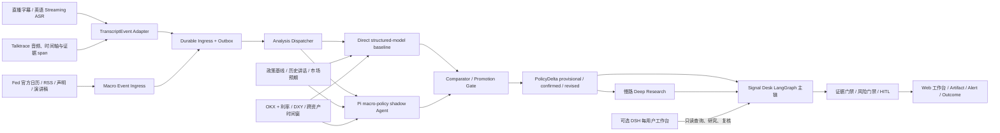
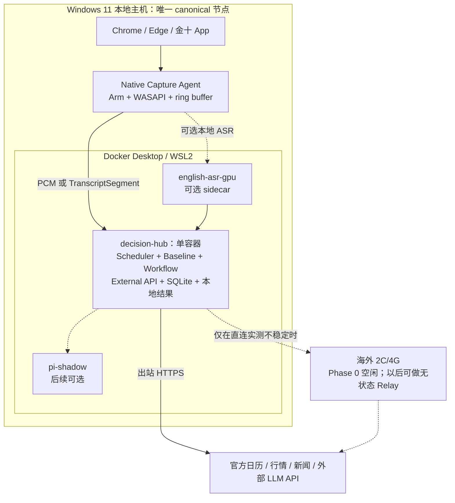
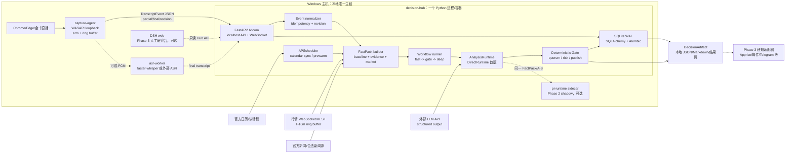
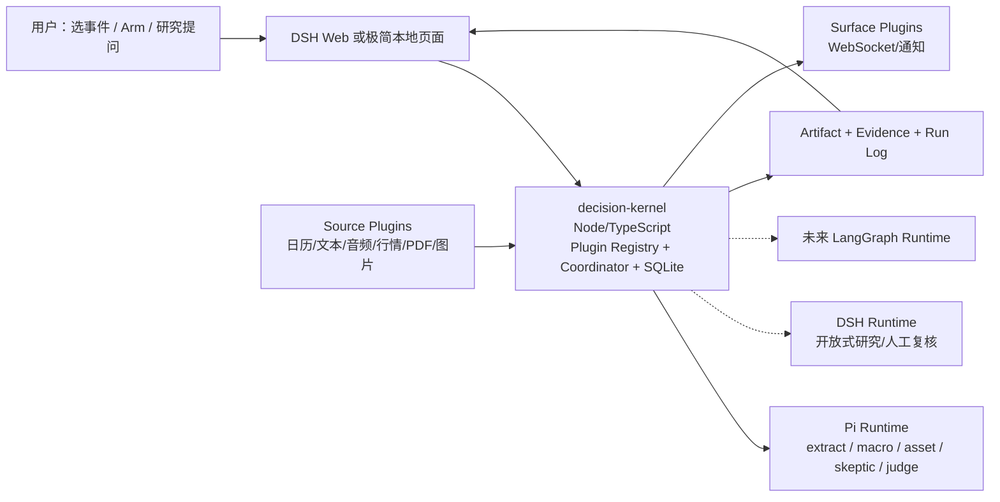
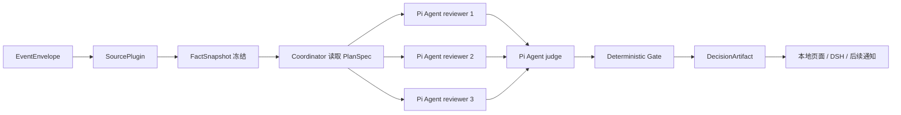

# DSH 调研与决策记录

> 文档类型：持续更新的研究、讨论与决策档案  
> 建立时间：2026-08-21（UTC+8）  
> 首次网络调查快照：2026-08-21 17:35（UTC+8）  
> 当前状态：中央单实例与“文本核心优先”已确认；长期技术架构已按维护性审查修订，正在审阅，尚未开始产品实现  
> 本地目录：`/Users/chase/Desktop/codex/project/dsh-mult`

> **当前权威阅读顺序（2026-08-23）：** 已确认的产品边界以 `D-001`、`D-002`、`D-004` 为准；当前待用户审阅的长期技术推荐以第 33 节为准。`DECISION_HUB_FINAL_ARCHITECTURE.md` 和第 32 节中的 `asyncio Coordinator + 固定角色链 + 首版无 LangGraph` 已被维护性审查退回，只能作为 Evidence/Gate/Artifact 契约审计材料，禁止作为实施基线。本文更早章节中的 `DirectRuntime`、`Pi shadow`、Alert/Pi 双生产链、先做 ASR/Feed/Web 等“当前建议”也均是历史方案。

## 0. 文档用途和维护规则

这份文档用于防止长对话中的事实、假设、疑问、方案和决策丢失。后续每讨论一个问题，都应追加到本文件，而不是只依赖聊天上下文。

统一使用以下标签：

- `[FACT]`：已由官方源码、官方文档、发布记录或项目代码直接证实。
- `[OBSERVATION]`：对公开生态和项目状态的观察，不等于生产采用证明。
- `[ESTIMATE]`：没有官方数据时给出的工程估算，必须写明假设。
- `[RECOMMENDATION]`：当前建议，尚不等于用户最终决定。
- `[QUESTION]`：需要后续逐项讨论的问题。
- `[DECISION]`：用户已经确认的决定，必须记录日期、原因和影响。
- `[RISK]`：可能导致安全、成本、兼容性或产品失败的风险。
- `[STOP]`：建议预先约定的停止/降级条件，不代表用户已经接受该条件。

维护约定：

1. 新问题进入“待讨论问题队列”，分配稳定编号，例如 `Q-001`。
2. 讨论完成后，在“决策登记表”新增 `D-xxx`，并回链原问题。
3. 外部事实应尽量保留版本、提交、日期和一手来源。
4. 资源数字必须区分“官方要求”“启动级估算”“实用配置”和“生产建议”。
5. DSH 仍处于快速 RC 阶段，重新做重大决策前应刷新版本和生态快照。

---

## 1. 本轮结论摘要

### 1.1 核心判断

> **2026-08-21 业务边界修正：** 本小节前半部分保留首次 DSH 通用工作台调查的结论，但“多用户 DSH 工作台”不再是当前市场决策项目的目标。当前有效边界见 `D-001`、`D-002` 和第 16 节。

- `[FACT]` DeepSeek Harness 是 DeepSeek AI 官方开源的 Agent Harness，CLI 名称为 `dsh`，核心理念是 Everything is a Plugin。
- `[FACT]` 截至 2026-08-21，最新版本为 `0.1.1-rc.1`，仍属于 Developer Preview，官方明确说明未来会有兼容性破坏。
- `[FACT]` 官方已经提供 `dsh web`，但产品边界是本地优先、单用户、拥有 Shell 和文件系统能力的工作台，不是现成的多租户 SaaS。
- `[FACT]` 官方 CLI 明确拒绝 `--host 0.0.0.0`，源码错误信息指出这会向网络暴露远程代码执行。
- `[FACT]` 当前没有原生登录、用户所有权、租户隔离、SSO、RBAC、配额或企业审计。
- `[FACT]` 如果未来另做通用多人 DSH 产品，“一名用户一个隔离 DSH Runtime”仍是正确安全边界；但这不是当前市场决策中心的部署方式。
- `[OBSERVATION]` 插件生态已经爆发，但生态规模远大于生产成熟度。企业已经入场，绝大多数 DSH 集成仍只有几天历史。
- `[RECOMMENDATION]` 最值得投入的不是新的主题、侧栏或桌面壳，而是可信插件治理、多租户控制平面、权限继承、评测审计和垂直工作流。

### 1.2 当前最重要的产品机会假设

`[OBSERVATION]` 首次通用 DSH 调研提出过以下候选方向：

> 企业级 DSH 工作台控制平面 + 每用户隔离 Runtime + 可信插件目录/兼容性认证 + 权限与审计。

`[DECISION]` 用户随后明确：当前项目不是上述多用户工作台，而是一个中央市场决策中心。当前最重要的产品假设已经修正为：

> 一个单租户、持续运行、事件驱动、跨资产的中央市场决策大脑。系统提前维护日历和预案，接收官方正文、突发新闻与用户打开直播后的音频，识别相对市场预期的新信息，沿宏观金融、产业供应链、公司暴露和市场仓位链推导影响，一次生成统一判断，再按资产、周期和订阅规则扇出通知。

当前仍需验证的不是“如何给每个用户启动 DSH”，而是这套决策链是否在历史回放和真实事件中更快、更深、更可校准。

---

## 2. 官方项目身份和成熟度

### 2.1 项目身份

- `[FACT]` 官方仓库：[deepseek-ai/deepseek-harness](https://github.com/deepseek-ai/deepseek-harness)
- `[FACT]` 官方产品页：[DeepSeek Harness](https://www.deepseek.com/harness/)
- `[FACT]` CLI/npm 包：`@deepseek-ai/dsh`
- `[FACT]` 许可证：MIT，可商用、修改和分发。
- `[FACT]` “DeepSeek Harness”商标另受品牌规范约束。第三方产品命名建议使用 `DSH`，产品描述可以写“基于/兼容 DeepSeek Harness”。

### 2.2 调查时版本快照

| 项目 | 快照值 |
|---|---|
| 最新版本 | `0.1.1-rc.1` |
| GitHub Tag | `dsh-v0.1.1-rc.1` |
| 固定提交 | `528c682e061696f5a160f363f236ecbf53cbd006` |
| 发布时间 | 2026-08-21 07:12:39 UTC |
| 稳定性 | Developer Preview / prerelease |
| Node.js | `^22.19.0` 或 `>=24.0.0` |
| 源码包管理器 | `pnpm 11.7.0` |
| 默认 Web 地址 | `http://127.0.0.1:3080` |

`[RISK]` 当前版本更新速度非常快。公开后一周内已经连续出现多个 RC，插件接口、存储格式、UI Slot 和构建方式都有变化。任何生产原型都应固定 DSH 版本，并建立自动兼容性验证，不能长期跟随 `latest`。

### 2.3 官方核心能力

- 模型适配器：DeepSeek、Anthropic、OpenAI 及自定义 OpenAI 兼容端点。
- 文件读取、编辑、搜索、Shell、PowerShell 和持久终端。
- Skills、MCP、Web Search 和 Web Fetch。
- Plan、Goal、Job、Workflow、Schedule、Subagent 和任务委派。
- 仅追加会话日志、恢复、分叉、回放、搜索和 Trajectory 视图。
- Standard、PTC、Minimal、Cordis 等 Agent Preset。
- Web UI、Headless、Python SDK、ACP 等运行入口。
- 模型可通过 Cordis 工具临时定义和运行进程内插件。

---

## 3. 插件体系如何理解

### 3.1 插件层次

| 层次 | 能做什么 | 耦合/风险 |
|---|---|---|
| Skill | 提供领域指导、工作流和资源 | 低，较便携 |
| MCP | 接入外部工具、数据和服务 | 中，跨 Harness 复用较好 |
| Tool/Provider 插件 | 注册工具、模型、搜索、记忆、Shell 等能力 | 中到高，依赖 DSH 接口 |
| UI 插件 | 注册侧栏、设置卡片、工具卡片、编辑器、浮层和主题 | 高，容易受 UI Slot 变更影响 |
| Core Seam 插件 | 替换文件系统、沙箱、存储、Agent Loop、调度等核心实现 | 很高，能力强但安全和兼容成本高 |
| 动态 Cordis 插件 | Agent 在运行时临时生成 Host/UI 插件 | 适合实验，不是安全边界，也不跨重启持久化 |

### 3.2 分发和个性化单位

- `Bundle`：可安装 npm/Git/tarball 包，通过 `dsh.bundle` 和 `cordis.patch.yml` 注入配置层。
- `Profile`：定义一个 DSH Runtime 加载哪些 Bundle 和 Patch。
- `Agent Preset`：定义某类会话使用的模型、工具和行为组合。
- `User Patch`：用户对 Profile 的本地覆盖。
- `UI Slot`：插件向 Web UI 的指定位置贡献组件。
- `Settings Card`：插件可以在 Web 设置中提供自己的配置界面。

### 3.3 插件供应链风险

- `[FACT]` 第三方插件在宿主进程中以当前 OS 用户权限执行。
- `[FACT]` Agent 的工具审批并不能隔离插件初始化和插件自身代码。
- `[FACT]` Git 依赖可能在安装阶段执行 `prepare` 等脚本，这不在 Agent 沙箱内。
- `[FACT]` 动态 Cordis VM 只是约束诚实代码，不是安全边界。
- `[RECOMMENDATION]` 企业环境必须使用固定版本、私有镜像/仓库、插件 allowlist、SBOM、依赖扫描、恶意行为检测和安装冒烟测试。

---

## 4. 生态规模与当前玩法

### 4.1 生态快照

| 指标 | 2026-08-21 调查值 | 解释 |
|---|---:|---|
| GitHub `dsh-plugin` Topic 仓库 | 约 10,007 | 含低质量、重复或仅添加 Topic 的项目，不等于插件数量 |
| Awesome DSH Plugin 可安装条目 | 约 1,837 | 列表检查“可安装和描述基本一致”，不做安全审计 |
| 精选分类 | 21 | UI、模型、记忆、工具、浏览器、多模态、工作流、安全、远程等 |

### 4.2 已核验的企业和社区案例

| 方向 | 主体/项目 | 已核验能力 | 成熟度观察 |
|---|---|---|---|
| 浏览器自动化 | 腾讯 [BrowserSkill DSH Plugin](https://github.com/Tencent/BrowserSkill/tree/main/packages/dsh-plugin-browserskill) | 11 个 Chrome/Edge 工具、登录态浏览器、多 Session、截图、移动模拟、观察浮层 | 有代码、测试和 npm 发布；DSH 插件本身仍很新 |
| 企业知识库 | 腾讯 [WeKnora DSH](https://github.com/Tencent/WeKnora/tree/main/packages/dsh-weknora) | 知识库列表、混合检索、全文重组、带引用 RAG/ReAct 问答 | 有契约测试和 DSH E2E；插件 2026-08-21 发布 |
| 上下文数据库 | 火山引擎 [OpenViking Memory](https://github.com/volcengine/OpenViking/tree/main/examples/dsh-memory-plugin) | Pre-step 自动召回、会话捕获、跨会话记忆、MCP 工具面、失败写入队列 | 底层项目较完整；DSH 插件仍很新 |
| 长期记忆 | [MemOS](https://github.com/MemTensor/MemOS) | 自动 Recall/Capture、本地或云记忆、混合检索和经验演化 | 已形成跨 Harness 产品思路 |
| 桌面办公 Agent | 网易有道 [LobsterAI](https://github.com/netease-youdao/LobsterAI) | 将 DSH 作为可替换 Runtime 嵌入桌面产品，支持文档、幻灯片、研究等 | 主产品有正式安装版，DSH Runtime 仍标为实验 |
| Agent 工作台 | [Yao](https://github.com/YaoApp/yao) | 跨桌面、手机、Web/API 的任务和 Workspace，自托管 Sandbox Runner | 底层项目历史较长，DSH Runner 是近期加入 |
| 多引擎创作工作台 | [iPolloWork](https://github.com/Devin-AXIS/iPolloWork) | DSH/Codex/OpenCode 多引擎，设计、PPT、视频和多 Agent | 产品化方向清晰，但许可和商业使用条件需单独核验 |
| 设计与可编辑产物 | [OpenDesign](https://github.com/nexu-io/open-design) | 原型、页面、PPT、图像、视频和真实文件导出 | 通用创作工作台竞争已开始拥挤 |
| 团队协作 | DataElement [CoAligne](https://github.com/dataelement/dsh-plugin-coaligne) | 团队项目上下文、会话同步、搜索、评论、分享和审阅 | 真实可安装，但采用证据和项目历史都很有限 |
| 可观测 | 腾讯云 [AgentObs DSH](https://github.com/TencentCloud/tencentcloud-agentobs-sdk-dsh) | Session/Agent/Step/Chat/Tool 五层 Trace，上报 CLS | 官方组织发布，但当前仅 `v0.0.1` |
| 插件市场 | [dsh-market](https://github.com/dsh-market/dsh-market) | 搜索、安装、更新、主题、备份恢复、依赖冲突和加载顺序诊断 | 迭代活跃；明确不做插件安全审计 |
| Web UI 扩展 | [dsh-web-ui](https://github.com/zhu1090093659/dsh-web-ui) | 任务板、Git 图、右侧面板、远程移动 UI、Token 面板和皮肤 | 已证明 Web UI 可高度定制，兼容性成本仍高 |
| 视觉桥 | [ModLens](https://github.com/liustack/modlens) | 为文本模型提供 OCR、布局和语义证据 | 有真实包和采用，但视觉桥赛道已快速拥挤 |

### 4.3 已经形成的玩法分类

1. 桌面客户端、托盘启动器和免 Node 安装分发。
2. Web UI 侧栏、主题、任务板、文件管理器、终端和 Git 面板。
3. 模型 Provider、额度管理、模型路由和本地模型接入。
4. 记忆、RAG、企业知识库和上下文数据库。
5. 浏览器、Computer Use、外部 API、数据库和业务系统工具。
6. 图片、视觉、语音、视频等多模态补强。
7. Workflow、Schedule、Ralph Loop、Subagent 和 Agent Team。
8. IM/移动端远控、跨设备任务入口和通知。
9. 可编辑的代码、文档、PPT、设计、图像和视频产物。
10. 插件市场、更新器、测试、评分、可观测、沙箱和安全治理。

`[OBSERVATION]` 企业已经真实入场，但公开证据主要证明“代码和包存在”，还不能证明已经有大规模生产部署。大多数 DSH 集成是在 2026-08-14 至 2026-08-21 之间加入的。

---

## 5. Web 部署和多用户结论

### 5.1 官方当前支持矩阵

| 场景 | 当前状态 | 说明 |
|---|---|---|
| 本机个人 Web UI | 支持 | 默认 `127.0.0.1:3080` |
| SSH 端口转发给单用户 | 支持/官方考虑 | 保持 DSH 仅监听 loopback |
| 单实例多个 Workspace/Session | 支持 | 没有用户所有权边界 |
| 每个 Session 使用不同 Agent Preset | 支持 | 不等于账号隔离 |
| 单实例多人登录 | 不支持 | 没有账号和认证层 |
| SSO/RBAC/租户 | 不支持 | 需外部控制面和隔离 Runtime |
| 直接绑定 `0.0.0.0` | CLI 明确拒绝 | 原因是会暴露远程代码执行 |
| 多副本共享 `$DSH_HOME` | 不支持 | 本地存储没有跨进程写锁 |
| 官方 Docker/K8s/Helm | 未提供 | 需要自行制作和验证 |

### 5.2 为什么不能直接共享一个 DSH 进程

- `[FACT]` 官方 Webserver 不提供 TLS、用户认证或完整 Origin 策略。
- `[FACT]` Host/Origin Fence 是可达性和 DNS Rebinding 防护，不是身份认证。
- `[FACT]` 非特权会话创建本身就可能获得默认 Bash、文件和 Agent 工具。
- `[FACT]` API Proxy 官方文档把当前网关描述为单用户本地服务。
- `[FACT]` Workspace、Session 和配置 API 没有完整的 tenant/user owner 字段和权限模型。
- `[FACT]` 默认数据根是一个 `$DSH_HOME`，凭据、Profile、Preset 和存储都在这个运行环境内。
- `[FACT]` 同一 OS UID 下运行的模型、工具或插件可能读取本地凭据。
- `[FACT]` JSON Store 假设单 Host Process，没有跨进程写锁；Session 同时只允许一个 Active Writer。
- `[FACT]` 动态插件和部分 Host 服务具有进程全局影响，可能影响同一进程的其他会话。

### 5.3 个性化能力的真实作用域

| 个性化对象 | 当前作用域 | 多用户平台需要做什么 |
|---|---|---|
| Profile/Bundle/Patch | `$DSH_HOME`/运行实例 | 每用户独立目录或从受控模板生成 |
| Agent Preset | 本地用户 Preset 目录/会话选择 | 每用户存储、版本和 allowlist |
| Skill/MCP | Profile、Workspace 或进程 | 每用户授权、Secret 和网络策略 |
| 模型/凭据 | 当前 DSH Host | 独立 Secret、KMS/Vault 和访问审计 |
| Workspace/Session | 当前全局注册表 | 显式所有权、隔离挂载和生命周期管理 |
| UI 插件/设置卡片 | 当前 Web Profile | 每租户策略 + 每用户可选层 |
| 动态 Cordis 插件 | 进程内存 | 生产默认禁用或放在强隔离 Runtime 中 |

### 5.4 推荐的多人工作台架构

```text
浏览器
  |
企业 SSO / API Gateway / WAF
  |
租户控制面
  |-- 身份与授权
  |-- Runtime 路由与 WebSocket
  |-- 配额、审计、版本、休眠恢复
  |-- 插件策略和镜像签名
  |
  +-- 用户 A Sidecar + 独立 DSH Runtime
  |      +-- 独立 DSH_HOME
  |      +-- 独立 Secret/Profile/Preset
  |      +-- 独立 Workspace Volume
  |
  +-- 用户 B Sidecar + 独立 DSH Runtime
         +-- 独立 DSH_HOME
         +-- 独立 Secret/Profile/Preset
         +-- 独立 Workspace Volume
```

关键原则：

- 不直接把 DSH 暴露到公网或办公网。
- DSH 保持监听 Runtime 内的 loopback，由同 Pod/VM 的认证 Sidecar 转发。
- 不同用户不共享可写 `$DSH_HOME`、凭据目录、插件目录或 Workspace。
- 公共插件进入审核后的基础镜像；个人插件安装在独立 Runtime，受组织策略控制。
- 外层负责 SSO、RBAC、配额、审计、网络出口、备份、数据保留和升级迁移。
- 空闲 Runtime 可以休眠或缩容到零，活跃时恢复逻辑状态和 Workspace。
- 共享团队项目应通过独立协作服务实现，不应通过共享 DSH 进程实现。

### 5.5 现有“多租户”社区项目成熟度

#### GuoMonth/dsh-multi-tenant

- `[FACT]` 当前版本 `v0.1.0-rc.2`，项目创建于 2026-08-14。
- `[FACT]` 目标 DSH 仍为旧版 `0.1.0-rc.7`。
- `[FACT]` 已实现最小 Tenant Principal、Session Ownership、Fail-closed Authorization 和可替换 Store Contract。
- `[FACT]` 默认只有内存 Store；Web Enforcement 是私有实验包。
- `[FACT]` 明确不提供生产登录、Web Transport、持久化、UI、通用 RBAC、计费、审计持久化或 Shell/FS/Process/Network 隔离。
- `[CONCLUSION]` 可研究其授权原语和测试方式，不能当作可部署多租户产品。

#### GuoMonth/dsh-isolated-runtime

- `[FACT]` 设计采用“一 Runtime 对应一个 Tenant；一个 Tenant 可有多个 Runtime”。
- `[FACT]` 方向是 Kubernetes Runtime、Gateway、控制器、持久化恢复和安全级别。
- `[FACT]` README 明确处于 Bootstrapping/M0.1，真实 Pod 生命周期尚未完成。
- `[CONCLUSION]` 架构方向与本文件建议一致，但目前仍是设计和控制面骨架。

#### Yao 等外部工作台

- `[OBSERVATION]` Yao、iPolloWork、LobsterAI 更接近“统一工作台/多 Agent Host”，但 DSH 只是其中一个近期加入的 Runtime。
- `[CONCLUSION]` 值得研究其任务、跨设备、Runner 和产品交互，不应假设其已经完整解决 DSH 的多租户安全边界。

---

## 6. 部署资源和容量估算

### 6.1 官方事实

- `[FACT]` 官方没有公布 CPU、RAM、GPU 或磁盘最低配置。
- `[FACT]` 官方没有发布生产并发测试或容量模型。
- `[FACT]` 官方仓库未发现 Dockerfile、Compose、Kubernetes 或 Helm 生产清单。
- `[FACT]` Node.js 要求为 `^22.19.0` 或 `>=24.0.0`。
- `[FACT]` 使用远程 DeepSeek/OpenAI/Anthropic API 时，DSH 自身不需要 GPU。
- `[FACT]` 如果本地运行模型，资源下限由模型和推理引擎决定，不能计入 DSH 自身最低配置。

### 6.2 工程估算

以下数字全部属于 `[ESTIMATE]`，假设使用远程 LLM API：

| 场景 | CPU | RAM | 磁盘 | 适用边界 |
|---|---:|---:|---:|---|
| 单人启动级实验 | 1 vCPU | 1 GiB | 2-5 GiB | 纯文本、单会话、不开图、不跑 `run_code`、不构建 |
| 单人实用最低 | 2 vCPU | 4 GiB | 10-20 GiB SSD + Workspace | 一个活跃会话，偶尔 Shell/工具/图片 |
| 浏览器/图片/构建/多子 Agent | 4 vCPU 起 | 8 GiB 起 | 40 GiB 起 | 开发型工作负载 |
| 5 人隔离试点 | 8 vCPU | 16 GiB | 每人至少 20 GiB + Workspace | 约 2-4 人并发，轻到中等负载 |
| 10 人隔离试点 | 16 vCPU | 32 GiB | 每人至少 20 GiB + Workspace | 轻负载、远程模型；重构建需上浮 |

`[RECOMMENDATION]` 不要把 `1 vCPU/1 GiB` 当作生产配置。单用户实用基线从 `2 vCPU/4 GiB` 起，多子 Agent、浏览器和编译任务从 `4 vCPU/8 GiB` 起。

### 6.3 容量影响因素

- `[FACT]` `/api` 单请求默认允许约 160 MiB，并会整体缓存在内存。
- `[FACT]` 每次 `run_code` 创建独立 Worker，默认 V8 Old Generation 上限为 512 MiB，没有 Worker Pool。
- `[FACT]` 每个 Agent 默认最多允许 10 个并行工具调用。
- Shell、Build、Test、浏览器、语言服务器和子 Agent 子进程不受 DSH Node Heap 上限完全约束。
- 会话、附件、Spill 和 Workspace 的增长需要独立的保留和清理策略。

粗略容量公式：

```text
总 RAM ≈ 控制面基础内存
       + 活跃用户 Runtime × 2-4 GiB
       + 并发 run_code Worker × 0.6-0.75 GiB
       + Build/Browser/LSP/Subagent 进程
       + 30%-50% 安全余量
```

Registered User 数量不是主要容量变量，真正应围绕 Active Runtime、并发任务、工具类型和 Workspace 大小进行容量规划。空闲用户 Runtime 应尽量休眠。

---

## 7. 值得研究和建设的方向

### 7.1 优先级建议

| 优先级 | 方向 | 为什么值得做 | 主要壁垒/风险 |
|---|---|---|---|
| S | 企业可信插件仓库与兼容性认证 | 现有市场解决“能安装”，没有解决“企业敢安装” | 供应链扫描、行为检测、版本矩阵、沙箱和签名 |
| S | 真正的多租户 Web 控制平面 | 官方单用户边界明确，公开方案仍不完整 | 身份绑定、每用户隔离、WebSocket 路由、成本和恢复 |
| A | 带源系统 ACL 的企业知识层 | WeKnora/OpenViking 验证需求，普通 RAG 已同质化 | ACL 继承、删除传播、引用、数据驻留和越权评测 |
| A | 项目级人机协作控制面 | CoAligne/Yao/iPolloWork 验证任务、评审和共享产物需求 | 并发一致性、责任链、组织权限和审计 |
| A | Agent 可观测、评测与安全事件平台 | 腾讯云已入场，但端到端治理仍早期 | 跨插件 Trace、数据脱敏、质量基线、成本归因 |
| A/B | 垂直可编辑产物工作台 | 通用创作拥挤，垂直模板和验收仍有空间 | 格式保真、引用、自动 QA 和行业知识 |
| B | 垂直浏览器工作流 | 可复用 Tencent BrowserSkill，不需重造浏览器层 | 页面变化、幂等、审批、证据和失败恢复 |

### 7.2 方向拆解

#### 方向 A：可信插件治理

建议研究：

- 私有插件目录、组织 allowlist 和审批流程。
- 包签名、来源固定、SBOM、依赖漏洞和 License 检查。
- 安装脚本、网络访问、文件访问、子进程和 Secret 行为扫描。
- 多个 DSH RC 的安装、启动、工具回路和 UI 冒烟测试。
- 插件加载顺序、依赖多版本、UI Slot 冲突和升级迁移报告。
- 生产镜像准入和已安装插件运行态清单。

#### 方向 B：多租户控制平面

建议研究：

- SSO/OIDC、Runtime Router、认证 Sidecar 和 WebSocket 转发。
- 一用户一 Runtime、一用户一 OS Identity/Container。
- DSH_HOME、Workspace、Secret、Profile 和 Preset 的隔离与模板继承。
- Runtime 创建、恢复、休眠、销毁、配额和成本归因。
- 审计事件、网络出口策略、插件策略和版本灰度。
- 逻辑状态备份、Workspace 持久化和故障恢复。

#### 方向 C：ACL-Aware 企业知识与业务连接器

不建议只做普通向量检索。建议优先研究：

- 飞书、钉钉、企业微信、Confluence、SharePoint、Git、工单和内部数据库。
- 保留源系统用户/组织权限，不把有权限的数据泄漏给无权限用户或 Agent。
- 引用、证据、版本、删除传播、保留期和数据驻留。
- 读取与写入分层，危险写操作必须审批、幂等和可回滚。

#### 方向 D：垂直工作台

比通用 PPT/设计更有机会的场景：

- 投标书和招投标材料。
- 审计底稿和合规报告。
- 行业研报和尽调材料。
- 工程施工方案和技术交底。
- 安全事件处置报告。
- IoT/园区运营、工单和设备诊断。

共同壁垒应是模板、证据引用、权限、业务规则和自动验收，而不是聊天 UI。

---

## 8. 当前不建议优先做的方向

- 又一个主题、桌面宠物、普通侧栏或简单 UI 皮肤。
- 只做启动器或同质化桌面壳。
- 普通 OpenAI-Compatible Provider 或额度面板。
- 没有权限和删除传播的通用个人记忆/RAG。
- 重造通用浏览器工具层；优先复用 BrowserSkill 等成熟底座。
- 直接把官方 DSH Web 绑定公网或办公室 LAN。
- 多用户共享一个 DSH 进程，再用 Nginx 登录页掩盖内部无租户边界的问题。
- 多副本共享同一个 `$DSH_HOME` 目录进行水平扩容。
- 在 DSH RC 阶段大规模 Fork 核心，除非无法通过插件/适配层实现。

---

## 9. 建议的验证顺序

这不是已经确认的 Roadmap，而是后续决策时可参考的顺序。

### 阶段 0：单用户能力和兼容性实验

- 固定一个 DSH RC，不跟随 `latest`。
- 本地或 SSH 转发运行官方 Web。
- 只安装少量已审核插件。
- 建立自动安装、启动、工具调用和数据恢复测试。
- 测量空闲、普通会话、图片、浏览器、Build、Subagent 和 `run_code` 的真实资源。

### 阶段 1：安全的单用户远程 Runtime

- 在同 Runtime 增加认证 Sidecar。
- 接入 OIDC/SSO，补 TLS、WebSocket 和审计。
- DSH 继续仅监听 loopback。
- 完成 Secret、Workspace、出口网络和插件策略。

### 阶段 2：每用户隔离实例

- 控制面按用户创建 Runtime、DSH_HOME 和 Workspace。
- 提供公共模板与用户个性化覆盖。
- 支持配额、休眠、恢复、版本灰度和备份。
- 做租户逃逸、越权读取和跨用户会话访问测试。

### 阶段 3：团队协作和垂直业务

- 共享项目、任务、评审、审批和产物由独立服务管理。
- DSH Runtime 仍保持执行隔离。
- 接入 ACL-Aware 企业知识和业务系统。
- 增加任务级成本、质量、证据和 ROI 评估。

---

## 10. 待讨论问题队列

后续建议按顺序逐项讨论。当前均未形成用户最终决定。

| 编号 | 问题 | 为什么重要 | 当前状态 |
|---|---|---|---|
| Q-001 | 产品服务谁：个人、企业内部团队、私有化客户还是公开 SaaS？ | 决定认证、隔离、合规和商业模式 | 待讨论 |
| Q-002 | 第一批核心用户是谁，他们每天最高频的三项任务是什么？ | 防止先做平台、后找需求 | 待讨论 |
| Q-003 | 目标是 DSH 专属工作台，还是同时支持 Codex/Claude Code/OpenCode？ | 决定平台耦合和市场范围 | 待讨论 |
| Q-004 | 主要工作负载是 Coding、办公产物、浏览器流程、知识问答还是 IoT/运营？ | 决定插件、资源和 UX | 待讨论 |
| Q-005 | 预期注册用户数、日活、峰值并发和单任务时长是多少？ | 决定容量和休眠策略 | 待讨论 |
| Q-006 | 数据敏感度和合规要求是什么？ | 决定单机、容器、VM、KMS、审计和驻留 | 待讨论 |
| Q-007 | 需要多强的隔离：进程、OS UID、容器、gVisor、MicroVM 还是独立 VM？ | 决定安全边界和成本 | 待讨论 |
| Q-008 | 用户能否自由安装第三方插件，还是只能选企业审核目录？ | 决定供应链治理模型 | 待讨论 |
| Q-009 | 用户个性化允许到什么程度：主题、Skill、MCP、模型、Core Plugin？ | 决定模板和风险等级 | 待讨论 |
| Q-010 | 模型走 DeepSeek API、企业网关、多 Provider 还是本地模型？ | 决定网络、成本、GPU 和凭据架构 | 待讨论 |
| Q-011 | 部署目标是单机 Docker、Kubernetes、客户本地机房还是公有云？ | 决定 Runtime 编排实现 | 待讨论 |
| Q-012 | Workspace 数据如何保存、共享、备份、删除和恢复？ | 决定存储与协作边界 | 待讨论 |
| Q-013 | 团队共享的是文件、任务、会话、记忆还是 Agent？ | 决定共享服务的数据模型 | 待讨论 |
| Q-014 | 产品的首个差异化壁垒是什么？ | 防止演化成同质化 UI 壳 | 待讨论 |
| Q-015 | 团队人数、技术栈、预算和期望上线周期是什么？ | 决定自研深度和 MVP 范围 | 待讨论 |
| Q-016 | 是否接受 DSH RC 频繁升级和兼容性维护成本？ | 决定是否现在进入以及版本策略 | 待讨论 |
| Q-017 | MVP 的验收指标是什么：任务成功率、节省时间、并发、成本还是合规？ | 决定评测系统和停止条件 | 待讨论 |
| Q-018 | 实时宏观分析内核选择 Pi SDK、完整 Pi、DSH，还是继续使用 LangGraph/Deep Agents？ | 决定热路径复杂度、运行时边界和迁移成本 | 第 33 节待审阅推荐：LangGraph 负责正式 Workflow Runtime；Pi SDK 执行 Agent loop；DSH 是研究工作台/可选深研 Runtime，不负责 canonical 自动化主链 |
| Q-019 | Signal Desk 是否继续作为任务、证据、风控、审批和 Artifact 的唯一业务事实源？ | 避免 Pi、DSH 和 LangGraph 各自保存互相冲突的状态 | 本轮最终推荐：新 Decision Hub 的 SQLite ledger 是唯一 canonical 业务状态；不启动 Signal Desk 产品壳 |
| Q-020 | Fed 实时文字首选官方已发布稿、直播字幕、云端英语 ASR，还是本地英语 ASR 双路校验？ | 决定速度、准确率、成本、版权和故障降级 | 待讨论 |
| Q-021 | 首期只覆盖 FOMC/美联储主席，还是同时覆盖其他 Fed 官员、ECB、BOJ、宏观数据发布？ | 决定事件模型和 MVP 边界 | 待讨论 |
| Q-022 | 从原话说完到出现初步提示、确认提示的 p50/p95 延迟目标是多少？ | 决定能否等待 final、模型选择和部署位置 | 待讨论 |
| Q-023 | 输出只做情报提示和情景分析，还是允许给出人工执行的方向/仓位建议？ | 决定风险门禁、合规边界和验收方式 | 待讨论 |
| Q-024 | 利率预期、国债、美元、期权、清算和跨资产行情采用哪些合法数据源？ | 深层影响分析依赖数据授权和时间对齐 | 待讨论 |
| Q-025 | DSH 是可选的分析师工作台，还是所有终端用户都必须经过 DSH？ | 决定是否承担一用户一 Runtime 的部署成本 | 已由 `D-001` 确认：终端接收者不运行 DSH；DSH 最多是内部可选控制台 |
| Q-026 | Talktrace 的商业嵌入、公开托管和第三方模型/资产授权如何处理？ | 当前 Source License 默认禁止这些使用方式 | 待讨论 |
| Q-027 | 联合系统部署在单机、内网服务器还是公有云；预计并发直播和分析师人数是多少？ | 决定 ASR、事件总线和 Runtime 的容量配置 | 当前倾向：Windows 本机、单用户、单场直播；待用户最终确认 Phase 0 拓扑 |
| Q-028 | 历史演讲回放集、人工标签和上线阈值如何定义？ | 没有离线回放无法判断“更智能”是否真实改善 | 待讨论 |
| Q-029 | Pi 接入采用同进程 Node SDK、常驻 JSONL sidecar，还是独立网络服务？ | 决定隔离、延迟、部署和故障恢复 | 第 33 节待审阅推荐：锁版本 npm SDK + 薄 `PiAgentRuntime`；长期边界采用版本化 HTTP/RPC Contract，JSONL stdio 仅保留为本地测试 transport；不 fork Pi 源码 |
| Q-030 | 转写 revision 导致既有判断变化时，是否允许自动撤回/降级旧提示？ | 决定实时提示能否保持可审计和不误导 | 待讨论 |
| Q-031 | 发言人身份由官方日历绑定、人工指定还是声纹识别确认？ | 现有 diarization 只能给匿名 speaker cluster | 待讨论 |
| Q-032 | 快路和慢路分别使用哪些模型、预算与降级策略？ | 决定速度、深度、稳定性和调用成本 | 当前建议：外部高质量模型负责正式判断，本地模型只预热/降级；具体 Provider、预算待讨论 |
| Q-033 | 是否先把请求级风险上下文丢失、空头 Outcome 标签和非法 horizon 静默回退列为 P0 阻断项？ | 这些问题会直接污染风险裁决、历史评分和后续模型评测 | 条件化：仅在复用 Signal Desk 对应代码时必须先修；不再是新内核前置项 |
| Q-034 | Pi shadow A/B 达到什么增量门槛后才能从候选适配器升级为默认路径？ | 避免把框架变化误当成分析质量提升 | 已被第 33 节取代：现有 Alert 分析图作为可运行的 `LegacyAlertStrategyPlugin`，Pi 驱动的新策略作为独立版本；日常只运行所选策略，评测时才双跑，可按版本回退 |
| Q-035 | 第一阶段只生成研究信号和人工执行建议，还是允许连接券商/交易所自动下单？ | 决定合规、风险门禁、权限和事故半径；默认建议首期不自动下单 | 待讨论 |
| Q-036 | ASR `partial` 只能用于预热和预警，还是允许触发可执行方向提示？ | partial 延迟低但会被 final/revision 推翻；默认建议不得直接触发可执行信号 | 待讨论 |
| Q-037 | 首期资产是否冻结为 BTC、国际黄金和 Nasdaq/QQQ（或指数期货）？ETH/SOL、美股板块和 A 股何时加入？ | 决定数据采购、Market Pack 数量、评测样本和实现范围 | 待讨论 |
| Q-038 | 首期决策周期是否冻结为 `0-30 分钟` 和 `1-3 天`，一个月级判断放到后续？ | 不同周期可能方向相反，必须分别评测和发布 | 待讨论 |
| Q-039 | 直播采集采用“用户选择已登记事件并点击 Arm”，还是自动识别任何正在播放的系统音频？ | 决定误绑定风险、隐私、桌面权限和交互复杂度 | 待讨论 |
| Q-040 | 金十仅作为用户人工查看日历/打开直播的入口，还是采购其合法 API/数据授权？ | 页面抓取、音视频使用和信号再分发存在稳定性与授权边界 | 待讨论 |
| Q-041 | 下游只接收统一 `house view`，还是还需按个人持仓和风险预算做轻量映射？ | 后者可以放在发布端，但不应为每个用户重新运行宏观分析 | 待讨论 |
| Q-042 | 快路的 `provisional/confirmed` 可否自动推送，还是必须经人工确认？ | 决定真正时延、误报风险、撤回体验和运营人力 | 待讨论 |
| Q-043 | 首期人物/事件范围是 Powell、FOMC 和美国核心宏观数据，还是同时覆盖 Trump、财政部、地区联储及其他央行？ | 事件语义和预案数量会直接决定 MVP 复杂度 | 待讨论 |
| Q-044 | 战争、制裁、关税等突发事件采用一手官方确认、双可信新闻源确认，还是宁可多报以换取速度？ | 决定假消息风险与抢时效之间的门禁 | 待讨论 |
| Q-045 | 音频只在本地边缘机转写并上传文本事件，还是允许向云端上传原始音频？ | 决定隐私、许可、带宽、成本和 ASR 方案 | 当前建议：原始音频默认留在 Windows；本地 ASR 与外部 ASR 仍待回放对比 |
| Q-046 | 产品长期是内部研究工具，还是向外部付费用户提供信号？ | 外部产品会引入行情/新闻再分发、投顾表述、适当性和审计要求 | 待讨论 |
| Q-047 | “供应链分析”是否采用四层统一传导图：宏观金融、传统产业链、公司/资产暴露、市场微观结构？ | Fed 讲话通常首先是金融传导，战争/关税才重点展开传统供应链 | 待讨论 |
| Q-048 | 秒级通知首选 App Push、WebSocket、Telegram 还是企业微信；邮件是否只用于完整报告？ | 邮件不适合作为直播短线的唯一通道 | 当前倾向：效果验证期先本地显示/留档，不建设正式推送；通过评测后再选渠道 |
| Q-049 | 中央服务首期运行在本地 Windows 主机、独立内网服务器还是公有云？同时最多处理几场直播？ | 决定采集拓扑、常驻调度、ASR 和最低配置 | 当前倾向：Windows 主机 24 小时运行、单场直播；海外 `2C/4G` 暂不进入主链，待最终确认 |
| Q-050 | 多 Agent 深路哪些角色必须全部成功，哪些失败时允许降级发布？ | 必须把成功条件写进 Workflow，不能再由模型临场决定 | 第 33 节待审阅推荐：`DomainPack` 声明角色 allowlist/证据/Gate policy，`StrategyPlugin` 动态选择 2-N 个角色并有界循环；硬发布条件仍由 deterministic Gate 执行 |
| Q-051 | Windows 主机的 CPU 型号、4060 Ti 是 `8GB` 还是 `16GB`，Docker Desktop/WSL2 和 GPU passthrough 是否已可用？ | 决定本地英语 ASR 模型、显存余量和容器配置 | 待确认硬件细节 |
| Q-052 | 外部模型 API 首期直接从 Windows 调用，还是同时配置海外 `2C/4G` 无状态 Relay？ | Relay 只可能改善链路稳定性，不改善模型质量，还会增加运维和一次网络跳转 | 当前建议：先 Direct，实测失败率/p95 后再决定 Relay |
| Q-053 | PoC 是否冻结为 Python `DirectRuntime` 正式基线，Pi 只做后续 shadow，DSH 不进入核心？ | 防止为了复用 Harness 增加 Node/Runtime，却没有改善分析质量 | 已被第 33 节取代：R0 即使用正式 Plugin API、LangGraph LifecycleGraph 与 Legacy Alert Strategy；Pi 在 R1 进入正式 Agentic Strategy；DSH 不拥有 canonical path，但在 R3 作为正式 Research Workbench 接入 |
| Q-054 | Phase 0 是否只输出本地 JSON/Markdown/控制台结果，不做邮件、Telegram、企业微信或公网 Web？ | 先验证决策质量，避免把时间花在分发和部署上 | 用户已明确要求先完成文本到结果核心；首个闭环只交付 JSON/Markdown/CLI |
| Q-055 | Windows 主机能否稳定禁止睡眠、断电恢复、时钟同步，并在重启后自动启动 Docker/Hub？ | 本地 24 小时运行的可靠性取决于这些运维事实，而不是 CPU/RAM | 待实测 |
| Q-056 | 可接受的外部模型单事件成本、每日/月度预算和 Provider RPM/TPM 是多少？ | 多 Agent 主要消耗 API 配额和费用，本地算力不是瓶颈 | 待讨论 |

---

## 11. 决策登记表

以下只登记用户已经明确确认的边界；建议、技术偏好和仍带“可能”的方向不登记为最终决定。

| 决策编号 | 日期 | 关联问题 | 决策内容 | 选择原因 | 放弃方案 | 影响/后续动作 | 状态 |
|---|---|---|---|---|---|---|---|
| D-000 | 2026-08-21 | - | 建立本研究与决策档案 | 防止长上下文丢失 | 仅依赖聊天记录 | 后续讨论持续追加 | 已确认 |
| D-001 | 2026-08-21 | Q-001、Q-005、Q-025、Q-041 | 市场决策业务采用中央单租户、每事件单次 canonical 分析：一个逻辑决策中心持续运行，每个事件形成一次统一判断，再向接收者扇出结果；终端接收者不各自运行 Pi/DSH 分析 | 用户明确这是“决策中心”，不是让每个用户进入系统触发分析 | 每用户一个 DSH/Pi Runtime；多用户 Agent 工作台作为当前主产品 | 容量按事件并发和分析任务计算，而非按接收者数量复制 Runtime；个性化仅放在下游筛选/风险映射；不限制未来把逻辑中心做成高可用多副本 | 已确认 |
| D-002 | 2026-08-21 | Q-018、Q-019、Q-025、Q-029 | 不把 `meeting-copilot`、`crypto-manual-alert` 或 `crypto-macro-decision` 整体合并为主系统；只提炼实时证据采集能力和决策教义，通过稳定契约接入新的中央决策内核 | `crypto-manual-alert` 过重且效果不佳；用户需要的是两类思想和能力，而不是继承完整产品边界 | 继续扩充重型 alert 主链；把通用会议助手完整嵌入；Everything is Skill | 会议侧提炼 `Live Evidence Capture`；决策 Skill 拆成通用 Doctrine、代码 Workflow 和 Market Packs；Pi/DSH 只做可替换 Runtime/Console Adapter | 已确认 |
| D-003 | 2026-08-23 | Q-106 至 Q-112 | Windows 本地、中央单实例、人工决策支持、首域、两周期、代码 Gate 与无自动交易边界继续有效；其中“先用 Talktrace -> Alert baseline -> Pi candidate A/B”的实施顺序已废止并由 D-004 取代 | 用户接受 Q-106 至 Q-112 的全部推荐项，并再次要求极简、可插拔、优先复用本人项目，不以框架堆叠代替效果验证 | 云 ASR 默认链路；Alert V2 多租户产品壳；每用户重复分析；首版自动交易；未验证即扩展完整 Web 和通知 | 本地 FunASR 保留为后续 Adapter；中央 Core 独占 canonical 状态；Pi 无发布权；外部模型先直连。原“排除 LangGraph 主编排”和旧最终文档指向已被第 33 节维护性审查退回 | 产品边界有效，实施顺序已由 D-004 取代 |
| D-004 | 2026-08-23 | Q-050、Q-053、Q-054 | 首版建设顺序改为 Text-Core First：先完成 `TextEnvelope -> Evidence -> 分析 -> Gate -> DecisionArtifact`；ASR、日历、实时 Feed、通知和 Web 都只是后续 Adapter/消费层，不能再成为核心闭环之前的前置项目；也不先建设 Alert/Pi 双生产链或无限 A/B 平台 | 用户明确指出此前先陷入 ASR/来源/节点评测是本末倒置，要求先把从文本输入到最终输出、每一步技术和复用边界完整想清楚 | 先做 ASR、日历或实时 Feed；先做 Alert/Pi shadow 平台再决定内核；边写边重新选框架 | D-003 的单机、单 owner、首域、两周期、代码 Gate、无自动交易继续有效；其“Alert baseline + 单 Pi candidate 先对照、达到门槛后再增加第二 Agent”的实施顺序被取代。D-004 只确认建设顺序和业务不变量；Pi/DSH/LangGraph 的长期分工以第 33 节待审阅推荐为准 | 已确认；固定 Coordinator 实现已退回 |

---

## 12. 讨论日志

### LOG-20260821-001：首次 DSH 网络调查

**用户关注：**

- DeepSeek Harness 当前最新状态。
- 企业在其基础上开发插件的玩法。
- DSH 是否可以部署为 Web。
- 是否可以让每个人定制自己的工作台。
- 有哪些值得研究和建设的方向。
- Web 部署最低配置。

**本轮得到的核心结果：**

- 确认官方项目、最新 RC、插件架构和企业/社区案例。
- 确认官方 Web 是本地单用户边界，不能直接作为共享多用户 SaaS。
- 确认“每用户隔离 Runtime + 外部控制面”是近期可行架构。
- 确认社区多租户项目仍处于 Kernel RC 或 Bootstrapping 阶段。
- 给出非官方资源估算和容量影响因素。
- 初步筛选可信插件治理、多租户控制面、ACL 企业知识、协作、可观测和垂直产物六类方向。

**尚未解决：**

- 具体目标用户、核心场景、商业模式和部署环境尚未确定。
- 尚未选择一个产品方向进入方案设计。
- 尚未进行本地 DSH 安装、启动、资源实测或安全测试。
- 尚未形成 MVP 范围、技术架构和实施计划。

### LOG-20260821-002：Pi、Talktrace 与 Signal Desk 实时宏观分析组合

**用户问题/想法：**

- Pi 与 DeepSeek Harness 的本质区别是什么，集成 Pi SDK 是否更合适。
- 能否把 `meeting-copilot` 和 `crypto-manual-alert` 接到主 Pi 或 DSH，使市场分析更深、更快。
- 当前尤其缺少对美联储主席实时讲话、观点变化、市场传导和预判的及时分析。
- 本轮内容要先持续记录，后续逐项讨论并由用户最终决策。

**已知事实：**

- Pi `v0.84.2` 是 MIT 许可的模块化 Agent 工具包；核心包提供多模型 API、状态化工具循环和事件流，不自带生产 Web、多租户身份或权限隔离。
- DSH `0.1.1-rc.1` 更接近完整可插件化 Agent 工作台，已有 Web、Profile、Bundle、Workflow、Schedule 和 Subagent，但仍是 RC，并且官方 Web 是本地单用户安全边界。
- Talktrace 主分支已经具备 `partial/final/revision`、时间轴、证据 span、speaker 后修订、SQLite 持久事件和 `after_seq` SSE。
- Talktrace 未合并分支 `feat/pi-realtime-coach-agent-loop` 已用 `@earendil-works/pi-agent-core@0.84.2` 和 `@earendil-works/pi-ai@0.84.2` 实现 Python 与 Node 常驻 sidecar、每会议 Pi Session、限制工具和证据校验，技术可行性已被源码证明。
- Talktrace 当前本地 ASR 是中文 Paraformer/SeACo 路线，不能作为英语 Fed 讲话的唯一识别源；speaker diarization 也不能自动识别“这是 Powell”。
- Signal Desk 当前 canonical 市场分析主链是：OKX 快照 -> 一次通用 Web query -> 一次宏观事实抽取 -> 一次结构化分析 -> 确定性证据/风险门禁 -> 可选人工审核。
- Signal Desk 已经有 LangGraph/Aegra checkpoint、HITL、Artifact、证据来源、Next.js BFF 和 tenant/workspace/owner 边界，但没有 Fed 官方源适配器、实时 Transcript ingress 或事件驱动的 Policy Delta 链。
- Fed 官方提供演讲、证词和货币政策 RSS、FOMC 日历、声明和发布稿。FOMC 会后新闻发布会视频有字幕和后续 PDF transcript，但不能把后续 transcript 当成直播级数据源。

**关键判断：**

- 当前“不够快”的第一原因是数据入口和调度，不是 Agent 框架；只替换为 Pi 或 DSH 不会自动获得 Fed 直播内容。
- 当前“不够深”的第一原因是缺少事件前基线、逐句政策增量、跨资产反应窗口、反证和事后校准，而不只是模型轮数不足。
- 如果只在 Pi SDK 与完整 DSH 之间选择实时分析候选，Pi SDK 更适合；但它是否优于现有 direct/LangGraph 基线仍需同模型 shadow A/B，不能先验认定。
- Signal Desk 的确定性证据、风险、HITL 和持久化链应该保留；不建议为接 Pi 重写整个 LangGraph/Aegra 主链。

**当前推荐但未决策的组合：**

> Talktrace/英语 ASR 负责采集与可修订证据事件；独立事件总线负责可靠传递；direct structured-model 先做正式快路基线，Pi SDK 的 `macro-policy` Agent 以 shadow 方式验证低延迟、有状态政策增量分析；Signal Desk 负责市场确认、风控、审批、Artifact 和历史评测；DSH 作为可选的深度研究与人工工作台。

**尚未解决：**

- 首期事件范围、实时文字来源、目标延迟和输出风险边界尚未确认。
- Talktrace 商业许可、实时字幕/行情数据授权和部署环境尚未确认。
- Pi 是常驻 JSONL sidecar 还是独立服务、DSH 是否进入 MVP 尚未确认。
- 尚未用历史 Powell/FOMC 音视频和逐笔/秒级行情做回放评测。

**关联问题：** `Q-018` 至 `Q-034`

**关联决策：** 暂无；本节不构成用户最终架构决定。

### LOG-20260821-003：业务边界纠正与中央事件决策中心

**用户纠正：**

- `crypto-manual-alert` 当前实现过重且效果不好，不应被默认保留为主系统。
- 用户原本希望调用 `crypto-macro-decision` 的决策思想，但 Skill 经常不能按提示稳定执行真实多 Agent 根因链，因而陷入“继续堆提示词还是重做系统”的困境。
- 用户并不是要求把两个旧项目整体拼接，而是要把“实时会议/直播采集”和“市场决策方法”拆成可复用、可插拔的能力。
- 当前业务是中央决策中心，不是多用户工作台。事件只需分析一次，结果再推送给用户；无需每个用户进入系统触发一套 Agent。
- 系统要提前检索和维护月度财经日历。到达 Powell、FOMC、Trump、重要数据或其他政府官员活动时，用户会打开金十或官方直播，系统应监听音频并迅速识别可能改变市场预期的原话。
- 除定时事件外，还要处理战争、国家局势、制裁、关税等突发新闻，并分析宏观金融、产业供应链、公司/资产暴露和市场仓位的传导。
- 输出不应只覆盖加密货币；未来可能扩展到国际黄金、美股和 A 股，并分别支持短线、三天、一个月等周期。

**源码审计事实：**

- `crypto-macro-decision` 固定快照为提交 `7dd8d784bf494051baf0642d2a90efbf6c929f9e`。本地与远端 `SKILL.md` 相同，本地 `references/event-pool.md` 存在用户修改，本轮没有触碰。
- 当前 [SKILL.md](https://github.com/luguochang/crypto-macro-decision/blob/7dd8d784bf494051baf0642d2a90efbf6c929f9e/SKILL.md#L116-L119) 明确规定：只有用户显式要求多 Agent 且宿主具备 subagent 工具时才创建独立角色，否则由同一个模型内部模拟。
- `agents/openai.yaml` 只有显示信息和默认提示，没有 Agent DAG、角色契约、fan-out/fan-in、超时、重试、失败降级或仲裁。
- 一次完整分析依赖 `SKILL.md` 加六个参考文件，约 `1,392` 行、`12,089` 个英文单词、`82,025` 字节；约 60 个输出字段没有 JSON Schema 或 validator。
- 两个可执行脚本只提供有限 OKX 快照和向 Markdown 事件池追加自由文本；没有可靠事件 ID、幂等、revision、并发状态机、回测或 CI。安装态事件池最后更新时间为 2026-07-01，不能承担 2026-08-21 的实时状态。
- OpenAI 官方 [Build skills](https://learn.chatgpt.com/docs/build-skills) 将 Skill 定义为指令、资源和可选脚本的可复用工作流编写格式，并说明宿主通过显式调用或 description 匹配激活；Plugin 用于分发 Skill 和 Connector。该文档没有把 Skill 定义为具备持久时钟、强制 Agent DAG 或事务门禁的运行时。
- Pi 官方 Skill 文档也明确承认模型不一定加载 Skill；DSH 将 Skill 定义为可选指令，而不是会话事件。因此该问题不能靠继续强化自然语言保证解决。

**三路独立架构审阅的共同结论：**

> 问题不是提示词还不够长，而是把“必须执行的控制流”写成了“模型最好遵守的文字”。一切可插拔不等于一切都是 Skill。

建议按职责选择载体：

| 载体 | 正确职责 |
|---|---|
| Skill | 决策教义、领域术语、来源优先级、因果先验、人工入口和解释规则 |
| Tool | 查询日历、官方稿、行情、基线、转写、预期差、EV/R 等有边界的 JSON 操作 |
| Plugin/Pack | 将一组 Skill、Tools、Schema、数据源和领域规则打包分发 |
| Workflow | 用代码强制节点顺序、真实多 Agent、并行、超时、重试、降级、revision 和发布门禁 |
| Long-running Service | 日历调度、音频流、突发监听、事件日志、状态持久化和通知 Outbox |
| MCP | 向 Pi/DSH/Codex 等宿主复用只读 Tool/Data；不承担直播流、时钟、事件总线或核心状态 |

**从两个项目提炼的资产：**

```text
meeting-copilot / Talktrace
  -> live-audio-source
  -> streaming-asr
  -> partial < final < revision
  -> transcript-canonicalizer
  -> TranscriptSegment publisher
  -> revision / retraction processor

crypto-macro-decision
  -> fact firewall
  -> expectation / surprise schema
  -> root-cause and transmission DAG grammar
  -> priced-in / crowding policy
  -> bull / base / bear and opposing-case policy
  -> invalidation / review / outcome doctrine
  -> crypto MarketPack and replay cases
```

普通会议纪要 UI、团队协作、会议教练规则和 Markdown 事件池不进入中央主链。`crypto-manual-alert` 只作为已有实现与反例素材，不作为必须保留的运行底座。

**新的业务闭环：**

```text
日历/突发事件发现
-> 事前建立共识、人物立场、市场定价和场景树
-> 官方正文 / 新闻 / 用户 Arm 后的系统音频
-> 可修订 Evidence / TranscriptSegment
-> 相对基线的 Claim / Surprise Delta
-> 快路初判 + 深路多 Agent 根因与反方审查
-> 跨资产 Market Packs 映射
-> provisional / confirmed / revised / retracted
-> 一次统一判断、多渠道扇出
-> Outcome、回放、概率校准和规则迭代
```

**实时性的核心修正：**

- 真正可争取的时间差主要来自事前编译，而不是讲话发生后才启动开放式搜索和完整 Agent 群。
- `partial` 只用于预热上下文、搜索和行情采样；默认不作为可执行方向的唯一证据。
- 权威正文 diff 或 `final` 触发数秒级快路；15-60 秒级深路并行运行根因、供应链、资产和反方分析后更新判断。
- `revision` 必须触发依赖关系失效、撤回或重算，通知渠道也必须显示修订状态。
- 多 Agent 必须由程序直接创建并等待结构化结果，不能让父 Agent 自己判断是否 spawn。

**时间差的现实边界：**

- 预先发布的 FOMC 声明通常已被专业机器在毫秒到秒级解析，普通第三方直播加 ASR 无法稳定领先。
- 更现实的优势在现场 Q&A、非准备稿表述、二阶/三阶跨资产传导、市场反应背离，以及提前准备好的条件分支。
- 第三方直播可能有数秒至数十秒延迟，官方正文和官方流应优先；不能承诺“必然提前、精准布局”。
- 可工程化承诺的是更早发现、条件式判断、明确失效、可撤回通知和可统计验证。

**本轮已确认：**

- `D-001`：采用中央单实例分析、一次判断、多接收者扇出，不采用每用户 DSH/Pi Runtime 作为市场业务架构。
- `D-002`：不整体合并两个旧项目，只提炼实时证据和决策教义为稳定能力；重型 alert 不作为默认主链。

**本轮未确认：**

- 是否自动下单、首期资产、首期周期、事件人物范围、目标时延、数据采购、音频上传、快路发布门禁、通知渠道和是否未来对外售卖信号。
- Pi SDK、DSH 或自建 Graph 最终由回放 A/B 和运行约束决定；当前不因“可插拔”口号先锁定 Harness。
- 本轮只完成理解、源码审计和记录，没有修改三个项目、Skill 或用户已编辑的事件池。

**关联问题：** `Q-018` 至 `Q-050`

**关联决策：** `D-001`、`D-002`

### LOG-20260821-004：本地优先、轻量 PoC 与外部 API 时间预算

**用户补充和纠正：**

- 当前主要是本人验证效果，不需要提前建设多人、正式推送或大型服务器。
- 本地有一台可 24 小时运行的 Windows 主机：`4060 Ti + 32 GB RAM + 1 TB`，可运行 Docker，也可以运行本地小模型。
- 另有一台海外 `2 vCPU / 4 GB RAM` 云服务器；可以追加采购，但只有在效果被证明、确有必要时才考虑。
- 高质量大模型倾向调用外部 API；用户关心多 Agent 是否能稳定调用外部 API、每一段的时间如何计算，以及本地、云端、中继和推送怎样分工。
- 用户要求在实施前把需求、架构、复用边界和效果验证标准讨论清楚，避免再次边做边改、系统越来越重但效果不好。

**对上一版的修正：**

> 第 16 节的六个领域是逻辑职责，不是六个微服务。当前 PoC 应压缩为一个 Windows 本地主节点、一个主应用进程/容器，以及至多两个按需 sidecar。

上一版 `4 vCPU / 8 GB` 的“实用起步线”是把 Web、缓存、Pi adapter 和并行深路共同计入的保守估算，不代表当前轻量 Decision Hub 的硬性最低配置。在外部 LLM 模式下，Hub 自身通常只需要约 `1-3 GB RAM`；用户本机资源远高于需求。

**当前最轻候选拓扑：**

```text
Windows 11
├── Chrome / Edge / 金十 App
├── Native Capture Agent
│   └── Arm -> WASAPI/标签页音频 -> localhost
└── Docker Desktop / WSL2
    ├── decision-hub              必需，单容器
    │   ├── calendar + official source
    │   ├── baseline + fast/deep workflow
    │   ├── external LLM clients
    │   ├── SQLite WAL
    │   └── 本地结果页/文件
    ├── english-asr-gpu           可选
    └── pi-shadow                 有回放基线后才可选

Overseas 2C/4G
└── Phase 0 不进入主链；以后只可能做无状态 Relay、心跳或备份
```

WASAPI 系统音频和浏览器/App 登录态必须留在 Windows native 层。Linux Docker 不应直接承担 Windows 交互式音频设备采集。ASR 可以先调用外部服务，也可以由 native 进程或 GPU sidecar 完成；原始音频默认不离开本机。

首版不引入：

- Postgres、Redis、Kafka/RabbitMQ、Celery、LangGraph。
- Kubernetes、Nginx、独立前端容器或向量数据库。
- 完整 DSH、完整 Pi Coding Agent 或完整 `crypto-manual-alert` Compose。
- 多用户、账号、插件市场、公网控制台和正式通知服务。
- 本地通用大模型作为最终 Judge。

**Pi/DSH 复用重新评估：**

- 固定根因 DAG 不需要自主 Agent Loop。`DirectRuntime` 用普通外部模型 SDK、并发调用和 JSON Schema 就能可靠执行。
- 多 Agent 在此处本质是多个隔离的外部 API 请求，不需要在本地加载多个模型，也不需要完整 Harness。
- Pi/DSH 不能替代系统音频、日历、会前基线、行情对时、revision、风险门禁、Outbox 和回放评测。
- 如果主服务使用 Python，为了 Pi 新增 Node sidecar 可能净增加代码；只有确实需要“连续整场讲话状态、自主只读工具循环、steer/abort”时，`pi-agent-core` 才可能产生净收益。
- DSH 可以在未来作为人工深研工作台，但不进入 PoC 正式链。
- 当前排序建议为：`DirectRuntime > pi-ai（仅 TS 多 Provider）> pi-agent-core shadow > 完整 Pi > 完整 DSH 核心路径`。

`[ESTIMATE]` 在固定 FactPack、三个并行 reviewer 和一个 Judge 的场景中，核心并发编排约 `80-150 LOC`；Pi SDK 能替代的只是很小一部分模型/工具循环，无法因为“复用 Harness”显著减少业务代码。该估算误差至少 `±50%`，只用于避免选型错觉。

**最小多 Agent 调用方式：**

```text
统一采集并冻结 FactPack
-> fast delta：1 次外部 structured call
-> 仅高影响事件启动 3 个并行角色
   1. macro transmission
   2. asset / supply-chain exposure
   3. skeptic / positioning / execution
-> Judge：1 次，只综合带 evidence_id 的结果
-> deterministic gate
```

- 每个 Agent 不自行重复上网或拉行情。
- `partial` 不调用外部 LLM，只做本地关键词、实体、materiality、预案和行情预热。
- `final` 只触发一次快路；深路第一版冷却 `30s`，只有高影响 material revision 才越过。
- 每角色有 Schema、deadline 和至多一次 retry；旧 revision 的任务可取消。
- 多 Agent 的瓶颈是 Provider 的 RPM/TPM、p95 和费用，不是本地 CPU/GPU。

**时间预算，均为待回放验证的设计目标：**

| 状态 | 时间起点 | p50 | p95 | 允许输出 |
|---|---|---:|---:|---|
| `PARTIAL_ATTENTION` | 关键字被说出 | `0.8-1.2s` | `<=1.8s` | 关注和预热，不给方向 |
| `TEXT_CONFIRMED` | 自然句末 | `3-5s` | `7-10s` | 原话、预期差、候选传导 |
| `INITIAL_MARKET_CONFIRMED` | 自然句末 | `6-12s` | `12-20s` | 加入 2Y、DXY、NQ、黄金、BTC 初始反应 |
| `DEEP_REVIEWED` | authoritative final | `18-30s` | `45-60s` | 正反根因、供应链、拥挤和执行风险 |
| 完整报告 | authoritative final | `2-5min` | 暂不设硬 SLO | 多来源核验和中长期场景 |

这些时间不包含第三方直播源自身可能已有的数秒到数十秒延迟。Talktrace 当前 preview 约 `600ms`、自然停顿后约 `900ms` 进入 final、持续讲话最长 `15s` 才强制分段、durable SSE 约 `250ms`；因此持续讲话时的权威 final 可能额外变慢。后续可以把宏观直播最长分段测试为 `6-8s`，但必须验证英语人名、数字、利率和否定词准确率。

**外部 API 和海外服务器：**

- Phase 0 直接从 Windows 调用官方 Provider API，少一跳、结构最简单。
- 海外 `2C/4G` 不会提高模型能力；只有当 Windows 直连的合法 JSON 成功率、TTFT、完整响应 p95 或断流率明显不达标时，才考虑无状态 Relay。
- Relay 可以承担 TLS、Provider Key、连接池、SSE 透传、限流、deadline 和 circuit breaker；不运行模型，不放 canonical 数据、数据库、DSH 或原始音频。
- `2C/4G` 足够承担当前低并发的文本 Relay，也能运行一个很轻的纯文本 Hub；但没有必要为了“已有服务器”制造双主和跨机故障面。
- Relay 不能用于规避 Provider 的地域或服务条款；是否启用应看真实结构化完成时间，而不是只看 ping。

建议的 Direct 保留条件是：滚动合法 JSON 成功率 `>=99%`、p95 TTFT `<=2.5s`、p95 完整响应 `<=6-8s`、流中断 `<1%`。若失败率超过 `2%` 或 p95 持续超过 `8s`，再测试 Relay 主用。这些均是建议阈值，尚未由用户确认。

**本地硬件判断：**

- 用户主机足够运行单场直播采集、VAD/ASR、Decision Hub、SQLite、本地结果页和外部 API 多 Agent。
- 需要确认 4060 Ti 为 `8GB` 还是 `16GB`。`8GB` 应优先保障 ASR；`16GB` 才考虑 ASR 与 `7B/8B` 量化模型同时常驻。
- 本地小模型只做 partial materiality、实体/主题、检索路由和外部 API 故障时的 informational fallback，不作为最终根因 Judge。
- Docker/WSL2 可先分配 `4-8 CPU / 12-16 GB RAM / 50-100 GB`；这是配额，不代表 Hub 会持续占满。
- 原始 `16kHz/mono/16-bit PCM` 约 `115 MB/小时`，默认不长期保存；只保留 transcript、引用片段和失败样本。

**当前建议的验证阶段：**

```text
Phase 0A：历史官方文本/录音回放 + DirectRuntime + 本地结果
Phase 0B：Windows Capture + 外部 ASR/本地 ASR 对比 + 单场直播
Phase 1 ：本地 GPU ASR + 官方稿双路 + 时延/稳定性测试
Phase 2 ：Pi shadow，同输入同模型 A/B
Phase 3 ：效果、稳定性和远程需求成立后再迁云和做推送
```

不能在实施前保证市场收益或分析准确率；可以保证的是：不购买新服务器、不引入 Harness、不做推送、不迁云，直到历史回放证明分析相对简单基线有增量。建议用 `20-50` 个历史事件比较 quote attribution、Surprise Delta、根因链完整度、Brier/ECE、p50/p95、单事件成本和 revision 收敛。

**本轮未形成新最终决定：**

- 用户明确表达了本地单机优先和先验证效果的倾向，但同时说明仍处于需求讨论阶段，因此尚未新增 `D-003`。
- 待确认 `Q-051` 至 `Q-056` 后，再把本地拓扑、DirectRuntime 和云端角色登记为最终决策。
- 本轮没有修改三个项目或开始实现。

**关联问题：** `Q-020`、`Q-027`、`Q-029`、`Q-032`、`Q-034`、`Q-045`、`Q-048` 至 `Q-056`

**关联决策：** 暂无新增

---


### LOG-20260822-009：继续确认极简可插拔的执行边界

**用户当前指令：**

> “继续”

**本轮处理：**

- 修正了研究文档中 `## 22` 错误插入 `## 13` 之前的问题，并把 Pi/DSH 主链边界章节放回文档末尾。
- 保留了前面所有研究记录，不修改用户提供的三个参考项目。
- 继续沿用“事实、建议、待确认问题”三分法；本轮没有把推荐的 Node/TypeScript、Pi 首版执行器或 DSH 研究台定位登记为用户已确认决策。

**当前最短结论：**

```text
PlanSpec 决定必须执行哪些 Agent；
Coordinator 决定何时、并发多少、失败如何处理；
Pi Agent 负责单个节点的推理和工具调用；
Gate 决定结果是否有资格成为 canonical DecisionArtifact；
DSH 只做研究界面或低时效深研，不拥有实时发布权。
```

**下一步讨论重点：**

1. 明确 Coordinator 的最小职责和代码边界，证明它不是另造一个大框架。
2. 明确 `PlanSpec`、`AgentResult`、`DecisionArtifact` 的最小字段。
3. 决定首版是 Pi 正式执行器加 Direct 降级，还是先做同输入 A/B。
4. 只有上述协议稳定后，再讨论直播采集、Web 页面、DSH 插件、推送和第二个领域 Pack。

**本轮没有新增最终决策。**

**关联问题：** `Q-067` 至 `Q-078`

**关联决策：** `D-001`、`D-002`

---

### LOG-20260821-005：澄清 DirectRuntime、Pi 与 DSH 的关系

**用户疑问：**

> 当前建议是否等于“纯 LLM + Prompt”，完全不需要 Pi/DSH？真正的技术架构是什么？

**澄清结论：**

不是纯 Prompt。完整系统分为三个层次：

```text
业务确定性层：Decision Hub
  日历、事件、证据、行情、baseline、状态机、Schema、门禁、存储

模型执行层：AnalysisRuntime
  DirectRuntime / PiRuntime / 其他 Runtime

交互层：Console
  本地结果页；以后可选 DSH 人工研究台
```

`DirectRuntime` 也不是“一条大 Prompt”。它由应用代码固定执行：

```text
冻结 FactPack
-> fast schema call
-> materiality gate
-> 并行角色调用
-> Judge
-> JSON Schema / evidence / risk gate
-> DecisionArtifact
```

Prompt 只存在于每个边界清楚的角色内部；调用顺序、角色数量、并发、超时、重试、输入快照、失败降级和发布条件都由代码控制。

Pi SDK 可以实现同一个 `AnalysisRuntime` 接口。它适合连续讲话状态、受限工具循环、steer/abort 和角色 Session；但 Pi 仍不能替代 Decision Hub 的事件、数据和门禁。推荐把 `PiRuntime` 作为同输入 shadow 或候选正式路径，而不是把完整 Pi CLI 变成业务系统。

DSH 的定位不同：它可以以后作为人工深研、解释和诊断工作台，通过只读 API 调用 Decision Hub。它不承担直播时钟、canonical 状态和固定金融工作流。

因此真正的技术架构是：

```text
Windows Capture / ASR
        |
TranscriptEvent
        |
Decision Hub（业务大脑和唯一状态）
        |
AnalysisRuntime interface
   |                 |
DirectRuntime     PiRuntime
基准/降级          候选多 Agent 引擎
   |                 |
   +------ A/B -------+
        |
Deterministic Gate -> DecisionArtifact -> 本地结果/后续通知

DSH：旁路人工控制台，不在热路径
```

`DirectRuntime` 的目的不是永久排除 Pi，而是建立可归因的对照组。若 Pi 在相同模型、相同 FactPack、相同工具和预算下显著改善连续状态、根因质量或失败恢复，就晋级为正式 Runtime；如果没有增益，则不因为“用了 Harness”而保留复杂度。

**本轮未形成新决定：** `Q-053` 仍需用户确认是“首版只做 Direct，后加 Pi shadow”，还是“首版同时实现 Direct + Pi shadow”。无论选哪种，都不采用纯 Prompt，也不让 Skill 决定是否启动多 Agent。

**关联问题：** `Q-018`、`Q-029`、`Q-034`、`Q-050`、`Q-053`

**关联决策：** 暂无新增

### 后续日志模板

```text
### LOG-YYYYMMDD-NNN：主题

用户问题/想法：
已知事实：
关键假设：
候选方案：
主要权衡：
建议方案：
用户最终决定：
待验证项：
关联问题：Q-xxx
关联决策：D-xxx
```

---

## 13. 关键一手来源

### 官方项目和版本

- 官方仓库：https://github.com/deepseek-ai/deepseek-harness
- 最新 Release：https://github.com/deepseek-ai/deepseek-harness/releases/tag/dsh-v0.1.1-rc.1
- 官方版本化 README：https://github.com/deepseek-ai/deepseek-harness/blob/dsh-v0.1.1-rc.1/README.zh.md
- 架构文档：https://github.com/deepseek-ai/deepseek-harness/blob/dsh-v0.1.1-rc.1/docs/architecture.zh.md
- 插件开发：https://github.com/deepseek-ai/deepseek-harness/tree/dsh-v0.1.1-rc.1/docs/user/develop
- 插件打包发布：https://github.com/deepseek-ai/deepseek-harness/blob/dsh-v0.1.1-rc.1/docs/user/develop/basic/publish.zh.md
- 品牌规范：https://github.com/deepseek-ai/deepseek-harness/blob/dsh-v0.1.1-rc.1/BRAND_GUIDELINES.zh.md

### Web 和安全边界

- `0.0.0.0` 拒绝逻辑：https://github.com/deepseek-ai/deepseek-harness/blob/dsh-v0.1.1-rc.1/packages/bundle/web-app/src/startup.ts#L70-L76
- Webserver 无认证/TLS：https://github.com/deepseek-ai/deepseek-harness/blob/dsh-v0.1.1-rc.1/packages/host/webserver/README.zh.md#L19-L22
- API Host/Origin Fence：https://github.com/deepseek-ai/deepseek-harness/blob/dsh-v0.1.1-rc.1/packages/client/connection/README.zh.md#L5-L10
- 单用户 API Proxy：https://github.com/deepseek-ai/deepseek-harness/blob/dsh-v0.1.1-rc.1/packages/host/apiproxy/README.zh.md#L75-L83
- JSON Store 单进程限制：https://github.com/deepseek-ai/deepseek-harness/blob/528c682e061696f5a160f363f236ecbf53cbd006/packages/storage/storage-json/README.zh.md#L35-L38
- Session Active Writer 限制：https://github.com/deepseek-ai/deepseek-harness/blob/528c682e061696f5a160f363f236ecbf53cbd006/packages/session/session-persistence-jsonl/README.zh.md#L70-L77
- 凭据边界：https://github.com/deepseek-ai/deepseek-harness/blob/dsh-v0.1.1-rc.1/packages/credentials/credentials-local/README.zh.md#L76-L93
- 官方安全建议：https://www.deepseek.com/harness/privacy/

### 资源估算证据

- HTTP 160 MiB 请求缓冲：https://github.com/deepseek-ai/deepseek-harness/blob/528c682e061696f5a160f363f236ecbf53cbd006/packages/client/connection/src/http-bridge.ts#L8-L12
- `run_code` Worker/512 MiB：https://github.com/deepseek-ai/deepseek-harness/blob/528c682e061696f5a160f363f236ecbf53cbd006/packages/code-runtime/code-runtime-worker-thread/README.zh.md#L9-L24
- 默认并行工具数 10：https://github.com/deepseek-ai/deepseek-harness/blob/528c682e061696f5a160f363f236ecbf53cbd006/packages/core/agent-loop/README.zh.md#L38-L52
- Node 和开发要求：https://github.com/deepseek-ai/deepseek-harness/blob/dsh-v0.1.1-rc.1/docs/development.zh.md#L11-L16

### 生态和多租户参考

- Awesome DSH Plugin：https://github.com/awesome-dsh-plugin/awesome-dsh-plugin
- dsh-market：https://github.com/dsh-market/dsh-market
- dsh-multi-tenant：https://github.com/GuoMonth/dsh-multi-tenant
- dsh-isolated-runtime：https://github.com/GuoMonth/dsh-isolated-runtime

### Pi 固定版本和 SDK

- 仓库与 `v0.84.2` Release：https://github.com/earendil-works/pi/tree/v0.84.2 、https://github.com/earendil-works/pi/releases/tag/v0.84.2
- `pi-agent-core` 状态、工具循环和事件：https://github.com/earendil-works/pi/blob/914cf1472e715297caa30db4b9535d534a9eb718/packages/agent/README.md
- Pi 不自带权限隔离：https://github.com/earendil-works/pi/blob/914cf1472e715297caa30db4b9535d534a9eb718/README.md#permissions--containerization
- Node.js `>=22.19.0` 和包版本：https://github.com/earendil-works/pi/blob/914cf1472e715297caa30db4b9535d534a9eb718/packages/agent/package.json
- 实验性 protocol 无兼容保证：https://github.com/earendil-works/pi/blob/914cf1472e715297caa30db4b9535d534a9eb718/packages/protocol/README.md#L1-L10
- 实验性 Server 不提供现成 Web 服务：https://github.com/earendil-works/pi/blob/914cf1472e715297caa30db4b9535d534a9eb718/packages/server/README.md#L1-L40
- 低层 Agent 拒绝同实例并发 prompt：https://github.com/earendil-works/pi/blob/5cd93f688aaab89dbb6dfa4aca535f21796ae185/packages/agent/src/agent.ts#L332-L388
- Steering/Follow-up 与 Abort：https://github.com/earendil-works/pi/blob/5cd93f688aaab89dbb6dfa4aca535f21796ae185/packages/agent/src/agent.ts#L264-L329
- Tool Hook 与执行门禁：https://github.com/earendil-works/pi/blob/5cd93f688aaab89dbb6dfa4aca535f21796ae185/packages/agent/src/types.ts#L55-L123
- 新 v4 `AgentHarness` 仍是 scaffold：https://github.com/earendil-works/pi/blob/5cd93f688aaab89dbb6dfa4aca535f21796ae185/packages/agent/CHANGELOG.md#L21-L37 、https://github.com/earendil-works/pi/blob/5cd93f688aaab89dbb6dfa4aca535f21796ae185/packages/agent/src/harness/agent-harness.ts#L347-L420

### DSH SDK 运行边界

- SDK server 是 stdio JSON-RPC：https://github.com/deepseek-ai/deepseek-harness/blob/528c682e061696f5a160f363f236ecbf53cbd006/packages/sdk/README.zh.md#L9-L12
- TypeScript SDK 按需启动并持有完整 Runtime 子进程：https://github.com/deepseek-ai/deepseek-harness/blob/528c682e061696f5a160f363f236ecbf53cbd006/packages/sdk/client/src/api.ts#L1-L20
- 当前没有 wire-level cancel，超时后的服务端工作继续到 Runtime 关闭：https://github.com/deepseek-ai/deepseek-harness/blob/528c682e061696f5a160f363f236ecbf53cbd006/packages/sdk/client/src/client.ts#L176-L182
- Python SDK 同样启动 bundled runtime 并走 stdio JSON-RPC：https://github.com/deepseek-ai/deepseek-harness/blob/528c682e061696f5a160f363f236ecbf53cbd006/python/sdk/README.zh.md#L13-L24

### Talktrace / meeting-copilot 固定提交

- 主分支固定提交：https://github.com/luguochang/meeting-copilot/commit/5cd0ed5a4dc15d24c7c9b8f466c6d632d3088eb2
- Source License 限制：https://github.com/luguochang/meeting-copilot/blob/5cd0ed5a4dc15d24c7c9b8f466c6d632d3088eb2/LICENSE#L1-L17
- `partial/final/revision` 事件：https://github.com/luguochang/meeting-copilot/blob/5cd0ed5a4dc15d24c7c9b8f466c6d632d3088eb2/code/web_mvp/backend/meeting_copilot_web_mvp/asr_live_events.py#L295-L339 、https://github.com/luguochang/meeting-copilot/blob/5cd0ed5a4dc15d24c7c9b8f466c6d632d3088eb2/code/web_mvp/backend/meeting_copilot_web_mvp/asr_live_events.py#L453-L497
- Canonical 权威顺序：https://github.com/luguochang/meeting-copilot/blob/5cd0ed5a4dc15d24c7c9b8f466c6d632d3088eb2/code/web_mvp/backend/meeting_copilot_web_mvp/canonical_transcript.py#L6-L58
- VAD 与权威 final：https://github.com/luguochang/meeting-copilot/blob/5cd0ed5a4dc15d24c7c9b8f466c6d632d3088eb2/code/web_mvp/backend/meeting_copilot_web_mvp/asr_stream.py#L87-L103 、https://github.com/luguochang/meeting-copilot/blob/5cd0ed5a4dc15d24c7c9b8f466c6d632d3088eb2/code/web_mvp/backend/meeting_copilot_web_mvp/asr_stream.py#L2531-L2614
- 持久事件事务和 `after_seq` SSE：https://github.com/luguochang/meeting-copilot/blob/5cd0ed5a4dc15d24c7c9b8f466c6d632d3088eb2/code/web_mvp/backend/meeting_copilot_web_mvp/v2_persistence.py#L2354-L2520 、https://github.com/luguochang/meeting-copilot/blob/5cd0ed5a4dc15d24c7c9b8f466c6d632d3088eb2/code/web_mvp/backend/meeting_copilot_web_mvp/app.py#L4219-L4284
- Pi 教练分支和依赖：https://github.com/luguochang/meeting-copilot/tree/5d8bba9b15cd3a6540f6de8177496a61934d3259/code/agent_runtime/pi_coach_bridge 、https://github.com/luguochang/meeting-copilot/blob/5d8bba9b15cd3a6540f6de8177496a61934d3259/code/agent_runtime/pi_coach_bridge/package.json#L1-L16
- Pi Session 与限制工具循环：https://github.com/luguochang/meeting-copilot/blob/5d8bba9b15cd3a6540f6de8177496a61934d3259/code/agent_runtime/pi_coach_bridge/src/runtime.mjs#L624-L665
- Windows/Python/Node 源码运行要求：https://github.com/luguochang/meeting-copilot/blob/5cd0ed5a4dc15d24c7c9b8f466c6d632d3088eb2/README.md#从源码运行
- 离线能力包体积与激活磁盘要求：https://github.com/luguochang/meeting-copilot/blob/5cd0ed5a4dc15d24c7c9b8f466c6d632d3088eb2/docs/installation.md#L123-L135

### Signal Desk / crypto-manual-alert 固定提交

- 固定提交与当前交付状态：https://github.com/luguochang/crypto-manual-alert/commit/9b370f4f3e87ef441ae84dc27368b987abbbb117 、https://github.com/luguochang/crypto-manual-alert/blob/9b370f4f3e87ef441ae84dc27368b987abbbb117/README.md
- 可替换的 `AnalysisRuntime.AnalysisAgent` seam：https://github.com/luguochang/crypto-manual-alert/blob/9b370f4f3e87ef441ae84dc27368b987abbbb117/backend/src/crypto_alert_v2/graph/runtime.py#L47-L125
- 通用 Web query 和线性分析主链：https://github.com/luguochang/crypto-manual-alert/blob/9b370f4f3e87ef441ae84dc27368b987abbbb117/backend/src/crypto_alert_v2/graph/graph.py#L520-L600 、https://github.com/luguochang/crypto-manual-alert/blob/9b370f4f3e87ef441ae84dc27368b987abbbb117/backend/src/crypto_alert_v2/graph/graph.py#L603-L739
- Graph 节点和路由：https://github.com/luguochang/crypto-manual-alert/blob/9b370f4f3e87ef441ae84dc27368b987abbbb117/backend/src/crypto_alert_v2/graph/graph.py#L1149-L1231
- 证据抽取边界：https://github.com/luguochang/crypto-manual-alert/blob/9b370f4f3e87ef441ae84dc27368b987abbbb117/backend/src/crypto_alert_v2/agents/research.py#L230-L295
- 标准研究查询、来源数量和内容边界：https://github.com/luguochang/crypto-manual-alert/blob/9b370f4f3e87ef441ae84dc27368b987abbbb117/backend/src/crypto_alert_v2/agents/research.py#L74-L204
- Market Analyst 无工具、重试主要用于结构化输出修复：https://github.com/luguochang/crypto-manual-alert/blob/9b370f4f3e87ef441ae84dc27368b987abbbb117/backend/src/crypto_alert_v2/agents/market_analysis.py#L20-L97
- Deep Research 选择与搜索上限：https://github.com/luguochang/crypto-manual-alert/blob/9b370f4f3e87ef441ae84dc27368b987abbbb117/backend/src/crypto_alert_v2/agents/research_harness_selection.py#L35-L97
- 请求级风险上下文在 Graph adapter 丢失：https://github.com/luguochang/crypto-manual-alert/blob/9b370f4f3e87ef441ae84dc27368b987abbbb117/backend/src/crypto_alert_v2/domain/decision_request.py#L72-L117 、https://github.com/luguochang/crypto-manual-alert/blob/9b370f4f3e87ef441ae84dc27368b987abbbb117/backend/src/crypto_alert_v2/graph/request.py#L111-L132
- Risk Policy 使用默认预算的调用点：https://github.com/luguochang/crypto-manual-alert/blob/9b370f4f3e87ef441ae84dc27368b987abbbb117/backend/src/crypto_alert_v2/graph/graph.py#L773-L798
- Outcome worker 的 long/short 标签问题：https://github.com/luguochang/crypto-manual-alert/blob/9b370f4f3e87ef441ae84dc27368b987abbbb117/backend/src/crypto_alert_v2/workers/memory_outcome.py#L220-L265
- OKX symbol/horizon 边界与未知周期回退：https://github.com/luguochang/crypto-manual-alert/blob/9b370f4f3e87ef441ae84dc27368b987abbbb117/backend/src/crypto_alert_v2/providers/okx.py#L579-L635
- 本地最低内存和生产未完成声明：https://github.com/luguochang/crypto-manual-alert/blob/9b370f4f3e87ef441ae84dc27368b987abbbb117/README.md#系统要求

### crypto-macro-decision 与可插拔运行边界

- OpenAI 官方 Skill 编写、激活与 Plugin 分发边界：https://learn.chatgpt.com/docs/build-skills
- `crypto-macro-decision` 固定提交：https://github.com/luguochang/crypto-macro-decision/commit/7dd8d784bf494051baf0642d2a90efbf6c929f9e
- 多 Agent 仅在显式要求且工具可用时启动：https://github.com/luguochang/crypto-macro-decision/blob/7dd8d784bf494051baf0642d2a90efbf6c929f9e/SKILL.md#L116-L119
- 决策因子、预期差与根因链：https://github.com/luguochang/crypto-macro-decision/blob/7dd8d784bf494051baf0642d2a90efbf6c929f9e/references/factors-and-sop.md#L121
- 当前结构化输出模板：https://github.com/luguochang/crypto-macro-decision/blob/7dd8d784bf494051baf0642d2a90efbf6c929f9e/references/templates.md#L23
- Pi Skills 的非确定性加载边界：https://github.com/earendil-works/pi/blob/914cf1472e715297caa30db4b9535d534a9eb718/packages/coding-agent/docs/skills.md#L64-L71
- DSH Skill 是可选指令而非会话事件：https://github.com/deepseek-ai/deepseek-harness/blob/528c682e061696f5a160f363f236ecbf53cbd006/docs/subsystems/skills.zh.md#L1-L5
- DSH Workflow 是模型编写的动态编排脚本：https://github.com/deepseek-ai/deepseek-harness/blob/528c682e061696f5a160f363f236ecbf53cbd006/docs/subsystems/workflow.zh.md#L1-L7
- DSH Schedule 的固定速率和交付边界：https://github.com/deepseek-ai/deepseek-harness/blob/528c682e061696f5a160f363f236ecbf53cbd006/docs/subsystems/schedule.zh.md#L94-L101 、https://github.com/deepseek-ai/deepseek-harness/blob/528c682e061696f5a160f363f236ecbf53cbd006/docs/subsystems/schedule.zh.md#L156-L186
- DSH 当前 MCP bridge 只接 Tools：https://github.com/deepseek-ai/deepseek-harness/blob/528c682e061696f5a160f363f236ecbf53cbd006/packages/mcp/mcp-client/README.zh.md#L113-L118

### Federal Reserve 官方源

- 官方 RSS 索引：https://www.federalreserve.gov/feeds/feeds.htm
- 官方日历 JSON：https://www.federalreserve.gov/json/calendar.json
- 官方活动日历：https://www.federalreserve.gov/newsevents/calendar.htm
- 演讲 RSS：https://www.federalreserve.gov/feeds/speeches.xml
- 演讲与证词 RSS：https://www.federalreserve.gov/feeds/speeches_and_testimony.xml
- 货币政策新闻 RSS：https://www.federalreserve.gov/feeds/press_monetary.xml
- FOMC 日历与材料：https://www.federalreserve.gov/monetarypolicy/fomccalendars.htm
- 新闻发布会视频与后续 transcript 示例：https://www.federalreserve.gov/monetarypolicy/fomcpresconf20260729.htm
- New York Fed Markets API：https://markets.newyorkfed.org/static/docs/markets-api.html

---

## 14. 本地状态说明

`[FACT]` 首次调查时，`/Users/chase/Desktop/codex/project/dsh-mult` 是空目录，大小为 0B，不是 Git 仓库，也没有可用于确认版本或上游的源码。

因此：

- 本文记录的是官方固定版本和公开网络生态调查，不是对本地 DSH 部署的实测报告。
- 不能因为目录名 `dsh-mult` 就断言它等同于 `GuoMonth/dsh-multi-tenant`。
- 在真正开始原型前，需要明确选择官方上游、目标版本和是否引入第三方多租户原语。

---

## 15. Pi + Talktrace + Signal Desk 实时宏观分析专项调查

### 15.1 调查边界与版本快照

本节是 2026-08-21 的源码与官方网络资料快照。没有运行三个项目的完整集成测试，也没有把工程估算写成官方配置。

| 对象 | 调查基线 | 状态/用途 |
|---|---|---|
| Pi | Release `v0.84.2`，tag commit `914cf1472e715297caa30db4b9535d534a9eb718`；main `5cd93f688aaab89dbb6dfa4aca535f21796ae185` | MIT；SDK 稳定基线应固定 Release，不跟随 main |
| DSH | `0.1.1-rc.1`，commit `528c682e061696f5a160f363f236ecbf53cbd006` | MIT；Developer Preview/RC |
| meeting-copilot / Talktrace | main `5cd0ed5a4dc15d24c7c9b8f466c6d632d3088eb2` | 实时采集、ASR、可修订转写和会议证据 |
| Talktrace Pi 分支 | `feat/pi-realtime-coach-agent-loop`，commit `5d8bba9b15cd3a6540f6de8177496a61934d3259` | 未合并；已证明 Pi sidecar 可行 |
| crypto-manual-alert / Signal Desk | main `9b370f4f3e87ef441ae84dc27368b987abbbb117` | 市场证据、结构化分析、风控、HITL 和 Web 产品壳 |

`[RISK]` Pi 的 main 已继续演进更高层 Harness/Session 能力。第一版集成应固定 `0.84.2`，复用已经在 Talktrace 分支验证的 `Agent` API，并以契约测试控制升级，不应直接追踪 main。

### 15.2 Pi 与 DSH 的本质区别

| 维度 | Pi | DeepSeek Harness / DSH | 对本项目的含义 |
|---|---|---|---|
| 产品形态 | 模块化 TypeScript Agent 工具包 + Coding CLI/TUI | 完整可插件化 Agent Host、CLI 和 Web 工作台 | Pi 更像可嵌入发动机，DSH 更像可扩展整车/工作台 |
| 最小集成单位 | `pi-ai`、`pi-agent-core`、自定义 Tool/Event/State | Profile、Bundle、Plugin、Preset、Skill、MCP、Workflow；DSH SDK 会启动完整 Runtime 子进程并通过 stdio JSON-RPC 驱动 | 热路径只需要 Pi 的小内核，不需要整套工作台 |
| 模型层 | 统一多 Provider LLM API | 多 Provider + Provider 插件 | 两者都能换模型，模型支持不是主要差异 |
| Agent Loop | 状态化 prompt、流事件、显式工具、hook、abort、steer/follow-up | Goal/Plan/Job/Workflow/Schedule/Subagent 等完整编排；当前 SDK 无 wire-level cancel | Pi 更适合嵌入既有业务图；DSH 更适合自由研究任务 |
| Web | 没有现成生产 Web；protocol/client/server 仍 experimental | 已有 `dsh web` | Pi 应由 Signal Desk Web 承载；DSH Web 仍是本地单用户边界 |
| 持久业务状态 | 应用自行负责；可接 Session backend | 自带会话/工作区/配置存储，但不等于业务事实源 | 任务、证据、审批仍应由 Signal Desk/Postgres 负责 |
| 扩展生态 | Coding Agent extensions、SDK tools | Everything is a Plugin，扩展面更广 | DSH 适合后续分析师插件，不适合第一版实时链路的必要依赖 |
| 安全边界 | 官方明确没有内建 FS/process/network/credential 权限系统 | 插件同样可拥有宿主进程权限，动态插件不是强沙箱 | 两者都必须用容器、工具 allowlist 和独立 Secret 做隔离 |
| 当前成熟度 | `v0.84.2` 正式 Release，但远程协议仍实验 | `0.1.1-rc.1` Developer Preview | 核心 Pi SDK 的版本风险低于把 DSH RC 放进热路径 |
| 本场景最佳位置 | 实时、低延迟、受限工具的 `macro-policy` Agent | 深度研究、人工复核、个性化分析师工作台 | 两者可以同时存在，但职责不能重叠 |

#### “主 Pi”与“Pi SDK”也要区分

- 完整 `pi-coding-agent` 带 Bash、文件编辑、Coding Session、TUI 和扩展加载，默认权限过宽，不适合作为金融实时决策服务的核心进程。
- `@earendil-works/pi-agent-core` 只提供状态、Agent Loop、工具调用、事件和 hook，应用可以只注册有限的只读工具。
- `@earendil-works/pi-ai` 负责模型适配，避免业务代码绑定单一 OpenAI-compatible 实现。
- `[RECOMMENDATION]` 本项目所说“接 Pi”应默认指 `pi-agent-core + pi-ai`，不是启动完整 Pi CLI。

### 15.3 是否集成 Pi SDK：当前结论

`[RECOMMENDATION]` 如果候选只有“Pi SDK 或完整 DSH”，Pi SDK 更适合作为嵌入式实时分析候选；但目前只能确认技术可接入，尚不能确认它比同模型 direct structured call 或现有 LangGraph 路径更准、更快或更便宜。正确做法是增加一个受控的 Pi shadow Runtime，而不是先用 Pi 重写 Signal Desk 或直接切换默认路径。

理由：

1. Talktrace 的未合并分支已经实现 Node `>=22.19.0`、Pi `0.84.2`、Python/Node JSONL 常驻 sidecar、每会议 Session、限制性工具、证据校验、静默决策和 fallback，证明了接入可行性；它没有证明 Fed 场景的生产延迟、分析增量或故障稳定性。
2. Pi 的状态化工具循环适合连续接收一场讲话的增量内容，能够记住“前面说了什么、当前出现了什么变化”，比每个 chunk 独立调用一次通用 LLM 更合适。
3. 现有 Signal Desk 的 LangGraph/Aegra 已经承担 durable run、checkpoint、interrupt、HITL、证据和 Artifact；这些能力没有必要用 Pi 重做。
4. DSH 的价值主要是开放式研究、插件和个性化界面。把 RC 阶段的完整 Host 放进直播热路径，会增加版本、权限和部署风险，却不直接改善 ASR 或官方数据时效。

Pi 是否晋级为默认路径，应使用同一模型、同一温度、同一事件材料和同一工具结果做对照，至少比较 quote precision、Policy Delta precision/recall、撤回率、Brier/ECE、p95 延迟、单事件成本和故障回退。否则同时更换模型、Prompt、数据和 Harness，无法归因增益来自哪里。

不建议的做法：

- 不把 Talktrace 音频直接塞给 DSH/Pi，让 Agent 自己“想办法”解析。
- 不让 Pi 直接访问 Bash、任意文件、任意 Web 或交易 API。
- 不让 Pi、DSH、LangGraph 各自保存一份不可对账的最终判断。
- 不先替换现有 `AnalysisAgent` 再去补数据入口；这会把主要问题误判成框架问题。

### 15.4 两个现有项目能复用什么

#### Talktrace 可直接复用

- 16 kHz 单声道浏览器采集，桌面版支持麦克风与 Windows WASAPI 系统音频双轨。
- `partial/final/revision` 事件，包含 segment、媒体时间、原始/规范化文字、source track 和 evidence span。
- Canonical 投影的权威顺序是 `partial < final < revision`，适合下游做原位替换和补偿计算。
- V2 final、speaker revision 和 source duplicate 已进入 SQLite 持久事件流；`/v2/meetings/{meeting_id}/events` 支持 `after_seq` 和 SSE，每 250 ms 拉取新事件。
- final 与派生任务在同一事务落入 `transcript_segments + meeting_events`，具备可靠 outbox 的基础。
- 双轨重复检测和 speaker 后修订可以防止同一句远近场重复进入宏观分析。

#### Talktrace 当前关键缺口

- 默认 ASR 是中文 Paraformer/SeACo 路线，现有 normalizer 也偏中文技术会议，不适合英语 Fed 讲话的唯一来源。
- 在线 worker 的 `final` 只是非权威 terminal snapshot；后端要等待 900 ms 静音或 15 s 最长分段，再做离线 refinement 才得到权威 final。
- 权威 final 中 `confidence=0.92` 是代码常量，不是模型校准概率，不能用于金融置信度计算。
- Diarization 异步 fail-open，初次 final 常无 speaker；得到的是匿名 cluster，不会自动知道发言人是 Powell。
- V2 durable final payload 还缺少 ASR provider/model、真实置信度语义、`authoritative`、`final_source` 和 refinement status。
- `meeting_events` 有 outbox 命名和 `published_at_ms` 索引，但没有生产 relay/mark-published 实现。

#### Signal Desk 可直接复用

- OKX public 市场快照、结构化 `MarketAnalysis`、证据 URL/发布时间/抓取时间和确定性相关性过滤。
- LangGraph/Aegra checkpoint、取消/重试/恢复/fork、interrupt 和人工审核。
- 确定性 evidence gate、risk gate、manual-only 边界和 Artifact/Run/Library/Outcome。
- Next.js BFF、内部短时 JWT、tenant/workspace/owner 业务边界和 Product Postgres。
- 受限 Deep Agents 研究链可继续承担慢路深度研究。

#### Signal Desk 当前关键缺口

- 标准市场分析每次只构造一条通用 Web query，之后一次抽取宏观字段、一次结构化分析；没有逐句事件状态。
- 没有 Fed/FOMC/Powell 官方 RSS、日历、声明、演讲稿、直播字幕或 transcript adapter。
- 没有 `TranscriptEvent` ingress、event-time watermark、revision/retraction、DLQ 或 speech freshness SLA。
- Monitor 是 Cron 任务入口，不是低延迟事件入口；分钟级轮询不能满足直播讲话。
- 只有 VIX、10 年实际收益率、DXY 和泛化 `macro_event_scan` 等静态字段，缺少“相对此前政策基线发生了什么变化”。
- 当前 `AnalysisRuntime.AnalysisAgent` 是最窄可替换点，但直接把 Pi 塞进 `invoke(dict)` 仍会把实时事件语义压扁成一次性 prompt。

#### Signal Desk 上线前的 P0 正确性阻断项

1. `[FACT]` `DecisionRequest` 已接收 position、`requested_action`、risk mode、最大亏损和最大名义仓位，但 Graph adapter 只继续传递 `symbol/horizon/query_text/notify`。最终 risk policy 因而使用静态默认预算，而不是本次请求的风险上下文。
2. `[FACT]` Outcome worker 对所有 action 都用 `close_price >= reference_price` 判断成功；做空建议也按上涨判成功，尽管收益计算区分方向。现有测试只覆盖 `open_long`，会污染 short 的 Brier 标签、记忆和后续校准。
3. `[FACT]` OKX adapter 只支持 BTC/ETH/SOL USDT 永续和单一周期；未知 horizon 会静默回退为 `1H`。这会让调用方输入错误时得到“看似成功但时间尺度错误”的分析。
4. `[FACT]` 标准研究只生成一条通用 query，内建/Tavily 搜索最多取得少量摘要且不强制官方源、发布时间或资料新鲜度；Market Analyst 本身没有工具。独立 Deep Research 又限制为一个 subagent、一次 search tool call、最多三条 query/八个来源，不会自动增强普通市场分析。

`[RECOMMENDATION]` 以上前三项应先于任何 Pi/DSH 默认路径切换修复并加入回放回归测试。否则新的 Agent 会在错误风险预算和错误 Outcome 标签上工作，得到的“更智能”评测没有可信度。

### 15.5 为什么目前会感觉“不够深”和“不够快”

#### 不够快的根因

```text
没有官方事件日历/直播数据入口
  -> 依赖通用 Web Search 被动发现
  -> Cron 或用户手动发起
  -> 一次完整研究与分析之后才有结果
```

Pi/DSH 可以缩短或增强“最后一步推理”，但不能让缺失的实时文字自动出现。速度优化的顺序应是：官方事件预注册 -> 官方已发布稿/字幕/英语 ASR -> 增量事件 -> 缓存基线 -> 快路模型。

#### 不够深的根因

当前分析大多回答“现在有哪些事实”，但一场央行讲话真正需要回答：

- 这句话相对上一次声明、上一次讲话、市场共识改变了什么。
- 改变的是通胀判断、就业权衡、增长风险、政策反应函数、降息/加息时点还是资产负债表。
- 是准备稿中的已知观点，还是 Q&A 中的新信息。
- 市场是否已经 price in；2Y、10Y、DXY、黄金、美股、BTC 和衍生品是否同时确认。
- 初始反应是流动性冲击、仓位挤压还是持续的政策重定价。
- 哪个反证会使当前解释失效，未来 5 分钟、30 分钟、当日和数日的情景分别是什么。

`[RECOMMENDATION]` 应建设的是 `Policy Delta Engine`，而不是简单增加更多 Agent 或更长 prompt。

每次正式分析至少要完整走过以下可验证链条：

```text
讲话原文与准确 speaker
  -> 相对会前市场预期/上次政策表述的新信息
  -> Hawkish/Dovish Policy Delta 及政策反应函数变化
  -> 2Y / OIS / SOFR / Real Yield / DXY / VIX / QQQ 的实际反应
  -> BTC / ETH / SOL 的价格、成交量与市场结构
  -> Funding / OI / Liquidation / Basis / Options / Order Book
  -> 是否已被定价、是否只是仓位挤压、是否存在跨资产背离
  -> Bull / Base / Bear 条件概率、触发条件、失效条件与复核时间
```

只做“鹰/鸽情绪分类”或讲话摘要，无法回答市场是否已经 price in，也无法区分政策重定价、流动性冲击和短时清算挤压。

### 15.6 推荐的职责架构



职责约束：

- Talktrace 是音频和转写证据生产者，不负责市场结论。
- Direct structured-model 是第一版正式快路基线；Pi 先作为有状态的 shadow 政策增量分析器，不是业务数据库，也不直接发外部通知。
- Signal Desk 是唯一业务事实源，继续负责 Run、Evidence、Gate、Review、Artifact 和 Outcome。
- DSH 是可选消费者和人工研究入口；如果部署给多人，仍采用一用户一隔离 Runtime。
- “事件总线”先定义逻辑契约。PoC 可直接消费 SSE 并写 Product Postgres outbox，不必第一天引入 Kafka。

### 15.7 快路、慢路和修订补偿

#### 快路：直播期间

1. Event Calendar 在开场前创建 `macro_event_id`，加载上次 FOMC、最近讲话、市场共识和事件前行情基线。
2. `partial` 只做关键词检测、上下文预热、历史检索预取和 ASR 质量告警，不形成可执行建议。
3. `authoritative final` 进入 Analysis Dispatcher；正式基线用 direct structured-model 生成 `PolicyDelta`，Pi Session 使用相同材料和受限只读工具并行 shadow，不影响用户可见结果。
4. 首次结果标记 `provisional`，显示精确原话和 evidence span；未达到新颖性/影响阈值时调用 `keep_silent`。
5. `revision` 或 `speaker_revised` 到达时，对同一 `(source_session_id, segment_id)` 原位重算；必要时发 `revised` 或 `retracted`，不能静默覆盖历史。
6. 同步抓取事件前后 1m/5m/15m 的利率、美元、BTC/ETH/SOL 和衍生品变化，区分政策含义与市场是否确认。

只有当 Pi 在预先冻结的回放集上达到 `Q-034` 确认的增量门槛，才按 workspace/canary 灰度为默认适配器；未达标时保留 direct baseline，不用“Agent 形态更复杂”替代量化证据。

#### 慢路：分钟到小时

1. 使用官方演讲稿、声明、SEP、新闻发布会材料和高质量媒体来源做多源核验。
2. Signal Desk 的 Deep Research 或可选 DSH 研究 Agent 生成完整传导链、反证和多时间尺度情景。
3. 经过 evidence/risk gate 和人工审核后形成正式 Artifact。
4. 官方 transcript 后续发布时再次对账，纠正引文、speaker 和上下文，并保留 supersedes 链。
5. 事件结束后回填真实市场结果，评测方向、幅度、时点、置信度和“不提示”决策。

#### 当前可实现的延迟边界

- `[FACT]` 在线 preview 约 600 ms 一次；权威 final 还要等待 900 ms 静音或 15 s 最长段、离线 refinement 和 250 ms SSE 轮询。
- `[ESTIMATE]` 对自然停顿的短句，优化后的“句末 -> confirmed PolicyDelta”目标可先设 p95 `<=5 s`；持续讲话会受 15 s 分段限制，不能承诺亚秒 confirmed。
- `[RECOMMENDATION]` 若业务需要 1-2 s 的初步提示，只能使用 `partial + provisional`，并在 UI 明确可修订；任何人工交易方向仍应等待 final 和市场确认。

### 15.8 建议的 `TranscriptEvent v1` 契约

| 字段 | 作用 |
|---|---|
| `schema_version` | 固定为 `transcript-event.v1`，支持独立升级 |
| `event_id` | 全局幂等键；消费者至少一次投递时据此去重 |
| `source_system` | `talktrace`、`official_caption`、`cloud_asr` 等 |
| `source_session_id` / `meeting_id` | 标识一条直播/录音会话 |
| `macro_event_id` | 绑定官方日历事件；与 ASR session 解耦 |
| `seq` | 单会话严格递增游标，支持断线续传和 gap 检测 |
| `event_type` | `partial`、`final`、`revision`、`speaker_revision`、`source_duplicate` |
| `segment_id` / `revision` | 下游投影主键与单调修订号 |
| `supersedes_event_id` | 显式指向被替换事件，支持撤回/补偿 |
| `authoritative` | 区分预览、终态快照和经过 refinement 的权威文本 |
| `text` / `normalized_text` | 保留原文；规范化文本不能覆盖证据原文 |
| `language` | 至少支持 `en-US`、`zh-CN`，供 ASR/normalizer 路由 |
| `speaker` | cluster、声明身份、官方角色、identity source 和置信度 |
| `start_ms` / `end_ms` / `source_track` / `capture_epoch` | 音频时间轴和多轨来源 |
| `asr` | provider、model、真实 confidence 语义、final source、refinement status |
| `evidence` | 音频 URI/哈希、span、原始字幕/官方 URL、content hash |
| `occurred_at` / `captured_at` / `ingested_at` | 事件时间、采集时间和处理时间，用于 SLA 与乱序 |
| `quality_flags` | 丢帧、低置信、语言不匹配、匿名 speaker、duplicate 等 |

处理规则：

- 以 `(source_session_id, segment_id)` 为 canonical key，`event_id` 做投递幂等。
- 同 key 的更高 revision 覆盖当前投影，但旧版本不可物理删除。
- `source_duplicate` 不进入 Policy Delta；`speaker_revision` 只更新身份并按需重评。
- 消费端维护 `after_seq` 和 gap 检测；gap 超时进入补拉或 DLQ，而不是跳过。
- final payload 必须补齐 provider、model、`authoritative`、`final_source` 和 refinement 字段后再作为生产契约。

### 15.9 建议的 `PolicyDelta v1`，这是“更深”的核心

不要只输出一个“鹰派/鸽派分数”。建议至少包含：

| 维度 | 内容 |
|---|---|
| 身份与版本 | `policy_delta_id`、`macro_event_id`、status、revision、supersedes |
| 证据 | 精确 quote、TranscriptEvent 引用、时间 span、speaker、source tier |
| 比较基线 | `baseline_id`、基线日期、此前原话/声明、市场共识来源 |
| 政策向量 | inflation、labor、growth、reaction function、rate path、balance sheet、financial conditions |
| 变化描述 | direction、magnitude、novelty、是否准备稿已知、是否来自 Q&A |
| 传导链 | 利率前端 -> 期限/美元/风险偏好 -> BTC/ETH/SOL 与衍生品的因果假设 |
| 市场确认 | 事件前后窗口、价格/收益率/成交量/OI/funding/liquidation 变化和一致性 |
| 情景 | 0-5m、5-30m、session、1-5d 的条件概率，不给无条件点预测 |
| 反证 | 哪些后续原话或市场行为会推翻当前解释 |
| 置信拆分 | transcript、speaker identity、source、baseline、market confirmation、model calibration |
| 动作门禁 | `informational`、`watch`、`manual_review`、`keep_silent`；默认无自动交易 |

### 15.10 Fed 数据源应该分层，而不是只靠录音

| 优先级 | 数据源 | 用法 |
|---|---|---|
| T0 | Fed 货币政策/演讲 RSS、FOMC statement、SEP、准备稿 HTML/PDF | 官方文本一旦发布，直接解析，速度和准确率通常优于 ASR |
| T1 | 官方日历、新闻发布会视频/字幕、活动主办方直播 | 预注册事件、绑定 speaker、获取 Q&A；需验证字幕和使用条款 |
| T1 | 双路英语 Streaming ASR | 无实时官方文字或 Q&A 时使用；一路低延迟、一路高精度复核 |
| T2 | Fed 后续发布的 Press Conference Transcript PDF | 作为慢路权威对账，不假设直播时已经可用 |
| T2 | 可信新闻/研究来源 | 仅用于补充市场共识和外部解读，不能替代原话证据 |

重要区分：

- 准备稿往往在演讲开始时发布，可直接形成高置信“稿件增量”；现场 Q&A 必须依赖字幕或 ASR。
- FOMC meeting transcript 与会后 press conference transcript 不是同一材料；前者历史发布节奏不适合实时分析。
- 官方 RSS 是发现机制，不保证亚秒推送；事件开始前应根据 Calendar 主动进入高频但克制的条件请求/页面监测。
- 实时字幕、视频和第三方行情必须单独核对服务条款、缓存期限和再分发权限。

### 15.11 Pi 的最窄候选接法

#### 推荐实现

- 沿用 Talktrace 分支的常驻 Node JSONL sidecar 形态，进程级隔离 Python 与 Node 依赖；依赖精确固定为 `@earendil-works/pi-agent-core@0.84.2`，不使用 `^0.84.2`。
- 每个 `macro_event_id` 一个 Pi `Agent` 实例或外层串行队列；同一个 Agent 不并发调用 `prompt()`。
- 只注册以下只读/终态工具：`get_policy_baseline`、`get_prior_claims`、`get_market_window`、`emit_policy_delta`、`keep_silent`。
- `beforeToolCall` 强制工具预算和参数校验；`afterToolCall` 写审计；`shouldStopAfterTurn` 控制最多轮数。
- Agent 输出先经过应用层 Pydantic/JSON Schema 校验和证据引用验证，再进入 Signal Desk。
- sidecar 失败时降级到 deterministic keyword/delta parser 或现有 one-shot LLM，但标记 degraded，不能伪装成功。
- 第一版使用成熟的低层 `Agent`；不使用完整 Pi CLI、默认 `read/bash/edit/write` Coding Tools、新 v4 `AgentHarness` scaffold 或实验性 `pi-server/pi-protocol`。

#### Signal Desk 的改造边界

- 短期可在 `AnalysisRuntime.AnalysisAgent` 外加 adapter 做 shadow 对照。
- 正式版应定义框架无关的 `RealtimeAnalysisRequest/Result` 和 `DeepAnalysisRequest/Result`，让 Pi、LangGraph/Deep Agents、DSH 都只是 adapter。
- 保留 canonical Product Graph 的 evidence/risk/HITL/Artifact 节点，不让 runtime adapter 绕过确定性门禁。
- DSH 若接入，只通过只读 API/MCP 获取事件、证据和 Artifact；写入或通知必须回到 Signal Desk 命令与审批接口。

### 15.12 分阶段实施量级

以下均为 `[ESTIMATE]`，不是仓库官方工期。窄研究 Spike 假设 1 名熟悉两仓库的高级工程师；可信主链假设 2 名 backend（Python/TypeScript）+ 1 名 frontend + 0.5 名 platform/QA、外部 LLM、无自动交易，整体误差按 `±35%`，不含数据采购和合规审批。

| 阶段 | 范围 | 预计量级 | 验收 |
|---|---|---:|---|
| P-1 研究 Spike | 修复/锁定三个 P0 正确性项；V2 SSE adapter；`TranscriptEvent v1` 草案；Pi shadow sidecar；少量历史录音回放 | 5-8 个工作日 / 1 名高级工程师 | 不改变正式用户结果；能证明事件、revision 和双 adapter 跑通；不能称为生产 PoC |
| P0 可信事件主链 | 冻结版本/许可证；`EventEnvelope`、`AnalysisRequest/Result` Python/TS contract；Postgres ingress/outbox、幂等、watermark、DLQ、重放；Fed 官方 adapter；direct/Pi shadow；P0 bug 回归 | 26-39 人日 / 3 人约 2-3 周 | 100 个 golden contract 一致；10,000 个重复/乱序/revision replay 零丢失、零重复 terminal side effect；风险上下文全链保真；long/short 标签均通过 |
| P1 Fed Live 可信试点 | 英语 ASR/官方稿快路、Policy Baseline、跨资产与衍生品窗口、Web provisional/revised/retracted、撤回通知、回放评测 | 3-6 周 | 连续多场历史/模拟直播；引文可点击；speaker/revision 可补偿；p95 延迟、误报、撤回和校准达到冻结门槛 |
| P2 可选内部 DSH 工作台 | DSH 只读 API/MCP、Preset/Skill、单分析师隔离 Runtime | 1-3 周起 | 不绕过 Signal Desk 权限、风险和审批；Runtime 与业务 Secret 隔离 |
| P3 多用户/生产治理 | 真实 OIDC、每用户 DSH Runtime、配额/插件 allowlist；多副本、PITR、可观测、SBOM、灰度和回滚 | 45-75 人日起；完整多用户工作台另约 37-59 人日 | 跨租户测试、72 小时 soak、故障恢复、RPO/RTO 和发布门禁通过 |

`[RECOMMENDATION]` 先做 P-1，再决定是否批准 P0；不先做 DSH 插件。P-1 的目标不是展示更复杂的 Agent，而是验证相同模型、相同材料、相同工具结果下，Policy Delta 设计及 Pi shadow 是否比当前一次性分析更快、更准、更可追溯。

### 15.13 联合 Web 部署最低配置

#### 官方可确认的下限

- Signal Desk README：完整本地环境至少 `8 GB` 可用内存，建议 `12 GB+`；Python `3.12`，前端 Node `22`。
- Pi `0.84.2`：Node.js `>=22.19.0`；官方没有 CPU/RAM 最低数字，不需要 GPU 才能调用远程模型。
- Talktrace 源码运行目标为 Windows 10/11、Python 3.11-3.13、Node 22；完整能力包约 `3.05 GiB`，激活需约 `9 GB` 空间。
- DSH：Node `^22.19.0` 或 `>=24.0.0`；官方没有 CPU/RAM 最低数字，远程模型模式不需要 GPU。

#### 本项目工程估算

| 场景 | CPU | RAM | 磁盘 | GPU | 说明 |
|---|---:|---:|---:|---:|---|
| 单机回放 PoC，远程 LLM/ASR | 4 vCPU | 12 GB | 40 GB SSD | 无 | Signal Desk Compose + Pi sidecar + 轻量 adapter；这是建议的最低可用线 |
| 单场直播试点，远程 LLM、边缘采集 | 8 vCPU | 16 GB | 80 GB SSD | 无 | 给 Postgres/Redis、缓存、回放和并发工具留余量 |
| 单机本地英语 ASR + 直播分析 | 8-12 vCPU | 32 GB | 100 GB SSD | 可选 8 GB VRAM 起 | 具体取决于 Whisper/FunASR 模型；需实测实时系数 |
| 再加一名活跃 DSH 分析师 | 每 Runtime +2 vCPU | +4 GB | +10-20 GB | 无 | DSH 必须按用户隔离；浏览器/构建/子 Agent 还要上浮 |

部署建议：

- 录音和 ASR 可留在 Windows 边缘机，服务端只接 `TranscriptEvent`，减少上传原始音频和许可风险。
- 服务端用现有 Signal Desk Compose/Postgres/Redis；Pi sidecar 与 Agent API 同机或同 Pod，走 stdio/Unix socket，不先开放公网协议。
- 本地 LLM 的显存不包含在表中；如果同时本地跑大模型，配置由模型决定，通常远高于上述最低线。
- 真正生产配置必须用负载回放测量，不能把 `4 vCPU/12 GB` 当作多用户生产承诺。

### 15.14 上线前必须量化的指标

| 指标 | 建议定义 |
|---|---|
| 数据时效 | source publish/utterance end -> ingress -> provisional -> confirmed 的 p50/p95 |
| 事件正确性 | `event_id` 重复率、seq gap、乱序、revision 收敛时间、DLQ 数量 |
| 引文准确性 | 每个 claim 是否能回到准确原话、speaker、时间 span 和官方来源 |
| Policy Delta 质量 | 与人工标签相比的 topic、direction、novelty precision/recall |
| 提示质量 | 有价值提示 precision、`keep_silent` recall、误报和撤回率 |
| 预测质量 | 各时间窗的 Brier score/校准曲线，并与“无变化”和“仅价格动量”基线比较 |
| 市场归因 | 政策事件与同时发生的数据/新闻冲突率，是否显式保留替代解释 |
| 系统可靠性 | sidecar 重启、ASR 降级、网络断开、模型限流后的恢复和数据不丢失 |
| 人工价值 | 分析师首次理解时间、复核耗时、被采纳/否决原因和事后评分 |

不建议用“某次 BTC 涨跌猜对了”作为 MVP 成功标准。预测必须按事件类型、市场 regime、时间窗口和置信度做样本外评测。

### 15.15 主要风险和停止条件

- `[RISK]` Talktrace Source License 禁止未经书面许可的公共托管、商业分发或嵌入其他产品。若版权属于当前团队，也应先明确产品主体和第三方资产许可；否则不能默认商用。
- `[RISK]` Signal Desk 仓库没有根级 LICENSE 文件。README 对第三方依赖的描述不等于仓库自身已授予商业使用权。
- `[RISK]` Pi/DSH 都不是安全沙箱；任何 Bash、任意网络、文件或插件能力都可能扩大金融系统攻击面。
- `[RISK]` 当前 ASR `0.92` 常量、匿名 speaker 和中文模型会制造虚假的高置信印象。
- `[RISK]` 讲话与行情相关不等于因果。若同一秒存在 CPI、地缘事件、清算或交易所故障，必须保留冲突解释。
- `[RISK]` provisional 结果会被 revision 推翻。UI 和通知渠道如果不能撤回/降级，就不应开放快路告警。
- `[RISK]` DSH 当前 RC 和单用户 Web 边界使它不适合直接作为多租户生产入口。
- `[STOP]` 若历史回放中 claim 无法稳定追溯、错误 speaker 频繁影响结论、revision 无法可靠撤回，停止做方向提示，只保留转写和证据摘要。
- `[STOP]` 若 Policy Delta 在样本外评测中不优于简单基线，不继续增加 Agent 数量，应回到数据和标签质量。

### 15.16 值得优先研究的方向

| 优先级 | 方向 | 研究价值 |
|---|---|---|
| S | Fed Live Policy Delta Engine | 直接解决用户当前的实时性和深度缺口，且能复用两个现有项目 |
| S | 历史演讲 + 秒级行情 Replay/Eval Lab | 决定模型是否真的更智能，是长期壁垒而不是演示功能 |
| A | 多源可修订 Transcript 与证据总线 | 可扩展到财报电话会、监管听证、央行和重大新闻直播 |
| A | 跨资产传导与“市场确认/背离”引擎 | 把观点抽取升级为可验证的市场机制分析 |
| A | 置信度校准、静默策略和撤回机制 | 金融场景中减少误报比生成更多结论更重要 |
| B | DSH 分析师插件和个性化研究台 | 在核心事件链稳定后提升人工研究体验，不作为 MVP 前置条件 |

### 15.17 历史候选建议，已被 `D-002` 部分取代

> **状态更新：** 以下内容记录第二轮调查当时的候选方案。用户随后明确 `crypto-manual-alert` 过重且效果不好，并通过 `D-002` 确认不把它作为必须保留的主系统。因此“由 Signal Desk 继续承担中央主链”不再是当前推荐；仍可复用的只是经验证后有价值的 Schema、风控、Artifact 或评测原语。

`[RECOMMENDATION]` 当前最优技术路线是：

> 不替换 Signal Desk，不把 DSH 放进热路径；先把 Talktrace 变成可修订的宏观证据生产者，以 direct structured-model 建立快路基线，并用固定版 Pi SDK sidecar 影子运行 `macro-policy` 实时状态 Agent，再由 Signal Desk 完成市场确认、确定性风控、人工审批和事后评测。DSH 只作为后续可选的深度研究/个性化工作台。

这里的 Pi sidecar 第一阶段是 shadow 候选，不是默认正式路径。正式快路先保留 direct structured-model 基线；只有同模型、同数据、同工具的回放 A/B 达到预先冻结的晋级门槛，才灰度提升 Pi 的流量。

这个建议的核心不是选择某个热门 Harness，而是把以下四个资产做成系统能力：

1. 事件前政策基线。
2. 可引用、可修订、可撤回的逐句 Policy Delta。
3. 与利率、美元和加密市场反应严格对时的传导链。
4. 可以用历史事件反复验证的评测闭环。

`[QUESTION]` 下一轮应先确认 `Q-033`（正确性阻断项）、`Q-021`（首期事件范围）、`Q-022`（延迟目标）、`Q-023`（输出风险边界）和 `Q-020`（实时文字源），之后再确认 `Q-034` 的 Pi 晋级门槛。这些选择会直接决定 P-1/P0 方案，尚未登记任何最终决定。

---

## 16. 中央事件驱动市场决策中心：当前有效架构

### 16.1 产品定义和非目标

`[DECISION]` 当前产品的一句话定义是：

> 一个单租户、持续运行、事件驱动、跨资产的中央市场决策大脑。它提前维护事件日历和预期基线，实时接收官方正文、突发新闻与已绑定直播的音频证据，识别 Surprise Delta，生成可引用、可修订、可失效的统一市场判断，再向多个接收者推送。

```text
一次事件分析
-> 一份 canonical house view
-> 按资产 / 周期 / 订阅规则筛选
-> App / WebSocket / 企业微信 / Telegram / 邮件扇出
```

当前明确不是：

- 每个终端用户各自运行完整 Agent 的多租户 DSH Web。
- 通用会议纪要、会议教练或团队协作产品。
- 把三个已有仓库整体拼成一个更大的系统。
- 只在用户问一句话后临时搜索的聊天机器人。
- 已经确认要自动交易的执行系统。

如果未来需要根据接收者持仓、风险预算或关注资产个性化，可以在统一判断之后增加轻量 `RiskProjection`；不应让每个接收者重新跑一遍宏观研究。

### 16.2 “一切可插拔”应如何落地

`[RECOMMENDATION]` 可插拔的核心不是目录名称，而是版本化的输入/输出契约和可替换 Provider。

| 抽象 | 应承载 | 不应承载 |
|---|---|---|
| Skill | 触发说明、人工 SOP、领域术语、来源优先级、因果先验、结果解释 | 日历时钟、实时监听、持久状态、强制多 Agent、硬性风控 |
| Tool | 一次有边界的 JSON 请求/响应，如查基线、拉行情、取官方稿、计算 surprise | 常驻轮询、直播流、必须执行的整个业务流程 |
| MCP | 把同一组 Tool/Data 提供给多个 Agent 宿主 | Event Bus、音频传输、日历调度、唯一事实源 |
| Plugin/Extension | 宿主命令、工具注册、UI、生命周期适配 | 不可替换的核心业务状态和最终发布权 |
| Workflow | 固定 DAG、真实多 Agent、Schema Gate、超时、重试、降级、revision 和撤回 | 只靠 Prompt 中的“务必按顺序执行” |
| Service | 日历、新闻、ASR、事件日志、调度、工作流、Outbox、回放 | 随某个 Agent Session 退出而停止 |

建议形成四条正交插件轴：

```text
EventSource
  Fed / BLS / White House / authorized Jin10 / browser audio / newswire

EventFamily
  central-bank-speech / macro-release / geopolitics / tariff / earnings

MarketPack
  global-macro / crypto / gold / us-equity / a-share / supply-chain

Notifier
  WebSocket / App Push / Telegram / WeCom / email
```

同一个 Fed 讲话可以组合：

```text
browser-audio + fed-live + global-macro
              + crypto + gold + us-equity
              + 0-30m / 1-3d horizon
```

### 16.3 六个有状态业务域

| 领域 | 核心职责 | 最低持久对象 |
|---|---|---|
| `Event Registry` | 自动发现、标准化、去重和维护财经日历、讲话、数据发布、公司事件和突发风险 | `EventPlan`、source、时间、人物、状态、版本 |
| `Source Gateway` | 官方正文/RSS/API、新闻、浏览器/系统音频和人工 Arm 直播 | `Evidence`、`TranscriptSegment`、revision、source health |
| `Context Compiler` | 事前生成共识、人物历史立场、当前定价、敏感资产和场景分支 | `ExpectationBaseline`、pre-event snapshot、scenario template |
| `Decision Kernel` | Surprise Delta、根因 DAG、传导、反方、概率、触发和失效 | `ClaimDelta`、`CausalEdge`、`DecisionThesis` |
| `Market Packs` | 加载市场专属事实、微观结构、交易规则、风险规则和 Outcome 定义 | `MarketSnapshot`、asset mapping、risk gate |
| `Publication & Learning` | 发布、修订、撤回、通知、事后结果、回放、概率校准 | `DecisionRevision`、Outbox、`Outcome`、eval case |

Pi、DSH 或任何模型 Harness 都只能实现 `AnalysisRuntime`，不能拥有上述全部领域。

建议最小核心接口：

```ts
interface EventSource {
  start(plan: EventPlan): AsyncIterable<EvidenceEvent>;
}

interface MarketPack {
  requiredFacts(context: DecisionContext): FactRequirement[];
  collect(context: DecisionContext): Promise<MarketSnapshot>;
  transmissionNodes(context: DecisionContext): TransmissionNode[];
  validate(candidate: DecisionCandidate): GateResult;
  labelOutcome(decision: DecisionArtifact, window: MarketWindow): Outcome;
}

interface AnalysisRuntime {
  runFast(input: FrozenEvidenceSnapshot): Promise<FastDecisionResult>;
  runDeep(input: FrozenEvidenceSnapshot): Promise<DeepDecisionResult>;
}

interface Notifier {
  publish(revision: DecisionRevision): Promise<DeliveryReceipt>;
}
```

### 16.4 事件生命周期和事实语义

建议事件状态机：

```text
discovered
-> scheduled
-> preloaded
-> armed
-> live
-> provisional
-> confirmed
-> revised / retracted
-> monitored
-> resolved
-> scored
```

每条证据至少必须包含：

- `event_id`、`evidence_id`、`schema_version` 和幂等键。
- `occurred_at`、`published_at`、`captured_at`、`ingested_at`，不能只留“系统看到它的时间”。
- 原始来源、author、speaker、URL/音频 span、内容哈希和 source tier。
- `partial/final/revision/retraction`、revision 号和 `supersedes` 关系。
- 真实可解释的置信度和质量标记；常量 `0.92` 不能被当成金融事实置信度。

每条因果边至少包含：

```text
from -> to
evidence_ids
mechanism
expected_lag
confirming_observation
counter_evidence
invalidation_condition
```

缺少 `ExpectationBaseline` 时只能说“发现新表述”，不能声称“超预期”；缺少市场确认时只能发布 `provisional`，不能伪装成已确认交易逻辑。

### 16.5 会议能力的正确提炼方式

`meeting-copilot` 应被提炼成 `Live Evidence Capture`，而不是保留为完整会议产品：

```text
start_capture(event_id, source_metadata)
-> browser tab / system audio
-> streaming ASR partial
-> authoritative final
-> optional speaker correction
-> revision / retraction
-> publish TranscriptSegment
```

推荐用户流程：

1. 中央系统提前从日历创建 `event_id` 并编译会前预案。
2. 用户在内部单人控制台选择相应事件，点击 `Arm`。
3. 用户自行打开官方直播或金十等合法入口。
4. 本地采集器监听指定标签页/系统音频，绑定已有 `event_id`。
5. 中央服务只消费标准 `TranscriptSegment`，不依赖会议助手内部 UI 或 SQLite 数据模型。

`[RECOMMENDATION]` 增加 30-60 秒内存环形缓冲，避免用户稍晚点击 `Arm` 时漏掉开场；默认只上传文本、时间戳和必要证据引用，原始音频是否上云由 `Q-045` 决定。

### 16.6 根因链必须成为代码级 Workflow

保留 `crypto-macro-decision` 最有价值的决策主链：

```text
事实防火墙
-> 会前预期和当前仓位
-> Surprise Delta
-> 深层根因与传导 DAG
-> 实际市场确认
-> priced-in / crowding
-> Bull / Base / Bear
-> 单一、可失效的决策
-> Outcome 与概率校准
```

但强制执行应改为：

```text
Source Verify + Expectation Baseline
                  |
            Claim / Policy Delta
                  |
       +----------+-----------+-------------+
       |                      |             |
 Macro Transmission   Supply-chain     Market Pack
       |                      |             |
       +---------- Opposing-case / Skeptic-+
                              |
                            Judge
                              |
             Deterministic Data / Risk Gate
                              |
                    DecisionArtifact
                              |
                      Publication Outbox
```

Workflow 的不可妥协条件：

- 代码直接创建规定角色，主模型无权自行决定是否 spawn。
- 所有角色读取同一份冻结且带时间戳的证据快照，不能分别上网获得不同事实截面。
- 每个阶段输出独立 JSON Schema；每个 claim 必须引用 `evidence_id`。
- Coordinator 必须等待规定角色返回合法结果；超时、失败和证据冲突必须显式降级、重试或拒绝发布。
- transcript revision 到达后，按证据依赖关系重算并发布 `revised/retracted`，不能静默覆盖历史。
- EV/R、仓位限制、动作枚举、freshness、通知去重和风险上限由确定性代码计算，不交给自由文本模型。

这可以由 Pi SDK、显式 Graph 或其他运行时实现。关键是业务 DAG 和 Schema 属于应用代码，而不是某个 Harness 的 Prompt。

### 16.7 事前编译、快路和深路

#### 事前编译

在 `T-24h / T-1h / T-10m` 预先计算：

- 市场共识和主要分歧。
- 发言人近期政策立场与历史措辞。
- 哪些表述代表政策反应函数、通胀、就业、增长、利率路径或资产负债表变化。
- 2Y/OIS/实际利率、DXY、黄金、NQ/BTC 和主要仓位如何定价。
- Bull/Base/Bear 分支、候选资产、确认条件、触发、失效和复核时间。

直播时做的是“新信息匹配预案 + 刷新市场确认”，而不是从零开始大规模搜索。

#### 快路

```text
官方正文 diff 或 authoritative final
-> speaker / claim
-> 对比 baseline
-> 命中预编译 scenario
-> 拉第一反应市场窗口
-> provisional / initial-confirmed
```

- `partial` 仅预热检索、上下文和行情采样。
- 快路不做开放式 Web Search，不串行启动五六个 Agent。
- 输出只包含新信息、相对预期的变化、候选方向、确认条件、失效条件、状态和下一次复核。
- 第一阶段建议目标量级为数秒至十几秒，但正式 p50/p95 由 `Q-022` 冻结并通过回放实测。

#### 深路

- 并行完成事实复核、正反根因、跨资产、传统供应链、仓位/拥挤和执行风险审查。
- 补足二阶、三阶影响，以及 1-3 天和一个月级场景。
- 目标量级可以是 15-60 秒首轮、数分钟完整报告，不能占用直播快路。
- 只对高影响、证据冲突、市场反应异常或明确关注事件启动完整深路。

### 16.8 跨资产不是复制系统，而是组合 Market Pack

共享内核只负责：

```text
事实 -> 预期差 -> 因果传导 -> 证据 -> 场景 -> 决策状态
```

| Pack | 专属内容 |
|---|---|
| `global-macro` | 政策预期、OIS/SOFR、美债曲线、实际利率、DXY、VIX、流动性 |
| `crypto` | 24/7、BTC anchor、funding、OI、清算、basis、options、稳定币、ETF flow |
| `gold` | 实际利率、美元、央行购买、地缘避险、COMEX/现货和 ETF flow |
| `us-equity` | 指数期货、板块/公司暴露、盈利、久期、options gamma、盘前盘后 |
| `a-share` | 中国政策语义、T+1、涨跌停、夜间事件次日跳空、行业/公司暴露、公告体系 |
| `supply-chain` | 原材料、能源、航运、关键节点、产能、地区暴露和替代路径 |

“供应链”建议泛化为四层传导图，但按事件选择重点：

```text
宏观金融传导
-> 传统产业供应链
-> 公司与资产暴露
-> 市场微观结构 / 仓位
```

Fed 讲话主要展开宏观金融和市场微观结构；战争、制裁、关税、航运中断再重点展开传统产业供应链。A 股应作为独立 Pack，不能直接复用 Crypto 的 24/7 和动作规则。

`[RECOMMENDATION]` 技术上更稳的扩展顺序是 `Fed/FOMC + 美国核心数据 -> BTC + 国际黄金 + Nasdaq -> 美股板块 -> A 股行业/ETF -> 个股`。这仍是建议，尚未替用户确认首期范围。

### 16.9 Pi、DSH、Skill 和 MCP 的正确位置

| 组件 | 推荐位置 | 当前判断 |
|---|---|---|
| Pi SDK | `AnalysisRuntime` adapter；应用代码直接创建独立角色，或做有状态直播分析 | 比完整 Pi CLI 更适合嵌入；是否优于 direct baseline 必须回放 A/B |
| 完整 Pi | 内部研究 CLI/开发工具 | 默认权限和 Coding 工具过宽，不应成为金融热路径 |
| DSH | 后置的单分析师控制台、深度研究入口、解释和诊断 UI | 不需要每用户部署，也不负责生产日历或直播调度 |
| Skill | 薄入口，例如调用 `run_decision(event_id, packs, horizon)`、解释结果 | 不承担运行态事件池和强制多 Agent |
| MCP | 可选只读工具分发，如 `get_event_context`、`get_market_window`、`get_decision` | 不用于音频 push、Event Bus 或 canonical 状态 |

DSH 的 `Schedule` 最短五分钟、无 Cron、Session Local、Cold Session 不运行并有至少一次重复窗口，不适合作为财经日历调度器。DSH 的动态 Workflow 适合临时深研，不适合硬性金融主链。生产日历和根因链应放在常驻 `decision-hub` 中。

### 16.10 修正后的最小部署

> **2026-08-21 状态更新：** 本节是面向完整逻辑架构的保守资源估算，不等于当前本地 PoC 必须购买的服务器。用户补充本地硬件和验证阶段后，当前更轻的实际部署方案见第 17 节。

`[ESTIMATE]` 以下基于“单中央实例、同时一场直播、远程 LLM、远程 ASR 或边缘 ASR、不运行完整 DSH、不运行本地大模型”的假设；不是任一上游项目的官方最低要求。

```text
Calendar / News adapters + Talktrace publisher
                        |
              single decision-hub
 SQLite WAL: event journal + workflow state + scheduler + outbox
                        |
          direct baseline / optional Pi adapter
                        |
            thin internal Web console + Notifiers
```

| 场景 | CPU | RAM | 磁盘 | GPU | 备注 |
|---|---:|---:|---:|---:|---|
| 开发/历史回放最小线 | 2 vCPU | 4 GB | 20 GB SSD | 无 | 远程模型和 ASR；单进程、低并发，不作为可靠直播生产配置 |
| 单场直播实用起步线 | 4 vCPU | 8 GB | 40 GB SSD | 无 | decision-hub、SQLite WAL、Web、缓存、Pi adapter 和通知；推荐的轻量 MVP 线 |
| 单场直播较稳妥配置 | 8 vCPU | 16 GB | 80 GB SSD | 无 | 给深路并行、回放、日志、新闻/行情 adapter 和故障余量 |
| 同机本地英语 ASR | 8-12 vCPU | 24-32 GB | 100 GB SSD | 可选 8 GB VRAM 起 | 具体取决于模型和实时系数，必须用目标音频实测 |

说明：

- 接收者数量主要增加 WebSocket/消息推送负载，不会线性复制分析 Runtime；真正容量维度是同时活跃事件数、深路并行数、ASR 位置和外部 API 限额。
- 早期单实例 SQLite WAL 足够，但必须有幂等键、Outbox、备份、事件重放和单写者边界；需要多副本或高并发后再迁移 Postgres/队列。
- 边缘机负责系统音频采集时，云端可只接标准转写事件；这能降低原始音频上传和许可风险。
- 若加载完整 `crypto-manual-alert` Compose、Postgres/Redis 或每用户 DSH，资源会回到第 15.13 节的重型估算；`D-002` 后它已不是当前最低配置。
- 本地大模型所需显存不包含在表中，通常会显著高于中央服务本身。

### 16.11 最先值得研究的方向

| 顺序 | 研究方向 | 为什么先做 |
|---|---|---|
| 1 | `Event Registry + Pre-event Context Compiler` | 决定能否提前准备，而不是临场从零搜索 |
| 2 | `Fed Live Policy Delta + revision` | 直接验证现场原话相对预期的变化是否可快且准地识别 |
| 3 | 历史音频/官方稿 + 秒级跨资产 Replay Lab | 判断系统是否真的优于摘要、关键词和价格动量基线 |
| 4 | 版本化 Evidence / Decision / Outcome Schema | 是插件、运行时替换、审计、撤回和校准的共同地基 |
| 5 | 强制多 Agent DAG + Schema Gate | 解决当前 Skill 偶尔执行、角色遗漏和无法降级的问题 |
| 6 | `global-macro + crypto + gold + us-equity` Market Packs | 用同一因果链验证跨市场复用，而不是复制应用 |
| 7 | 突发地缘/关税/供应链事件 Pack | 价值高，但来源确认、实体图谱和误报门禁更复杂 |
| 8 | A 股行业/ETF Pack | 需要独立政策语义、交易规则和次日评测，适合核心稳定后加入 |
| 9 | DSH 内部分析师控制台 | 改善人工研究体验，但不决定决策主链是否有效 |

最重要的评测不是“某一次涨跌猜对”，而是：

- claim 是否精确引用原话和正确 speaker。
- Surprise Delta 相对人工标签的 precision/recall。
- `provisional -> confirmed/revised/retracted` 的误报率、撤回率和收敛时间。
- 各周期概率的 Brier score/ECE，以及是否优于无变化、关键词和价格动量基线。
- 同一事件跨 2Y、DXY、黄金、Nasdaq 和 BTC 的时间对齐与替代解释是否完整。
- p50/p95 端到端延迟、单事件成本、角色失败后的降级质量。

### 16.12 当前最优建议和下一轮讨论顺序

`[RECOMMENDATION]` 当前最优路线不是先选 Pi 还是 DSH，也不是继续扩充 `crypto-manual-alert`，而是先冻结三个框架无关资产：

1. `Evidence/TranscriptSegment/DecisionArtifact` 的版本化契约。
2. `Source Verify -> Baseline -> Delta -> Parallel Causal Review -> Judge -> Risk Gate -> Publish` 的代码级 Workflow。
3. 一套 Powell/FOMC 历史回放与秒级行情评测集。

随后让 direct structured call、Pi SDK adapter 或其他运行时在同一输入、同一模型、同一工具和同一预算下 A/B。只有质量、时延、成本和故障恢复达到预设门槛，才把某个 Runtime 升级为默认路径。

下一轮建议按以下顺序逐项确认，避免讨论再次发散：

1. `Q-035`：首期是否明确不自动下单。
2. `Q-043`：首期事件/人物范围。
3. `Q-037`、`Q-038`：首期资产和周期。
4. `Q-020`、`Q-039`、`Q-040`、`Q-045`：官方文字、直播采集和数据授权。
5. `Q-022`、`Q-036`、`Q-042`：目标延迟、partial 边界和自动发布门禁。
6. `Q-028`、`Q-034`、`Q-050`：评测集、Pi 晋级门槛和多 Agent 失败策略。
7. `Q-041`、`Q-046`、`Q-048`：接收者个性化、产品合规方向和通知渠道。

在这些边界冻结前，不应开始重写三个现有项目或安装一套重型多用户 DSH 架构。

---

## 17. Windows 本地优先 PoC：待确认的最小技术方案

### 17.1 先澄清“架构”和“部署”

第 16 节中的 Event Registry、Context Compiler、Decision Kernel、Market Pack 和 Publication 是代码中的逻辑模块，不是独立服务器、容器或数据库。

`[RECOMMENDATION]` 当前部署只需要：

```text
1 台 Windows 主机
+ 1 个 native 音频采集进程
+ 1 个 decision-hub 主进程/容器
+ 0 或 1 个英语 ASR sidecar
+ 0 或 1 个后续 Pi shadow sidecar
```

历史回放阶段甚至只需一个 `decision-poc` 进程和一个 SQLite 文件，不需要 Docker、音频、Web 或云服务器。

### 17.2 建议拓扑



关键边界：

- 金十/浏览器登录态和 WASAPI 留在 Windows，不复制到 Docker 或云端。
- Hub 只监听 `127.0.0.1`，ASR/Pi 只在 Docker internal network。
- SQLite 使用 Docker named volume/WSL2 文件系统，不把高频 WAL 直接写在 Windows NTFS bind mount。
- 原始音频默认留在本机；云端最多接收标准文本事件和证据 ID。
- 所有市场工具首期只读，不配置下单接口。

### 17.3 一个 Hub 内部只保留四条主能力

```text
get_baseline(event_id)
get_fact_pack(event_id, revision)
analyze_event(fact_pack)
emit_artifact(decision)
```

Hub 同进程完成：

- 启动时和定时同步日历。
- `T-24h/T-1h/T-10m` 编译 baseline/scenario。
- 维护行情 ring buffer 和事件时间轴。
- 接收 final/revision，运行快路和深路。
- SQLite WAL 保存 Event、Run、Artifact、Outbox、Outcome。
- Phase 0 将结果写为 JSON/Markdown 或本地页面；暂不建设正式通知服务。

不需要 Redis/Kafka 的原因是：单用户、单场直播、单写者。内部优先级队列和 SQLite 事务足够；未来出现多个实例和 SLA 后再迁移。

### 17.4 Runtime 选型顺序

先明确：`DirectRuntime` 不是纯 LLM + 大 Prompt。它是由代码强制执行固定 DAG、并发、Schema、超时和门禁的模型执行器。

稳定不变的业务架构是：

```text
Decision Hub
    |
AnalysisRuntime
    |--- DirectRuntime
    |--- PiRuntime
    `--- future runtime
```

`[RECOMMENDATION]` 当前应先建立不依赖 Harness 的正式对照基线，同时保留 Pi 的标准适配口：

```text
DirectRuntime
  > pi-ai（仅 TypeScript 且需要多 Provider 时）
  > pi-agent-core shadow
  > 完整 Pi
  > 完整 DSH 核心路径
```

理由：

- 固定多 Agent DAG 只是 `asyncio.gather`/`Promise.all` 加 Schema 校验，不需要自主 Agent Loop。
- 外部 API 多 Agent 不占本地显存；它是多个并行网络请求。
- Pi/DSH 不会自动提供财经日历、预期基线、行情时间对齐、revision、风控、通知和 Outcome。
- 如果 Hub 用 Python，Direct Provider SDK 最轻；为了 Pi 增加 Node sidecar 只有在连续会话和自主工具确实提升评测后才合理。
- DSH 可以以后独立承担人工深研和解释，不影响实时主链可用性。

为保留复用空间，只需定义薄接口：

```python
class AnalysisRuntime:
    async def fast(self, fact_pack): ...
    async def deep(self, fact_pack): ...
```

候选实施方式有两种，尚待用户确认：

1. 最轻方式：先实现 `DirectRuntime`，回放基线成立后再加 `PiRuntime` shadow。
2. 对照方式：首版同时实现 Direct 和 Pi 两个 Runtime，但 Pi 只写 shadow 结果，不影响正式输出。

无论选择哪一种，Pi 都是模型执行引擎，不是业务数据库、调度器或发布系统；DSH 都只在未来作为可选人工台。这才是“可替换”，而不是首日把所有 Harness 都部署起来。

### 17.5 外部 API 多 Agent 设计

```text
authoritative final
-> 1 次 fast structured call
-> materiality gate
-> 高影响时并行：
   macro transmission
   asset / supply-chain exposure
   skeptic / positioning / execution
-> 1 次 Judge
-> deterministic gate
```

第一版约束：

- `partial` 为 `0` 次外部 LLM 调用。
- Fast 输入不超过约 `4k tokens`，输出不超过约 `300 tokens`，不做开放式 Web Search。
- 三个 reviewer 读取同一 `FactPack`；Judge 不能创造新事实。
- Provider 并发先限制为 `4`：快路保留一个 slot，深路最多三个并行角色。
- Deep cohort 冷却 `30s`；revision 先做确定性语义 diff，只重跑受影响部分。
- 每次请求保存 `event_id/revision/request_id/deadline/input_hash/model_version`。
- 快路最多重试一次；半截流式输出没有通过 Schema 时全部丢弃。

### 17.6 时间状态必须分开

| 状态 | 设计目标 | 含义 |
|---|---:|---|
| `PARTIAL_ATTENTION` | p50 `0.8-1.2s`，p95 `<=1.8s` | 只预警和预热 |
| `TEXT_CONFIRMED` | p50 `3-5s`，p95 `7-10s` | 权威文字和预期差完成 |
| `INITIAL_MARKET_CONFIRMED` | p50 `6-12s`，p95 `12-20s` | 观察到初始跨资产反应 |
| `DEEP_REVIEWED` | p50 `18-30s`，p95 `45-60s` | 正反根因和执行风险完成 |
| 完整研究 | `2-5min` | 多来源和中长期报告 |

时间起点必须分别记录 `source utterance end`、`captured_at`、`final_at`、`model_start/finish` 和 `published_at`。第三方直播自身的延迟单独记录，不能把“来源晚了”误判为模型慢。

行情在 `T-10m` 开始进入本地 ring buffer；final 到达时冻结 `t0-5s..t0`，再补 `t0+2/5/15/60s`。不能等 final 后才顺序调用多个 REST endpoint。

### 17.7 本地 Direct 与海外 Relay

Phase 0 默认：

```text
Windows decision-hub -> 官方模型 API
```

海外 `2C/4G` 不进入主链，也不提高模型分析质量。只有直连实测不稳定时，才启用：

```text
Windows -> stateless Relay -> 官方模型 API
```

Relay 只能做连接池、SSE 透传、限流、deadline、circuit breaker 和指标，不存业务数据库、不运行 DSH、不接原始音频。`2C/4G` 足以处理当前低并发纯文本 Relay。

建议以以下滚动指标决定是否启用 Relay：

- 合法结构化完成率是否 `>=99%`。
- p95 TTFT 是否 `<=2.5s`。
- p95 完整响应是否 `<=6-8s`。
- 失败率是否 `<2%`、流中断是否 `<1%`。

Relay 多一跳本身会增加延迟；只有它显著改善国际线路稳定性时才有价值。不能用它绕过 Provider 地域或服务条款。

### 17.8 硬件资源结论

`[ESTIMATE]` 用户现有 Windows 主机明显足够，不需要购买新服务器：

| 部分 | RAM | GPU | 说明 |
|---|---:|---|---|
| 浏览器 + Native Capture | `6-10 GB`，含 Windows 活动占用 | 少量桌面显存 | WASAPI 和登录态留在主机 |
| `decision-hub` | `1-3 GB` | 无 | 外部 LLM 下主要瓶颈是网络/API |
| 本地 ASR sidecar | `3-8 GB` | 模型决定 | 单路英语直播，需实测 RTF/WER/VRAM |
| Pi shadow | `0.5-1.5 GB` | 无 | Phase 2 才加入 |

Docker/WSL2 初期给 `4-8 CPU / 12-16 GB RAM / 50-100 GB` 即有充分余量。还需确认 4060 Ti 是 `8GB` 还是 `16GB`：

- `8GB`：显存优先给 ASR，本地小模型只用 `1.5B-3B 4-bit` 或确定性分类。
- `16GB`：可测试 ASR + `7B/8B 4-bit`，但最终 Judge 仍优先使用外部高质量模型。

现有海外 `2C/4G` 也能跑轻量纯文本 Hub，但当前没有迁移收益。若未来需要公网 SLA、多人运营、同时多场事件或本地机器频繁漏事件，再考虑 `4C/8G` 起的云端 Hub；Windows 继续保留 Capture/ASR。

### 17.9 防止再次做重的阶段门禁

```text
Phase 0A
  20-50 个历史事件回放
  DirectRuntime + 一个 EventFamily + 一个目标 Market Pack
  无直播、无推送、无 Pi/DSH

Phase 0B
  Windows Capture + 单场直播
  外部 ASR / 本地 ASR 对比
  本地结果与延迟记录

Phase 1
  官方稿 + ASR 双路
  本地 GPU ASR 稳定性
  revision / cancel / replay

Phase 2
  Pi shadow
  同输入、同模型、同工具、同预算 A/B

Phase 3
  质量和 SLA 达标后才做通知、云端和更多 Market Pack
```

每个阶段未达标就停止扩展，优先修数据、基线和评测，不通过增加 Agent 数量掩盖问题。

### 17.10 实施前仍需确认

1. `Q-053`：是否接受 DirectRuntime 作为正式基线，Pi 只做后续 shadow，DSH 不进核心。
2. `Q-043/Q-037/Q-038`：首期一个 EventFamily、一个目标 Market Pack 和两个周期具体选什么。
3. `Q-020/Q-045/Q-051`：英语 ASR 路线和 4060 Ti 显存版本。
4. `Q-052/Q-056`：外部模型 Provider、直连表现、配额和成本上限。
5. `Q-054`：Phase 0 是否只本地展示，不做正式推送。
6. `Q-055`：Windows 24 小时运行和重启自动恢复是否可靠。
7. `Q-028/Q-034`：历史回放集和 Pi 晋级标准。

这些选择确认后再冻结 `D-003` 和 PoC 技术规格；在此之前不开始编码。

---

## 18. 可实现架构规格：Decision Hub 到底是什么

### 18.1 先给结论

**Decision Hub 不是一个新框架，也不是“一个大 Prompt”。** 它是一个运行在 Windows 本机的 Python 单体应用，负责把已经存在的库和几个必须由业务自己定义的金融规则串起来：

```text
FastAPI/Uvicorn       = 本地 API、结果页接口、WebSocket
Pydantic v2           = 跨模块输入/输出契约和 JSON Schema
SQLAlchemy + SQLite   = 事件、证据、运行、结果的持久化
Alembic               = 数据库迁移
APScheduler            = 日历同步和预热任务的唤醒器
asyncio               = 固定分析 DAG 的并发、超时和取消
HTTPX/WebSockets      = 外部模型、日历、新闻、行情连接
OpenTelemetry         = 延迟、失败和调用链观测
AnalysisRuntime       = DirectRuntime 或未来 PiRuntime 的薄适配口
```

必须自己写的只有业务核心：事件/修订状态机、预期基线、FactPack、相对预期差、固定 reviewer/Judge 流程、确定性风险门禁、DecisionArtifact 和历史回放评测。也就是说，首版不是“重复造轮子”，而是用现成轮子实现一个很小的业务应用。

### 18.2 具体进程图



进程边界要保持简单：Phase 0 只有 `capture-agent` 和 `decision-hub` 两个进程；ASR 是可选第三个进程；Pi 和 DSH 都不进入首版热路径。所有外部调用由 Hub 发起，原始音频默认不离开 Windows。

### 18.3 Decision Hub 内部的真实调用链

一次事件从日历到结果，代码按以下顺序运行；模型不能改变顺序，也不能自行决定是否启动 reviewer：

```text
1. calendar_sync()
   -> Event(event_id, family, scheduled_at, source_refs)

2. prewarm(event_id)
   -> baseline_snapshot
   -> scenario_set
   -> market ring buffer

3. ingest_transcript(TranscriptEvent)
   -> 幂等键 event_id + source + utterance_id + revision
   -> partial 只更新上下文，不发布交易方向

4. build_fact_pack(event_id, revision)
   -> authoritative text / ASR text
   -> deterministic diff
   -> baseline / surprise candidates
   -> market window and source timestamps

5. fast(fact_pack)
   -> 一次结构化模型调用
   -> 生成 provisional/confirmed attention

6. materiality_gate(fast_result)
   -> 没有重大变化：记录并结束
   -> 有重大变化：进入固定 deep cohort

7. deep(fact_pack)
   -> macro_transmission reviewer
   -> asset_exposure reviewer
   -> skeptic/positioning reviewer
   -> minimum quorum 检查
   -> Judge 只仲裁已有证据和 reviewer 输出

8. deterministic_publish_gate()
   -> Schema、证据引用、时间戳、风险字段、horizon、置信度检查
   -> 通过：写 DecisionArtifact
   -> 不通过：写 NEEDS_REVIEW / DEGRADED，不发布为可执行信号

9. persist_and_replay()
   -> EventRevision、AnalysisRun、ReviewerOutput、Artifact、Outcome
```

`asyncio` 只负责并行和超时，不负责业务真相。业务真相在 FactPack 和 SQLite 中；因此以后换成 Pi、Temporal 或 DBOS，也不需要改事件、证据和 Artifact 的语义。

### 18.4 现成库与自研边界

| 责任 | 直接复用 | 仍需自研的最小部分 |
|---|---|---|
| 本地 HTTP/API | FastAPI、Uvicorn | 路由和认证边界；Phase 0 只绑定 `127.0.0.1` |
| 数据契约 | Pydantic v2 | `Event`、`TranscriptEvent`、`FactPack`、`DecisionArtifact` 模型 |
| 数据库 | SQLAlchemy async、`aiosqlite`、SQLite WAL | 表模型、唯一键、事务边界、查询仓储 |
| 迁移 | Alembic | 初始迁移和后续字段变更；禁止运行时 `create_all` |
| 调度 | APScheduler `AsyncIOScheduler` | 日历同步、T-24h/T-1h/T-10m 预热任务及幂等处理 |
| 并发/超时 | Python `asyncio.TaskGroup`、`asyncio.timeout`、Semaphore | 固定角色列表、quorum、失败降级和预算控制 |
| 外部 HTTP | 长生命周期 HTTPX `AsyncClient` | Provider adapter、deadline、响应映射、请求审计字段 |
| 行情连接 | `websockets` 或供应商 SDK | ring buffer、交易时钟对齐、窗口冻结和缺失标记 |
| 音频/ASR | WASAPI 库或复用 `meeting-copilot` 采集思路；`faster-whisper`/外部 ASR | Arm/Stop、音频分段、TranscriptEvent 转换；不自研语音识别模型 |
| 观测 | `structlog`、OpenTelemetry Python | 事件级 trace/span 和延迟指标；不记录原始音频、Prompt 或 API key |
| 通知 | Phase 3 才接 Apprise | 发布策略、去重、撤回和渠道模板 |
| Agent Loop | Pi `pi-agent-core`（未来可选） | 仅写 `PiRuntime` 适配器；不复制 Pi 的 Loop、工具协议和 session 存储 |
| 人工工作台 | DSH `dsh web`（未来旁路） | 只读 Hub API/Artifact 浏览，不把 DSH 状态当业务事实源 |

**明确不自研的东西：** WebSocket 协议、LLM SDK、ASR、数据库连接池、调度器、通用 Agent Loop、通知渠道、用户登录和多租户控制面。首版也不引入 Redis、Kafka、Celery、Kubernetes 或独立消息总线。

### 18.5 Phase 0 的代码目录和规模

为了避免“先搭平台再找效果”，Phase 0A 只允许下面这组逻辑模块；它们可以先放在一个 Python 包内，不拆成微服务：

```text
decision-hub/
  pyproject.toml
  alembic.ini
  src/decision_hub/
    main.py          # FastAPI app 和生命周期
    config.py        # pydantic-settings，API key 从环境变量读取
    contracts.py     # Pydantic 跨边界契约
    storage.py       # SQLAlchemy engine/session/repository
    domain.py        # Event、Revision、Baseline、FactPack、Artifact 规则
    ingest.py        # 日历、TranscriptEvent、行情快照的归一化
    scheduler.py     # APScheduler 唤醒和预热
    workflow.py      # fast/deep 固定 DAG、并发、deadline、quorum
    runtimes.py      # AnalysisRuntime、DirectRuntime、PiRuntime 占位口
    gates.py         # materiality、Schema、风险和发布门禁
    replay.py        # 历史事件回放、指标和结果落盘
  tests/
    test_contracts.py
    test_revision_idempotency.py
    test_gate.py
    test_replay.py
```

这是逻辑边界，不要求一次生成所有文件。`Phase 0A` 的预估是 **8-12 个 Python 源文件、约 800-1500 行业务代码**，加上约 500-1000 行测试；误差约 ±50%。角色 reviewer 先是 `workflow.py` 中的固定策略配置和纯函数，不为每个角色创建一套 Agent 类，也不引入 LangGraph。

Phase 0B 才增加：

```text
capture-agent/
  capture.py       # WASAPI loopback + arm/stop
  segmenter.py     # VAD/分段和本地时间戳
  client.py        # WebSocket/HTTP 发送 TranscriptEvent
```

Pi shadow 如果评测需要，再单独增加一个 Node/TypeScript sidecar，预估 4-6 个文件、约 200-500 行适配代码。DSH 首版核心集成代码为 **0 行**；未来人工台最多增加一个只读 API 页面适配，不得接管 Hub 的状态。

### 18.6 Hub 的最小 API 和表

Phase 0 只需要本地 API，不做用户注册和公网鉴权：

```text
GET  /healthz
POST /v1/events                         # 登记/更新日历事件
POST /v1/events/{event_id}/arm         # 绑定当前直播，开始接收音频/字幕
POST /v1/events/{event_id}/transcripts # TranscriptEvent，支持 partial/final/revision
GET  /v1/events/{event_id}
GET  /v1/events/{event_id}/artifacts
GET  /v1/runs/{run_id}
GET  /v1/events/{event_id}/stream      # 本地 WebSocket，显示状态变化
```

最小持久化表：

```text
events              # 事件身份、来源、计划时间、当前状态
event_revisions     # final/revision 原文、hash、来源时间和接收时间
evidence            # URL/官方稿/市场快照/证据片段及引用范围
baseline_snapshots  # 事件前预期、情景和版本
analysis_runs       # 每个阶段的 input_hash、model、deadline、状态
reviewer_outputs    # reviewer/Judge 结构化结果或失败原因
decision_artifacts  # canonical house view、horizon、置信度、风险门禁
outcomes            # T+2m/5m/15m/1h/3d 的回填标签
```

`outbox` 在真正接通知时再加入；Phase 0 写本地 JSON/Markdown 足够。每个外部调用和阶段写入 `event_id + revision + stage` 的幂等键，防止同一 final/revision 重复启动分析。

### 18.7 为什么当前不选 Temporal、Prefect、LangGraph 或 DBOS

这些项目都是真实可用的工具，但不解决当前最关键的问题：**事实、预期和金融传导是否正确**。

| 方案 | 它擅长什么 | 当前不选的具体原因 |
|---|---|---|
| Temporal | durable timer、workflow history、跨进程恢复 | 要维护独立 Server；事件/Revision/Artifact 仍要自己建；单机单场事件不值得引入控制面 |
| Prefect | 数据管道、任务编排和运行观测 | 会产生第二套 schedule/run 状态；直播 revision/cancel 仍要自己实现 |
| LangGraph | 有状态 Agent 图和 checkpoint | 固定 3 个 reviewer 的 DAG 用 `asyncio` 更透明；checkpoint 会与 Hub canonical state 重叠 |
| DBOS | 基于 Postgres 的 durable workflow、队列、限流、去重 | 能减少恢复代码，但强制把本地轻量 PoC 带入 Postgres 和额外运维；等需要 Postgres 时再复评 |

这不是“以后永远不用”。当出现多 Hub 副本、跨日长任务、必须跨机器恢复或需要独立运维团队时，再把同一 `WorkflowPort` 迁到 Temporal/DBOS；业务契约和表语义保持不变。

### 18.8 如何复用 Pi，而不是重复造 Agent

Pi 的位置只在下面这一层：

```text
FactPack -> AnalysisRuntime.fast/deep -> structured reviewer result

DirectRuntime: Python provider SDK，作为正式基线
PiRuntime:     Node sidecar + pi-agent-core，同输入做 shadow A/B
```

Pi sidecar 必须接收版本化 JSON：`fact_pack_version`、`event_id`、`revision`、`deadline`、`tool_allowlist`、`model_budget`。它返回与 DirectRuntime 完全相同的 `ReviewerResult`/`JudgeResult` Schema。Pi 不能直接写 SQLite，不能直接发布 Artifact，不能读取未声明的网络源，也不能自行启动未登记的 subagent。

因此复用的是 Pi 的 Agent Loop、工具调用和会话能力；不复用、不复制的是 Hub 的事件时钟、金融状态机、基线、风险门禁和审计存储。若 A/B 没有质量或恢复增量，删除 Pi sidecar 不会影响主链。

### 18.9 不做什么，以及停止条件

首版明确不做：

- 不做多用户 DSH 工作台、登录、RBAC、计费和公网暴露。
- 不做自动下单，不接券商/交易所写权限。
- 不做“任意 Skill 自动编排多 Agent”；skill 只提供 doctrine/资源，workflow 由代码固定。
- 不做 Redis/Kafka/Temporal/DBOS 集群。
- 不做全网开放式搜索作为秒级热路径；权威来源和登记数据源优先。
- 不同时覆盖 BTC、ETH、SOL、A 股、美股、黄金和所有央行；先冻结一个 EventFamily 与一个 Market Pack。
- 不在没有历史回放指标的情况下增加 reviewer 数量、模型数量或服务器规格。

`Phase 0A` 只有在以下条件满足后才进入直播：20-50 个历史事件能回放；结构化合法率、证据引用率、p50/p95 延迟、根因链完整度和成本都达到预设门槛。Pi、通知、云端和多资产都必须等这些指标过门。

### 18.10 本轮新增问题

| 编号 | 问题 | 当前建议 | 状态 |
|---|---|---|---|
| Q-057 | 是否接受 FastAPI/Pydantic/SQLAlchemy/SQLite/APScheduler/asyncio 的 Python 单体作为 Phase 0 技术栈？ | 接受；它覆盖当前需求且不引入第二个控制面 | 待用户确认 |
| Q-058 | Phase 0 是否先让 DirectRuntime 作为正式输出，Pi 仅在 Phase 2 做 shadow？ | 建议接受；先建立可归因质量基线 | 待用户确认 |
| Q-059 | 是否接受 DSH 完全不进入首版核心，只作为未来旁路人工研究台？ | 建议接受；DSH 不应拥有 canonical 状态 | 待用户确认 |
| Q-060 | 是否要为单机 PoC 引入 DBOS/Temporal 这类 durable workflow？ | 不引入；SQLite WAL + 幂等键 + replay 足够，需求变大后再迁移 | 待用户确认 |

### LOG-20260821-006：把抽象架构落到具体技术实现

**用户问题：**

> “没理解整个技术架构为什么要这么大……把整个架构图都实现下。你是用啥框架去实现吗，都是重复造轮子？Decision Hub 怎么实现？”

**本轮结论：**

1. Decision Hub 定义为一个 Python 3.12 单体应用，不是新框架、不是纯 LLM Prompt，也不是 DSH/Pi 的替代品。
2. Phase 0 只运行 `capture-agent`（可选）和 `decision-hub`；SQLite WAL 作为唯一持久化，内部用 APScheduler + asyncio，不上 Redis/Kafka/Temporal/DBOS。
3. FastAPI、Pydantic、SQLAlchemy、Alembic、HTTPX、WebSockets、OpenTelemetry 等全部直接复用；自研范围收敛到事件语义、事实快照、固定 Workflow、风险门禁、Artifact 和 replay/eval。
4. DirectRuntime 是正式可归因基线；Pi 只有在相同 FactPack、模型、工具和预算下通过 A/B 证明增益后，才作为 `PiRuntime` sidecar 进入 shadow。DSH 首版核心集成为 0 行。
5. 本轮仍不登记 `D-003`，因为用户明确还在方案讨论阶段；Q-057 至 Q-060 需要确认后再冻结技术规格。

**关联问题：** `Q-053`、`Q-057` 至 `Q-060`

**关联决策：** 暂无新增

---

## 19. 把技术术语翻译成实际使用方式

### 19.1 回放、直播和人工介入不是一回事

此前“回放”和“直播”并列描述，容易让人误以为两者都要求用户一直人工操作。实际应分成三种模式：

| 模式 | 用户要做什么 | 系统自动做什么 | 用途 |
|---|---|---|---|
| 历史回放 | 选择一场已经发生的 Fed 讲话/数据事件，或导入历史文本/录音 | 按原始时间戳重放采集、检索、分析和市场窗口；不需要用户实时盯着 | 验证准确率、根因链、延迟和成本 |
| 真实直播 | 在日历页点击一次 `Arm/开始监听`，必要时点击停止 | 自动接收音频/字幕、检索权威文本和行情、运行快路/深路、显示 provisional/confirmed/revised | 实时决策 |
| 人工研究 | 在研究页输入问题、选择事件、上传图片/PDF 或要求继续检索 | 启动开放式检索、多模态分析和解释型 Agent；结果默认是研究备忘录 | 深入研究、事后复盘、人工追问 |

因此，用户只需要人工介入“选择哪个事件、何时开始监听、是否查看或采纳结果”这几个产品动作。不会要求用户手动启动 3 个 Agent、手动复制新闻、手动给每个模型发 Prompt，也不会要求用户一直坐在电脑前操作。

自动 Arm 可以作为后续选项，但首版保留人工 Arm 是为了避免误绑定错误的浏览器音频、隐私泄漏和把普通视频误判成目标事件。

### 19.2 页面入口和业务路由

“按业务路由和页面入口组织”是正确方向。Decision Hub 自己提供轻量本地页面，不等于必须把 DSH 放进核心：

```text
/calendar       日历、事件详情、预期基线、Arm 按钮
/live           当前直播、partial/final 文本、来源和延迟
/decision/:id   canonical house view、根因链、资产/周期投影、修订记录
/evidence/:id   官方稿、新闻、图片/PDF、行情窗口和引用
/replay         选择历史事件、运行回放、比较版本和指标
/research       人工提问、多模态上传、开放式深研；可后接 DSH
```

Phase 0 不需要另建 React/Node Web 服务。FastAPI 可以先提供 JSON API 加一个简单本地页面，页面的目标是让用户选择事件、Arm、查看证据和结果；不是做漂亮的交易终端。

### 19.3 “离线实时介入知识”应如何自动化

这里的“离线”不是断网运行，而是**不依赖用户手动输入材料**。Hub 在事件生命周期内自动抓取和整理网络知识：

```text
T-24h/T-1h：同步日历、历史讲话、共识预期、已知政策背景
T-10m：建立行情 ring buffer，预取官方页面和登记新闻源
直播 final：优先锁定官方文字/字幕/ASR 证据，形成 FactPack
高影响触发：并行检索宏观、资产、供应链、仓位和反方证据
结果发布后：继续收集修订、市场反应和后续官方澄清
```

文本是实时主路径的第一优先级，因为延迟和可引用性更好。图片、图表、PDF、截图也可以进入证据包，但只有在以下情况才调用视觉模型：

- 图表中的曲线、表格或政策路径本身是证据；
- 讲话稿或央行材料只有 PDF/图片版；
- 新闻截图包含文字或关键时间线，且需要 OCR/视觉核对。

不会把互联网上所有图片都发给模型。图片先经过来源、时间、OCR/表格抽取和相关性筛选，成为 `ImageEvidence`，再由支持视觉输入的模型读取。这样不会让多模态变成无边界的成本黑洞。

### 19.4 多 Agent 和根因链究竟如何实现

多 Agent 不是让几个模型在聊天群里自由讨论，而是 Hub 按固定角色调用多个模型，并将它们的输入和输出都纳入 Schema：

```text
Evidence Collector
  只负责找来源、抓文本/图片/PDF、记录引用；不能下结论

Policy Delta Analyst
  比较“原话/事实”与“会前预期”，输出 surprise 和政策变化

Macro Transmission Reviewer
  解释利率、实际利率、美元、黄金、Nasdaq、BTC 的传导

Asset/Supply-Chain Reviewer
  解释受影响的商品、行业、公司和资产暴露

Positioning/Skeptic Reviewer
  检查拥挤度、期货仓位、反方链、缺失事实和失效条件

Judge
  只能引用 FactPack 和 reviewer 输出，不能创造新事实

Deterministic Gate
  由代码检查证据、时效、Schema、horizon、风险和发布条件
```

每个根因链都要求同一个结构，不允许停留在“Powell 偏鹰，所以 BTC 跌”这种标签：

```text
可观察事实
  -> 会前预期/市场仓位
  -> Surprise Delta
  -> 直接原因
  -> 更深层驱动
  -> 利率/美元/流动性/供应链/仓位传导
  -> 第一确认信号
  -> 失效条件
  -> 资产和周期影响
```

示例：

```text
Powell 明确排除近期降息
  -> 市场原本定价年内两次降息
  -> 降息路径被重新定价
  -> 真实利率和美元上行
  -> 黄金、Nasdaq、BTC 的估值和流动性承压
  -> 2 年期收益率/DXY/BTC 永续基差同步确认
  -> 收益率不上行、美元转弱或 BTC 快速收复事件前价格
  -> 0-30 分钟和 1-3 天两个周期分别给出结论
```

代码固定的是角色、证据边界、并行、超时、重试、最小 quorum 和发布规则；模型负责在这些边界内完成推理。这样根因链不会因为 Skill 没有按提示词启动 subagent 而失效。

简化后的执行逻辑是：

```python
fast = await runtime.fast(frozen_fact_pack)
if not material(fast):
    return gate_and_publish(fast)

reviewers = await run_fixed_roles(
    frozen_fact_pack,
    roles=("macro", "asset", "skeptic"),
    timeout_seconds=45,
)
judge = await runtime.judge(frozen_fact_pack, reviewers)
return gate_and_publish(judge)
```

如果某个 reviewer 超时，代码根据预先定义的 quorum 降级；不能让模型临时宣布“少一个也算完成”。

### 19.5 Pi shadow 到底是什么意思

`shadow` 不是让用户再开一个 Pi，也不是否认 Pi SDK。它是软件工程里的“后台对照运行”：

```text
同一个事件
同一个 FactPack
同一个模型或等价模型
同一个工具白名单和时间预算
       |                         |
正式结果：DirectRuntime       对照结果：PiRuntime
       |                         |
       +---- 用户只看到正式结果 ----+
                 |
        后台比较质量/速度/成本/失败恢复
```

Pi SDK 当然可以介入，具体方式是实现同一个 `AnalysisRuntime` 接口。由于 Pi SDK 是 TypeScript，而 Hub 首版按 Python 实现，最轻的接入方式是一个本机 Node sidecar，通过 localhost JSON-RPC/HTTP 收发 `FactPack` 和 `ReviewerResult`。它不写 Hub 数据库，不直接发通知，不拥有发布权。

如果用户明确决定“Pi 从第一天就是正式引擎”，也可以把 PiRuntime 放到正式路径；那就必须接受一个事实：我们失去 DirectRuntime 这个可归因对照组，之后很难判断分析变好是因为 Pi 的 Agent Loop、模型变化、检索变化还是 Prompt 变化。当前的 shadow 建议是评测设计，不是产品操作要求。

### 19.6 DSH 不进入首版核心是什么意思

不是“不使用 DSH”，而是 DSH 不负责以下事情：

- 不能拥有事件日历和 T-10m/T-1m 时钟；
- 不能成为唯一的事实数据库；
- 不能决定是否发布 canonical 决策；
- 不能让每个接收者各自启动一套分析；
- 不能把 Skill 是否加载当成强制 Workflow；
- 不能把 DSH 的 Job/Schedule 状态当成金融事件状态。

DSH 可以放在 `/research` 页面或单独的本机窗口中，用于：

- 追问“为什么这次和上次 FOMC 不一样”；
- 读取 Hub 已保存的证据和 Artifact；
- 对某个政策、公司、行业或图表做开放式研究；
- 人工要求继续搜索、比较图片/PDF、生成解释报告。

也就是说，**Hub 是自动决策主链，DSH 是人工研究台**。首版不进入核心，不代表以后不能使用。

### 19.7 DBOS 和 Temporal 是什么

它们不是模型，也不是多 Agent 框架，而是“任务如何可靠执行”的基础设施：

| 名称 | 通俗解释 | 当前为什么不先用 |
|---|---|---|
| Temporal | 独立的任务控制中心，负责长任务、定时器、重试、崩溃后继续、历史回放 | 需要额外 Server；当前单机单事件用 SQLite 和幂等键足够 |
| DBOS | 用数据库保存每一步工作，让函数、队列、重试和定时任务可恢复 | 以 Postgres 为基础，会提前增加数据库和运维复杂度 |

它们解决的是“程序挂了以后任务能不能接着跑”，不解决“Powell 这句话到底意味着什么、基线是否正确、根因链是否可信”。单机 PoC 先用 SQLite WAL、运行状态、幂等键和启动恢复扫描，已经足够。未来需要多台 Hub、跨日长任务和高可用时再评估。

### 19.8 Event Family 和 Market Pack 是什么

这两个词分别回答两个不同问题：

**Event Family：什么事情会触发分析？**

例如：

```text
central-bank-speech   Fed/FOMC/Powell/其他央行讲话
macro-release         CPI/PCE/NFP/利率决议等数据
policy-geopolitics    关税、制裁、战争、停火、重大政策
crypto-native         ETF、交易所风险、稳定币、解锁、监管新闻
```

不建议第一天全部支持。按照用户当前最核心的需求，默认建议是：

```text
Phase 0：Fed/FOMC/Powell 讲话和记者会
Phase 1：其他 Fed 官员 + CPI/PCE/NFP
Phase 2：关税/地缘政治 + ECB/BOJ + A 股相关事件
```

**Market Pack：分析哪类资产，以及需要什么数据？**

它不是一个独立服务器，也不是简单的资产列表，而是一套市场专属规则：

- 资产和交易标的；
- 必须采集的事实和行情；
- 事件到该资产的传导路径；
- 0-30 分钟、1-3 天等周期定义；
- 风险门禁和失效条件；
- 事后如何计算 Outcome。

例如 `CryptoMarketPack` 可以要求：

```text
BTC 永续/现货价格、标记价、指数价
资金费率、OI、基差、清算、主动买卖、ETF/稳定币流量
DXY、2Y/10Y 收益率、实际利率、VIX、黄金、Nasdaq
结果窗口：T+2m/T+5m/T+15m/T+1h/T+1d/T+3d
```

`GoldMarketPack` 会更重视实际利率、美元、央行需求和油价；`USEquityMarketPack` 会更重视 Nasdaq/QQQ、指数期货、行业 ETF、收益率和估值；未来 `AshareMarketPack` 还要加入交易时段、涨跌停、北向/ETF 等合法数据源规则。

一个事件可以同时投影到多个 Market Pack，但不会为每个用户重复运行一套宏观分析：先生成一份 canonical house view，再由各 Pack 生成资产和周期投影。

### 19.9 Pi SDK、DSH、LangGraph 不是同一层的三选一

| 组件 | 它实际是什么 | 适合放在哪里 | 当前建议 |
|---|---|---|---|
| Pi SDK | 可嵌入的 Agent Loop、工具调用、会话和 steer/abort 能力 | `AnalysisRuntime`，运行某个 reviewer 或研究 Agent | 可以从第一天接入，但先用 feature flag/后台对照，不能直接拥有发布权 |
| DSH | 带 Web/CLI、Skill、MCP、Schedule 和插件的通用 Agent 工作台/宿主 | `/research` 人工研究入口、解释和诊断 | 不放自动决策热路径；首版可以完全不启动，后续只读接入 Hub |
| LangGraph | 用代码定义有状态 Agent 图和 checkpoint 的流程运行时 | 未来复杂、长时间、分支很多的研究图 | 首版固定 reviewer DAG 不需要；不要让它拥有第二套 canonical 状态 |
| DirectRuntime | Hub 直接用 Provider SDK 按固定代码调用结构化模型 | 首版正式快路和可归因基线 | 必须保留，作为质量对照和降级路径 |

推荐的组合不是“Pi 或 DSH 或 LangGraph 选一个做总系统”，而是：

```text
Decision Hub：事件、证据、时间、数据库、风险门、发布
Pi SDK：可选的 Agent 执行器
DSH：可选的人工研究工作台
LangGraph：以后才考虑的复杂研究流程 Runtime
Skill：规则、术语、SOP 和资源，不是强制调度器
```

这样即使 Pi、DSH 或 LangGraph 的输出不如一个简单 Skill，Hub 的事实、版本、评测和发布门仍然不受影响；可以直接替换掉该 Runtime，而不重写业务中心。

### 19.10 本轮新增问题

| 编号 | 问题 | 当前建议 | 状态 |
|---|---|---|---|
| Q-061 | 真实直播是否由用户在日历页点击 `Arm`，之后全自动采集和分析？ | 建议是；只把选择事件和开始监听保留为人工动作 | 待用户确认 |
| Q-062 | 是否需要 Hub 自己提供日历、直播、证据、决策、回放、研究五类页面入口？ | 建议是；不依赖 DSH 才能查看正式结果 | 待用户确认 |
| Q-063 | 实时热路径是否文本优先，图片/PDF/图表只在相关时调用视觉模型？ | 建议是；控制延迟和成本 | 待用户确认 |
| Q-064 | Pi SDK 是首版正式引擎，还是先作为后台对照？ | 建议先对照；用户操作上没有额外步骤 | 待用户确认 |
| Q-065 | 首期 Event Family 是否冻结为 Fed/FOMC/Powell？ | 当前最符合已表达的实时会议需求 | 待用户确认 |
| Q-066 | 首期 Market Pack 是否只做 BTC，或做 BTC+国际黄金？ | 建议先 BTC；若要验证跨资产传导则选 BTC+黄金 | 待用户确认 |

### LOG-20260821-007：用户要求将架构术语转换为实际操作模型

**用户疑问：**

> “回放和直播是不是都要我人工介入？网络文本、图片、多模型、多模态检索能不能自动做？Pi shadow 是什么？DSH 不进核心是什么意思？多 Agent 根因链到底怎么实现？DBOS/Temporal 是什么？Event 范围和 Market Pack 是什么？”

**本轮澄清：**

1. 回放是自动化离线测试，用户只选择历史事件；直播只需要人工选择事件并点击 Arm，之后采集、检索、多模型、多模态筛选、根因链和结果发布自动运行。
2. Hub 自己提供日历、直播、决策、证据、回放和研究入口；DSH 不进入核心，表示它不拥有自动决策主链的时钟、数据库和发布权，不表示不能作为后续人工研究台。
3. Pi shadow 是后台 A/B 对照运行。Pi SDK 作为 `PiRuntime` 真实接入，但暂不影响用户看到的正式结果；这样可以判断 Pi 的 Agent Loop 是否真的带来质量、速度或恢复增益。
4. 多 Agent 根因链由 Hub 固定创建 Evidence、Policy Delta、Macro、Asset/Supply-Chain、Skeptic 和 Judge 角色，并用统一 FactPack、JSON Schema、超时、quorum 和 Deterministic Gate 强制执行，不依赖 Skill 是否听懂“请启动多 Agent”。
5. Temporal/DBOS 是任务持久化和恢复基础设施，不是分析模型；当前 SQLite WAL 已足够，等多机高可用或跨日长任务成立后再评估。
6. Event Family 表示“什么事件触发分析”，Market Pack 表示“对哪类资产用哪些数据、传导规则、周期和 Outcome 评估”。当前建议优先评估 Fed/FOMC/Powell，Market Pack 先 BTC，或者为了验证跨资产传导选择 BTC+国际黄金。

**本轮未形成新最终决定：** 以上是对术语和使用方式的解释，`Q-061` 至 `Q-066` 仍待用户确认；不登记 `D-003`。

**关联问题：** `Q-018`、`Q-020`、`Q-021`、`Q-028`、`Q-034`、`Q-037`、`Q-038`、`Q-043`、`Q-053`、`Q-057` 至 `Q-066`

**关联决策：** 暂无新增


---

## 20. 可插拔优先的修正方案：Pi 做执行器，DSH 做宿主适配

### 20.1 为什么要修正前面的默认方案

前文的“Python 单体 + DirectRuntime + 固定金融 Workflow”是一个可行实现，但它把语言、编排方式和首期运行时提前锁得过多，不完全符合用户提出的“极简、可插拔、以后方便增加领域”的要求。

当前重新核对的版本事实是：

| 组件 | 当前快照 | 结论 |
|---|---|---|
| `@earendil-works/pi-agent-core` | `0.84.2` | 可嵌入的 TypeScript 单 Agent Loop、工具、事件、状态和附件能力；适合执行一个受限的 Agent Task，不能当作已完成的跨 Agent 编排器 |
| `@deepseek-ai/dsh` | `0.1.1-rc.2`（2026-08-22 npm 最新标签） | 完整 CLI/Web/Skill/MCP/Plugin 宿主，仍是快速 RC；适合作为研究工作台和插件宿主适配，不宜成为自动决策唯一事实源 |

因此，**如果 Pi 和 DSH 都要从设计上保留，首选内核不应再是 Python + Node sidecar，而应先考虑 Node/TypeScript 单进程**。这样 Pi 可以直接嵌入，DSH 通过本地 API/插件接入，Python 只在本地 ASR 等确有必要的地方作为可选进程。

这是一项新的技术建议，不是用户已经确认的最终决定；它会替代第 18 节中“Python 作为唯一首选宿主”的建议，但保留其中的契约、证据和发布门原则。

### 20.2 极简内核的四个部件

```text
decision-kernel（Node/TypeScript，一个本地进程）
  ├─ Plugin Registry       # 发现和加载插件
  ├─ Run Coordinator       # 读取 PlanSpec，执行有界 DAG
  ├─ Evidence/Artifact Log # 保存证据、运行和结果版本
  └─ Local API             # 日历、直播、研究、结果页面的 API

Pi Runtime
  └─ @earendil-works/pi-agent-core + pi-ai
     负责真正运行一个 Agent Task

DSH Adapter（可选）
  ├─ DSH Web/CLI 作为研究和人工复核界面
  └─ DSH Headless 作为某些开放式研究任务的 Runtime

可选边缘进程
  ├─ Windows WASAPI Capture
  └─ faster-whisper/CTranslate2 ASR
```

内核不包含“Fed 专用代码”、BTC 专用代码或固定的三 Agent 类。它只理解通用对象：`EventEnvelope`、`EvidenceRef`、`FactSnapshot`、`PlanSpec`、`AgentTask`、`AgentResult`、`Artifact` 和 `RunEvent`。

### 20.3 四类插件，而不是一个大插件

新增领域时只需组合或新增以下插件类型：

| 插件类型 | 负责什么 | 示例 |
|---|---|---|
| `SourcePlugin` | 把外部信息转成统一证据事件 | Fed 日历、FRED、官方讲话、新闻、行情、浏览器音频、PDF/图片 |
| `DomainPack` | 描述一个领域的事实字段、触发条件、工具、分析计划和结果 Schema | `fed-speech`、`crypto-market`、`a-share-policy`、`company-earnings` |
| `RuntimePlugin` | 执行一个 `AgentTask` | Pi、Direct Provider、DSH Headless、未来 LangGraph |
| `SurfacePlugin` | 把运行状态展示或发送出去 | 本地 Web、DSH 页面、WebSocket、邮件、Telegram |

`DomainPack` 不写调度器；`RuntimePlugin` 不拥有事件数据库；`SurfacePlugin` 不得修改 canonical Artifact。这样新增 A 股或公司研究只增加 Pack 和 Source，不需要复制一套 Hub。

### 20.4 插件最小契约

为了保持可插拔，首版只冻结一个很小的 JSON/TypeScript 契约。插件可以用 YAML/JSON 编写计划，但运行时统一转换为 `PlanSpec`：

```ts
type PlanSpec = {
  apiVersion: "plan.v1";
  id: string;
  trigger: string;
  nodes: Array<{
    id: string;
    role: string;
    needs: string[];
    runtime: "pi" | "direct" | "dsh" | string;
    inputRefs: string[];
    outputSchema: string;
    tools: string[];
    timeoutMs: number;
    retry: number;
    required: boolean;
  }>;
  publish: {
    artifactSchema: string;
    requiredNodes: string[];
    gate: string;
  };
};
```

插件真正提供的是 `PlanSpec`、Schema、Skill/资源和工具声明；内核只做：拓扑排序、并行、超时、重试、取消、结果校验、证据引用检查和 Artifact 写入。这样流程可变，但执行边界一致。

### 20.5 多 Agent 到底由谁实现

明确答案：

> **每个 Agent 节点由 Pi SDK 的基础 `Agent` 执行；多 Agent 的创建、依赖和汇总由一个很薄的通用 Coordinator 实现；DSH 不负责自动热路径的编排。**

一次 `fed-speech` 事件可以由插件声明如下计划：

```text
extract-policy-delta       [Pi]  找原话、比较预期、输出 PolicyDelta
        |
        +--> macro-transmission    [Pi]  利率/美元/流动性传导
        +--> asset-exposure        [Pi]  BTC/黄金/美股/供应链暴露
        +--> skeptic-positioning   [Pi]  反方、拥挤度、失效条件
                          |
                          v
                    synthesize-judge [Pi]
                          |
                    deterministic gate
                          |
                    DecisionArtifact
```

Coordinator 的执行方式：

1. 从事件和 SourcePlugin 生成一个不可变 `FactSnapshot`。
2. 读取 DomainPack 的 `PlanSpec`。
3. 找出没有依赖的节点，并发创建多个独立的 Pi `Agent` Task。
4. 每个 Pi Task 只拿到同一份快照、声明的 Skill、声明的只读工具和自己的输出 Schema。
5. 通过 `Promise.all`/有界队列等待结果；超时或失败按 `required` 和 quorum 规则处理。
6. 将合法的 reviewer 结果交给下游 Judge Task；Judge 不能读取未登记的新事实，也不能直接写数据库。
7. Coordinator 做最终 Schema、证据 ID、时效、风险和发布门检查，再写 Artifact。

这不是让 Pi Agent 自己决定“要不要再 spawn 三个 Agent”。角色和依赖由 `PlanSpec` 明确声明，Coordinator 创建多个基础 `Agent` 实例，Pi 只负责执行单个节点。这样解决了原有 Skill“有时没有真正启动多 Agent”的问题，同时仍保持领域计划可插拔。

### 20.6 Pi、DSH、LangGraph 的确切分工

```text
decision-kernel
  ├─ RuntimePlugin: pi      # 首选，实时/多 Agent/受限工具
  ├─ RuntimePlugin: direct  # 可选，快路或降级
  ├─ RuntimePlugin: dsh     # 可选，开放式研究/人工深研
  └─ RuntimePlugin: graph   # 未来某个领域需要时再装
```

- **Pi SDK**：首选单节点 Agent 执行器。使用 `pi-agent-core` 的成熟基础 `Agent`，不依赖当前尚未完成的 `AgentHarness` lanes/skills API，不启动完整 coding CLI，也不给 Bash、任意文件和交易写权限。
- **DSH**：首选研究界面和插件宿主；可以通过 `SurfacePlugin` 查看运行、证据和 Artifact，也可以通过 `RuntimePlugin` 执行低时延不敏感的开放式研究任务。DSH 的 Job/Schedule 不作为金融事件的唯一时钟。
- **LangGraph**：不进首版核心。若某个未来 DomainPack 确实需要复杂分支/长状态图，可实现一个 `RuntimePlugin`，但不能拥有第二份事实数据库或发布权。
- **Skill**：作为 DomainPack 的资源和角色说明，提供术语、来源优先级、因果先验和输出解释；不负责强制 spawn、持久化和发布。

因此，不是“DSH 还是 Pi 二选一”：**Pi 运行 Agent，DSH 承载人和插件，Kernel 负责把它们接起来。**

### 20.7 为什么不让 DSH 直接做全部核心

这不是否定 DSH，而是控制耦合：

- DSH 当前 `rc.2` 仍可能变更插件、Schedule、UI Slot 和 Runtime 协议；
- DSH 的通用工具权限比市场决策热路需要的权限宽；
- DSH 的会话/Job 状态不等于事件证据、revision 和 Artifact 版本；
- 把 DSH 作为 Kernel 会让任何 DSH 升级都变成金融主链升级。

保留 DSH 的方法是让它只依赖稳定的 Kernel API/Plugin Contract。以后即使不用 DSH，Pi、一个简单 Web 页面或别的 Host 仍可以复用同一 DomainPack。

### 20.8 极简实现的运行图



### 20.9 极简版本的边界和规模

首版不做动态热加载和任意第三方代码沙箱；插件在启动时发现，运行过程中按 `apiVersion` 和权限白名单加载。这样既可插拔，又不把安全问题变成“插件随便执行宿主权限”。

建议 Node/TypeScript 版本的最小目录：

```text
decision-kernel/
  src/
    contracts.ts       # Event/Evidence/Plan/Task/Artifact Schema
    registry.ts        # Plugin discovery + version checks
    coordinator.ts     # generic DAG execution
    runtime-pi.ts      # pi-agent-core adapter
    store.ts           # SQLite append-only run/evidence/artifact log
    api.ts             # local HTTP/WebSocket
    policy.ts          # permission + publish gate
  plugins/
    fed-speech/        # DomainPack + PlanSpec + Skill + schemas
    crypto-market/     # MarketPack + tools + outcome rules
```

估算：Kernel 约 `500-1000` 行 TypeScript；Pi 适配和契约测试约 `150-300` 行；第一个领域 Pack 约 `100-300` 行加资源文件。ASR/Capture 另算。若首版很快膨胀到多服务、多数据库或数千行编排代码，说明插件边界失控，应停下来复核。

### 20.10 本轮新问题

| 编号 | 问题 | 当前建议 | 状态 |
|---|---|---|---|
| Q-067 | 是否把 Node/TypeScript `decision-kernel` 作为 Pi/DSH 友好的极简宿主，而不是先做 Python 主体？ | 建议是；减少双运行时和 sidecar 代码 | 待用户确认 |
| Q-068 | 多 Agent 是否由 Pi SDK 执行、Kernel Coordinator 编排？ | 建议是；Pi 做执行器，计划和门禁在通用内核 | 待用户确认 |
| Q-069 | DSH 是否作为可选 UI/研究宿主，通过 Kernel API/Plugin Contract 接入？ | 建议是；不让 DSH 拥有 canonical 状态 | 待用户确认 |
| Q-070 | 是否允许 DomainPack 以 `PlanSpec` 声明不同角色和依赖，而不是把 Fed 角色写死？ | 建议是；角色、工具和 Schema 由领域包提供 | 待用户确认 |
| Q-071 | 是否首版不引入 LangGraph、Temporal、DBOS，只保留 RuntimePlugin 扩展口？ | 建议是；需要时再按领域安装 | 待用户确认 |

### LOG-20260822-008：用户要求以极简可插拔方式借助 Pi/DSH

**用户要求：**

> “目前借助 Pi 和 DSH，按照极简思想做成可插拔，后续方便新增领域；多 Agent 到底借助 DSH/Pi 还是其他？”

**本轮修正建议：**

1. 不再把 Python 固定金融 DAG 视为唯一首选；若 Pi/DSH 是一等公民，优先采用 Node/TypeScript `decision-kernel`，直接嵌入 Pi SDK。
2. 把可插拔拆为 `SourcePlugin`、`DomainPack`、`RuntimePlugin`、`SurfacePlugin` 四条正交轴，核心只冻结版本化契约、运行协调、证据/Artifact 日志和发布门。
3. 多 Agent 首选由 `@earendil-works/pi-agent-core` 执行；一个很薄的通用 Coordinator 根据 DomainPack 的 `PlanSpec` 并行、等待、重试和汇总；不让 Skill 或 Pi Agent 自由决定是否 spawn。
4. DSH 作为可选 Web/CLI 研究宿主和插件/Surface 适配；DSH Headless 可以执行开放式研究，但不拥有市场事件时钟、canonical 数据库或最终发布权。
5. LangGraph、Temporal、DBOS 都不进首版核心；以后可作为 `RuntimePlugin` 或基础设施适配器，不能形成第二份事实状态。
6. 这仍是建议，不登记新的最终决策；Q-067 至 Q-071 需要用户确认后再冻结实现语言和首期插件集合。

**关联问题：** `Q-018`、`Q-029`、`Q-053`、`Q-057` 至 `Q-071`

---

## 21. 继续澄清：怎样做到“极简可插拔”，又保证多 Agent 真的执行

### 21.1 先给不含糊的结论

本轮不把 DSH、Pi、Skill 和一个新编排框架混成“四套大系统”。推荐的最小组合是：

```text
一个本地 Node/TypeScript 进程
  ├─ 极薄 Kernel：接收事件、读取计划、调度任务、保存证据和结果
  ├─ Pi SDK：真正执行每一个受限的 Agent Task
  ├─ DomainPack：声明某个领域的角色、工具、Schema 和任务依赖
  └─ 可选 DSH Adapter：提供研究界面或执行低时效的开放式研究
```

因此，对“多 Agent 借助 DSH/Pi 还是其他”的直接回答是：

> **自动多 Agent 用 Pi SDK 执行；通用 Kernel 只负责编排和门禁；DSH 作为可选的研究/插件宿主。**

这里的 Kernel 不是重新造一个 Agent 框架。它不负责聊天、Prompt 推理、工具循环或模型能力，只负责把插件给出的任务图可靠地跑完并留下可审计结果。

### 21.2 极简不等于把所有逻辑塞进一个 Prompt

用户之前的 Skill 失败，根因不是“模型不够聪明”，而是把必须发生的控制流写成了自然语言：

```text
请自行启动几个 Agent，互相验证，再给出结论
```

这句话不能证明三个 Agent 真的被创建、输入是否一致、某个角色是否超时、结论是否引用了事实。极简方案应把**控制流**放在代码，把**领域知识**放在插件资源，把**推理**交给 Pi：

| 内容 | 放在哪里 | 是否可由模型临时改变 |
|---|---|---|
| 哪些节点必须执行、依赖谁、超时和重试 | `PlanSpec` + Coordinator | 不可以 |
| Fed/A 股/公司研究的术语、来源优先级、因果先验 | `DomainPack` 的 Skill/Schema | 只能在任务范围内解释 |
| 如何从给定证据推导 Delta、传导和反方 | Pi Agent Task | 可以，但必须结构化输出 |
| 哪些结果可以发布、缺什么证据就降级 | Deterministic Gate | 不可以 |

### 21.3 一个事件的实际执行顺序

以 `fed-speech` 为例，Kernel 不知道“Fed”是什么，只读取该 Pack 的计划：

```text
1. SourcePlugin 生成并冻结 FactSnapshot
2. Pi: policy-delta
3. Pi 并行：macro-transmission / asset-exposure / skeptic
4. Pi: judge（只能读取快照和前述结构化结果）
5. Kernel Gate 检查证据、Schema、时效、required/quorum
6. 写入一个 canonical DecisionArtifact
7. DSH/本地页面/通知只读取这个 Artifact
```

新增 `a-share-policy` 时，替换的是第 2 至 4 步的 Pack 计划、工具和 Schema；第 1、5、6、7 步的 Kernel 不变。新增 `company-earnings` 甚至可以只有两个 reviewer 和一个 judge，不需要复制一套新的 Hub。

### 21.4 Pi 的接入边界

首版只接 Pi 的嵌入式 Agent 能力，不启动完整 coding agent 工作台：

截至本轮核验的 `@earendil-works/pi-agent-core@0.84.2`，应只依赖成熟的基础 `Agent`。包内较新的 `AgentHarness` 虽出现 lanes、skills 等多 Agent 类型/API 名称，但当前发布 JavaScript 的 `prompt`、`skill`、`createLane`、`runToCompletion` 等关键入口仍抛出 `HarnessNotImplemented`。因此它不能成为首版依赖，也不能被宣传为已经可用的多 Agent 编排能力。

- 每个 Pi Task 拿到同一个不可变 FactSnapshot、自己的角色 Skill、只读工具白名单和输出 Schema。
- Pi 不能直接写 SQLite、修改发布状态、发送通知或调用交易写权限。
- Pi 返回 `AgentResult`，其中每个判断必须带 `evidence_id`；非法或缺证据的结果由 Kernel 拒收。
- 需要暂停、取消、超时或重试时，由 Coordinator 控制；不让 Agent 自己修改任务图。

Pi coding-agent 中的 subagent 示例也不纳入主链：该示例通过 `child_process.spawn` 启动多个独立 CLI 子进程，带有面向代码工作的默认工具和权限面。这适合交互式编码研究，不适合需要毫秒/秒级可控延迟、最小权限和可审计状态的市场决策服务。

这样 Pi 的优势（Agent Loop、工具调用、状态和附件）被利用，但它不会把业务状态和安全边界带走。

### 21.5 DSH 的接入边界

DSH 首版可以完全不启动，系统仍能通过本地页面工作。接入时分两种模式：

1. **Surface 模式**：DSH 页面调用 Kernel 的只读 API，查看日历、直播、证据、决策和回放；人工提问时把 `event_id` 或 `artifact_id` 传给 Kernel。
2. **Research Runtime 模式**：DSH 运行开放式、低时效敏感的深研任务，结果作为 `ResearchMemo` 回写，不能直接覆盖 canonical DecisionArtifact。

实时讲话的时钟、事实快照、版本修订和发布门仍由 Kernel 管理。这样 DSH 升级、Skill 变更或某次开放式研究失败，都不会让实时主链失去可对账状态。

这不是说 DSH 没有真正的多 Agent 能力。当前 DSH 已有 `ctx.subagents` 和 `ctx.workflowEngine`：静态 workflow 可以启动带输出 Schema、工具过滤和取消语义的子 Agent。若未来实测其延迟和稳定性合格，可以新增一个 `RuntimePlugin: dsh-workflow`，由 DomainPack 传入**受版本控制的静态计划**，而不是让模型临时写脚本决定业务流程。

但 DSH 的 Session-local Schedule 只会在原会话保持 live 时投递、固定频率最低五分钟，且不是外部通知/事件服务；它不适合承担 Fed 讲话、宏观数据等事件的唯一时钟。再加上 DSH 官方目前明确标注 developer preview 和可能破坏兼容的变更，首版不应把它的 Session/Workflow 状态当成唯一的 FactSnapshot 或 DecisionArtifact 账本。

### 21.6 最小内核的实际规模控制

“可插拔”在首版只表示**契约可替换**，不表示先建插件市场或动态热加载。首期由一个明确的 `packs.ts` 清单显式导入 Pack；只有第二个领域 Pack 通过同一契约接入后，才评估是否需要 Registry、DSH 包发现或动态卸载。这样不会为了未来可能的生态先造一套插件平台。

不先实现完整 Web 平台。首个可运行切片只需要：

```text
contracts.ts    事件、证据、计划、结果、Artifact 类型
coordinator.ts  拓扑、并发、超时、重试、quorum
runtime-pi.ts   Pi Task 适配
store.ts        SQLite WAL 的 append-only 运行/证据日志
packs.ts        显式选择已验证的 Pack，不扫描、不热加载
packs/fed-crypto/
                一个 PlanSpec、三个角色 Skill、输出 Schema
```

第一阶段可以不做：独立 Web/API、DSH 插件、邮件/Telegram、自动日历同步、复杂图片管线、LangGraph、Temporal、DBOS、云端部署。它们都可以在契约已证明稳定后加入，不需要先为未来写一整套平台。

建议把首个验证目标限定为：**导入一场历史 Fed 讲话文本，运行一次 Pi 多 Agent 计划，得到带证据引用的 DecisionArtifact，并能回放和比较结果。** 只有这条链的质量和延迟过关，才接直播音频和 DSH 页面。

### 21.7 本轮新增问题（仍不视为最终决定）

| 编号 | 问题 | 当前建议 | 状态 |
|---|---|---|---|
| Q-072 | 是否把 Pi SDK 作为首版真实 Agent 执行器，而不是只做 Prompt 调用？ | 建议是；通过 `RuntimePlugin` 接入并保留 Direct 降级 | 待用户确认 |
| Q-073 | 是否把 DSH 限定为可选 Surface/Research Runtime，不让它拥有主链状态？ | 建议是；首版可不启动 DSH | 待用户确认 |
| Q-074 | 是否用 `PlanSpec` 让每个 DomainPack 自己声明多 Agent 任务图？ | 建议是；Kernel 不写死 Fed/BTC 角色 | 待用户确认 |
| Q-075 | 是否先做“历史文本 + Pi 计划 + Artifact”这一条最小链路，再接直播和 Web？ | 建议是；先验证效果，避免工程膨胀 | 待用户确认 |

**本轮仍未形成新的最终决策。**

---
---

## 22. Pi 与 DSH 不应同时成为实时主链的两个 Agent Loop

### 22.1 本轮核验到的事实

`[FACT]` 截至 2026-08-22，`@earendil-works/pi-agent-core@0.84.2` 的成熟能力是一个可嵌入的基础 `Agent`：模型流、工具调用、事件、状态、附件、abort/steer/followUp。它不是跨 Agent DAG、证据账本或发布门。当前发布包中的 `AgentHarness` 关键入口仍返回 `HarnessNotImplemented`，不能作为首版多 Agent 编排器。

`[FACT]` Pi 的官方 coding-agent subagent 示例通过启动独立 CLI 子进程实现委派；它带有代码助手的工具和权限面，不应直接搬进金融实时热路。

`[FACT]` DSH `0.1.1-rc.2` 已有 Cordis 插件树、`ctx.subagents` 和 `ctx.workflowEngine`。但 Workflow 的执行脚本由 Agent/模型提交，Schedule 是 Session-local 提醒，项目仍标注 developer preview 并允许破坏性变更。它们都不能自动等价为本项目的事件时钟、事实快照和正式决策账本。

### 22.2 “借助 Pi/DSH”不等于同时依赖两套主框架

更准确的组合单位是：

```text
Host：谁持有事件、事实、Artifact 和发布权限？
Runtime：谁执行一个受限 Agent Task？
Surface：谁给人看、让人追问？
```

首版应只选一个 Host：

| 路径 | Host | Agent Runtime | DSH 位置 | 当前评价 |
|---|---|---|---|---|
| A（推荐） | 极薄 Node/TS Decision Kernel | Pi 基础 `Agent` | 暂不启动，后续作研究台 | 边界最清楚，可直接控制事实和发布 |
| B（实验） | DSH Cordis Host | DSH `ctx.agents/subagents` | 同一个 Host | 可快速试插件，但受 RC API、模型脚本 Workflow 和权限面影响 |
| C（不推荐） | 自建 Kernel + DSH Agent + Pi Agent 同时做主链 | 两套 Agent Loop | 两套状态/会话 | 看似复用最多，实际上最难归因和排错 |

路径 A 并不是重新造一个“大框架”：Host 只需要事件输入、`PlanSpec` 拓扑、有限并发、超时/重试、Schema/evidence 校验和 Artifact 写入。Pi 负责模型循环；DSH 不需要被复制进来。路径 B 可以作为后续独立实验，但不应和路径 A、Pi 同时拥有实时发布权。

### 22.3 多 Agent 的唯一正式实现方式

无论将来选择路径 A 还是 B，正式市场计划都必须来自版本化的静态 `PlanSpec`，而不是 Prompt 或模型临时 Workflow：

```text
FactSnapshot
  -> Coordinator 根据 PlanSpec 创建 N 个独立 Agent Task
  -> 有界并发 + deadline + retry/quorum
  -> 结构化 reviewer 结果（每项带 evidence_id）
  -> Judge Task
  -> 确定性 Gate
  -> DecisionArtifact
```

在路径 A 中，N 个节点是 N 个 Pi 基础 `Agent` 实例；在路径 B 中，N 个节点可以是 DSH 的受限 `ctx.agents` 子 Agent。两者都只能是 `RuntimePlugin` 的实现，不能修改事实、发布或通知状态。这样未来比较 Pi 和 DSH 时，可以复用同一个 `FactSnapshot`、同一个 `PlanSpec`、同一个 Schema 和同一个评测集。

### 22.4 当前推荐的冻结候选（不是最终决定）

`[RECOMMENDATION]` 先把**主协议**冻结，而不是先把 DSH 或 Pi 的全部 API 冻结：

1. `EventEnvelope / EvidenceRef / FactSnapshot / PlanSpec / AgentResult / DecisionArtifact` 用 TypeScript 类型和 JSON Schema 定义。
2. 首个 Host 用一个本地 Node/TS 进程；首版不做动态插件市场、独立 Web 服务、云端和通知。
3. 首个 Runtime 接 Pi `Agent`，但固定版本 `0.84.2`，禁用 `AgentHarness`、coding CLI、Bash/任意文件和交易写权限。
4. DSH 作为后续只读 Surface/Research Runtime；若要验证 DSH 多 Agent，另做同协议 A/B，不改变正式 Artifact。
5. 第一个 Pack 只验证“历史 Fed 讲话文本 -> 根因链 -> 带证据 DecisionArtifact”；直播、ASR、图片和多市场在这条链通过评测后再接。

### 22.5 本轮新增问题（仍不构成用户最终决定）

| 编号 | 问题 | 当前建议 | 状态 |
|---|---|---|---|
| Q-076 | 是否避免 Pi 与 DSH 两套 Agent Loop 同时拥有实时主链发布权？ | 建议是；一个 Host + 一个 Runtime，另一套只做适配/A-B | 待用户确认 |
| Q-077 | 是否先冻结通用协议和评测样本，再决定 DSH-first 还是 Kernel-first 实验？ | 建议是；避免被某个 RC API 反向锁死 | 待用户确认 |
| Q-078 | 是否把路径 A（Node/TS Kernel + Pi Agent）作为当前默认 PoC？ | 建议是；路径 B 保留为独立 DSH 插件实验 | 待用户确认 |

**本轮仍未形成新的最终决策。**

---

## 23. Coordinator 的最小职责与可插拔协议草案

### 23.1 先回答“是不是又造一个大框架”

当前建议中的 Coordinator 不是新的 Agent 框架，也不是 LangGraph 的替代品。它只负责把已经由 DomainPack 声明好的任务可靠地执行完，并把过程变成可检查的记录。

它不负责：

- 设计 Fed、BTC、A 股或公司研究的业务知识；
- 自己搜索互联网、判断市场方向或编写 Prompt；
- 让模型自由决定是否创建 Agent；
- 保存第二套事实状态；
- 直接发送通知、下单或修改用户配置。

它只保留六项通用职责：

1. 接收 `EventEnvelope`，加载对应的 `DomainPack` 和版本化 `PlanSpec`。
2. 接收或调用 `SourcePlugin` 生成不可变的 `FactSnapshot`。
3. 按 `PlanSpec` 创建独立 Agent Task；依赖满足后并行运行无依赖节点。
4. 对每个 Task 执行有界并发、deadline、有限重试、取消和 quorum 检查。
5. 校验 `AgentResult` 的 JSON Schema、`evidence_id`、输入快照版本和任务权限。
6. 将合格结果交给 Judge Task，再经过确定性 Gate，写入一个版本化 `DecisionArtifact`。

因此它的复杂度主要是拓扑执行和校验，不是推理复杂度。首版保持单进程、单写入者 SQLite/WAL；不引入消息队列、微服务、Temporal 或 DBOS。

### 23.2 四类对象和职责边界

```text
SourcePlugin
  外部日历、官方稿、新闻、行情、音频、PDF、图片
  -> EvidenceRef / FactSnapshot

DomainPack
  领域角色、只读工具、字段定义、输出 Schema、PlanSpec
  -> 不实现通用调度，不拥有数据库

RuntimePlugin
  Pi Agent、Direct Provider、未来 DSH Workflow 或其他执行器
  -> 只执行一个受限 Agent Task，返回 AgentResult

SurfacePlugin
  本地页面、DSH 页面、WebSocket、邮件或其他通知
  -> 只读取或提交受控命令，不产生第二份 canonical 结果
```

`Skill` 属于 `DomainPack` 的知识资源，不等于调度器。它可以规定“如何分析政策变化、如何写根因链、必须引用证据”，但不能证明某个 Agent 已经被创建、是否超时、是否通过 quorum。这个差异正是之前“Skill 要求多 Agent，但实际只跑了一个 Agent”的根因。

### 23.3 `PlanSpec` 最小形状

计划是静态、可版本化、可回放的。首版只支持无环 DAG，以及少量固定的确定性门控（例如“事实缺失则降级为 insufficient_evidence”）；不支持可执行 JavaScript、任意表达式 DSL、循环或 Agent 动态 spawn。即使未来加入条件分支，分支条件也必须由 Coordinator 根据结构化事实计算，不能由 Agent 临时改写任务图。

```text
PlanSpec {
  id, version,
  triggerKinds,
  nodes: [
    {
      id,
      role,
      dependsOn,
      required,
      input: snapshot | dependency_results,
      outputSchema,
      readonlyTools,
      timeoutMs,
      maxAttempts
    }
  ],
  judgeNode,
  outputSchema,
  quorum,
  gatePolicy
}
```

一个 `fed-speech` Pack 可以声明：

```text
policy_delta              required
macro_transmission        required, dependsOn=policy_delta
asset_exposure            required, dependsOn=policy_delta
skeptic                   required, dependsOn=policy_delta
judge                     required, dependsOn=前三个 reviewer
```

其中三个 reviewer 可以并行；judge 只能读取冻结快照和 reviewer 的结构化结果；任何节点都没有写数据库、发通知、下单或修改计划的工具。

### 23.4 三种结果对象的最小字段

`FactSnapshot`：

```text
snapshotId, eventId, asOf, facts[], evidenceRefs[], freshness, sourceVersions
```

`AgentResult`：

```text
taskId, runId, status, output, evidenceIds[],
runtimeId, modelId, startedAt, endedAt, usage, error
```

`DecisionArtifact`：

```text
artifactId, eventId, revision, planVersion, snapshotId,
decision, confidence, rootCauseChains[], invalidation,
evidenceIds[], quality, publicationStatus, createdAt
```

其中 `decision` 不是必须立即等于交易指令。首版可以是 `directional_bias`、`monitor`、`no_trade` 或 `research_only`；是否允许映射成具体交易动作，由对应 Market Pack 的 Gate 决定。这样同一内核能够复用到宏观事件、公司财报、A 股政策和供应链研究，而不会把加密货币字段硬编码到 Kernel。

### 23.5 一次运行的确定性顺序



这张图中唯一真正依赖模型的部分是 reviewer 和 judge；事件、事实、依赖、重试、证据引用和发布条件都在代码或 Schema 中。Pi 的定位是“执行一个节点”，不是“拥有整个决策中心”。

### 23.6 Pi、DirectRuntime、DSH 的当前推荐分工

| 组件 | 首版定位 | 是否拥有 canonical 发布权 | 说明 |
|---|---|---:|---|
| Pi `Agent` | 推荐的正式 Agent Task 执行器 | 间接拥有，必须经过 Gate | 只注册受限只读工具；不使用 `AgentHarness` 或 coding CLI |
| DirectRuntime | 可选的同输入基线/降级执行器 | 经过同一 Gate 后才可以 | 用于比较“Pi 是否真的带来增量”，不是另一套业务流程 |
| DSH | 可选的人工研究台或低时效 Research Runtime | 不拥有 | 查看 Artifact、追问、做开放式研究，结果写 `ResearchMemo` |

这里“Pi 正式执行器”仍是推荐，不是用户最终确认。更稳妥的评测方式是让 Direct 和 Pi 在相同 `FactSnapshot`、相同模型、相同工具预算下分别跑一组历史事件；如果 Pi 没有可测的质量或延迟增益，就不为“用了 Pi”保留额外复杂度。

### 23.7 首版的明确禁区

以下内容全部推迟到最小链路通过回放评测之后：

- DSH 作为实时主链 Host；
- Pi 与 DSH 同时拥有发布权；
- 动态插件市场、热加载和任意第三方插件代码；
- 直播音频、复杂 ASR、多模态图片管线；
- 独立公网 Web、多用户账户和远程推送；
- LangGraph、Temporal、DBOS、消息队列和多服务拆分；
- 自动下单或任何交易写权限。

**本轮结论：** 先冻结协议和静态任务图，后选择运行时；多 Agent 的“多”由 Coordinator 创建多个受限 Pi Task 来保证，而不是靠 Skill 或模型自觉。首版只做“并行 reviewer → judge”的最小拓扑，不做通用工作流语言。该结论仍属于推荐方案，尚未新增用户最终决策。

**关联决策：** 暂无新增

---

## 24. 多 Agent 实现方式、分层技术栈与剩余决策

### 24.1 直接回答当前问题

这部分已经想清楚了**控制流和边界**，但还没有把所有实现细节冻结为最终工程方案。可以区分为三层：

1. **已经基本确定的设计原则**：一个 Host、一个主 Runtime、静态 `PlanSpec`、Coordinator 硬控制多 Agent、同一 `FactSnapshot`、唯一 `DecisionArtifact`。
2. **当前推荐的首版技术栈**：本地 Node/TypeScript Kernel + Pi 基础 `Agent` + SQLite/WAL + JSON Schema/Ajv；首版不引入 DSH、LangGraph、Temporal、DBOS。
3. **必须通过小型 PoC 才能冻结的部分**：Pi 正式输出还是 shadow、模型 Provider、历史样本质量、事件范围、ASR/直播采集、Web 页面和通知。

所以现在不是“什么都没想好”，也不是“已经可以直接写完整系统”。架构协议已经可以进入 PoC 设计，产品范围和运行时取舍还需要验证。

### 24.2 首版推荐技术栈矩阵

| 层 | 首版推荐 | 作用 | 是否进入第一条历史文本 PoC |
|---|---|---|---:|
| 运行环境 | Node.js `>=22.19.0`，固定 lockfile | 与 Pi `0.84.2` 的 Node 要求一致 | 是 |
| 语言 | TypeScript，严格模式 | Kernel、Coordinator、Pack、Runtime 契约 | 是 |
| 包管理 | `pnpm` | 依赖锁定和后续 Pack 模块管理 | 是 |
| Agent Runtime | `@earendil-works/pi-agent-core@0.84.2` + `@earendil-works/pi-ai@0.84.2` | 每个 Plan node 执行一个受限 Agent | 候选；需 A/B |
| 直接基线 | Provider 的结构化 JSON 调用，封装为 `DirectRuntime` | 与 Pi 使用相同快照/模型/预算作对照和降级 | 推荐保留 |
| 编排 | 自建一个小模块的静态 Coordinator | 依赖、并发、deadline、重试、quorum、汇总 | 是 |
| 计划描述 | TypeScript 对象 + JSON Schema 的静态 `PlanSpec` | 版本化 reviewer→judge 拓扑 | 是 |
| 运行时校验 | JSON Schema + `Ajv`；可用 TypeBox 生成 TS 类型 | 校验 AgentResult、Artifact、证据引用 | 是 |
| 持久化 | SQLite + WAL，手写 SQL/migration，不引入 ORM | Event、Snapshot、Task、Result、Artifact、运行日志 | 是 |
| 日志 | `pino` + SQLite provenance | 诊断、回放、成本和延迟统计 | 是 |
| 测试 | 首版偏向内置 `node:test` | 协议、DAG、Gate、回放和失败场景 | 是 |
| 本地 API | Fastify + SSE/WebSocket（后续） | 结果页和 DSH 只读适配 | 否，协议稳定后加入 |
| 本地页面 | React + Vite（后续） | 事件、证据、运行、Artifact、回放页面 | 否 |
| DSH | 单独的 Surface/Research Adapter | 查看 Artifact、人工追问、低时效深研 | 否 |
| 日历/事件时钟 | SQLite due-time loop | 事件持久化、重启恢复、人工 Arm | 否，历史回放先手工触发 |
| 音频采集 | Windows 原生采集/FFmpeg WASAPI（后续） | 监听用户选择的直播音频 | 否 |
| ASR | Python sidecar，优先 `faster-whisper`/`ctranslate2` | 利用 4060 Ti 做本地语音转写 | 否 |
| 通知 | 邮件/Telegram 等 `SurfacePlugin`（后续） | 只发送已发布 Artifact | 否 |
| 部署 | Windows + Docker/WSL2；文本 PoC 单进程 | 本地优先，不依赖云端 | 是 |

第一条文本 PoC 实际只需要 Node、TypeScript、Pi/Direct Runtime、Ajv、SQLite、测试和一个 Pack，不需要先安装整套 Web、DSH、ASR 和通知依赖。

### 24.3 多 Agent 的实际执行算法

一次 `run()` 的控制流应当是确定的：

```text
1. SourcePlugin 产出 EvidenceRef，并冻结 FactSnapshot(snapshot_id, hash)
2. Kernel 根据 event.kind 显式选择 DomainPack
3. Coordinator 校验 PlanSpec：版本、无环、节点引用、工具白名单、Schema
4. Coordinator 为每个 node 生成 task_id，并建立依赖关系
5. ready reviewer 节点按 maxConcurrency 并行执行
6. 每个节点调用 RuntimeAdapter；PiRuntime 或 DirectRuntime 二选一
7. Coordinator 校验 AgentResult：状态、Schema、snapshot_id、evidence_id、权限
8. transient 错误按 maxAttempts 重试；超时/非法结果按策略标记，不让 Agent 自行改图
9. reviewer 满足 quorum 后，Coordinator 创建固定 judge task
10. judge 只能读取同一 Snapshot 和 reviewer 结构化结果，不自行刷新事实
11. Deterministic Gate 检查证据、时效、冲突、required/quorum、失效条件
12. 写入唯一 DecisionArtifact；页面和通知只消费 Artifact，不重新触发分析
```

以首个 `fed-speech` Pack 为例：

```text
policy_delta
      |
      +--> macro_transmission
      +--> asset_exposure
      +--> skeptic
                    |
                    v
                  judge
                    |
               deterministic gate
                    |
             DecisionArtifact
```

真正的“多 Agent”发生在第 4 至第 10 步：Coordinator 创建多个独立 Pi `Agent` 实例，每个实例只执行一个节点。Pi 不负责 DAG；DSH 也不负责热路径编排。首版不允许 Agent 再动态 spawn Agent。

### 24.4 每个 Agent 拿到什么

```text
AgentTask {
  task_id, run_id, node_id, role,
  snapshot_id, snapshot_content,
  dependency_results,
  skill_ref/version, output_schema,
  readonly_tools, deadline, attempt
}
```

首版历史文本 Pack 尽量不给 Agent 自由联网工具，所有可引用事实先进入 `FactSnapshot`。这样可以测出“多 Agent 推理是否带来增量”，不会把数据源差异误认为模型能力。后续直播/实时 Pack 才按需加入只读行情、文档检索和官方源查询工具。

Pi Agent 的权限边界：可以读取传入快照和声明的只读证据工具，可以调用模型并返回结构化 JSON；不能写 SQLite、修改 PlanSpec、发送通知、执行下单、运行 Bash 或任意写文件。外部文本、网页和字幕全部视为不可信输入，不能通过 Prompt Injection 提升工具权限。

### 24.5 为什么不用 LangGraph、Temporal 或 DBOS

| 组件 | 解决的问题 | 当前不引入的原因 |
|---|---|---|
| LangGraph | 更复杂的状态图、循环和人工介入 | 首版只需静态 reviewer→judge；会增加第二套状态语义 |
| Temporal | 跨进程、长时间、可恢复的 durable workflow | 单机 SQLite + 幂等键 + 启动恢复足够；尚无多服务需求 |
| DBOS | 用数据库持久化工作流和恢复 | 当前只需保存运行结果和 Artifact，不需要 DBOS 执行模型 |
| DSH Workflow | 开放式 Agent 提交脚本并执行 | 模型可影响脚本控制流；RC API 和权限面不适合作为实时主链 |

未来如果某个 DomainPack 确实需要长状态或复杂循环，可以实现 `RuntimePlugin`，但必须复用同一套 Snapshot、Schema、Gate 和 Artifact，不能形成第二份 canonical 状态。

### 24.6 已经想好的部分与还没有想好的部分

**已经足够明确，可以进入 PoC 设计的部分：**

- 多 Agent 不是 Skill 自发 spawn，而是 Coordinator 根据静态 PlanSpec 创建任务；
- 一个节点对应一个受限 Runtime Agent；
- reviewer 并行，judge 汇总，Gate 发布；
- 所有节点读取同一不可变 Snapshot；
- 结果必须结构化并引用 evidence ID；
- DSH 不拥有实时主链发布权；
- Kernel 不硬编码 Fed/BTC/A 股字段；
- 首版不做动态插件市场和通用工作流 DSL。

**还没有最终冻结、必须通过实验或用户确认的部分：**

- 首版正式结果使用 `PiRuntime`，还是 `DirectRuntime` 正式输出、Pi 同输入 shadow；
- Node/TypeScript Kernel 是否作为最终首选，而不是保留 Python Host；
- 首期事件范围是 Fed/FOMC/Powell，还是同时加入 CPI/NFP/地缘事件；
- 首期 Market Pack 是 BTC，还是 BTC + 国际黄金；
- 使用哪一个模型 Provider、模型版本、上下文预算和成本上限；
- 官方文本、新闻、行情和音频的数据源优先级与授权可用性；
- 直播音频的 Windows 捕获链、ASR 延迟和断流恢复；
- 本地页面是否第一阶段就做，还是先用 JSON/CLI 回放；
- 通知渠道、人工 Arm 流程和是否允许人工 override；
- 质量门槛：引用率、根因链完整度、延迟、成本、校准和证据不足时的拒绝发布比例。

### 24.7 还需要做什么，不是继续堆框架

后续应按验证顺序推进：

1. 冻结四个协议：`EventEnvelope`、`FactSnapshot`、`PlanSpec`、`AgentResult/DecisionArtifact`。
2. 准备 `20-50` 个历史 Fed 讲话或政策事件，建立人工标注的预期、实际变化、市场反应和失效条件。
3. 实现一个显式 `FedSpeechPack`，不做插件市场、不做 Web、不接直播。
4. 实现最小 Coordinator：静态 DAG、并发、超时、重试、Schema/evidence Gate、SQLite 日志。
5. 在同一输入上比较 Direct 单 Agent、Pi 单 Agent、Pi 三 reviewer + judge。
6. 只有当多 Agent 在根因链、证据覆盖、方向/事件归因或恢复能力上有稳定增益，才把 Pi 定为正式 Runtime。
7. 冻结后再接本地页面、日历和单场直播；最后才考虑 DSH Surface、推送和第二个领域 Pack。

**本轮判断：** 技术边界和多 Agent 机制已经可以进入 PoC；完整产品技术栈尚未全部拍板。此时最重要的工作不是再选一个 Agent 框架，而是用固定历史样本验证 Pi 多 Agent 是否相对 Direct/单 Skill 真有增益。

### 24.8 本轮新增问题（仍不构成用户最终决定）

| 编号 | 问题 | 当前建议 | 状态 |
|---|---|---|---|
| Q-079 | 首版是否采用 Node/TypeScript + SQLite + JSON Schema/Ajv 的 Kernel 候选栈？ | 建议是；与 Pi 原生兼容，减少桥接 | 待用户确认 |
| Q-080 | 多 Agent 是否固定为 Coordinator 创建 Pi Task，首版只做静态 reviewer→judge？ | 建议是；不依赖 Skill 自发 spawn | 待用户确认 |
| Q-081 | 是否保留 DirectRuntime 作为同输入基线，即便 Pi 可能作为首版候选正式 Runtime？ | 建议保留；否则无法归因增益 | 待用户确认 |
| Q-082 | 是否首版只做历史 Fed 文本 Pack，暂不接直播/DSH/Web？ | 建议是；先验证质量和延迟 | 待用户确认 |
| Q-083 | 是否首版不引入 LangGraph、Temporal、DBOS 和动态插件市场？ | 建议是；需求不足以支撑这些复杂度 | 待用户确认 |

**本轮没有新增用户最终决策。**


## 25. 复用优先修正：不从零重写会议和 Alert 能力

### 25.1 对上一版建议的修正

上一节把“Node/TypeScript Kernel + 并行 reviewer → 固定 judge → Gate”写成了首版候选主线，这对协议讨论有帮助，但对实际交付顺序过早，也没有充分利用用户已经验证过的 `meeting-copilot` 中文语音链路和 `crypto-manual-alert` 决策代码。

本轮把它修正为：

> **先复用已经存在的能力，新增代码只做适配、运行模式和结果对照；等复用链路跑通并证明瓶颈后，再抽象通用 Coordinator。**

这意味着“并行 reviewer → judge → Gate”不再被视为第一天必须固定的产品主链。它先作为一种可对照的候选拓扑；首版主链应优先调用现有 Alert 的决策入口，并保留原链路作为 baseline。

### 25.2 已核验的可复用资产

`meeting-copilot` 当前已经不是一个简单 Demo：

- `code/asr_runtime/` 有驻留式 FunASR 在线 worker、离线精修 worker、VAD、标点、热词、转写规范化和 streaming contract。
- `code/desktop_tauri/` 已处理 Windows 音频采集、桌面进程生命周期和本地服务连接。
- 其架构已经明确区分 `partial -> final -> revision`，并把最终文本和证据版本关联起来。
- 技术栈是 Tauri/Rust + React/TypeScript + FastAPI/Python + SQLite + FunASR，不需要为了接入 Pi 把中文 ASR 重写成 Node。

`crypto-manual-alert` 也有大量可以直接作为参考实现或适配对象的代码：

- `DecisionRunContext`、事实/证据/贡献的 artifact 结构和哈希引用；
- `ControlledAgentPoolRunner` 的有界并发、超时和 deterministic ordering；
- `HarnessPolicy` 的 Agent 白名单、工具权限和非最终 Agent 禁止字段；
- `SkillExecutor`、`ToolBudget`、`SourceFreshness`、`ToolCallArtifact`；
- `root_cause_search`、`macro_event`、`market_sentiment`、`liquidity_order_book` 等 Skill facade；
- `legacy final`、candidate final、replay、release gate 和副作用控制。

但不能把 Alert 说成已经完成了目标生产多 Agent 主链。其 README 和正式执行文档明确写着：默认仍是 `legacy_baseline + legacy_prompt`，Agent Swarm 主要是 shadow/candidate，部分 Skill provider 仍未形成真实闭环，项目状态仍是 `V2 PARTIAL / Production Ready: NO`。因此正确的复用方式是“抽取已验证的边界和局部实现”，不是整体复制或直接宣布完成。

### 25.3 修正后的最小架构

```text
Talktrace / meeting-copilot
  音频采集 + 中文 ASR + partial/final/revision + 证据片段
        |
        v
TranscriptAdapter / AnalysisInputBuilder
        |
        v
crypto-manual-alert compatibility layer
  现有 DecisionRunContext + SkillExecutor + LegacyDecisionEngine
        |
        +--> 现有 legacy final：第一对照结果
        +--> 现有 worker/shadow：只在已具备 provider 时运行
        +--> PiRuntime：可选同输入对照，不改变主链
        |
        v
Existing Gate / Candidate Artifact / Replay
        |
        v
本地页面、人工审核、后续通知

DSH：旁路查看、追问和 ResearchMemo，不进入热路径
```

新增的第一层不应该叫一个全新的“大 Decision Hub”，而应该是一个小的兼容桥：

```text
TranscriptEvent / MarketContext
    -> AnalysisInput
    -> existing alert entrypoint
    -> CandidateDecision / Artifact
```

这样第一阶段可以不迁移数据库、不迁移 ASR、不迁移所有 Skill，也不需要先实现新的通用插件市场。

### 25.4 中文语音链路怎么处理

中文直播转写先继续使用已验证的 `meeting-copilot` 链路：

```text
Windows WASAPI / 麦克风
  -> Talktrace streaming worker
  -> partial transcript
  -> VAD 分段
  -> FunASR offline refinement
  -> final/revision TranscriptEvent
  -> AnalysisInputBuilder
```

首版不把英文 ASR 或其他模型硬塞进主链。英文支持应当做成独立 `ASRProvider`，使用同一份转写事件契约：

```text
ASRProvider
  -> {segment_id, language, text, start_ms, end_ms, status, revision_of, model_id}
```

之后可以用英文模型做 A/B，但不会改变下游决策模块。需要测量的是：中文/英文在专名、数字、政策术语、否定句、时间和金融术语上的错误率，以及 ASR 迟到 revision 对决策版本的影响，而不是凭感觉换模型。

### 25.5 Alert 的分析能力如何“简化抽出来”

不是把整个仓库复制到新项目，而是先定义一个兼容接口，包住现有入口：

```python
class DecisionAdapter(Protocol):
    def analyze(self, input: AnalysisInput) -> CandidateArtifact:
        ...
```

首版实现三个适配器：

```text
LegacyAlertAdapter
  直接调用现有 legacy decision engine，作为可复现 baseline

ShadowSkillAdapter
  复用已有 SkillExecutor / worker / artifact，只有 provider 可用时才执行

PiRuntimeAdapter
  把同一 AnalysisInput 交给一个或多个受限 Pi Agent，返回 candidate artifact
```

三者必须接收同一份输入快照，输出同一种脱敏比较结构：

```text
input_hash
artifact_ref
decision_effect
evidence_refs
latency
cost
status
```

这样可以先回答“Pi 是否带来增益”，而不是先把所有 Alert worker 改写成新框架。

### 25.6 Reviewer 不应该一开始就重新设计

上一版“reviewer”这个词容易造成误解。Reviewer 不是必须新建的五个聊天 Agent，也不是一个抽象框架。它应该先对应 Alert 中已经存在的结构化贡献角色：

```text
LiveFact / transcript fact
MacroEvent / policy delta
RootCause / transmission chain
MarketSentiment / crowding
Derivatives / execution risk
DataQuality
```

但首版不必全部启用。每个角色只有在以下条件满足时才参与候选分析：

- 需要的数据源已经可用；
- 角色有明确输入和输出 Schema；
- 角色输出能引用 evidence/tool artifact；
- 角色失败有明确降级行为；
- 该角色在历史回放中证明有增量。

第一条复用链路可以只有：

```text
Talktrace transcript fact
  -> Alert macro/root-cause skill
  -> 现有 final decision engine
```

如果这条链已经足够，暂时不增加 asset reviewer、skeptic reviewer 或 judge。只有回放发现单一 final 经常漏掉某类信息，才加对应角色，并用同一输入做增量验证。

### 25.7 Pi 和 DSH 的修正定位

`PiRuntimeAdapter` 不是新的主系统。它只负责把一个已有角色或一个候选决策输入交给 Pi，再把结果转回 Alert 的 artifact 格式。Pi 可以先承担：

- `macro_delta` 的结构化抽取；
- `root_cause` 的受限扩展；
- 反方审查；
- 对 Talktrace revision 的增量重分析。

它不应该一开始接管会议采集、事实存储、通知和最终发布。

DSH 先只做：

- 查看 Talktrace transcript、证据和 Alert artifact；
- 追问某次讲话或某条根因链；
- 生成不覆盖 canonical 结果的 `ResearchMemo`；
- 作为后续 Pi/DSH Runtime 对照入口。

这使得 DSH、Pi、Talktrace 和 Alert 可以被组合，而不要求它们共享同一套 Agent Loop。

### 25.8 复用优先的阶段顺序

```text
阶段 0：单独验证 Talktrace 中文 ASR 和 transcript export
阶段 1：TranscriptAdapter -> LegacyAlertAdapter，先跑通一条真实链
阶段 2：把已有 SkillExecutor/ToolCallArtifact 接到同一输入，保持 audit-only
阶段 3：PiRuntimeAdapter 同输入 A/B，不改变正式结果
阶段 4：只把证明有增益的一个角色提升为 candidate reviewer
阶段 5：必要时再加入固定 judge/Gate 或抽出通用 Coordinator
阶段 6：最后再接 DSH 页面、直播自动 Arm、通知和第二个市场领域
```

阶段 1 只需要一个小桥接模块和输入映射，不需要新建 Node Kernel。若现有 Alert 入口难以调用，再先做一个 Python CLI/JSONL adapter；不要先迁移到 TypeScript。

### 25.9 本轮判断

用户提出的“把已验证项目组合起来，再逐步抽取”的方向比“从零搭一套新多 Agent 平台”更稳妥。上一轮的 Node/TS Kernel、固定 reviewer→judge 拓扑和完整新协议只能保留为未来候选，不应直接作为首版实施承诺。

当前真正需要验证的是：

- Talktrace 的 `TranscriptEvent` 能否稳定映射为 Alert 的 `AnalysisInput`；
- Alert legacy final 在会议事件上下文下能否给出可用 baseline；
- Alert 的哪些 Skill provider 真实可用，哪些只是契约/fixture；
- Pi 在同一输入下是否改善了深度、速度、revision 处理或证据引用；
- 中文 ASR 误差是否比模型/Agent 架构更早成为主要瓶颈。

**本轮修正结论：** 不从零重写 ASR、Alert 决策和 Skill；先做兼容桥和复用链路。没有通过阶段 1 和阶段 2 的真实回放，不进入新的多 Agent 主链，也不购买服务器、不做完整 Web 和不接通知。

### 25.10 本轮新增问题（仍不构成用户最终决定）

| 编号 | 问题 | 当前建议 | 状态 |
|---|---|---|---|
| Q-084 | 是否撤回“Node/TS Kernel 作为首版必选实现”，先以 Python 兼容桥复用 Talktrace/Alert？ | 建议撤回必选；Node/TS 仅保留为后续 Pi sidecar/候选 Runtime | 待用户确认 |
| Q-085 | 是否把 Talktrace 的中文 ASR/TranscriptEvent 作为首版唯一语音输入链？ | 建议是；英文模型作为后续 ASRProvider A/B | 待用户确认 |
| Q-086 | 是否先调用 Alert legacy final 作为 baseline，再逐个接入已有 Skill/worker？ | 建议是；避免一次性重做 Agent Swarm | 待用户确认 |
| Q-087 | 是否把 reviewer→judge 从首版固定主链降为按评测结果启用的候选拓扑？ | 建议是；先复用已有角色贡献 | 待用户确认 |
| Q-088 | 是否阶段 1 只实现 TranscriptAdapter -> LegacyAlertAdapter，不接 DSH、通知和自动直播？ | 建议是；先验证真实输入输出闭环 | 待用户确认 |

**本轮没有新增用户最终决策。**

---

## 26. 复用 Pi Bridge 与“先验证再扩展”的最终收缩

> **[SUPERSEDED BY D-004]** 本节仅保留源码调查和方案演变证据；其中 Alert legacy canonical、单 sidecar、先做 ASR/回放的实施顺序已废止。当前方案以最终架构文档、D-004 和第 32 节为准。

### 26.1 新核验：Talktrace 已有 Pi 接入样板

在 `meeting-copilot` 的历史提交 `5d8bba9b15cd3a6540f6de8177496a61934d3259` 中，已经存在 `code/agent_runtime/pi_coach_bridge/`：

- Node.js `>=22`；
- `@earendil-works/pi-agent-core@0.84.2` 和 `@earendil-works/pi-ai@0.84.2`；
- JSONL stdin/stdout bridge，带 `protocol`、`request_id`、`ready` 和错误包；
- 每个 session 复用一个 Pi Agent，上限控制 session 数量；
- `beforeToolCall`、最大回合数、最大工具调用数、终止工具和错误码；
- faux provider、smoke test 和 runtime contract test。

这证明 Pi 的接入机制已经有本地样板，不需要重新发明 sidecar、会话复用、工具边界和测试协议。但该 bridge 的 system prompt、工具和输出是“会议教练”领域，不能直接当成宏观市场 Agent；可复用的是 transport/runtime skeleton，领域逻辑仍需替换。

### 26.2 复用后的推荐组合

```text
Talktrace / Python + Tauri
  -> 中文 FunASR 或英文 ASRProvider
  -> TranscriptEvent / TranscriptReport / EvidenceSpan
  -> Python TranscriptAdapter
  -> Alert-compatible immutable AnalysisInput
  -> crypto-manual-alert 现有 legacy entrypoint（canonical baseline）
  -> 现有 Evidence / Risk / Artifact / Replay

可选旁路：
  -> Alert 现有 MacroEvent / RootCause / DataQuality worker
  -> 历史 Talktrace Pi bridge 改造成 PiRuntimeAdapter
  -> ResearchMemo / candidate comparison（不覆盖 canonical）

DSH：只读展示、人工追问、ResearchMemo
```

首版不建立新的 Node/TS Decision Kernel，也不合并两个 SQLite 数据库。跨项目通信先用 JSONL 或 localhost HTTP，结果用 `artifact_ref`、`input_hash` 和 `evidence_ids` 关联；等输入输出契约稳定后再考虑统一存储。

### 26.3 reviewer 和 judge 的重新定义

`parallel reviewer -> fixed judge -> Gate` 不是已证明有效的固定答案。本项目首版按以下顺序处理：

1. **Baseline**：直接调用 Alert 当前 legacy final，确认 Talktrace 的讲话文本和事件上下文能够得到一个可回放结果。
2. **第一个 sidecar**：只接一个已有角色，优先 `MacroEvent` 或 `RootCause`；不新增一套聊天 Agent。
3. **第二个 sidecar（按需）**：只有第一步回放显示缺失明显，再接 `DataQuality` 或反方/拥挤度角色。
4. **Candidate synthesis**：多个 sidecar 真有互补信息时，先复用 Alert 已有 lead synthesis；不急着新造“固定 judge”。
5. **Gate**：继续使用现有证据、风险和副作用门；sidecar 结果先写 audit/candidate artifact。

Alert 现有的 `ControlledAgentPoolRunner` 可以负责有界并发和超时；现有 local workers 多数是确定性审计函数，并不等于七个独立 LLM。只有明确启用 LLM worker、工具 provider 和真实 `ToolCallArtifact` 后，才把它称为 LLM reviewer。

### 26.4 英文 Fed 讲话的 ASR 方案

中文链路继续使用用户已经验证的 Talktrace FunASR。美联储主席或其他官员的英文直播不应硬塞给中文模型，而是在同一 ASR 接口后增加一个 English/Multilingual provider：

```text
AudioCapture
  -> ASRProvider(language=zh-CN | en-US | auto)
  -> StreamingTranscriptEvent
  -> TranscriptReport / EvidenceSpan
```

英文原声保持 canonical evidence；中文翻译是 derivative artifact，不覆盖原文。首轮可以比较本地 faster-whisper/Whisper 类 sidecar 与外部 ASR，但要用同一事件样本测：专名、数字、政策术语、否定句、时间、首字延迟、RTF、revision 率和断流恢复。不能因为“换了英文模型”就默认分析会变好。

### 26.5 返工和失控风险的实际控制

不能在未跑回放前保证最终效果；但可以把失败成本限制在可删除的旁路：

- legacy 结果保持 canonical，sidecar 不发通知、不改生产决策；
- 每次只新增一个 adapter 或一个 role，不做整仓迁移；
- Talktrace ASR、Alert legacy、Pi bridge 都可单独回滚；
- 每次对照使用同一个 `input_hash`，能区分 ASR、数据源、Prompt 和 Runtime 的影响；
- 没有真实 provider/ToolCallArtifact 的 worker 只能标记 audit-only；
- 如果 sidecar 在历史样本没有稳定增益，直接停在 baseline，不继续加 Agent。

### 26.6 当前真正的最小实施切片

```text
1. 选一场已保存的中文或英文讲话转写
2. 读取 Talktrace TranscriptReport + EvidenceSpan
3. 转成一个 Alert-compatible AnalysisInput
4. 调用现有 legacy final，保存 baseline artifact
5. 只运行一个 MacroEvent/RootCause sidecar，保存 comparison artifact
6. 检查证据引用、延迟、失败降级和回放一致性
```

这条切片通过前，不做：七个 reviewer、固定 judge、DSH 热路径、完整 Web、直播自动 Arm、通知、云端迁移或自动下单。

**本轮收缩结论：** 用户提出的“先把已经验证的会议、Alert、Pi bridge 和 Skill 组合起来，再逐步抽取”是当前优先路线。上一版从零设计的通用 Kernel 和固定 reviewer→judge 只保留为未来候选，不是首版承诺。

### 26.7 本轮新增问题（仍不构成用户最终决定）

| 编号 | 问题 | 当前建议 | 状态 |
|---|---|---|---|
| Q-089 | 是否把历史 Talktrace Pi bridge 作为 PiRuntimeAdapter 的起点，而不是重写 Pi 接入？ | 建议是；只替换领域 prompt、工具和输出 Schema | 待用户确认 |
| Q-090 | 首个 sidecar 是否只选 MacroEvent 或 RootCause 一个角色？ | 建议是；先证明一类信息有增量 | 待用户确认 |
| Q-091 | 是否让 Alert legacy final 保持 canonical，sidecar/Pi 只做 candidate comparison？ | 建议是；失败可删除、可回滚 | 待用户确认 |
| Q-092 | 英文 ASR 是否以独立 provider 接入，保留英文原文为权威证据？ | 建议是；中文 FunASR 不改 | 待用户确认 |

**本轮没有新增用户最终决策。**

## 27. 英文与中英混说实时 ASR：不重写 meeting-copilot

> **[DEFERRED BY D-004]** 本节的 ASR 技术调查仍可供后续 `TextSourceAdapter` 阶段参考，但 ASR 不属于首个文本核心，也不阻塞 `ManualTextAdapter -> DecisionArtifact`。

### 27.1 本轮问题与结论

用户担心：美联储主席、特朗普或英文财经直播需要实时转写时，是否必须大幅改造已经验证过的 `meeting-copilot`，或者换成一个能直接接入的 ASR。

**本轮结论：** 不替换中文 FunASR，不重写 meeting-copilot 的 Windows 音频采集、会话、录音、持久化和 EvidenceSpan 链路。英文 ASR 先做可删除的 provider/sidecar；先回放和小规模实时 A/B，再决定是否正式嵌入 Talktrace UI。

### 27.2 meeting-copilot 已有的真实接缝

核验对象为 `meeting-copilot` main 固定提交 `5cd0ed5a4dc15d24c7c9b8f466c6d632d3088eb2`：

- `[FACT]` `StreamRecognizer` 的最小接口是 `recognize_chunk(pcm)`、`finalize()`、`abort()`；见 `code/web_mvp/backend/meeting_copilot_web_mvp/asr_stream.py:259-264`。
- `[FACT]` `get_recognizer()` 当前选择顺序写死为 FunASR -> Sherpa -> Fake；见 `asr_stream.py:308-321`。因此不能只设置 `language=en` 或替换环境变量来完成英文路由。
- `[FACT]` 现有 Sherpa sidecar 接受 16 kHz mono float32 PCM，从 stdin 读入、从 stdout 输出 JSONL `partial/final`；见 `code/asr_runtime/scripts/sherpa_stream_worker.py:1-10,68-100`。这个进程边界可复用。
- `[FACT]` 但当前 Sherpa worker 固定扫描单个 `*.onnx`，并调用 `from_zipformer2_ctc(...)`；见 `sherpa_stream_worker.py:22-46`。官方中英双语 Zipformer Transducer 需要 `encoder/decoder/joiner/tokens`，双语 Paraformer 也使用不同构造函数，所以“只把模型目录换掉”不成立。
- `[FACT]` V2 有正式持续事件出口 `GET /v2/meetings/{meeting_id}/events?after_seq=...`，支持 SSE、断点游标和 heartbeat；见 `code/web_mvp/backend/meeting_copilot_web_mvp/app.py:4219-4271`。决策侧应消费它，不应读取私有 SQLite。
- `[FACT]` 实时音频上行 `/live/asr/stream/ws/{session_id}` 同时处理录音、ASR、VAD、持久化和 final 提交；见 `app.py:5240-5504`。把云 SDK 直接塞入该热路径并非一两行改动。
- `[FACT]` `TranscriptEventV1`/`EvidenceSpanV1` 已支持 `partial/final/revision`、时间、置信度和修订链；见 `code/core/meeting_copilot_core/contracts.py:7-8,19-220`。
- `[RISK]` 离线精修 worker 固定是中文 FunASR Paraformer；见 `code/asr_runtime/scripts/funasr_offline_refiner_worker.py:54-125`。英文 provider 不能复用中文精修；server VAD 精修也需要按 profile/language 限制，见 `asr_stream.py:2531-2614`。

可复用的是：WASAPI/loopback 采集、PCM 生命周期、VAD/录音、sidecar 线程与重启、事件持久化、EvidenceSpan 和 SSE。尚未完成的是：第三方 ASR registry、语言路由、英中文质量策略、双语模型 pack 和云端重连策略。

### 27.3 ASR 候选核验（截至 2026-08-22）

| 方案 | 适配性 | 限制 | 定位 |
|---|---|---|---|
| `sherpa-onnx` bilingual online Zipformer/Paraformer | 原生在线 partial/endpoint；官方有中英模型和 hotwords；可复用现有本地 sidecar | 当前 worker 的 CTC 单文件构造不兼容双语 Transducer/Paraformer；部分 Paraformer 无词级时间戳；模型需实测 Fed 人名、数字和政策术语 | **本地最小 POC 首选** |
| Deepgram Nova-3 Streaming | WebSocket；`is_final`/`speech_final`；词级 start/end/confidence；Nova multilingual 支持 code-switch 和 keyterm | 需要 API key、网络和应用级重连；延迟是厂商测量值，不是本项目 SLA；保留/驻留按 DPA 和账户核验 | **英文质量 A/B 首选** |
| AssemblyAI U3.5 Pro Realtime | WebSocket；turn/word final；英语、普通话和 native code switching；实时 speaker labels/keyterms | 成本和 WebSocket 时长更高；仍需自行维护重连和证据修订 | 云端备选 |
| Azure AI Speech | continuous interim/final、ConversationTranscriber、Custom Speech | 连续 LID 增加初始延迟，官方说明不能处理同一句频繁切语；价格按 region/SKU | 企业治理备选 |
| Google Cloud STT V2 | 双向 gRPC；`is_final`/`stability`；PhraseSet/CustomClass | IAM、Recognizer、region 和 gRPC 配置较重；本轮未确认最适模型矩阵 | 后续评估 |
| `faster-whisper` / `whisper.cpp` | 4060 Ti 可做多语高质量离线精修，支持 timestamps | 实时通常是滑窗重复解码 wrapper，不是原生 streaming；partial/final/revision 需自定义 | 英文离线精修/备用 |
| OpenAI Realtime transcription | 可作为增量转写 A/B | 本轮官方页面未能独立核实词级时间戳、diarization、金融词汇偏置和精确保留设置 | 暂不做 canonical 热路径 |

官方资料入口： [Sherpa-onnx](https://github.com/k2-fsa/sherpa-onnx)、[Sherpa online Transducer](https://k2-fsa.github.io/sherpa/onnx/pretrained_models/online-transducer/zipformer-transducer-models.html)、[Deepgram Live Streaming](https://developers.deepgram.com/docs/live-streaming-audio)、[Deepgram multilingual](https://developers.deepgram.com/docs/multilingual-code-switching)、[Deepgram keyterm](https://developers.deepgram.com/docs/keyterm)、[AssemblyAI Streaming](https://www.assemblyai.com/docs/streaming/getting-started/transcribe-streaming-audio)、[Azure language identification](https://learn.microsoft.com/en-us/azure/ai-services/speech-service/language-identification)、[faster-whisper](https://github.com/SYSTRAN/faster-whisper)。

云价格只是当前公开页面快照，不是承诺：Deepgram Nova-3 streaming 约为英语 `$0.0048/min`、multilingual `$0.0058/min`；AssemblyAI 模型页约为 `$0.45/h` 基础 streaming，diarization 另计。开通前应按账户、地区和 DPA 再核验。

### 27.4 三条路线和改动量

#### 路线 A：Talktrace 零改，决策侧消费事件

```text
Talktrace 中文 FunASR -> V2 SSE -> TranscriptAdapter -> Alert baseline
```

- `[FACT]` Talktrace 改动为 0，决策侧使用 `after_seq` 游标即可续接。
- `[ESTIMATE]` 新增约 150-300 LOC：SSE client、去重、revision 投影、TranscriptAdapter 和测试。
- `[LIMIT]` 只解决中文复用，不提供英文 ASR；英文 Gateway 若自己抓 WASAPI，会重复设备、重采样和会话生命周期。
- `[RECOMMENDATION]` 先用这条路线跑通中文历史回放到 Alert baseline。

#### 路线 B：Talktrace 内增加可选 `bilingual_sherpa` profile

```text
同一 WASAPI/PCM/VAD
  -> zh_funasr（保持现状）
  -> bilingual_sherpa（可选）
  -> 统一 TranscriptEvent/EvidenceSpan
```

- `[ESTIMATE]` 本地 POC 约 3-5 个源码/测试文件、300-550 LOC：worker 增加 `--model-kind`/descriptor 和 Transducer/Paraformer 构造约 100-180 LOC；`asr_stream.py` 增加 session profile 路由和参数约 120-220 LOC；回放脚本和测试约 150-300 LOC。
- `[RISK]` 必须禁止该 profile 使用中文 offline refiner 和中文质量 gate；英文另设 refiner policy。
- `[ESTIMATE]` 产品化约 8-12 个文件、700-1,300 LOC，还包括 bilingual model-pack manifest、哈希/许可、Windows bundle staging 和断流测试。
- `[RECOMMENDATION]` 这是复用现有采集和本地 sidecar 的最小实时 POC，但不能预先保证模型质量。

#### 路线 C：独立英文 ASR Gateway / 云 sidecar

```text
现有 PCM producer -> PCM tee
  +-> FunASR 中文 worker
  +-> Deepgram/AssemblyAI 英文 WebSocket
  -> event mapper -> 统一 TranscriptEvent -> Decision Adapter
```

- `[FACT]` 不需要改 WASAPI 采集协议；理想是在现有 PCM producer 复制一份音频给 sidecar。
- `[ESTIMATE]` 可回放 Gateway 约 300-600 LOC：SDK/WebSocket、事件映射、sample-clock、重连和测试；若嵌入 Talktrace 热路径，生产可用约 3-5 个源码/config/test 文件、500-1,000 LOC。
- `[RISK]` 云端断线不能透明恢复原 session；必须记录 provider session、sample-clock、重连 offset 和可修订尾部窗口。
- `[LIMIT]` 如果 Gateway 自己重新抓 Windows 音频，会重复 Talktrace 的采集和生命周期实现，不是首期推荐形态。
- `[RECOMMENDATION]` Deepgram Nova-3 做英文质量 A/B；AssemblyAI 在实时 diarization/区域驻留成为重点时再选。

### 27.5 英文证据语义与实时触发

```text
英文原始音频
  -> 英文原文 ASR（canonical evidence）
  -> final/revision + 时间戳
  -> 可选中文翻译（derivative artifact）
  -> MacroEvent / RootCause / Alert 分析
```

- `[FACT]` `partial` 只能用于展示或候选触发；正式证据必须等待 `final/revision`，旧证据在 revision 时标记 superseded。
- `[RISK]` 中文翻译不能覆盖英文原文；Fed 的否定词、限定词和语气必须能回溯到英文时间段。
- `[RECOMMENDATION]` partial 可启动候选检索，但不能直接发布高置信度方向；正式 DecisionArtifact 要引用英文原文 `evidence_ids`。
- `[RECOMMENDATION]` 首个 Fed 单主讲 POC 不启用 diarization，先测人名、职位、利率/通胀术语、数字、否定词、延迟、修订和断流恢复。

### 27.6 当前推荐顺序

```text
阶段 0：中文 FunASR 保持原样；V2 SSE -> TranscriptAdapter -> Alert baseline
阶段 1：可选 bilingual_sherpa 本地 POC；禁用中文 offline refiner；两场 Fed 回放 + 一次实时 A/B
阶段 2：同一音频 sample-clock 接 Deepgram Nova-3 sidecar 做英文质量 A/B
阶段 3：质量和延迟通过后，再决定英文是否进入 Talktrace UI，或保持 Gateway 直供 Decision Hub
```

验收指标：首个 partial、speech final、权威 final 延迟；人名/职位/政策术语/数字/否定词错误；revision 可撤销性；EvidenceSpan 时间戳；抖动重连和尾部丢失；本地资源、云成本、隐私；以及 ASR 改善是否真正增加预期差、传导链和失效条件。

### 27.7 待确认问题

| 编号 | 问题 | 当前建议 | 状态 |
|---|---|---|---|
| Q-093 | 是否保留中文 FunASR 不变，英文独立为 provider/profile？ | 建议是，分开模型、热词和质量策略 | 待用户确认 |
| Q-094 | 英文实时 POC 是否复用现有音频采集，先做可选 `bilingual_sherpa`？ | 建议是，不先做自抓 WASAPI Gateway | 待用户确认 |
| Q-095 | 是否用 Deepgram Nova-3 做英文质量 A/B，而不是直接定 canonical？ | 建议是，先测真实 Fed 样本 | 待用户确认 |
| Q-096 | 是否规定英文原文为 canonical evidence，中文翻译只做 derivative artifact？ | 建议是 | 待用户确认 |
| Q-097 | 是否把中文 offline refiner/质量 gate 限定在 `zh_funasr`？ | 建议是，英文另设 refiner policy | 待用户确认 |

**本轮没有新增用户最终决定，也没有修改三个参考项目源码。**

---

## 28. crypto-manual-alert 复用审计：保留决策能力，旁路多用户产品壳

> **[PARTIALLY SUPERSEDED BY D-004]** 源码成熟度、多用户旁路和 Provider/Evidence/Gate 复用结论继续有效；Alert baseline/sidecar 的首版运行顺序已废止。当前只把 Alert 当领域能力库，正式模型调用统一走 Pi typed workers。

### 28.1 本轮问题、源码快照与结论

用户提出的核心判断是：crypto-manual-alert 前期做成了多用户 Agent 工作台，导致每个用户都可能重复触发同一市场分析；更合理的业务模型应是单个中央服务器持续采集、去重、检索和分析一次，用户只查询统一结果或订阅推送。本轮只做只读源码审计，不修改参考项目，也不开始实现新系统。

- [FACT] 审计仓库：luguochang/crypto-manual-alert。
- [FACT] 2026-08-22 再次查询远端 main，固定提交仍为 9b370f4f3e87ef441ae84dc27368b987abbbb117，提交日期为 2026-07-29。
- [FACT] README 明示 V2 PARTIAL / Production Ready: NO。它证明了某台本地主机上的一次 real-provider 主链，但没有证明 hosted production、真实 OIDC、HA/DR/SLO 或外部通知交付；见 README.en.md L11-L18。
- [FACT] 仓库叠加了两套不同年代的体系：backend/src/crypto_alert_v2 是当前 V2 Product Graph 和多租户产品；src/crypto_manual_alert 被 README 定义为 migration-era legacy package，不是 V2 canonical Product Graph；见 README.en.md L363-L373。

本轮核心结论：用户对多用户重复计算的判断成立。V2 不是只多做了登录页和用户表，而是把 Thread / Task / Run / Artifact / Monitor / Notification 的所有权和幂等范围都绑定到了 tenant + workspace + owner_user。因此，两个用户或两个 Workspace 对同一事件、同一标的和同一周期发起请求，当前模型没有全局事件指纹或共享 canonical artifact 来复用结果，原则上会产生两次分析运行。

它最值得借鉴的不是完整 V2 产品，也不是名义上的“七 Agent”，而是以下边界思想：

> 原始证据有来源和时效 -> Skill 调用受预算、超时和白名单约束 -> 工具结果形成不可变引用和哈希 -> 模型只提出候选解释 -> 证据、风险和副作用由确定性代码门禁 -> 同一输入可回放、对照和评估。

### 28.2 为什么当前 V2 会按用户重复分析

#### 手工提交路径

[FACT] _create_product_task() 的真实流程是：

1. 解析当前请求的 Actor；
2. 只在当前 Actor 范围查 idempotency_key；
3. 创建新的 owner-scoped Thread；
4. 创建新的 owner-scoped Task；
5. 创建新的 TaskCommand(submit)；
6. 后续 Worker 再为该 Task 启动远端 Agent Run。

源码位置：backend/src/crypto_alert_v2/api/service.py L2159-L2227。payload_hash 只是用于校验同一个 actor-scoped admission key 是否被不同 payload 重用，不是跨用户查找公共分析结果的键。

[FACT] Task 的唯一约束明确包含 tenant_id + workspace_id + owner_user_id + idempotency_key，而不是 event_fingerprint + snapshot_hash；见 backend/src/crypto_alert_v2/persistence/models.py L443-L492。Run 又从 Task 继续继承 owner scope。

#### Monitor 定时路径

[FACT] 每个 MonitorDefinition 也属于某个 tenant/workspace/user，并拥有自己的 task template、schedule、quiet hours、artifact 和 cron binding；见 backend/src/crypto_alert_v2/persistence/models.py L2388-L2522。

[FACT] 一个 Monitor 触发后会新建一套 Thread + Task + MonitorTrigger + UsageLedgerEntry + TaskCommand。其任务幂等键包含 monitor.id：

    monitor-trigger:{monitor.id}:{trigger_identity_digest}

见 backend/src/crypto_alert_v2/persistence/monitor_repository.py L1164-L1258。因此两个用户即使保存了内容完全相同的 Monitor，也仍是两个 monitor.id、两套 Task 和两次模型调用。

[FACT] Monitor 的活动数、最小间隔、月度触发量和并发限制也按 Workspace/owner 范围计算；见 monitor_repository.py L1065-L1141。这进一步证明它解决的是多租户 Agent SaaS 配额，而不是公共市场情报的一次分析、多端分发。

#### 准确表述

- [FACT] 同一用户用同一个 admission key 重试时，当前代码可以避免部分重复创建。
- [FACT] 同一个 Monitor 的同一个官方 cron run，也有 monitor-scoped 去重。
- [INFERENCE] 不同用户、不同 Workspace 或不同 Monitor 对同一公共事件，当前没有 event/content-level 全局唯一键，也没有共享 canonical artifact 查询路径，所以不会自动共享一次分析。
- [RECOMMENDATION] 应修正的不是一个 API 路由，而是任务归属、幂等键、Artifact 所有权和通知扇出的核心语义。

### 28.3 项目不能被当成一套已经成熟的多 Agent 决策核心

#### V2 Product Graph 有真实本地链路，但产品很重

[FACT] README 记录过 OKX、Tavily、OpenAI-compatible model、Aegra、LangGraph interrupt、人工批准、checkpoint resume 和 Artifact commit 的本地 real-provider walkthrough；这说明 V2 不是纯 PPT。与此同时，README 自己明确说它不是 Production Ready，且完整产品面包括 Home、Work、Runs、Inbox、Library、Monitors、Memory、Outcomes、Improvement、Usage、Settings、Next.js BFF 和多用户隔离；见 README.en.md L25-L45。

[OBSERVATION] V2 的多租户产品层不是“删几张表就会变轻”。仅 api/service.py、persistence/models.py、commands/dispatcher.py 三个文件就约 13,344 行，另有 32 个 Alembic Python 文件和约 82 个 frontend/src 文件。若 fork V2 再反向删除身份、配额、Workspace、BFF、远端 cron 和双数据库，返工风险高于抽取少量纯能力。

#### legacy 默认配置不是实时生产主链证明

[FACT] legacy 默认配置仍包含 fixture 行情、fixture decision engine、legacy_prompt、关闭 research/scheduler、local_audit 和 legacy_baseline；生产样例也仍保留 legacy_baseline/legacy_prompt 配置。因此，legacy 包有可复用模块和 baseline 价值，但不能直接宣称它已经是会议事件驱动的实时决策核心。

#### “七 Agent Swarm”多数是 shadow/audit，不是七个成熟 LLM Agent

- [FACT] 默认 registry 的模式是 shadow_audit、decision_effect=none，local_audit 返回确定性 Python Worker；见 src/crypto_manual_alert/agent_swarm/registry.py L88-L126。
- [FACT] llm_tool_shadow 确实有 LLM adapter，但非 fixture 情况下必须显式注入 LLM client factory；它仍强制 decision_effect=none，并明确“不馈入 FinalDecisionAgent”；见 src/crypto_manual_alert/agent_swarm/llm_tool_worker.py L48-L115。
- [FACT] RootCauseLocalWorker 主要读取既有 snapshot/research 后按确定性规则组装 direct/second-order causes；见 src/crypto_manual_alert/market_agents/root_cause.py L12-L65。它不是会自主取证、反复验证和追问的宏观因果研究 Agent。
- [FACT] production_candidate_swarm adapter 目前仍硬编码为 audit-only、blocked、production_candidate=False，最终 plan 为 no trade 且 verdict 为 allowed=False；见 src/crypto_manual_alert/workflow/controlled_adapter.py L105-L200。

结论：可以复用它的 Worker contract、受控并发、证据 artifact 和审计机制；不能直接把当前 Swarm 接过来，就宣称“多 Agent 根因链已经解决”。真正的深层分析增益仍必须用相同事件输入做 baseline/sidecar 回放验证。

### 28.4 四级复用矩阵

下表中的“可直接抽取”只是当时的源码耦合度判断，不代表可以直接 import 完整 V2 runtime。三个仓库的代码授权已经确认，但每个候选仍须先通过 dependency/import smoke；耦合到 Product Graph 的实现只迁移 runtime-neutral helper 和测试。

| 能力 | 级别 | 借鉴价值 | 必须修正或验证 |
|---|---|---|---|
| ControlledAgentPoolRunner | 可直接抽取/轻改 | 有界并发、单任务超时、全局 deadline、稳定结果顺序、preflight 拒绝 | Python thread cancel() 不能真正终止已经开始的 HTTP/API 调用；Provider 自身仍须有 timeout/cancellation/idempotency |
| HarnessPolicy / AgentPolicy | 可直接抽取思想与小模块 | 角色白名单、工具白名单、预算、副作用约束；非最终角色不能生成下单/杠杆字段 | 改成与 Pi Worker/直接 LLM Worker 都无关的 runtime-neutral policy |
| SkillTaskContext / SkillToolResult | 优先抽取 | 明确输入、trace、query、timeout 和结构化输出契约 | 增加事件 ID、EvidenceSnapshot ID、语言、revision watermark 和 Market Pack |
| SkillExecutor + ToolBudget | 优先抽取 | 未注册 Skill 拒绝、调用预算、异常转审计 artifact | 工具失败要脱敏；预算应按一次 canonical run，而不是按 user/workspace |
| SourceFreshness + ToolCallArtifact | 优先抽取 | 记录来源类型、抓取时间、fresh/stale、result ref、output hash | 当前 web-search adapter 只保留 snippet ref/hash，不足以回放；必须持久化可审核正文片段、URL、发布时间和抓取时间 |
| Evidence/Risk/SideEffect Gate | 优先保留思想和纯规则 | 模型提议，代码裁决；证据不足或过期时降级/封顶 | Gate 不应由 Pi/DSH/Prompt 接管；首版仍不自动下单 |
| hashing / journal / replay | 优先保留 | 同一输入对比 baseline、Pi sidecar、不同 Provider，定位效果增益 | 哈希必须覆盖模型、Prompt、Skill、Market Pack 版本，不能覆盖动态用户展示偏好 |
| lead/synthesis.py | 轻改复用候选 | 汇总支持论点、反方、冲突和缺失事实，避免从零造固定 Judge | 先验证对会议事件输入是否有增益；不预设永久固定 reviewer->judge 拓扑 |
| realtime_search Provider 接口 | 轻改复用 | 已有可插拔 Provider 和 OpenAI Responses web search 适配 | 必须保存实际证据正文与真实 source URL；不能把 responses://web_search 当充分出处 |
| root_cause_search | 只复用受预算递归骨架 | 有 depth、branch、total calls、deadline 和 seen-query 控制 | 现有 provider 基本把上一层搜索 title 作为下一层 query，且 factor type 默认固定为 flow；不是成熟因果引擎 |
| OKX public adapter | 加密 Market Pack 内轻改 | 可真实拉 mark/index/order book 并做时效校验 | 只能属于 crypto Provider；A 股、美股、黄金各自实现 Market Pack，不能把 OKX 数据模型上升为核心域模型 |
| MacroEvent / Sentiment Skill | 只借契约 | 领域插件边界方向正确 | 当前主要是 contract wrapper，缺真实官方日历/讲话/新闻 Provider，不能直接列为已完成能力 |
| Notification Outbox | 只借投递模式 | immutable payload hash、lease、retry、幂等投递值得保留 | 改为 canonical_artifact_id + destination/subscription；通知是分析后的 fan-out，不能从每用户 Task 发起 |
| Monitor admission | 只借思想 | 最小间隔、静默窗口、失败记录、租约有价值 | 重建为全局 EventSource/Schedule；不要复用 user-owned Monitor、entitlement 和 monthly usage |
| Outcome / Frozen Replay / release gate | 只借评测方法 | 用历史事件比较深度、延迟、校准和失效条件 | 原项目不构成效果已验证证据；先累计至少 20-30 个真实事件，再决定是否增加 Agent |
| Auth/OIDC/Tenant/Workspace/Membership/RBAC | 首版不要带入 | 对未来多人 SaaS 有意义 | 与中央单实例决策中心目标冲突 |
| 每用户 Thread/Task/Run/Artifact/Monitor | 必须旁路 | 无 | 是公共事件重复计算的直接根因 |
| Next.js BFF、完整前端产品面 | 首版不要带入 | 可在效果验证后参考交互 | 当前只需本地决策台/检索页，不需要 Home/Usage/Memory/Library 全套 SaaS |
| Aegra + LangGraph + Redis + 双 PostgreSQL | 首版不要带入 | 大规模 durable multi-user runtime 才可能有价值 | 本机 POC 用一个 daemon + SQLite 足够；不要为了复用分析代码连带引入整套部署拓扑 |
| Usage entitlement、计费账本、用户数据导出/删除、凭据轮换 | 首版删除需求 | 多租户运营能力 | 不是分析效果的前置条件，且会显著扩大代码和测试面 |

**本节关键判断：** 不是把所有模块都“插件化”就会自然得到好系统。插件边界应落在 Provider、Skill、Worker Runtime、Market Pack 和 Notifier；Event 去重、Evidence 版本、Canonical Artifact、Gate 和审计是中央核心契约，不能交给用户插件随意改变。

### 28.5 推荐的中央单实例语义

    官方日历 / 突发新闻 / Talktrace 转写 / 市场数据
                          |
                          v
                  Event Normalizer
            event_fingerprint + source identity
                          |
                          v
           Immutable EvidenceSnapshot(version/hash)
                          |
                          v
         one AnalysisRun per canonical run key
       [event + snapshot + market_pack + horizon + version]
                          |
              +-----------+-----------+
              |                       |
              v                       v
       Alert baseline          optional MacroEvent/RootCause
              |                 research sidecar
              +-----------+-----------+
                          v
                 synthesis + code Gate
                          |
                          v
            one CanonicalDecisionArtifact(version)
                          |
                  Subscription Matcher
                          |
              query / email / Bark / Telegram

#### 核心对象只需要五类

| 对象 | 所属语义 | 关键键 |
|---|---|---|
| CanonicalEvent | 公共世界事件，不属于用户 | event_fingerprint |
| EvidenceSnapshot | 某一时点不可变事实集合 | event_id + snapshot_hash + revision_watermark |
| AnalysisRun | 对一份输入执行一次分析 | event_id + snapshot_hash + market_pack + horizon + analysis_version |
| CanonicalArtifact | 中央决策结果及版本/失效条件 | analysis_run_id + artifact_version |
| Subscription 或本地通知规则 | 用户只决定看什么、何时推送、用什么格式 | filter + threshold + destination，绝不进入分析幂等键 |

[RECOMMENDATION] 首版单用户甚至可以不用 Subscription 数据表，只用一份本地 notifier 配置；但分析与投递的接口从一开始应分离，避免以后加入订阅者时重新复制 Run。

#### 用户操作的正确语义

- 查询/检索：先查既有 CanonicalArtifact，不启动新模型运行。
- 订阅：只改变资产、周期、置信度阈值、通知渠道和展示格式，不改变 canonical 分析。
- 查看不同语言/摘要格式：生成 derivative view，可缓存；不能覆盖 canonical evidence 和 artifact。
- 明确提出临时深研问题：可以创建独立 ResearchMemo，但它引用 canonical artifact，不覆盖公共结论，也不伪装成新的市场事件。
- 相同事件的新证据到达：形成新的 EvidenceSnapshot/Artifact version；按证据 revision 更新一次，而不是按在线用户数更新 N 次。

#### 直播 partial/final/revision 的去重

[RECOMMENDATION] 直播不应每出现一条 partial 就跑一轮完整分析：

1. partial 只允许预取检索和形成 candidate，不发布高置信度 canonical 决策；
2. final 或有实质含义的 revision 更新 EvidenceSnapshot；
3. 以 revision_watermark + snapshot_hash 防止重复处理；
4. 对连续短句使用小窗口聚合/debounce，但保留原始 EvidenceSpan；
5. revision 推翻关键词、数字、否定词或政策立场时，旧 Artifact 标记 superseded，再中央重算一次；
6. 所有查询者看到同一个最新 canonical 版本，而不是各自重新听写、检索和分析。

### 28.6 Alert 在新组合里的准确位置

    Talktrace / 日历 / 新闻
      -> EventEnvelope + EvidenceSnapshot
      -> TranscriptAdapter / AnalysisInputAdapter
      -> Alert 现有 baseline（先证明可调用、可回放）
      -> 一个可选的 MacroEvent 或 RootCause 研究 sidecar
      -> Alert 的 synthesis / evidence / risk 思想
      -> CanonicalArtifact

- [RECOMMENDATION] 复用 baseline，而不是复用产品壳。先确认 Alert 当前能消费的真实输入字段和入口；会议 Transcript 不能为了省事塞到 audit-only query_text 后就声称已完成集成。
- [RECOMMENDATION] 复用受控 Worker contract，而不是照搬七 Agent。首个 sidecar 只选 MacroEvent 或 RootCause，用同一 input_hash 比 baseline 深度、引用和延迟。
- [RECOMMENDATION] Pi 可以作为一个 Worker Runtime adapter。它负责某个研究 Worker 的 agent loop、工具调用和上下文，不拥有 Event、Gate、Artifact、SQLite 或通知。
- [RECOMMENDATION] DSH 不进入首版实时热路径。它可做只读查看、人工追问和生成 ResearchMemo；不能让每个 DSH 用户会话重新触发公共市场分析。
- [RECOMMENDATION] LangGraph 不是当前必选。一台本机、一个 central daemon、少量有界 Worker 和 SQLite 已足以验证效果；只有出现跨进程长任务、复杂恢复/HITL 或多机执行的真实需求后，再比较 LangGraph、DBOS 或 Temporal。

### 28.7 最小抽取方式：不要 fork V2 后做删减工程

推荐依赖方向：

    contracts
       ^
    providers / market_packs
       ^
    skills
       ^
    workers (direct LLM or Pi adapter)
       ^
    central orchestrator
       ^
    SQLite artifact store / notifier

领域 Pack 只能实现 Provider/Skill contract，不能反向 import orchestrator、UI、租户或通知。Pi/DSH 只能处于 adapter 层，不能成为业务事实和风险规则的唯一保存位置。

[ESTIMATE] 在不做完整 Web、不搬多租户、不自动下单的前提下，中央骨架可以控制在约 6-10 个主要模块、800-1,500 行新的 glue/core 代码；这不包含 Talktrace 和 Alert 已有源码，也不包含真实 Provider 的后续扩充。此数字是架构量级估算，不是实施承诺，必须在定位 Alert 的真实 baseline entrypoint 后再细化。

第一阶段只需要：

1. EventEnvelope / EvidenceSnapshot / CanonicalArtifact 三个核心契约；
2. Talktrace TranscriptEvent/EvidenceSpan -> AnalysisInput adapter；
3. Alert baseline adapter；
4. 一个 SQLite run/artifact store，带 canonical run unique key；
5. 一个可选 MacroEvent 或 RootCause sidecar adapter；
6. replay comparison 和最小 deterministic Gate；
7. 本地 CLI 或极简只读页面用于查结果。

首期不需要：OIDC、Tenant、Workspace、Membership、配额、计费、双 PostgreSQL、Redis、Aegra、远端 cron、完整 Next.js BFF、每用户 Monitor、Memory、Usage、Improvement 产品页或自动交易。

### 28.8 建议的验证顺序与停止条件

    阶段 A：选一场已有转写 -> Alert baseline -> 保存 canonical artifact
    阶段 B：相同 input_hash 加一个已有 RootCause/MacroEvent sidecar
    阶段 C：接一个真实 Search Provider 和一个 crypto Market Pack
    阶段 D：回放 20-30 个事件，对比深度、延迟、引用、校准和失效条件
    阶段 E：只有效果有稳定增益，再加入 Pi Worker、第二角色或极简 Web
    阶段 F：通知仍只从 CanonicalArtifact 扇出，不从用户请求触发分析

建议预先记录的 [STOP] 条件：

- sidecar 没有增加新证据、预期差、传导链或失效条件，只是改写 baseline；
- 根因链引用无法回到原始 URL/正文/发布时间，只能回到 LLM 摘要；
- 同一输入回放结果漂移过大，无法判断改动是否真的提升；
- API 延迟和成本增加，但历史结果的方向、校准或风险识别没有稳定改善；
- 为接一项能力必须先引入多租户产品壳或大规模基础设施；
- 任何用户查询仍会绕过 canonical cache，重新启动完整分析。

### 28.9 本轮待讨论问题

| 编号 | 问题 | 当前建议 | 状态 |
|---|---|---|---|
| Q-098 | 是否正式确认：分析归属于公共事件，不归属于用户；同一 canonical run key 只执行一次？ | 建议确认，这是修正重复计算的核心 | 待用户确认 |
| Q-099 | 是否正式确认：首版完全旁路 V2 多租户产品壳，只抽取分析/证据/门禁能力？ | 建议确认，不 fork V2 做大规模删减 | 待用户确认 |
| Q-100 | Alert 首版复用边界是先调用 legacy baseline，还是直接抽 V2 Product Graph 的纯分析子图？ | 建议下一轮做 entrypoint 级实跑审计后决定，当前不能凭 README 选定 | 待调查/确认 |
| Q-101 | 首个 sidecar 选 MacroEvent 还是 RootCause？ | 建议先按 Fed 讲话样本检查输入缺口；二者只选一个做对照 | 待用户确认 |
| Q-102 | 用户查询是否一律只读 canonical artifact，只有明确“临时深研”才创建独立 ResearchMemo？ | 建议是 | 待用户确认 |
| Q-103 | 首版持久化是否使用 SQLite + append-only artifact/version，而不引入 PostgreSQL/Redis？ | 建议是，符合当前本机验证阶段 | 待用户确认 |
| Q-104 | 若仓库并非用户本人所有，是否先澄清源码复制授权，再决定复制小模块还是仅重实现接口？ | 建议先澄清；当前仓库根目录未发现明确 LICENSE | 待用户确认 |
| Q-105 | 是否把 20-30 个历史事件回放设为增加第二个 Agent 或完整 Web 前的硬门槛？ | 建议是，以效果而非代码量决定扩展 | 待用户确认 |

**本轮没有新增用户最终决定。** 当前仍只有 D-001、D-002 是已确认决定；第 28 节均为源码事实、推论、风险和待确认建议。

---

## 29. 最终架构方案前的收口审计

> **[SUPERSEDED BY D-004]** 本节保留的是确认前的收口过程；其中“仍待用户确认”、Alert baseline、Pi candidate、云 ASR 对照和首版来源链等方案，均由 D-004、第 32 节及最终架构文档更新或取代。

### 29.1 收口结论

截至本节，真正由用户正式确认的架构决定仍只有：

- D-001：中央单租户决策中心；公共事件只生成一次 canonical 分析，接收者只查询、筛选和接收结果。
- D-002：不整体合并 Talktrace、crypto-manual-alert 或 crypto-macro-decision；只通过稳定契约复用有价值的能力。

此前 Q-001 至 Q-105 中存在大量重复、过时和相互替代的问题。最终方案不再让用户逐项回答这些旧问题，而是压缩为七组会实际改变首版范围、风险和验收方式的选择，见 29.4。

以下旧候选不再作为首版默认方案：

- 多用户 DSH SaaS、每用户一个 Agent Runtime；
- 把 Alert V2 的认证、Workspace、Aegra、LangGraph、Redis、双 PostgreSQL 和完整前端整体搬入；
- 从零建立 Node/TypeScript 通用 Kernel；
- 把 Pi 直接指定为第一天的唯一正式分析引擎；
- 固定并行 reviewer -> judge -> Gate 为首版必选拓扑；
- 未经实跑就宣布 Alert legacy 是正式 canonical 引擎；
- 未经 A/B 就指定某个英文 ASR、LLM Provider 或 sidecar 为最终实现。

### 29.2 当前整体架构候选

    Fed 官方日历 / 官方稿 / 合法新闻 / 市场数据
                         +
       Talktrace Windows 音频采集与 TranscriptEvent
                         |
                         v
                  Evidence Adapters
      source/time/span/hash/final/revision/supersedes
                         |
                         v
                   Event Normalizer
            CanonicalEvent + event_fingerprint
                         |
                         v
             immutable EvidenceSnapshot
                         |
                         v
                  canonical run claim
      event + snapshot + market_pack + horizon + version
                         |
             +-----------+-----------+
             |                       |
             v                       v
    AnalysisBaselineAdapter     one candidate sidecar
    legacy or V2 pure graph     MacroEvent or RootCause
    selected by smoke test      optional Pi Worker runtime
             |                       |
             +-----------+-----------+
                         v
          evidence/freshness/risk deterministic Gate
                         |
                         v
             one CanonicalDecisionArtifact
                         |
          +--------------+----------------+
          |              |                |
      local console   replay/eval   later notifier fan-out

    DSH：后置只读研究台、人工追问和 ResearchMemo

核心语义保持不变：

1. 分析属于事件，不属于用户。
2. 普通查询只读已有 CanonicalDecisionArtifact，不重新调用模型。
3. 新证据或重大 revision 形成新的 EvidenceSnapshot 和 Artifact version。
4. 模型只产生候选分析；Schema、证据、时效、风险、幂等、发布和撤回由代码裁决。
5. Pi、DSH、Alert 和任何模型框架都不能拥有第二份 canonical 状态。

### 29.3 各部分的推荐实现

| 部分 | 当前推荐实现 | 复用边界 |
|---|---|---|
| Windows 音频采集 | 保留 Talktrace/Tauri、WASAPI、VAD、录音和进程生命周期 | 不重写采集，不在 Docker 或云端重新抓一次音频 |
| 中文 ASR | 保留现有 FunASR 在线转写、离线精修和 partial/final/revision | 中文链路不因英文需求而替换 |
| 英文 ASR | 通过独立 ASRProvider 接同一 PCM/Transcript 契约；本地 bilingual sherpa 与云端候选做同音频 A/B | 英文原文是 canonical evidence，中文翻译只是 derivative view |
| Transcript 接入 | 消费 Talktrace V2 SSE after_seq；Python TranscriptAdapter 映射 EvidenceSpan 和 revision | 不读取或合并 Talktrace 私有 SQLite |
| 中央核心 | 薄 Python 3.12 daemon/compatibility core；Pydantic v2 契约、HTTPX/SSE、asyncio | 不是新的 Agent 框架，只负责事件去重、运行声明、Gate、Artifact 和回放 |
| 中央持久化 | 独立 SQLite WAL，append-only Evidence/Artifact version 和全局 run unique key | 不合并 Talktrace/Alert 数据库；首个 smoke 可先写 JSONL |
| 日历与调度 | 官方日历 Provider + SQLite due state；通过评测后用 APScheduler 唤醒，启动时扫描未完成项 | APScheduler 不拥有业务事实；暂不引入 Temporal/DBOS |
| 证据与检索 | Provider Adapter 统一保存 URL、来源类型、原文 span、发布时间、抓取时间、hash 和 freshness | LLM/search snippet 不能单独成为高置信事实；官方源优先 |
| Market Pack | 首版为 Python Protocol + 显式配置，声明所需数据、目标资产、周期、传导检查、confidence cap 和 Outcome | 不做动态插件市场；未来 Crypto、Gold、US Equity、A-share 分 Pack |
| Alert 复用 | 通过 AnalysisBaselineAdapter 调用经 smoke test 选出的 legacy 或 V2 纯分析能力 | 不 fork V2 产品壳；legacy 当前没有现成 Transcript 正式入口，不能预先定为 canonical |
| 首个深研能力 | baseline 后只接一个 MacroEvent 或 RootCause candidate；复用 SkillExecutor、ToolBudget、SourceFreshness、ToolCallArtifact 和受控并发思想 | 二者都需真实 Provider 和证据引用实测，不能按文件名宣称成熟 |
| Pi | 固定历史 bridge 提交，复用 Node 22、Pi 基础 Agent、JSONL、会话复用、工具预算和 contract test | Pi 只替换一个 Worker Runtime；当前 AgentHarness 不能当现成多 Agent 编排器 |
| 多 Agent 扩展 | 只有第一个 sidecar 证明增益后才加第二角色；多个贡献互补后优先复用 lead/synthesis | 不先固定七 Agent 或 reviewer->judge；Gate 永远在模型外 |
| DSH | 后置只读 Surface/Research Runtime，查看事件、证据、Artifact，生成 ResearchMemo | 不承担日历、直播、canonical run、发布或每用户重复分析 |
| 本地页面 | 第一条分析链通过后，FastAPI 提供 localhost API 和极简页面：日历、直播、决策、证据、回放 | 不做 Next.js BFF、登录、Tenant、Workspace 或完整 SaaS |
| 通知 | 效果通过后再加 Outbox；CanonicalArtifact -> Subscription/Notifier fan-out | 通知偏好不能进入分析唯一键，也不能反向触发完整分析 |
| 部署 | Phase 0 优先 Windows 原生 Python/Node 进程以减少边界；验证后再决定 decision-core 是否容器化 | 海外 2C/4G 暂不进主链；原始音频默认留本地 |

### 29.4 只需用户确认的七组选择

#### Q-106：首个交付切片

推荐确认：

    已保存的 Talktrace 转写
      -> TranscriptAdapter
      -> 经 smoke test 选出的 Alert baseline
      -> 一个 candidate sidecar
      -> 本地 JSONL/SQLite comparison artifact

第一切片暂不接自动直播、完整 Web、通知、DSH 或通用 Kernel。该顺序不是取消这些功能，而是先隔离“分析是否真的变深”这个变量。

#### Q-107：首期业务范围

推荐默认范围：

- Event Family：Powell/FOMC 讲话与记者会；其他 Fed 官员、CPI/NFP、Trump、战争和关税后置。
- 目标输出：BTC + 国际黄金。
- 传导上下文：2Y/10Y 美债收益率、DXY、VIX、Nasdaq 和必要的加密衍生品数据；上下文不等于同时实现五套交易系统。
- 决策周期：0-30 分钟与 1-3 天分别生成结果；一个月级判断后置。

如果首版只做 BTC，工程更小，但无法充分检验用户最关心的 Fed -> 黄金/跨资产传导；如果首版覆盖全部市场，则数据源、规则和评测量会同时膨胀。

#### Q-108：输出和发布边界

推荐确认：

- 只提供统一 house view、方向、触发、失效条件和人工执行建议；
- 不接交易写权限，不自动下单；
- partial 只用于预热检索、提示和行情采样，不形成正式方向；
- final 或有实质意义的 revision 经过 Gate 后才能更新 canonical Artifact；
- revision 推翻关键数字、否定词或政策立场时，旧结果自动 supersede/retract。

#### Q-109：Pi、DSH 和多 Agent 的权责

推荐确认：

- 中央 core 唯一持有 Event、EvidenceSnapshot、canonical run、Gate 和 Artifact；
- Alert 先提供可比较 baseline，不被预先指定为最终长期引擎；
- Pi 在首个 MVP 中作为一个真实 candidate Worker 参与 A/B，但不能绕过 Gate 或直接覆盖 canonical；
- DSH 只做后续只读研究台和 ResearchMemo；
- 第一个 sidecar 有稳定增益后，才增加第二角色和 synthesis。

这既真正接入 Pi，又保留可删除、可归因和可回退的边界，不是把 Pi 无限期放在“以后再说”。

#### Q-110：直播、ASR 与音频隐私

推荐确认：

- 用户在日历选择登记事件并点击 Arm，之后采集、转写和分析自动运行；
- 中文 FunASR 保持不变；
- 英文使用独立 Provider，英文原文为 canonical evidence；
- 原始音频默认留在本地；
- 云 ASR 只在用户明确开启的 A/B 中接收同一音频，不默认上传。

需要用户额外说明：是否允许将选定的历史或直播英文音频发送给云 ASR 做质量对照。

#### Q-111：本地部署与界面阶段

推荐确认：

- Windows 本机是 Phase 0/首个 MVP 的唯一主站，同时最多一场直播；
- Talktrace 原生 Windows 运行；第一条兼容链优先原生 Python/Node 进程，稳定后再容器化；
- 外部模型 API 先直接调用，海外 2C/4G 不进入主链；
- 技术 smoke/replay 先用 CLI/本地 artifact；
- 第一条分析链通过后立即补极简 localhost Web 页面，而不是建设多用户产品。

#### Q-112：效果门槛与扩展条件

推荐确认：先准备 20-30 个真实历史事件做同输入回放。至少记录：

- 原始证据引用正确率和无法回源的 claim 数；
- Surprise Delta、根因传导、最强反链、确认和失效条件的完整度；
- baseline 与 sidecar/Pi 的盲评差异；
- structured output 合法率、失败降级和 replay 漂移；
- fast/deep p50、p95 延迟和单事件成本；
- 方向、置信度和 Outcome 的初步校准。

只有 sidecar/Pi 在新证据、预期差、传导链、反方或失效条件上表现出稳定增益，才升级为 canonical 候选；增加第二 Agent、自动直播、正式 Web 和通知也受同一门槛约束。

### 29.5 不需要用户凭偏好选择的技术验证项

以下内容由源码、smoke test 和 A/B 结果决定，不能作为框架喜好题：

1. Alert baseline：用同一 Frozen AnalysisInput 实跑 legacy 入口与 V2 pure analysis graph。legacy 当前只接 symbol 并自行拉市场快照，没有正式 Transcript 注入缝；V2 则有 LangGraph/Provider 耦合。按真实输入、Provider、依赖、Artifact 和延迟选择。
2. Transcript SSE：在 Windows 真机验证 after_seq 续接、重复事件、partial/final/revision、重连和 EvidenceSpan 映射。
3. 第一个 sidecar：用 5-10 场 Fed 样本比较 MacroEvent 与 RootCause 新增的可引用证据、预期差、传导和失效条件；如果两者都只有 fixture 或改写，首期都不提升。
4. Pi bridge：固定其历史功能分支 SHA，重跑 JSONL contract、smoke 和真实 Provider 测试；与 baseline 使用同一个 input_hash、模型和工具预算。
5. 英文 ASR：同一 2-3 场 Fed 音频测试 bilingual sherpa 与获准的云 ASR；测人名、数字、否定词、政策术语、首字/final 延迟、revision、断流、显存和成本。
6. 数据源：验证 Fed 官方源、2Y/DXY/黄金/Nasdaq/期货、预期数据和新闻的时效、授权、断流及时间对齐；FRED 等低频源不能伪装成直播分钟级行情。
7. Windows 打包：实测原生与 Docker 的 localhost、文件、GPU、睡眠/重启恢复后，再定最终安装方式。

这些验证结果应各自形成简短 ADR，并直接写入最终文件级方案。

### 29.6 可以明确延期的内容

以下内容不阻塞最终方案，不再要求现在逐项确认：

- 公网 Web、多用户、登录、RBAC、计费和外部付费产品；
- A 股、美股板块、个股、Trump/地缘/关税和第二 Event Family；
- 动态插件市场和任意第三方 Skill 热加载；
- 完整 DSH UI 集成；
- 第二/第三 Agent、固定 Judge 和复杂 Agent DAG；
- Telegram、企业微信、邮件或 Bark 的最终渠道选择；
- 海外 Relay、云端高可用、多实例和 Kubernetes；
- PostgreSQL、Redis、LangGraph、Temporal、DBOS；
- 自动下单或任何交易写权限；
- 图片、PDF 和图表视觉分析作为实时热路径。它们以后可作为按需 EvidenceProvider。

### 29.7 用户还需补充的事实

这些不是架构偏好，但会影响最终 Provider 和部署清单：

1. 4060 Ti 是 8GB 还是 16GB；WSL2 GPU passthrough 当前是否已可用。
2. Talktrace、Alert 和 Decision Skill 是否均为用户本人拥有或已获得直接复制、修改和组合的授权。
3. 当前已经拥有或愿意使用哪些外部 LLM、Web Search、实时行情和可选云 ASR API。
4. 云 ASR 是否允许接收明确选定的英文音频样本。
5. 是否已有金十或其他财经日历/新闻/行情的合法 API 授权；如果没有，首版只把金十作为人工查看和打开直播的入口。

### 29.8 下一步

用户确认 Q-106 至 Q-112，并补充 29.7 能确定的事实后：

1. 在决策登记表新增 D-003，冻结首版产品边界和阶段顺序。
2. 先完成 29.5 的 Alert 入口与 sidecar 技术 smoke，不开始大规模编码。
3. 根据 smoke 结果编写独立的最终架构与实施方案文档，包含组件图、时序图、数据模型、接口、技术栈、文件级复用清单、阶段任务、测试、资源和停止条件。
4. 用户批准最终方案后才进入实际实施。

**本轮仍未新增用户最终决定。**

---

## 30. 用户确认、纯本地 ASR 与实时信息源调查

> **[PARTIALLY SUPERSEDED BY D-004]** 本节保留 D-003 当时的确认事实以及 ASR、日历、实时信息源调查；其中 Alert baseline/candidate 的首个切片和 ASR/Feed 优先顺序已经废止。这些来源能力全部后置到 Text-Core 通过之后。价格、套餐、工具列表和未版本化网页接口仍只代表 2026-08-23 调查快照。

### 30.1 本轮已确认事实

用户明确接受 Q-106 至 Q-112 的全部推荐项，因此已登记 `D-003`。确认结果如下：

| 组别 | 已冻结结果 |
|---|---|
| Q-106 首个切片 | 已保存 Talktrace 转写 -> TranscriptAdapter -> Alert baseline -> 一个 candidate sidecar -> comparison artifact |
| Q-107 首域 | Powell/FOMC -> BTC + 国际黄金；`0-30m` 与 `1-3d` 分开输出 |
| Q-108 发布 | 只做人工决策支持；不自动交易；`partial` 不发布方向；实质 `final/revision` 经确定性 Gate 发布、修订或撤回 |
| Q-109 Runtime | 中央 Core 唯一持有 canonical 状态；Pi 首版作为真实候选 Worker；DSH 后置只读研究；不先固定七 Agent 或 reviewer/judge 图 |
| Q-110 ASR | 中文保留 Talktrace/FunASR；英文独立 Provider；英文原文为权威证据；音频默认只留本机 |
| Q-111 部署 | Windows 本机是首版主站；先原生进程与本地 artifact，分析链通过后补 localhost Web；海外 `2C/4G` 暂不进主链 |
| Q-112 门槛 | 20-30 个真实历史事件的同输入回放，是增加第二 Agent、自动直播、正式 Web 和通知的硬门槛 |

用户同时补充：

- GPU 为 NVIDIA GeForce RTX 4060 Ti `8GB`；整机为 `32GB RAM + 1TB disk`，可运行 Docker。
- `meeting-copilot`、`crypto-manual-alert` 和 `crypto-macro-decision` 均为用户自己的 `luguochang` 仓库，可直接复制、修改和组合；此前关于这三份代码授权不明的阻断项关闭。
- 已有自建 `sub2api` 中转站和 DeepSeek Key。外部模型默认先从 Windows 直连；中转是否支持某个新端点必须 capability-detect，不能只因 OpenAI-compatible 就假设全部工具兼容。
- 当前没有金十开放平台合同或其他财经快讯授权。

### 30.2 ASR 修正：默认链路不再包含云 ASR

用户明确要求本地识别，因此第 27、29 节中“本地与云 ASR A/B”不再是默认方案。正式设计冻结为：

```text
Talktrace Windows PCM / session / VAD
  -> language/profile router
     -> zh-CN: 现有 FunASR streaming + offline refinement
     -> en-US/mixed: 本地 sherpa-onnx streaming
                       -> 本地 faster-whisper final refinement
  -> partial / final / revision
  -> TranscriptAdapter -> EvidenceSnapshot
```

具体边界：

1. 不重写 Talktrace 的 WASAPI、录音、会话、VAD、SSE、EvidenceSpan 和 `partial/final/revision` 生命周期。
2. 英文增加可删除的 `ASRProvider`/sidecar，并从同一 PCM 流做一次 tee；不再启动第二份 WASAPI 采集。
3. 英文实时 partial/final 首选本地 `sherpa-onnx`；段落级权威精修首选本地 `faster-whisper`。实际模型和量化以 8GB 显存回放测试决定，不在文档中伪装成已验证结果。
4. 同一场事件不同时常驻中文和英文两套重模型。用户 Arm 时选择语言/profile；显存优先给 ASR，不在热路径同时常驻本地 7B/8B LLM。
5. 英文原文是 canonical evidence；中文翻译只作为 derivative view，不覆盖英文 span。
6. `partial` 只做热词检测、检索预热和行情采样。只有 speech final 或 material revision 能形成正式 EvidenceSnapshot。
7. GPU OOM、实时系数不达标或 provider 崩溃时，转 CPU/int8 降级或只保留录音并稍后精修；系统必须显式标记 `asr_degraded`，不能用低质量文本静默发布高置信结果。

云 ASR 从依赖清单删除。以后只有用户主动要求做外部基准时，才可能作为一次性、显式开启的 benchmark，不属于生产拓扑。

### 30.3 金十：存在正式 Open API，不能再按“无官方接口”设计

本轮核验到两个不同产品：

#### 金十开放平台

- 官方文档：[Jin10 Open Platform](https://open.jin10.com/document?anchor=flash-10100-intro)
- REST 根地址：`https://open-data-api.jin10.com/data-api`
- WebSocket 根地址：`wss://open-api-ws.jin10.com`
- 鉴权字段：`secret-key`
- 快讯 WebSocket：`wss://open-api-ws.jin10.com/flash`
- 日历 WebSocket：`wss://open-api-ws.jin10.com/calendar`
- 快讯 REST：`/flash`，可按 category、关键词、分类和 `important` 等条件筛选，并包含唯一 ID 及 add/modify/delete 语义。
- 日历 REST：`/calendar/data`、`/calendar/event`、`/calendar/holiday`；另有对应 `/log` 能力用于断线追赶和 revision 恢复。字段覆盖 actual、previous、consensus、revised、发布时间、国家、重要度、人物和事件时间等。

这套 Open API 才适合常驻热路径：WebSocket 接收实时 push，原始消息先落盘，再做去重、重要性判断和触发分析；断线后通过 log/REST 补齐。金十宣传中的“7x24、毫秒级更新”不是本系统端到端 SLA，仍要实测 `source_time -> received_at -> evidence_finalized_at -> artifact_published_at`。

当前没有可靠公开固定报价，应申请试用并询价。正式采购前必须书面确认：允许的用途、并发/限流、历史回放、原文/摘要落盘、向最终用户展示或推送、AI 分析、缓存期限和终止后的数据处理。官网版权声明对未授权商业使用和 AI 训练有约束，因此标记为 `license_class=contract_required`。既然已有正式 API，不抓消费者网页，也不逆向 App 私有接口。

#### 金十 MCP

- 官方文档：[Jin10 MCP Guide](https://mcp.jin10.com/app/doc.html)
- MCP 地址示例：`https://mcp.jin10.com/mcp`
- Bearer Token 鉴权。
- 当前公开工具包括 `get_quote`、`get_kline`、`list_flash`、`search_flash`、`list_news`、`search_news`、`get_news` 和 `list_calendar`。

`list_calendar` 可以查日历，但没有日历/快讯持续 push，也没有把 MCP 查询变成常驻低延迟事件流的承诺。官方当前公开额度为“每用户、每工具、每天最多 1500 次，按北京时间自然日重置”；单 Token 全天均匀轮询 `list_flash` 最快约 57.6 秒一次，30 秒轮询会超限。因此金十 MCP 只接 DSH ResearchMemo、freeze 前的 Core 补证或明确标记为 non-canonical 的 Agent 研究；正式 Pi RootCause run 只读 frozen EvidenceSnapshot。中央 daemon 的秒级触发必须用 Open API WebSocket/REST。MCP 不是消息队列，也不应每几秒让 Agent 主动调用一次或用多 Token 绕过额度。

### 30.4 官方日历与正式发布源

首期不依赖单一聚合日历。日历负责预注册/Arm，正式发布源负责确认事实已经出现，两者必须分开。

| 来源 | 已核验机器入口 | 首期用途 | 限制/实现要求 |
|---|---|---|---|
| Federal Reserve | [Calendar JSON](https://www.federalreserve.gov/json/calendar.json)、[FOMC Calendar](https://www.federalreserve.gov/monetarypolicy/fomccalendars.htm)、[Monetary RSS](https://www.federalreserve.gov/feeds/press_monetary.xml)、[Speeches RSS](https://www.federalreserve.gov/feeds/speeches.xml)、[Testimony RSS](https://www.federalreserve.gov/feeds/testimony.xml) | Powell/FOMC 排期、直播 URL、声明/讲话/证词正式发布触发 | Calendar JSON 无稳定事件 ID、机器时区和 revision 字段；自建 fingerprint，保存原始时区解释；以 RSS GUID/正文 URL 确认发布 |
| BEA | [Release Schedule](https://www.bea.gov/news/schedule)、[release_dates.json](https://apps.bea.gov/API/signup/release_dates.json)、[ICS](https://www.bea.gov/news/schedule/ics/online-calendar-subscription.ics)、[RSS](https://apps.bea.gov/rss/rss.xml) | 后续 GDP、PCE、Personal Income、贸易数据 Pack | Schedule 可能 Cancel/Reschedule；保存 diff；RSS/正文才是实际发布证据 |
| U.S. Treasury | [Press manifest](https://home.treasury.gov/news-data/press-releases/manifest.json)、年度 JSON shard、[Fiscal Data Auction API](https://api.fiscaldata.treasury.gov/services/api/fiscal_service/v1/accounting/od/auctions_query) | 财政部声明、制裁、债券拍卖及突发政策 | manifest/shard 是一手站点数据但不是版本化开发 API；做 schema monitor 与内容 hash |
| BLS | [Release Calendar](https://www.bls.gov/schedule/news_release/)、[ICS](https://www.bls.gov/schedule/news_release/bls.ics)、[Latest RSS](https://www.bls.gov/feed/bls_latest.rss)、[Data API](https://api.bls.gov/publicAPI/v2/timeseries/data/) | 后续 CPI、PPI、NFP/就业事件 | 当前调查出口被 Akamai `403`；在 Windows 主机重新验证。Data API 不是日历替代品；失败时由已授权聚合源补排期/actual，但不伪装成 BLS 一手证据 |

第二批央行可沿用相同 Adapter：ECB/BoE 使用“HTML 排期 + 官方 RSS 发布触发”；BOJ 使用“HTML 排期 + 官方发布页/内容探测”，是否采用机器 feed 以实施时重新核验为准。所有来源都必须保存 raw body、URL、source published time、received time、原始时区、解析时区、ETag/Last-Modified、hash 和 revision/supersedes。

### 30.5 实时快讯候选

| 候选 | 实时方式 | 当前定位 | 是否进首版热路径 |
|---|---|---|---|
| 金十 Open API | Flash + Calendar WebSocket，REST/log 补偿 | 最贴合中文全球快讯、宏观日历和用户现有使用习惯；先申请 trial | 是，拿到试用/合同后 |
| Trading Economics | [Economic Calendar Streaming](https://docs.tradingeconomics.com/economic_calendar/streaming/) 和 [News Streaming](https://docs.tradingeconomics.com/news/streaming/)，同一 WebSocket 服务；日历含 actual/forecast/previous/importance 等 | 金十合同、覆盖或跨资产数据不足时的强备选；仍需试用测延迟、覆盖、revision 和授权 | 候补；也可做交叉核验 |
| Federal/BEA/Treasury/央行 RSS/JSON | 条件轮询，临近事件提高频率 | 一手权威确认，不保证所有突发新闻或毫秒级速度 | 是，作为 canonical evidence |
| GDELT | 全球事件数据，约 15 分钟级更新 | 地缘政治召回、历史回放、事后补链 | 否，不能承担秒级交易触发 |
| Benzinga | 付费公司/美股新闻 API | 将来做美股公司与板块 Market Pack 时评估 | 否，首域不需要 |
| Alpaca/Finnhub/Massive/FMP/Alpha Vantage News | 多数为 REST 新闻查询或轮询 | 低成本补覆盖、公司新闻或历史材料；不能假设是低延迟 push | 否，按领域后置 |

市场行情 WebSocket 和新闻 WebSocket 是两回事。OKX/Binance 等交易所 WebSocket 可确认 BTC mark、盘口、OI、funding 和反应窗口，但不能替代宏观新闻流；黄金、DXY、美债和 Nasdaq 需要另选有合法实时授权的跨资产 Provider。

### 30.6 Web Search 与 MCP：只在触发后定向取证

#### DeepSeek 原生 Web Search

当前官方 [Responses API](https://api-docs.deepseek.com/api/create-response) 已文档化 server-side `web_search` / `web_search_2025_08_26`，并会产生 `web_search_call` 事件；服务端自动 continuation 上限为 10 轮。Responses API 是无状态的，且其 OpenAI compatibility 当前忽略 MCP tools，因此外部 MCP 必须由 Pi 或 Decision Hub 自己调用。

已有 DeepSeek Key 可直接做以下 smoke：

1. `/responses` 和普通文本调用是否可用；
2. `web_search` 是否返回可保存的真实 source URL、标题、发布时间和引用关系；
3. streaming、超时、最大轮次和结构化输出行为；
4. 同一请求经 `sub2api` 是否完整转发 `/responses`、tool config 和事件流。

不能假设 `sub2api` 因为能转 Chat Completions 就一定支持 Responses 内置搜索。如果 DeepSeek 搜索不能返回足够可审计 URL/正文片段，只能作为候选发现器，不能单独支撑高置信决策 claim。

#### Tavily 作为可审计 fallback

[Tavily Search](https://docs.tavily.com/api-reference/endpoint/search) 支持 `topic=news`、日期范围、域名 allow/deny、basic/advanced/fast/ultra-fast 等模式，并返回 URL、相关分数、摘要及可选原文；另有官方 [Tavily MCP](https://docs.tavily.com/documentation/mcp)。本轮公开价格快照为每月 `1,000` credits 免费额度、pay-as-you-go `$0.008/credit`；basic/fast/ultra-fast 通常一 credit，advanced 两 credits。价格实施前重查。

推荐：DeepSeek 直连 smoke 通过且引用完整时，先复用已有 Key；引用不足或中转不兼容时，Tavily REST 成为中央 Core 的标准搜索 Adapter。Tavily MCP 只供 DSH 或 non-canonical enrichment planner 研究，不放在触发循环或 frozen canonical run。

#### MCP 的统一位置

```text
实时触发：Jin10/TradingEconomics WebSocket + 官方 RSS/JSON
定向补证：Decision Hub 调 SearchProvider REST/API
Agent 研究：DSH/非 canonical planner 调 Jin10、Tavily、TradingEconomics MCP
```

MCP 解决“Agent 如何调用一个查询工具”，不解决“如何可靠地 24 小时接收消息、持久 cursor、补偿断流和做 exactly-once canonical claim”。后者必须由中央 Source Adapter 实现。

### 30.7 持续监控的正确运行方式

部署后不是由 Codex 会话常驻检索，而是本地 `decision-hub` daemon 24 小时运行。数据源分五层：

```text
Tier A  官方排期与正式发布：Fed/BEA/BLS/Treasury/央行
Tier B  授权实时推送：Jin10 Flash/Calendar WS 或 Trading Economics stream
Tier C  官方 RSS/JSON/HTML 条件轮询：补一手确认和恢复
Tier D  触发后的定向 Web Search：补背景、交叉验证和根因材料
Tier E  市场 WebSocket：确认 BTC/黄金/利率/美元/股指实际反应
```

Scheduled Event：

```text
定期同步日历 -> 自建 event fingerprint/diff -> T-24h 预编译 baseline
-> T-15m 建行情窗口 -> 用户 Arm 直播/本地 ASR
-> 官方正文/RSS或 final transcript 到达
-> EvidenceSnapshot -> baseline + Pi RootCause Worker
-> assembler -> deterministic Gate -> 两个 horizon Artifact
```

Breaking News：

```text
授权 WS/RSS 新消息 -> RawObservation 先落盘 -> ID/hash 去重
-> 来源可信度 + 关键词/实体 + materiality 代码筛选
-> 高重要候选并行触发：官方源核验 + 定向 Search + 市场反应快照
-> CanonicalEvent/EvidenceSnapshot -> 分析 -> Gate
-> 后续 modify/delete/辟谣形成 revision、supersede 或 retract
```

关键规则：

- 不让 LLM 按固定间隔“搜全网”；只有排期窗口或候选事件触发搜索。
- WebSocket 原始消息必须在 ack/cursor 推进前落盘；断线采用 heartbeat、指数退避、last cursor/log/catch-up window 和周期性 full reconcile。
- 对 scheduled event，日历时间到达只触发“等待发布”，不能虚构 actual 或判断。
- 突发事实至少满足“一手官方来源”或“两家独立可信新闻源”才能成为高置信发布依据；单一匿名/社交消息仅为 `unconfirmed scenario`，强制 confidence cap。
- 所有时延分别记录 source time、publish time、received time、evidence finalized time、analysis start/end 和 artifact publish time。
- 每个 decision-changing claim 都引用 Evidence ID 和真实 URL；搜索摘要不能替代原文。

### 30.8 首版 Provider 组合决定

不等最终采购才开始回放，但也不把无授权网页抓取写进架构。

**PoC/试用组合：**

```text
Fed Calendar JSON + FOMC HTML
Fed monetary/speech/testimony RSS + canonical HTML/PDF
BEA JSON/ICS/RSS + Treasury manifest（先完成 Adapter contract，首域按需启用）
Jin10 Open API trial：Flash WS + Calendar WS
若拿不到 Jin10 trial：Trading Economics calendar/news streaming trial
DeepSeek direct Responses web_search smoke
Tavily free tier fallback（需要可审计引用时）
OKX/Binance 官方 WS 做 BTC 反应；跨资产行情 Provider 另做同接口 smoke
```

**正式运行组合：**

- 至少一套签约实时快讯/日历推送；首选按实测与合同在 Jin10、Trading Economics 中选择，不把两者名字硬编码进业务域。
- 官方排期和官方正文源始终并行保留，用于校验、修订和 canonical evidence。
- 一套能返回 URL/正文的 SearchProvider；DeepSeek 或 Tavily 二选一主用，另一个可降级。
- BTC 使用交易所官方实时流；黄金、DXY、美债和 Nasdaq 使用一套合同允许内部分析/展示的跨资产实时 Provider。
- 每个 Provider 都有独立 cursor、health、license class、freshness SLA 和熔断；任何一个 Provider 断线都不能静默使用陈旧值。

### 30.9 最低配置更新

用户现有机器足够，不需要现在购买服务器：

| 运行形态 | CPU | RAM | 磁盘 | GPU | 结论 |
|---|---:|---:|---:|---:|---|
| 纯 API Core，远程 LLM、无本地 ASR | `2 vCPU` | `4GB` | 约 `20GB` | 无 | 可做文本回放和轻量常驻；不是完整本地直播配置 |
| Windows 单场直播 + 本地 ASR + 外部 LLM | 建议 `6-8 cores` | 建议 `16GB+` | `50-100GB` 可用空间 | `8GB VRAM` | 首版可用线；真实 RTF、模型占用和录音保留期需实测 |
| 用户现有主机 | 未补充具体 CPU；`32GB RAM` | `32GB` | `1TB` | 4060 Ti `8GB` | 容量充足；显存专供 ASR，不并行常驻本地大 LLM |
| 海外云机 | `2 vCPU` | `4GB` | 约 `20GB+` | 无 | 以后可做通知/反向代理/健康 relay；当前不进分析主链 |

还要在 Windows 实测：禁止睡眠、自动登录/服务启动、NTP 时钟同步、网络断开恢复、GPU driver/CUDA、进程 watchdog、磁盘录音轮转和 UPS/断电恢复。硬件够不等于能可靠 24x7。

### 30.10 剩余事项改为技术 smoke，不再是架构偏好题

1. 申请 Jin10 Open API trial，测 Flash/Calendar WS 的 auth、心跳、顺序、add/modify/delete、断线 log 恢复、覆盖、p50/p95 和合同条款；并与 Trading Economics trial 同事件对比。
2. 用 DeepSeek 真实 Key 直测 Responses `web_search` 的引用；再测 `sub2api` 是否完整转发。引用不充分时切 Tavily Adapter。
3. 在 Windows 对 BLS ICS/RSS 重试；持续 `403` 时保留官方 URL和健康告警，由签约聚合源补排期/actual。
4. 用 2-3 场英文 Fed 音频测 sherpa-onnx streaming + faster-whisper refinement：首字/final 延迟、RTF、8GB VRAM、专名、数字、否定词、政策术语、revision 和断流恢复。
5. 用同一 Frozen AnalysisInput 实跑 Alert legacy 与 V2 pure graph，选真正可注入讲话证据、真实 Provider、可回放且依赖最小的 baseline；不能预先按目录名决定。
6. 固定 Talktrace 历史 Pi bridge 的版本，替换会议教练工具/Prompt 为 `RootCauseWorker`，跑 JSONL contract、工具预算、超时、取消、真实 Provider 和结构化输出测试。
7. 为 BTC 与跨资产行情各做 Provider smoke；没有合法、新鲜的黄金/利率/美元/股指数据时，只能发布 BTC 部分或降低对应 Market Pack 置信度。
8. 完成 20-30 场盲评后再决定第二 Worker、自动 Arm、Web、通知和是否需要海外 Relay。

### 30.11 被本轮明确取代的旧假设

- **取代：** “金十没有官方 API，只能人工查看或抓页面。”当前已有正式 Open API 和独立 MCP；没有授权时可以人工查看，但工程路线应优先申请 trial/合同。
- **取代：** “英文默认比较或使用云 ASR。”当前默认全本地：sherpa-onnx streaming + faster-whisper refinement；云 ASR 不在生产依赖。
- **取代：** “实时新闻可以靠 Web Search/MCP 持续轮询。”实时触发由 WebSocket/RSS/官方发布源承担；Search/MCP 只在触发后补证据。
- **关闭：** 用户自有三个仓库的复制授权疑问。
- **继续有效：** Pi 是一个真实候选 Worker Runtime，DSH 是后置研究面；二者都不拥有 canonical state 或发布权。
- **继续有效：** 首版不引入 Alert 多用户壳、Redis、双 PostgreSQL、Aegra、Temporal、DBOS、Kubernetes 或自动交易。

### LOG-20260823-010：确认首版并补齐实时信息源

**用户要求：** 接受七组推荐；确认 8GB GPU、代码所有权和 DeepSeek/sub2api；拒绝云 ASR 默认方案；要求调查可用日历、实时快讯、Web Search/MCP，并在想清楚持续检索后出最终方案。

**本轮结果：**

- 登记 `D-003`，首版产品、Runtime、发布、部署与评测边界正式冻结。
- ASR 改为纯本地默认，中文复用 FunASR，英文走独立本地 Provider。
- 核验金十 Open API 的 Flash/Calendar WebSocket 与 REST/log；金十 MCP 只进入研究工具层。
- 建立官方排期/正式发布、授权推送、条件轮询、定向 Search 和市场流的五层 Source Architecture。
- 选定 Jin10/Trading Economics 试用对照、DeepSeek Search smoke 和 Tavily fallback。
- 用户现有 Windows 主机满足首版资源，不采购新服务器。
- 剩余不确定项全部转为可执行 smoke/eval，不再要求用户按框架偏好决定。

**关联决策：** `D-001`、`D-002`、`D-003`

---

## 31. 后续实时来源阶段的并发与证据审查

> **[DEFERRED IN PART BY D-004]** Evidence 不可变、generation fencing、CAS、canonical hash 和 at-least-once attempt 等核心不变量继续有效；feed admission、t+30/t+120 checkpoint、实时 Source SLA 等只在后续实时来源阶段启用，不能阻塞手工文本主链。

在当时方案完成后又做了一轮独立 adversarial review。以下约束保留为相应阶段的设计输入：

1. **搜索必须在 Snapshot freeze 前完成。** Search/MCP 结果先形成 RawObservation/Evidence，再冻结给 canonical Pi workers；Pi 只读 frozen snapshot。Pi 如发现缺口，只能提出 `EnrichmentRequest`，由 Core 创建 successor generation。Replay 禁止公网搜索，避免看到未来资料。
2. **增加 publication fencing。** 每个事件有单调 `analysis_generation`；Artifact 发布在 SQLite 事务内对 `(event, pack)` current pointer 做 CAS，Artifact 内部按 `asset + horizon` 保存独立 view。旧 generation 即使晚完成也只能标记 stale，不能覆盖新 revision。
3. **增加事件级 admission。** final 按小窗口 coalesce，只有 deterministic material change 才增加 generation；一个 event/pack 只允许一个 in-flight；限制最小发布间隔、每事件 fast/deep 次数和 token/tool/cost，超限转 manual review。
4. **行情采用分阶段 checkpoint。** fast v1 只用事前 baseline + t0/current；t+30s、t+120s 分别形成 v2/v3 revision，避免先等两分钟再声称 45 秒快路。
5. **Evidence 改为 kind-specific union。** Web 用 canonical URL；Transcript 用 session/audio hash/source stream/span；Market 用 instrument/event time/window。所有证据带 Observation lineage、provider、真正 `origin_id`、许可和 retention；两家转载同一原始报道不算两个独立来源。
6. **run key 纳入完整 AnalysisInput hash。** hash 覆盖 policy baseline 内容、Prompt、Worker/tool/model/Provider config、预算和排序后的 horizons，并使用跨语言 canonical JSON；不做有歧义的字符串拼接。
7. **无状态模型按 at-least-once attempt 处理。** 请求前落 attempt，断连标 unknown；只读调用可在预算内重试，保存所有返回，最终由 publication CAS 选择结果；不宣称远端模型 exactly-once 或可查询不存在的结果。
8. **补齐状态。** `awaiting_evidence`、`overloaded/manual_review`、`stale` 进入相应 contract 与测试。
9. **普通 checkpoint 先 pending、后 admission。** t+30s/t+120s 或普通 final 在当前 run 未结束时只形成 `EvidenceCandidate`，不提升 eligible generation；当前 run 完成/失败后再合并并 admit。只有 critical correction/retraction 能立即废弃旧 run，避免快路因 t+30s 先到而永远 CAS 失败。
10. **freeze 前搜索计入端到端 SLA。** Fast v1 只允许 3-5 秒有界 enrichment；超时直接用已有一手证据冻结，未完成搜索转 successor/deep generation。同时记录 `source/transcript final -> artifact` 和 `snapshot frozen -> artifact` 两个延迟。

其中与文本核心直接相关的 Evidence、hash、attempt 和 publication 约束已经进入最终架构；与实时 Source/Feed 特有的调度和 checkpoint 约束，在 Phase 3 启用时才成为必选项。

---

## 32. Text-Core First 最终纠偏

### LOG-20260823-011：先完成文本到 Artifact，不再以前置节点评测拖住主链

**用户纠正：** ASR 的本质只是把来源变成文本；当前第一优先级必须是“文本输入之后如何完整走到最终输出”。要求逐节点写清输入、输出、框架、现有代码复用和必须新写的部分，不再边实施边重新选框架，也不再先陷入某个节点的无限评测。

**本轮收口：**

- 登记 `D-004`，明确取代 D-003 中“Alert baseline + 单 Pi candidate A/B 先行”的实施顺序；保留单机、单 owner、首域、两周期、代码 Gate 和无自动交易边界。
- 第一条正式链固定为 `ManualTextAdapter -> exact Evidence -> EventFrame -> route/enrichment -> frozen EvidenceSnapshot -> Pi PolicyDelta -> (Pi RootCause || independent Pi CounterThesis) -> Pi MarketTransmission -> deterministic ConflictMatrix -> Pi DecisionSynthesizer -> deterministic Gate -> DecisionArtifact`。
- Alert 不再运行一条并行 baseline 主链；只抽 Provider、领域字段、Evidence/Risk policy、hash/replay 和测试。现有固定 Crypto schema 与 Gate 必须参数化，不能虚称原样 import。
- 外层采用 Python 显式 Coordinator、`asyncio.TaskGroup`、`asyncio.timeout` 和单一 SQLite ledger；不引入 LangGraph checkpoint 形成第二状态源，也不编写动态 DAG/通用 workflow engine。
- Pi 普通 `Agent` 复用真正的 model/tool loop；每个角色独立 state，只能读随 JSONL 请求传入的冻结 evidence bundle，并通过 Pydantic 导出的 finish tool Schema 返回 typed report。
- DSH 保留为后续开放式深研/ResearchMemo Runtime；不能拥有 canonical state 或发布权，同一个 Worker 不嵌套 Pi 与 DSH 两套 Agent Loop。
- ASR、日历、实时 Feed、Web 和通知全部后置；它们通过 Adapter 生产 `TextEnvelope` 或消费 Artifact，不改变文本核心。
- canonical run key 只哈希冻结时已知的 AnalysisInput、view plan/selector 和 Runtime 配置；具体 Worker view 与上游报告另进入派发级 input hash，避免输出依赖 run key 的循环。
- EventFrame 与冻结后 Worker 都受 `180_000` bytes 的完整序列化 JSONL 请求上限约束；禁止静默截断。
- ConflictMatrix 必须有独立 phase、持久化 hash，并作为 deterministic Gate 的正式输入；Artifact 的反链必须按 ID 来自独立 CounterReport。

**仍需 smoke，但不再作为架构选择题：** DeepSeek/sub2api function-tool 兼容性、Pydantic JSON Schema 的 `$defs`/union 编译、Alert Provider 的 dependency-light import 面、具体模型预算和合法跨资产行情源。

**关联决策：** `D-001`、`D-002`、`D-003`、`D-004`

---

## 33. 长期维护性纠偏：从固定 Coordinator 转向 LangGraph + Strategy Plugin

### LOG-20260823-012：旧“最终方案”退回，不按一次性文本 PoC 架构开工

**用户指出：** 上一版把第一条文本链和异常路径写得过死，虽然能验证 Evidence/Gate/Artifact，但长期会在 Python Coordinator 上不断堆 `if/try/retry`；新增领域、策略、角色、实时监听、每天重复运行、DSH 会话和策略替换都可能需要重写。用户要求从产品全生命周期、插件可替换性和成熟 Agent 工程角度重新评估，而不是继续优化一次性 PoC。

**审查结论：用户的担心成立。** Python 不是问题，问题是上一版让业务代码直接承担 Workflow Runtime 的职责。`asyncio.TaskGroup` 适合节点内部并发，但不应继续承担长期图状态、节点级恢复、动态 fan-out、暂停/继续、图版本和错误策略。

因此：

- `D-004` 的 Text-Core First、单 owner、中央 canonical decision、ASR/来源适配层和模型外 Gate 继续有效；
- `DECISION_HUB_FINAL_ARCHITECTURE.md` 中“首版不引入 LangGraph”和固定 `PolicyDelta -> RootCause || Counter -> Transmission` 作为唯一正式拓扑的结论被退回；
- 在新架构完成前，不开始产品实现；
- 本节是新的技术推荐，尚未登记为用户确认的 `D-005`。

### 33.1 最新官方能力核验

#### LangGraph

- `[FACT]` 2026-08-23 PyPI 最新 `langgraph` 为 `1.2.11`。
- `[FACT]` 官方 Persistence 把 checkpointer 定义为 thread-scoped checkpoint/fault-tolerance/HITL，把 Store 定义为跨 thread 的长期应用数据；二者本来就是不同职责，不应再把“两种状态”一概视为架构错误。
- `[FACT]` 官方提供 `SqliteSaver/AsyncSqliteSaver` 供本地工作流，以及 `PostgresSaver/AsyncPostgresSaver` 供生产；更换 checkpointer 不要求重写图定义。
- `[FACT]` 官方 Graph API 提供 node `RetryPolicy`、timeout、`error_handler`、checkpoint、`interrupt()`、subgraph、conditional edge、`Command`、动态 `Send` fan-out 和 graph migration 规则。
- `[FACT]` 官方明确指出节点恢复会从节点开头重跑，因此节点仍需幂等；LangGraph 不能替代 canonical Artifact、Evidence identity 和 side-effect idempotency。
- `[FACT]` 已完成 thread 可自由改变拓扑；被 interrupt 的 thread 不能安全删除/重命名其即将进入的节点。因此 Strategy Graph 必须版本化，新 run 使用新版本，旧 in-flight run 继续使用旧版本或显式过期，不能热替换同一个 graph id。

#### Pi

- `[FACT]` npm 最新 `@earendil-works/pi-agent-core`、`pi-ai` 和 `pi-session-backend-sqlite-node` 均为 `0.84.2`。
- `[FACT]` 普通 `Agent` 已提供 state、model/tool loop、并行/串行工具、hooks、steer/follow-up、Abort、event stream、context transform 和 session id。
- `[FACT]` Pi 已提供单独 SQLite session backend 以及 client/server/session lease 包。
- `[RECOMMENDATION]` Decision Hub 只通过锁版本 npm SDK 使用 Pi，不 fork、不复制、不修改 Pi 源码。应用只实现薄 `PiAgentRuntime` 和业务 tools/Schema。

#### DSH

- `[FACT]` npm 最新 DSH 仍为 `0.1.1-rc.2`，官方仍标 Developer Preview，并明确未来有 breaking changes。
- `[FACT]` DSH 的 Cordis 架构是真正的 Everything is a Plugin：模型、工具、会话日志、agent loop、Web 节点都可由插件替换，插件卸载会撤销自己的注册副作用。
- `[FACT]` DSH 已有事件溯源 Session、JSONL/Zstd 持久化、崩溃尾部修复、恢复、session projection、Skill、MCP、Subagent、Schedule tool 和 Web UI。
- `[FACT]` 但 DSH Workflow 当前明确只有前台收集，没有脚本/子 Agent 中间 checkpoint 和崩溃恢复，没有保存/嵌套 Workflow，也没有跨子 Agent token budget。
- `[RECOMMENDATION]` DSH 不能替代 LangGraph 自动化主链；它应成为本地 Research Workbench、深研会话容器和可选 `DeepResearchRuntime`。

### 33.2 新的分层架构推荐

```text
Source Plane
  SourcePlugin / WatchPolicy / SchedulerAdapter
  official feed / WebSocket / RSS / polling / search fallback
        |
        v
Event Inbox
  source cursor / dedupe / materiality / event generation
        |
        v
Workflow Plane -- LangGraph 1.2.x
  stable LifecycleGraph
  -> choose DomainPack
  -> choose StrategyPlugin@version
  -> run Strategy Subgraph
  -> deterministic Gate
  -> publish/archive
        |
        +-------------------------------+
        |                               |
        v                               v
LegacyAlertStrategy              AgenticResearchStrategy
wrap existing Alert graph        ResearchSupervisor (Pi)
                                 -> dynamic Send(specialist tasks)
                                 -> challenge/refine loop
                                 -> LeadDecisionAgent
        |                               |
        +---------------+---------------+
                        v
                  DecisionArtifact
                        |
          +-------------+-------------+
          v                           v
     Decision Desk              DSH Research Workbench
                               case MCP + Skill + Subagent
                               -> ResearchMemo / EnrichmentRequest
```

职责边界：

| 层 | 正式职责 | 不负责 |
|---|---|---|
| Domain Core | Event/Evidence/Snapshot/Artifact/Gate/版本/审计 | 工作流调度、LLM loop |
| LangGraph | node/edge、checkpoint、retry、interrupt、动态 fan-out、subgraph、thread history | canonical business truth、自动交易 |
| StrategyPlugin | 一个可版本化分析方法；可以是 Alert legacy 或 Agentic macro graph | 修改中央 Evidence/Gate 不变量 |
| PiAgentRuntime | 执行一个角色或 Lead Agent 的 model/tool loop | 24x7 监听、全局调度、发布 |
| DSH Workbench | 人工深研会话、Skill/MCP/Subagent、Web、ResearchMemo | 自动化 canonical workflow 与最终发布 |
| Source Plane | 持续监听、游标、重连、轮询、合法 Feed、候选事件 | 深层市场决策 |

### 33.3 Skill、Plugin、Pack、Strategy 必须分开

不能把所有东西都叫 Skill，否则运行时能力、知识文件和工作流无法治理：

```text
Skill
  = doctrine / instructions / references / examples / eval cases
  = 不拥有代码副作用

CapabilityPlugin
  = Source / EvidenceProvider / MarketProvider / Tool / Notifier / Runtime
  = Python entry point 或 MCP/HTTP service

DomainPack
  = 事件匹配、资产、周期、required evidence、可用专家、Skill、Gate policy
  = 主要是声明式配置

SpecialistProfile
  = 专家职责、适用条件、Skill、允许工具、输入输出 Schema、预算
  = 通常是声明式配置，不是代码插件

RolePlugin
  = 仅用于确实需要自定义工具、算法或独立子图的专家实现
  = 不是每个专家角色都必须做成插件

StrategyPlugin
  = 一个 LangGraph compiled subgraph factory
  = 输入 FrozenAnalysisContext，输出 StrategyCandidate
```

建议插件清单：

- `SourcePlugin`：Fed、Jin10、RSS、新闻、行情流、保存转写；
- `EvidenceProviderPlugin`：Search、官方文档、市场、衍生品；
- `SpecialistProfile`：政策变化、利率流动性、Crypto 微观结构、黄金、供应链、反方、数据质量；只有需要自定义代码/工具/子图时才实现 `RolePlugin`；
- `StrategyPlugin`：Legacy Alert、Agentic Macro、以后 A 股政策链、美股财报链；
- `AgentRuntimePlugin`：Pi、以后可选 DSH deep runtime 或其他 runtime；
- `GatePolicyPlugin`：只能增加领域规则，不能取消 Core hard rules；
- `Renderer/NotifierPlugin`：Web、Markdown、Email、Bark、Telegram。

每个插件 manifest 固定：

```text
plugin_id / kind / version
core_api_compat
input_schema / output_schema
capabilities / permissions / side_effects
config_schema / secret_refs
healthcheck / migrations
tests / eval_dataset
```

升级规则是 immutable version：新 run 选择新版本；旧 run、Artifact 和 DSH session 永远保留原 plugin/strategy/prompt/model hashes。禁止原位修改一个正在被历史 run 引用的版本。

### 33.4 多 Agent：Supervisor 动态规划，不写死成四个固定岗位

顶层生命周期图稳定，但领域分析使用开放、受控的 Strategy Subgraph：

```text
ResearchSupervisor (Pi)
  -> 依据 EventFrame + DomainPack 生成 typed ResearchPlan
  -> 按 Pack required_capabilities 从 allowlist 选择 SpecialistProfile
  -> 为每个专家生成 typed SpecialistTask
  -> LangGraph Send 动态并行执行，总任务数不超过 max_total_tasks
  -> EvidenceCritic/DataQuality 交叉检查
  -> AdversarialCrossExam 对主链和反链逐项质询
  -> Supervisor 判断：补证 / 改任务 / 新增专家 / 停止
  -> bounded loop: max rounds/tasks/tokens/deadline/recursion limit
  -> LeadDecisionAgent 形成唯一 StrategyCandidate
  -> deterministic Gate 决定能否发布
```

这里原写的“2-N 个 RolePlugin”不只是术语不清，数量也不是正确的业务约束，现已撤回。正确约束是 `required_capabilities`：例如 FOMC Pack 要求覆盖政策变化、利率/流动性传导、目标资产影响、数据质量和反方链，但 Supervisor 可以把这些能力合并成较少任务，也可以按复杂度拆成更多任务。Strategy Budget 只设置运行上限，例如 `max_parallel_tasks=6`、`max_total_tasks=10`、`max_rounds=3`，不预先规定必须运行几个 Agent。

`ResearchSupervisor` 就是该 Strategy 的 Supervisor Agent。它不是最终决策者，也不直接在 Pi 内部偷偷创建不可见子 Agent；它只输出 typed `ResearchPlan` 或下一步 `ResearchCommand`。LangGraph 校验计划后，用 `Send` 创建可 checkpoint、可重试、可追踪的专家任务。专家返回 typed `SpecialistReport` 后，Supervisor 再决定是否补证、追问、交叉质询或结束研究。

`LeadDecisionAgent` 是用户要求的“一个决策者”；它负责在多个研究结果间形成唯一分析结论。代码 Gate 不是第二个 Judge，而是证据、风险、权限和发布裁决。Supervisor 只能从 DomainPack allowlist 选择 SpecialistProfile 和工具，并受最大轮次、任务、Token、成本和 deadline 限制；这样既不是固定流水线，也不是失控 Agent swarm。

### 33.5 实时监听不由 Pi/DSH Agent 常驻执行

24x7 监听是可靠 I/O 和调度问题，不应让一个 LLM agent loop 全天空转：

- WebSocket/SSE/feed：长期 SourcePlugin 负责连接、心跳、游标、重连和背压；
- RSS/官方 API/网页：SchedulerAdapter 触发条件轮询；
- 没有 feed 的站点：Playwright/HTTP connector 仅在许可允许时使用；
- Web Search/MCP：是事件后的补证或低频 Watch fallback，不伪装成毫秒级 feed；
- deterministic filter 先做 URL/content hash、来源归一、重复合并、关键字/规则；
- cheap classifier 可判断 materiality；只有达到阈值才创建 LangGraph run；
- Pi 只在 Strategy node 被调用时运行，DSH 只在人工或 escalation 深研时运行。

本地首版 SchedulerAdapter 可使用持久化 APScheduler；Source cursor/outbox 落 Domain Store。以后替换为 Temporal、云 Scheduler、NATS/Kafka 时只换 Adapter，不改 SourcePlugin/EventEnvelope/LifecycleGraph。

### 33.6 每天多次运行、会话和归档

三个 ID 必须分离：

```text
case_id
  长期主题/事件房间，例如 2026-09 FOMC 或某次战争冲突

run_id / langgraph_thread_id
  每个 event generation 的一次自动化分析，独立 checkpoint

agent_session_id
  某个 Role/Lead/DSH 深研会话，不作为业务主键
```

- LangGraph `thread_id = run_id`，避免一个永久 thread 无限增长；跨 run 记忆从 Domain Store 按 `case_id` 读取；
- Pi 每个 research task 使用隔离 session，任务内可多轮；不让昨天的隐藏消息直接污染今天的事实；
- DSH 每次人工深研创建或恢复一个与 `case_id` 绑定的 session，使用官方 JSONL/Zstd persistence；
- Hub 的 `research_session` 只保存 DSH session ref、case/run/artifact、plugin/profile/model 版本、开始/结束时间、memo hash 和归档位置；
- DSH 产出的 `ResearchMemo` 先作为 evidence candidate，经来源/引用校验后只能触发 successor run，不能原地覆盖 Artifact；
- 完成 run 的 LangGraph checkpoint 按 retention policy 清理，DecisionArtifact/Evidence/Run provenance 永久按业务策略保留。

### 33.7 Alert 不删除、不直接改成“单用户版”

正确迁移不是 fork V2 后删除 tenant/user，也不是立刻废弃它：

1. 把现有 market-analysis/deep-research LangGraph 分支封装为 `LegacyAlertStrategyPlugin`，用输入/输出 Adapter 接受新的 FrozenAnalysisContext；
2. 生产默认可以先选择 Legacy Alert Strategy，立即复用现有 Provider、Agent、Evidence/Risk policy 和测试；
3. 新 `AgenticResearchStrategy` 使用 Pi + 动态研究图，作为另一 Strategy 版本；只有在指定 Pack 或评测模式才运行，不要求每天双跑；
4. 逐步把 Alert 的 Search/OKX/citation/Gate pure code 提升为共享 CapabilityPlugin；
5. Alert 的多租户 Product Graph 保持原仓不动，不成为中央 Hub 的依赖；后续要做 SaaS 时仍可复用。

这样旧能力不是 fixture，而是可运行的兼容 Strategy；新分析效果不好时可以按 `strategy_id@version` 回退，不重写入口、来源、存储、页面和通知。

### 33.8 产品演进路线：每一阶段都留在最终产品里

```text
R0 Platform Spine
  Domain Core + Plugin API + LangGraph LifecycleGraph
  + LegacyAlertStrategy + ManualTextSource + Artifact archive

R1 Agentic Macro Strategy
  Pi SDK Runtime + ResearchSupervisor + dynamic specialists
  + LeadDecisionAgent + deterministic Gate + replay

R2 Always-on Event Engine
  SourcePlugin/SchedulerAdapter + source cursor/inbox/outbox
  + official feeds/search/market streams + local Decision Desk

R3 DSH Research Workbench
  case MCP + DSH profile/skills/subagents/session archive
  + ResearchMemo successor-run workflow

R4 Domain Expansion / Production Migration
  A 股/美股/供应链 Pack + Strategy subgraphs
  + AsyncPostgresSaver/PostgreSQL + optional distributed source/runtime adapters
```

R0 不是 throwaway PoC：从第一天就使用正式 Plugin API、LangGraph、Strategy version、Artifact 和 Repository；后续只增加插件、Pack、子图和后端 Adapter。

### 33.9 当前推荐与待审阅点

当前唯一推荐：

```text
Python Domain Core
+ LangGraph 1.2.x Workflow Runtime
+ Pi 0.84.2 SDK Agent Runtime（不改源码）
+ Alert Legacy Strategy（真实兼容路径）
+ versioned Skill/Capability/DomainPack/Strategy plugins
+ DSH 0.1.1-rc.2 Research Workbench / DeepResearch option
```

不再推荐：

- 手写 asyncio Coordinator 作为正式 workflow engine；
- 把四个固定 Agent 角色写成唯一业务拓扑；
- 先丢弃 Alert runtime 再从零建设全部分析；
- 让 Pi/DSH Agent 全天负责网络监听；
- 把所有扩展都模糊称为 Skill；
- 把一个永久 Pi/DSH 会话当作每天所有决策的业务状态。

本轮不要求用户重新回答一串框架选择题。下一份正式架构应直接按上述分层重写，并只把具体 Source 授权、模型配置和领域 Pack 参数留给 smoke/eval。

**一手来源：**

- LangGraph Persistence：https://docs.langchain.com/oss/python/langgraph/persistence
- LangGraph Graph API / Send / migrations：https://docs.langchain.com/oss/python/langgraph/graph-api
- LangGraph subgraphs：https://docs.langchain.com/oss/python/langgraph/use-subgraphs
- LangGraph fault tolerance：https://docs.langchain.com/oss/python/langgraph/fault-tolerance
- Pi Agent Core：https://github.com/earendil-works/pi/tree/v0.84.2/packages/agent
- Pi SQLite session backend：https://github.com/earendil-works/pi/tree/v0.84.2/packages/session-backends/sqlite-node
- DSH architecture：https://github.com/deepseek-ai/deepseek-harness/blob/dsh-v0.1.1-rc.2/docs/architecture.zh.md
- DSH Workflow limitations：https://github.com/deepseek-ai/deepseek-harness/blob/dsh-v0.1.1-rc.2/packages/workflow/workflow/README.zh.md
- DSH session persistence：https://github.com/deepseek-ai/deepseek-harness/tree/dsh-v0.1.1-rc.2/packages/session

---

## 34. Supervisor 与 Agentic Strategy 实现澄清

### LOG-20260823-013：外层 Workflow、内层 Agentic，不以 Agent 数量代替能力覆盖

**用户追问：** “2-N 个 RolePlugin”是什么、如何实现；整个系统看起来是否仍只是固定 Workflow，是否缺少真正的 Supervisor。

**纠正与结论：**

- `ResearchDirector` 正式改名为 `ResearchSupervisor`，它就是 `AgenticResearchStrategy` 的 Supervisor Agent；
- 撤回“2-N”数量表述。DomainPack 声明 `required_capabilities`，Supervisor 动态决定任务拆分；
- 普通专家是声明式 `SpecialistProfile`，不是每个角色都开发一个代码插件；只有需要自定义工具、算法或子图时才使用 `RolePlugin`；
- LangGraph 负责让 Supervisor 的动态选择可 checkpoint、可重试、可回放；Pi 负责 Supervisor 和专家各自的模型/工具循环；二者不是两套互相竞争的编排器。

三层运行结构：

```text
LifecycleGraph (deterministic workflow)
  admit -> snapshot -> select strategy -> execute -> gate -> publish/archive

AgenticResearchStrategy (supervisor-driven dynamic subgraph)
  supervisor -> dynamic tasks -> review/replan loop -> lead decision

Pi Agent loop (one agent execution)
  model -> tool -> observation -> model -> typed finish
```

Supervisor 不直接调用隐藏的 `spawn_agent` 并把过程留在 Pi session 里，而是输出可校验的控制对象：

```text
ResearchPlan
  objective
  required_capabilities
  tasks[]: task_id / specialist_id / question / evidence_refs /
           allowed_tools / output_schema / budget / deadline

ResearchCommand
  action: dispatch | request_evidence | cross_examine | finish | escalate
  tasks[]
  reason
  coverage_status
```

执行过程：

1. LangGraph 调用 Pi `ResearchSupervisor`，得到 typed `ResearchPlan`；
2. deterministic validator 检查 specialist/tool allowlist、能力覆盖、预算、Schema 和证据权限；
3. LangGraph `Send` 将合法的 `SpecialistTask` 动态 fan-out 到通用 `specialist_runner`；
4. runner 加载对应 SpecialistProfile 的 Skill、工具和输出 Schema，再调用 Pi Agent；
5. `SpecialistReport` 进入图状态，Supervisor 根据冲突和缺口返回下一条 `ResearchCommand`；
6. 图可循环到补证、交叉质询或新增任务，但受 `max_rounds/max_total_tasks/token/cost/deadline` 限制；
7. Supervisor `finish` 后，独立 `LeadDecisionAgent` 读取已验证报告，输出唯一 `StrategyCandidate`；
8. deterministic Gate 检查证据、风险、权限和发布规则，形成 DecisionArtifact 或转人工研究。

因此它不是“把开放研究写死成流程”，而是只固定不可省略的产品生命周期和安全边界，把研究任务、专家组合、工具使用和补证路径交给 Supervisor 动态决定。

---

## 35. Harness 选择与个人长期资产

### LOG-20260825-014：不要把外部 Harness 当公司资产

**用户疑问：** 目前 DSH、Codex 以及中国企业正在开发的 Manus 类 Agent 都在快速开源和迭代。如果未来要成立类似的企业，应该选哪个 Agent 底座？哪些东西值得个人长期沉淀，才能避免重复造轮子，又不在模型和 Harness 进步后被淘汰？未来除了 BTC，还可能做 A 股、美股、PPT、文档等不同业务。

### 35.1 先区分四种东西

很多讨论把以下四种东西都叫“Agent 底座”，这会造成错误投资：

| 层 | 它解决的问题 | 典型代表 | 是否值得作为个人核心资产 |
|---|---|---|---|
| **模型层** | 推理、视觉、语音、代码能力 | DeepSeek、OpenAI、Anthropic、本地模型 | 否。应通过 Provider 适配，不能押注单一模型 |
| **Agent Harness / Runtime** | agent loop、上下文、工具调用、会话、审批、subagent、模型接入 | Pi、DSH、Codex CLI 等 | 不应 fork 成核心资产；应通过 Adapter 可替换使用 |
| **产品运行内核** | 任务、运行、版本、权限、证据、Artifact、评测、发布、通知 | 需要自己定义的薄层 | 是。它是跨 Harness 的产品边界 |
| **领域产品资产** | 领域数据、规则、评测集、连接器、用户反馈、工作流经验和分发 | 宏观市场 Pack、PPT Pack、企业知识库 Pack | 是。它是最难被通用模型直接复制的部分 |

结论：**不要选择一个永远不变的“唯一 Agent 底座”，而要建立一个可以更换 Harness 的产品底座。**

### 35.2 DSH、Codex、Pi 和 Manus 类产品各自是什么

#### DSH

DSH 更接近一个 plugin-first 的通用 Agent Workbench：Skill、MCP、工具、Provider、UI Slot、Workflow、Schedule、Session 和 Web 工作台都可以扩展。它适合：

- owner 的人工研究台；
- MCP/Skill/Subagent 的实验与深研；
- 本地文件、Shell、网页和多工具协同；
- 给产品提供一个可替换的人机入口。

它不适合直接作为你的业务数据库、事件调度器、决策发布权或多租户安全边界。其插件和宿主生态仍在快速变化，长期把业务写死在 DSH 内部 API 会被版本升级牵着走。

#### Codex

Codex CLI/App 的核心优势是软件工程任务：代码仓库上下文、终端/文件工具、审批与沙箱、任务和开发者工作流。它适合作为：

- 编程 Agent；
- 研发团队的开发入口；
- 生成和修改代码、测试、文档的工作台。

它不是市场决策、PPT 生产或企业业务流程的通用领域内核。即便未来 Codex 开放更多 Agent 能力，也不应把自己的业务账本、领域契约和评测数据存进 Codex 会话格式。

#### Pi SDK

Pi 更接近可嵌入的 Agent Runtime：适合把一个受限 Supervisor、专家或 Lead Agent 放进自己的服务中。它的价值在于减少自建 agent loop、工具调用、模型适配和结构化完成协议的工作量，而不是提供完整产品控制面。

对于当前 Decision Hub，Pi 可以作为首选 Agent 执行适配器；但它仍然必须被 `AgentRuntimeAdapter` 包住。以后替换成其他 runtime，只需要实现同一协议，不改 `Event/Evidence/Forecast/Outcome/Artifact`。

#### 中国企业正在做的 Manus 类产品

公开项目和企业产品大致集中在以下几类：

1. 浏览器/Computer Use：登录态浏览器、截图、页面操作、跨网站任务。
2. 企业知识库和记忆：RAG、混合搜索、长期记忆、组织上下文。
3. 桌面办公与创作：文档、PPT、表格、图片、视频和可编辑文件输出。
4. 远程和多端工作台：Web、桌面、手机、IM、任务恢复和通知。
5. Workflow 与 Agent Team：计划、子 Agent、定时任务、长运行任务和失败恢复。
6. 平台治理：模型路由、插件市场、审计、Trace、权限、沙箱和配额。

这些企业通常不是在发明全新的模型，而是在做四件事：**把成熟模型和 Harness 包装成可交付产品；接入企业数据和系统；提供可靠的产物与审批链；通过垂直场景和分发形成收入。** 通用的 agent loop、聊天 UI、MCP 包装和“多 Agent 数量”本身，很难成为长期壁垒。

### 35.3 推荐的长期底座：双层 Adapter，而不是单一 Harness

建议把自己的底座拆成两层：

```text
┌────────────────────────────────────────────────────────┐
│ Personal Product Kernel                                │
│ Task / Run / ContextSnapshot / Evidence / Claim        │
│ Plan / Artifact / Review / Policy / Evaluation         │
│ Version / Provenance / Audit / Notification             │
└───────────────────────┬────────────────────────────────┘
                        │ stable contracts
        ┌───────────────┼────────────────┐
        │               │                │
  PiRuntimeAdapter  DSHWorkbench      CodexAdapter
  agent execution   human research    coding/maintenance
        │               │                │
    model/tools      Skill/MCP/UI      repo/tools
```

其中：

- **Personal Product Kernel** 是你真正应该沉淀的代码和契约；
- **PiRuntimeAdapter** 负责生产 Agent 的受限执行；
- **DSHWorkbench** 负责人工研究、MCP、Skill、调查和本地界面；
- **CodexAdapter** 主要服务研发、代码生成、测试和运维，不作为市场业务运行时；
- LangGraph 或其他生命周期引擎作为 Kernel 的 `WorkflowRuntime`，可替换但不承载业务真相。

这个结构让 DSH、Pi、Codex 各自做擅长的事，同时避免三套系统分别保存同一份业务状态。

### 35.4 真正值得沉淀的六类个人资产

#### 1. 跨 Harness 的产品契约

从第一天定义稳定的 JSON/Pydantic 契约，而不是保存某个 Agent 的聊天记录：

```text
Task
Run
ContextSnapshot
Evidence / Claim / SourceSpan
ResearchPlan / SpecialistReport
Artifact / Review / GateResult
Forecast / Outcome / Evaluation
Policy / Notification
```

市场产品可以使用 `Event/EvidenceSnapshot/Forecast/Outcome`；PPT 产品可以使用 `Brief/Source/SlideArtifact/RenderCheck/Review`；它们共享 `Task/Run/Artifact/Review/Evaluation`，而不是共享一套错误的“市场流程”。

#### 2. Evidence、Provenance 与 Replay 系统

记录原文、时间、来源、版本、输入快照、模型版本、工具结果和最终输出。它能让你回答：当时系统知道什么、为什么这样判断、哪一步错了、换模型后是否真的改善。

这是通用模型和 Harness 最不容易替你沉淀的资产，也是市场决策、企业研究、PPT 引用可信度的共同基础。

#### 3. 评测资产，而不是示例 Demo

每个领域都要有冻结输入、期望产物、后续结果、人工 rubric、成本/时延和失败分类。市场领域记录方向、概率、Outcome 和费用后表现；PPT 领域记录事实引用、版式、渲染、可读性、修改次数和人工接受率。

评测集必须是时间切分、可回放、版本化的。没有评测集，换一个模型或 Harness 后只能凭“感觉好像更强”做选择。

#### 4. DomainPack 与 Capability Registry

新增业务时，优先添加 Pack、Provider、SpecialistProfile、Artifact Renderer 和 Evaluation Policy，而不是修改 Core：

```text
DomainPack
  taxonomy / doctrine / capabilities
  providers / source priority
  strategy / artifact schema
  gate / outcome / evaluation policy
```

BTC 宏观、A 股、美股、供应链、PPT、报告生成都可以成为不同 Pack。只有跨领域反复出现的对象才进入 Kernel；一次性领域逻辑留在 Pack 内。

#### 5. 连接器与可授权数据能力

可靠的官方 API、市场数据、日历、企业知识库、Office/PPT 渲染、浏览器和通知连接器，比再写一个 Agent Loop 更有长期价值。连接器要包含：权限、限流、游标、重试、数据时间、授权状态、审计和可替换 Provider。

#### 6. 用户反馈与结果闭环

保存 owner 是否采纳、为什么否决、人工修改了什么、最终结果如何。市场中这对应 Forecast/Outcome；PPT 中这对应“导出后改了多少页、是否继续使用、客户是否接受”。这类真实反馈会形成比 Prompt 更有价值的专属数据资产。

### 35.5 明确不要沉淀的东西

以下内容不应成为公司的核心研发方向，除非业务规模已经证明有必要：

- 自己重写通用 agent loop、tool-call parser、上下文压缩和会话存储；
- 自己做通用模型训练、模型路由平台和模型市场；
- 自己做通用浏览器 Computer Use、通用 OCR/ASR 或通用 Office 编辑器；
- 自己做一个“所有人都能安装插件”的平台和 Marketplace；
- 为了展示 Agent 数量而堆固定角色或无限 Supervisor；
- 先做通用 Web UI、桌面壳、聊天窗口，再寻找真实场景；
- 把业务真相、权限、预测和评估存进 DSH/Codex/Pi 的私有会话格式；
- 先做多租户 SaaS、计费、组织权限和云端集群，而没有一个个人场景的结果闭环。

这些能力可以通过开源项目、云服务或 Adapter 使用。除非你有明确的性能、合规或商业理由，否则它们是重复造轮子。

### 35.6 对未来 BTC、PPT 和其他业务的具体建议

| 业务 | 复用 Kernel 的部分 | 独立 Pack 的部分 | 推荐运行时 |
|---|---|---|---|
| BTC/宏观决策 | Event、EvidenceSnapshot、Run、Forecast、Outcome、Gate、Replay | 宏观 Doctrine、市场 Provider、因果能力、费用后评估 | LangGraph + Pi；DSH 做研究台 |
| A 股/美股 | Event、Evidence、Artifact、Forecast、Outcome、Notification | 交易日历、股票/行业/供应链数据、资产规则、评估窗口 | 同一 Runtime Adapter；按 Pack 选择专家 |
| PPT/报告 | Task、Source、Artifact、Review、RenderCheck、Evaluation、Notification | Brief 解析、模板、图表、PPTX/HTML 渲染、视觉 QA、引用规则 | Pi/DSH/Codex 均可作为执行入口；Core 保存产物和评测 |
| 企业知识库 | Task、Run、Source、Evidence、Artifact、Review、权限审计 | 组织权限、索引、召回、引用、保留策略 | DSH/MCP 或专用 RAG Runtime 通过 Adapter 接入 |

这里的“复用”不是把所有领域强行塞入市场决策流程，而是复用任务、运行、来源、产物、评审、版本、权限、评估和通知这些产品内核对象。

### 35.7 推荐的公司级产品定位

当前不建议把公司定位成：

> “又一个国产 Manus / 又一个通用 Agent 平台 / 又一个 DSH Web UI。”

更稳妥的长期定位是：

> **面向高价值业务的可审计 Agent 产品内核与垂直决策/产物系统。**

先用自己的市场决策场景验证：事件输入、实时证据、人工决策、结果反馈是否形成真实价值；之后把已验证的 Kernel 能力用于第二个高价值领域（例如 PPT/研究报告），只有在第二个领域真实复用后，才提炼通用层。

这条路径的关键是：**先垂直形成结果资产，再抽象真正重复的部分；不要为了“未来可能有很多 Agent”提前建设一套泛化平台。**

### 35.8 当前建议的底座选择

截至当前方案讨论，推荐如下：

1. **不选 DSH 作为业务核心。** DSH 作为 Research Workbench、MCP/UI 和人工深研入口。
2. **不选 Codex 作为通用业务核心。** Codex 主要用于研发和代码 Agent；未来通过 `CodexAdapter` 为产品开发提供自动化维护能力。
3. **Pi SDK 作为当前生产 Agent 执行适配器。** 它更适合嵌入自有服务；通过 `AgentRuntimeAdapter` 隔离版本变化。
4. **LangGraph 作为长生命周期与动态研究的 WorkflowRuntime。** 它处理状态、检查点、重试、中断和动态任务，不拥有业务数据。
5. **自己的 Product Kernel 作为长期资产。** 它只写契约、账本、证据、Artifact、Gate、Outcome、Evaluation、Provider/Pack registry 和适配器，不重写 Harness。
6. **未来评估替换。** 当 Pi、DSH、Codex 或其他 Runtime 在成本、延迟、工具能力或稳定性上明显更优时，只替换 Adapter，并用同一 Replay/Evaluation 集验收，不能凭主观感受迁移。

### 35.9 仍需讨论，但不是立即选新框架

这里还需要长期观察三个问题，但它们不应阻塞当前架构：

- 哪些 `Task/Artifact/Review/Evaluation` 对象在第二个真实领域仍然成立；
- Pi + LangGraph 的组合是否在实际成本、时延、故障恢复上优于单一 Runtime；
- 当需要商业化时，哪些 Provider、连接器、评测集和结果反馈具有可授权或可销售价值。

当前没有必要再增加一个新的 Agent Harness 进行框架比较。先按同一契约把 Pi、DSH、Codex 放在各自正确的位置，再用真实任务和回放结果决定是否替换。

### LOG-20260825-015：将长期资产落到代码、账本、Pack 与契约测试

**用户反馈：** 仅说明“沉淀产品内核、领域 Pack、评测资产”仍然过于抽象，没有写清楚实际如何实现，容易变成纸上谈兵。

**已落实到最终架构文档：** [DECISION_HUB_PRODUCT_ARCHITECTURE_V1.md](./DECISION_HUB_PRODUCT_ARCHITECTURE_V1.md) 新增具体实现章节，包含：

- 一个模块化单仓库的目标目录，明确 `kernel`、runtime/source/provider/workbench adapters、Pack、evals、contracts、migrations 和 failure tests 的所有权；
- `AgentRuntime`、`SourcePlugin`、`StrategyPlugin`、`DecisionPack`、`ArtifactRenderer` 的 Python Protocol 边界；
- Pi、DSH、Codex 不得进入业务 Kernel 的 import 规则，以及由 CI/contract tests 强制的依赖方向；
- `events`、`observations`、`evidence_items`、`snapshots`、`runs`、`run_steps`、`artifacts`、`forecasts`、`outcomes`、`evaluations`、`feedback`、`outbox` 的最低账本设计；
- 只暴露产品用例 API，不暴露任意 chat/session 作为业务主键；
- `crypto_macro/pack.yaml`、profiles、Gate、evaluation、PIT fixtures 的实际组成；
- Pi/DSH/Codex 替换时如何用同一契约测试和 replay 集证明无需重写业务；
- R0 的具体交付物和 GO 门槛，而不是只写“先做一个 PoC”。

**重要架构纠偏：** 不能把未来 PPT 直接建模成 BTC 的 `DecisionPack`。最终文档现在明确区分：

```text
Product Kernel（跨产品）
  Task / Run / Source / Artifact / Review / Evaluation / Version / Feedback

Decision Domain Extension（当前 BTC）
  Event / EvidenceSnapshot / Forecast / Outcome / Decision Gate

Presentation Domain Extension（未来 PPT）
  Brief / Outline / SlidePlan / RenderedArtifact / RenderCheck
```

因此当前 Decision Hub 仍然只实现 `Product Kernel + Decision Domain Extension`。PPT 不进入 R0/R1，也不通过在 Core 中增加 `if ppt` 来实现；等 BTC 真实闭环稳定后，PPT 作为第二个独立领域验证 Product Kernel 是否真的可复用。若第二个领域无法复用某个抽象，该抽象留在 BTC Pack，不强行上提为平台能力。

### LOG-20260825-016：强制工程治理与 pre-code freeze

**用户补充的强制要求：** 契约单一来源/codegen、协议先行、ADR、Harness/Gate/权限/PIT 等边界、中文长期文档，以及正式文档与临时产物分离。所有选择必须确认后才能开始写代码。

**已更新最终架构：** [DECISION_HUB_PRODUCT_ARCHITECTURE_V1.md](./DECISION_HUB_PRODUCT_ARCHITECTURE_V1.md) 第 13、15 节。

新增或纠正内容：

- `contracts/schemas/*.schema.yaml` 使用 JSON Schema 2020-12，成为跨模块/跨语言唯一可编辑源；生成 Pydantic v2、Zod/TypeScript 和 OpenAPI 镜像；
- codegen 统一封装 `datamodel-code-generator`、`json-schema-to-zod` 和 AJV，CI 检查 clean generation、旧 fixture 兼容与生成物漂移；
- 模块化单仓库不等于源码硬引用：允许通过 `workspace:*` 解析公开 package，禁止 deep import、文件路径和 path alias 穿透；
- 新功能顺序锁定为 schema/event -> 状态/错误 -> Gate/权限/PIT -> contract/replay tests -> 实现；
- `docs/decisions/` 为 ADR 权威目录；本日志在最终冻结后提炼首批 ADR，并转为 `research/archive/` 的只读历史索引；
- 文档明确列出 B-01 至 B-10 强制边界规则；
- 三时间戳 PIT 已纠正为 `published_at -> cutoff_at -> outcome_window`，另行保存 event/received 时间用于延迟审计；
- 文档状态明确为“业务代码未获授权”，OD-01 至 OD-09 全部确认前不创建 R0 实现；OD-09 补充 Agent 最大轮次/任务/并发、deadline、token/cost 和未校准置信度等硬预算。

本日志此条之后不再承担新增有效架构决策的权威存储；最终确认后的正式决定应进入 `docs/decisions/`。
