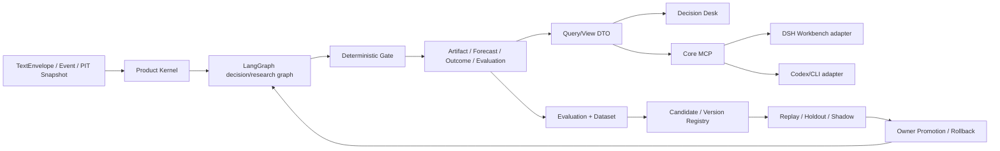
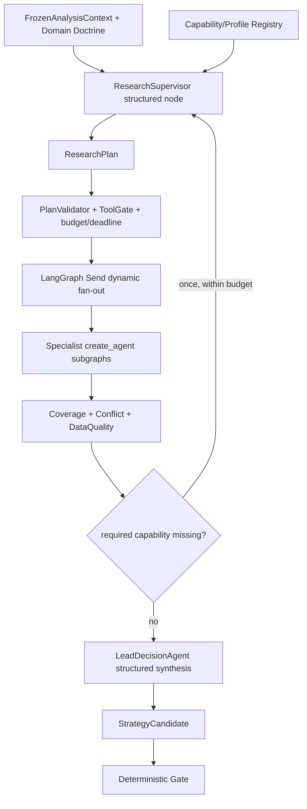

# R2 Decision Workbench 与自主进化 Stage Charter

版本：`STAGE-R2-2026-08-27.v0.3`
状态：`done (offline U2) / observation`（R2-00 至 R2-05 工程退出门已完成；不得扩大范围）
前置：`R0-CORE-COMPLETE`、`R1-REALTIME-EVENT-ENGINE`、`R1-L-SINGLE-OWNER-PILOT-READINESS`
适用范围：Decision Workbench、Core MCP、ResearchMemo、评测数据集、候选 Runtime、replay/holdout/shadow、版本注册、人工 Promotion/Rollback 和个人资产沉淀。

> 本文是 R2 的已接受执行规格。授权范围仅为 R2-00 至 R2-05 和退出门所需实现；不授权自动交易、公共插件市场、多用户、第二领域、远程高可用或任意社区插件接入。

## 0. 产品形态、可用阶段与停止条件

Decision Hub 不是无限追加功能的 Agent 平台。每个阶段都必须有一个可交付的产品形态；阶段退出后先运行、观测和积累证据，不自动开启下一阶段。

| 阶段 | 产品形态 | 可以说“可用”的范围 | 不能据此宣称 |
|---|---|---|---|
| `U0` | R0 本地文本决策核心 | owner 手工提交文本，得到带 PIT、证据、Gate、Forecast 和后续 Evaluation 的决策支持 | 真实来源连续监听、预测准确率或盈利 |
| `U1` | R1/R1-L 单 owner 试运行 | 在 owner 明确通过 Live Pilot Gate、来源/通知授权和本机 readiness 后，进行有限真实运行 | 长期稳定性、自动交易、统计显著超额收益 |
| `U2` | R2 Decision Workbench v1 | 研究、运行、实验、资产、候选比较、人工 Promotion/Rollback 和经过审计的插件桥接形成闭环；这是首个成熟的个人产品形态 | 候选一定优于 baseline，或已经证明可规模化盈利 |
| `U3` | R3 多领域/远程部署扩展 | 只有 R2 运行证据证明有真实需求时，才增加 A 股、美股、PPT 或远程高可用 | 默认需要微服务、公共插件市场或多用户 SaaS |

本 R2 的停止条件是：`R2-00` 至 `R2-05` 退出门全部通过，owner 完成一次明确的 Stage Gate，并把系统转入观察期。观察期内只修复已证实的缺陷、记录 FailurePattern 和评测证据，不以“再加一个插件/页面/领域”为理由自动开启 R3。新范围必须另立 Stage Charter；R2 通过本身不等于预测效果已证明。

### 0.1 R0/R1 兼容性审计结论

2026-08-27 对 R0/R1 代码、契约、迁移、回放和测试做了静态审计：没有发现业务行为冲突，PIT、Gate、账本、Outbox、checkpoint、source state 和 Query/View 仍是唯一事实链。发现一处应在 R2 前收口的依赖方向偏差：`packages/kernel/decision_hub_kernel/application/analyze.py` 直接导入 LangGraph/LangChain 编排类型和 graph factory。它目前不改变测试结果，但会增加未来替换 DSH/Pi/编排器的迁移成本。

该问题不通过局部补丁掩盖，定义为有界的 `R2-00 Kernel/Orchestration Boundary Alignment`，详见 [ADR-0006](../decisions/ADR-0006-kernel-orchestration-boundary-alignment.md)。R2-00 只移动 composition seam、补 Port 和契约测试，不改变 R0/R1 的公开行为，也不新增业务对象。

## 1. 阶段价值假设

R0 已证明文本可以经过 PIT、LangGraph、AgentRuntime、确定性 Gate、Forecast、Outcome 和 Evaluation 形成可回放的决策链；R1/R1-L 已证明来源、调度、通知和单 owner 运行边界可以在不改变这条主链的情况下接入。R2 要验证的不是“再做一个聊天界面”，也不是“让 Agent 自己修改代码”，而是以下产品价值：

> owner 可以在一个可观测的工作台中调查已有运行、补充有证据引用的研究备忘录、比较不同策略/Runtime 的真实表现，并把经过 replay、holdout、shadow 和人工审查的候选版本沉淀为可回滚的个人资产。

R2 的成功必须能回答四个问题：

1. DSH/Codex/Pi 更换时，业务事实、PIT、Gate、Forecast/Outcome 和评测数据是否仍可读取、回放和比较？
2. 一次研究或实验能否追溯到 Snapshot、Run、Step、Call、Evidence、策略/Runtime/Provider 版本和成本，而不是只剩一段聊天记录？
3. 失败样本、owner 反馈和结果是否形成结构化的 Experience、FailurePattern、Dataset 或 Candidate，而不是散落在 Prompt/日志中？
4. 任何候选是否都必须经过代码 Gate 和 owner Promotion，且可以确定性回滚，不会把模型建议直接变成生产策略？

R2 不承诺预测准确率、盈利能力或外部 Provider SLA。那些结论只能由时间切分的前瞻样本和独立 Live Pilot 证据支持。

## 2. 进入条件、目标与非目标

### 2.1 进入条件

- R0、R1 和 R1-L 的离线退出门保持通过；现有业务账本、PIT、Gate、Outbox、checkpoint 和 Query/View 不回退。
- `INDEX.md`、产品架构基线、全局治理规范、本 Charter 和受影响模块 README 已被任务上下文引用。
- owner 接受本 Charter 的范围、边界和阶段门；未确认前只允许文档评审。
- 至少有一组不含敏感生产数据的固定 PIT fixture，能够比较 baseline 与 candidate；真实 DSH/Pi/Provider canary 仍需显式 opt-in。

### 2.2 R2 目标

- 建立 Core-owned、只读优先的 MCP/Workbench 端口：查询 Snapshot、Evidence、Run、Artifact、Forecast、Outcome、Evaluation、Asset 和健康摘要；提交受限 `ResearchMemo`/`Feedback`，不写发布账本。
- 在现有 React Decision Desk 中提供人可读的研究、运行、实验、资产和晋级视图；DSH 作为可选研究入口，消费同一 Query/Command 契约。
- 建立统一的 `Experiment`、`EvaluationDataset`、`CandidateVersion`、`PromotionDecision`、`RollbackDecision` 生命周期，支持 baseline/candidate 的 replay、time-split holdout 和 shadow 对照。
- 建立可观测的候选进化流水线：从失败样本/反馈生成 candidate，保留原始输入和评分证据，候选只能进入实验，不能修改 Gate、权限、账本或 active pointer。
- 让 Pi SDK 作为同一 `AgentRuntime` 契约下的可选候选实现；只有完成契约测试和公平评测后才允许进入 shadow，不能以“集成了 Pi”替代质量证据。
- 让新增能力通过 Domain Pack、SpecialistProfile、RolePlugin、Source/Runtime/Workbench adapter 扩展，避免把 BTC 字段或 DSH session 类型扩散到 Product Kernel。

### 2.3 明确非目标

- 不 clone DSH，不把 DSH 前端、session、插件状态或内部 JSON 作为业务账本。
- 不把 Pi 作为 R2 正式生产 Runtime；不 fork Pi，不强制部署 Node sidecar。
- 不实现自动交易、自动晋级、模型修改 Gate/权限、模型直接写 Artifact/Forecast/Outbox 或扣费。
- 不把“ResearchMemo”当成另一份决策账本；它只能引用既有事实，并以受限命令写入可审计的研究资产。
- 不在 R2 重写 LangChain/LangGraph 的 agent loop、tool loop、checkpoint、retry、timeout、structured output 或 tracing。
- 不引入第二套 DTO、workflow engine、队列、账本、向量数据库或微服务；Redis/Postgres/Temporal/DBOS 只有在运行数据证明单机边界不足时另立 ADR。
- 不在 R2 默认接入实时 ASR、音频捕获、未授权网页抓取、付费新闻源或新的外部交易接口。ASR 仍只通过既有 TranscriptSource boundary 产出文本。
- 不用 LLM Judge 的主观分数取代 Gate、Outcome、Brier、net return、证据覆盖率和前瞻评测。

## 3. 产品边界与职责分配

R2 保持一条正式业务链和多个可替换候选：



| 层/组件 | R2 复用或新增的职责 | 明确不能做什么 |
|---|---|---|
| Product Kernel/Application | 维护 ResearchMemo、Feedback、Experiment、Asset、Version、Promotion 等产品事实；提供公开 Port | 不依赖 DSH、Pi、LangGraph 或某个 Provider；不接受任意 session JSON |
| LangGraph | 复用 `StateGraph`、子图、`Send`、checkpoint、interrupt、RetryPolicy，承载 bounded Supervisor、Specialist 和 evolution graph | 不把 graph state 当业务账本；不拥有最终发布权 |
| LangChain | 复用 `create_agent(response_format=...)`、tool loop、middleware、callbacks 和 provider adapter | 不承载领域事实、Gate、Outcome 或 Promotion |
| ResearchSupervisor | 根据 Domain Doctrine、Capability Registry 和冻结上下文提出结构化 `ResearchPlan`，可有限 replan | 不能安装插件、删除 Pack 必需能力、写账本、改 Gate 或自批权限 |
| Specialist/Profile/RolePlugin | 以 allowlist 工具和输出 schema 完成某项研究；普通能力优先用声明式 `SpecialistProfile`，特殊算法才写代码型 `RolePlugin` | 不能自由创建 Agent、无限调用网络、直接写业务表 |
| Deterministic Gate | 对候选做 PIT、证据、冲突、鲜度、概率、版本和权限检查；唯一决定 publish/degraded/research_only/reject | 不调用 LLM，不接受 Judge 或 DSH 的“最终通过” |
| Core MCP | 以 Pydantic/canonical DTO 暴露 Query 和受限 Command；统一审计、权限、幂等和错误语义 | 不暴露 SQL、checkpoint、raw provider payload 或 secret |
| DSH adapter | 研究工作台、Skill/MCP、人工调查、Memo/Feedback 提交和 View 渲染 | 不调度正式实时链、不写 Ledger、不改 active pointer |
| Pi adapter | 同一 `AgentRuntime` 的可选 replay/shadow 候选，记录 runtime/version/usage/trace | 不进入正式 active path，不拥有 Core 端口或发布权 |
| Decision Desk | 通过 Query API 展示运行、证据、实验、资产和晋级；提供受控命令入口 | 不直查 SQL、LangGraph state、DSH session 或原始 JSON |
| Evaluation/Evolution | 保存不可变数据集、失败样本、评分、候选、实验、Promotion/Rollback 证据 | 不在线修改生产策略，不把未评估候选标为 active |

### 3.1 Agentic 还是 Workflow

R2 不是把所有角色硬编码成一条固定链，也不是把所有控制权交给一个无边界 Supervisor。固定的是产品生命周期和安全边界；动态的是每次研究需要哪些能力、依赖和深度：



`ResearchSupervisor` 最多按 Pack policy replan 一轮；`counter_thesis` 和 `data_quality` 等高影响能力由 Pack 以 required subset 强制覆盖，Supervisor 不能删除。LangGraph 负责调度、取消、checkpoint 和有限重试；业务层只实现计划校验、权限裁剪、Coverage、Conflict 和 Gate。

### 3.2 一个功能调用多个插件时的实际边界

“交易员角色调用 ASR、金融分析、网络检索，再由领导者调度”在架构上可以成立，但调用关系必须经过公开 Port，而不是插件互相硬引用：

```text
DSH/Codex/Decision Desk command
  -> Core use case / AgentRequest
  -> Supervisor 读取 Capability Registry
  -> Source/ASR adapter（只产出 TextEnvelope，R2 不实现音频）
  -> Evidence/Search adapter（只读、带 authority/PIT/鲜度）
  -> Finance SpecialistProfile / RolePlugin
  -> Counter/Data-quality reviewer
  -> Lead candidate
  -> Deterministic Gate
  -> Artifact/Forecast 或 ResearchMemo
```

插件是可调用能力，不只是界面按钮；但每个插件必须有 manifest、输入/输出 schema、权限 allowlist、deadline/retry/cost policy、版本和 contract tests。插件不得直接调用另一个插件的私有代码、SQL 或 DSH session。Supervisor 通过 capability ID 和公开 ToolPort 组合它们，Core 负责最终审计和状态。

## 4. R2 公开契约基线（已锁定并完成 codegen）

本节是 owner 已接受的契约基线，已落入 `contracts/schemas/workbench_assets.schema.yaml` 与 `run_inspector.schema.yaml`，由 codegen 生成 Python/TypeScript/Zod 镜像，并通过 `0011`-`0015` 迁移持久化。后续字段变化必须先更新 canonical YAML、必要时补 ADR，再重新生成镜像。

### 4.1 ResearchMemo

用途：保存 DSH/Codex/人工研究对既有 Snapshot/Run 的补充解释、反证、证据缺口或后续问题。它是可审计研究资产，不是发布 Artifact 的替代品。

必备语义：

| 字段组 | 约束 |
|---|---|
| identity | `memo_id`、`schema_version`、`domain_pack_ref`、`created_at`、`created_by` |
| provenance | `source_adapter_ref`、可选 `run_id`/`snapshot_id`、输入内容 hash、runtime/model/version（若由 Agent 生成） |
| content | 结构化 `claims[]`、`evidence_refs[]`、`counterpoints[]`、`uncertainties[]`、`follow_up_questions[]`；禁止只有一段不可解析 Markdown |
| lifecycle | `draft -> submitted -> reviewed -> accepted/rejected/superseded`；状态变更有 owner/时间/理由 |
| safety | 不能写 `artifact_id`、`forecast_id`、`active_pointer`；如需进入正式决策，必须作为新 Evidence revision/Run 输入并重新过 Gate |

### 4.2 Experiment / EvaluationDataset

`Experiment` 是不可变 manifest，至少引用：`experiment_id`、dataset manifest/hash、PIT/cutoff 规则、baseline ref、candidate refs、strategy/runtime/provider/model/schema 版本、预算、执行时间、随机性策略和结果摘要。原始运行证据先保存再评分，后续评分不能覆盖原始结果。

`EvaluationDataset` 必须区分 `replay`、`holdout`、`shadow` 和 `live_observation`，记录时间范围、事件覆盖、label/outcome 规则、泄漏审计、fixture hash、授权级别和可见性。holdout 不能被 candidate 训练、Prompt 生成或人工调参读取。

### 4.3 Candidate / Version / Promotion / Rollback

| 对象 | 语义 | 代码权限 |
|---|---|---|
| `CandidateVersion` | Prompt/Doctrine/Profile/Strategy/Runtime adapter/provider policy 的内容 hash、父版本、变更原因、生成来源和状态 | Agent/Evolution 只能创建 `candidate` |
| `ExperimentResult` | candidate 与 baseline 的分片指标、失败样本、成本、时延、证据覆盖、Gate 结果和置信区间 | 只读评分结果，不能改原始运行 |
| `PromotionDecision` | owner、理由、评测 refs、适用 Pack、目标 pointer、有效时间和回滚点 | 只能由受控 owner command 写入；不能由 Agent/DSH 自动提交 |
| `RollbackDecision` | 从 active 退回哪个已验证版本、触发原因、影响范围、审计时间 | 代码 CAS/权限检查后原子执行 |
| `ActivePointer` | 某个 Pack/strategy/runtime/policy 的当前正式组合；带 generation 和 CAS | 不允许直接由模型或前端改写 |

上述对象之间的关系必须能在没有 DSH/Pi session 的情况下重放。`active pointer` 变更不得覆盖历史版本；回滚是新审计事件，不是删除记录。

## 5. R2 工作包和任务卡

R2 是一个大阶段，先由 owner 通过本 Charter，再按依赖顺序逐卡实现。每张卡遵守 SDD -> ADR（需要时）-> BDD -> TDD Red/Green/Refactor -> 集成/回放 -> 文档同步 -> 独立 commit。

| Task ID | 目标与实现边界 | 依赖 | 主要证据 |
|---|---|---|---|
| `R2-00` | 对齐 Kernel/Orchestration 依赖方向：增加最小 workflow executor Port，把 LangGraph graph/checkpoint/config 组装移出 Kernel application；保持 R0/R1 行为不变 | 本 Charter owner gate；ADR-0006 | import boundary、LangGraph contract、PIT/Gate/账本/recovery 回归 |
| `R2-01` | 锁定并生成 ResearchMemo、Feedback、Asset、Experiment、Dataset、Candidate、Promotion/Rollback 的 canonical contract；实现 Core MCP read-only Query 与受限 Memo/Feedback command；不接 DSH 生产调度 | R2-00、R0/R1 contracts | contract/codegen、权限/幂等、DSH 未启动仍可用、无 ledger 越权 |
| `R2-02` | 扩展统一 Run/Lineage/Version Query View 和 Decision Desk：研究备忘录、证据血缘、运行阶段、实验对比、候选差异和资产目录；raw JSON 仅 debug 受控查看 | R2-01、现有 Query/View | API/前端 BDD、Zod、无横向溢出、无 SQL/Graph state 直读 |
| `R2-03` | Evaluation Dataset/manifest、失败样本、owner Feedback、FailurePattern/Experience 索引和实验登记；保存 raw artifact 后再评分 | R2-01 | PIT 泄漏拒绝、时间切分、失败可检索、评分不可覆盖原始证据 |
| `R2-04` | LangGraph evolution graph、bounded Supervisor/动态 Send、Pi `AgentRuntime` candidate adapter（如启用）、baseline/candidate replay、holdout、shadow；不改变正式 active pointer | R2-01、R2-03 | runtime contract suite、fair compare、failure taxonomy、checkpoint/recovery、成本/时延 |
| `R2-05` | Version Registry、PromotionGate、owner approval command、CAS active pointer、Rollback 和 Evolution 前端对比 | R2-03、R2-04 | 未授权不能晋级、非劣/安全门、原子回滚、审计完整、通知不重复 |

R2-01 是唯一允许新增 canonical contract 的入口；R2-02/03/04/05 不得各自发明同名 DTO、版本表或状态机。R2-00 不新增业务契约，只新增最小编排 Port。若实现证明某对象不需要独立持久化，应删掉提案并记录理由，不保留空表。

## 6. 框架复用与自研边界

| 能力 | 直接复用 | Decision Hub 只补的产品逻辑 |
|---|---|---|
| Agent/tool loop | LangChain `create_agent(response_format=...)`、middleware、callbacks | Profile/RolePlugin manifest、权限和领域输出 schema |
| Graph orchestration | LangGraph `StateGraph`、子图、`Send`、checkpoint、interrupt、RetryPolicy | Supervisor plan schema、PlanValidator、Coverage/Conflict routing |
| Provider | 既有 `langchain-openai`/OpenAI-compatible adapter 和 ProviderConfig | capability manifest、错误映射、版本/cost projection |
| Runtime replacement | 既有 `AgentRuntime` port；Pi 只实现同一 port | contract suite、fair replay/holdout/shadow、active pointer policy |
| Runtime schema | Pydantic v2；前端 Zod；跨语言 `contracts/` codegen | 领域资产、ResearchMemo、Experiment 和 Promotion schema |
| Persistence | SQLAlchemy/Alembic、现有 SQLite WAL 和 repository | 新增对象的最小业务表/查询投影；不复制账本或 checkpoint |
| Observability | LangChain callbacks/metadata、OpenTelemetry、`structlog` | Run/Step/Attempt/Call/Lineage/Asset 的归一化 Query/View |
| Evaluation | pytest、现有 Evaluation service、固定 replay | 数据集 manifest、领域标签、FailurePattern、PromotionGate |
| UI | React/TypeScript/Vite、TanStack Query、Zod、ECharts、Lucide | 人可读的研究/比较/资产视图和受控命令 |

禁止在任何 R2 task 中以“方便”为理由写自研 HTTP client、ReAct loop、retry framework、trace SDK、JSON repair parser、第二个队列或通用 `utils/`。

## 7. 个人资产沉淀规则

R2 的核心产品结果是可迁移资产，而不是某个 Harness 的会话历史。每次研究/运行按以下链路沉淀：

```text
Source/Observation + provenance
  -> immutable PIT Snapshot
  -> Run/Step/Attempt/Call/Lineage + versions
  -> Artifact/Forecast/ResearchMemo/Feedback
  -> Outcome/Evaluation + failure labels
  -> Experience/FailurePattern/Dataset
  -> CandidateVersion
  -> replay -> holdout -> shadow -> owner Promotion/Rollback
```

权威资产与展示方式：

| 资产 | 权威记录 | 价值 | 默认前端视图 |
|---|---|---|---|
| Doctrine/Profile/Strategy | Pack manifest、content hash、版本 registry、评测 refs | 可替换的判断原则和研究方法 | Assets：适用事件、工具权限、质量/成本切片 |
| ResearchMemo/Feedback | Core-owned 表/DTO，引用 Snapshot/Run/Evidence | 让人工判断可检索、可复盘、可进入下一次研究 | Research：证据、反方、未决问题、审阅状态 |
| Experience | 结构化事件/结果/适用条件/失效时间和 refs | 经结果验证的成功/失败模式 | Assets/Evolution：成功、失败、no-trade、失效 |
| FailurePattern | 统一 failure code、影响、根因假设、修复 ADR/commit、回归状态 | 防止同类错误靠局部补丁重复出现 | Health/Evolution：频次、影响、回归 |
| EvaluationDataset | 不可变 manifest、PIT fixture、标签、泄漏审计 | 自己可复用的能力基准 | Evaluations：覆盖、时间切分、授权和 hash |
| Promotion/Rollback | 不可变决定、评测 refs、审批人、前后 pointer | 可审计、可回退的生产经验 | Evolution：候选 -> 证据 -> 决定 -> 回滚点 |

首版不把所有模型输出向量化后塞进向量库。先结构化过滤 `domain/event_type/regime/available_at/quality_status`，再按需做语义召回；任何召回结果仍须通过 PIT、Evidence 和权限 Gate。未经过 Outcome/Evaluation 或 owner review 的内容只能标记 `candidate`，不能自动变成 Skill/Doctrine。

## 8. 可观测性和前端展示原则

R2 的可观测性目标是让 owner 快速回答“发生了什么、凭什么、哪一步失败、哪个版本更好”，不是把所有内部 JSON 搬到页面：

- `Run Inspector`：状态、阶段时间线、Supervisor plan、专家覆盖、Provider/Runtime、attempt、latency、cost、failure code 和 Gate 结论。
- `Evidence Lineage`：每个 claim 到 Evidence span、source authority、三时间戳、Snapshot cutoff 和冲突/过期标记。
- `Experiment Compare`：baseline/candidate 按数据集和切片比较结构化有效率、证据覆盖、反方覆盖、Gate 状态、Brier、net return、延迟、成本和失败率。
- `Asset Catalog`：Doctrine/Profile/Strategy/Experience/Dataset/FailurePattern 的版本、适用条件、来源、评测和回滚关系。
- `Promotion Desk`：候选状态、硬门结果、owner decision、active pointer 和 rollback；没有明确确认按钮不改变生产状态。
- `Health`：Provider/source/worker/evaluation/evolution 的摘要和最近失败；不显示 secret、完整 prompt 或原始 provider response。

原始 JSON 只作为受权限控制的 debug reference/hash 或脱敏折叠内容存在；默认页面使用 Query/View DTO、状态标签、时间线、对比图和证据链接。Decision Desk 继续位于 `apps/decision-desk`，不 clone DSH 前端；DSH 只通过 Core MCP/Query API 复用这些事实。

## 9. BDD 验收场景

```text
Feature: Research Workbench 不越权
Scenario: DSH 提交研究备忘录
Given 一个已冻结的 Snapshot、已有 Run 和有效 Evidence 引用
When DSH 通过 Core MCP 提交 ResearchMemo
Then 系统校验 schema、PIT、引用和幂等键并保存 memo
And 不创建 Artifact/Forecast，不修改 Gate、active pointer 或交易权限
```

```text
Feature: 统一运行事实
Scenario: DSH 未启动时仍能查询运行
Given 一个已完成或失败的 R0/R1 Run
When owner 通过 Decision Desk 或 Core Query API 查询
Then 返回同一 Query/View DTO、版本、证据血缘和 Gate 摘要
And 查询不依赖 DSH session、LangGraph checkpoint 或原始 JSON
```

```text
Feature: 候选公平比较
Scenario: baseline 与 candidate 使用同一 PIT holdout
Given 同一数据集 manifest、cutoff 规则、输出 schema 和评测 policy
When EvaluationRunner 分别执行 baseline 与 candidate
Then 两者都经过同一 Gate/Outcome/Evaluation 规则并保存独立结果
And candidate 不能读取 holdout 标签或覆盖 baseline 证据
```

```text
Feature: 进化安全
Scenario: candidate 不能自动晋级
Given Evolution graph 生成一个通过 replay 但尚未 holdout/shadow 的 CandidateVersion
When candidate 运行结束
Then 状态仍为 candidate/experimental，记录评测和失败样本
And active pointer、Gate policy、权限和正式通知不改变
```

```text
Feature: 人工 Promotion 与回滚
Scenario: owner 晋级后可以原子回滚
Given candidate 已通过硬门、holdout、shadow 和非劣比较
When owner 提交有效 PromotionDecision，随后执行 RollbackDecision
Then active pointer 按 generation/CAS 原子切换并留下两条不可变审计记录
And 新旧版本都能按原 Snapshot 重放，已有业务事实不被覆盖
```

```text
Feature: Pi/DSH 可替换
Scenario: 候选 Runtime 失败不污染正式链
Given Pi adapter 或 DSH ResearchMemo adapter 返回 timeout、schema invalid 或 tool denied
When replay/shadow 执行
Then 失败映射到统一 RunFailure/ExperimentResult 并记录成本未知或实际值
And 正式 LangGraph active pointer、Artifact、Forecast、Outbox 和 Gate 不改变
```

```text
Feature: 评测防泄漏
Scenario: holdout 输入含未来信息
Given candidate 试图读取 cutoff_at 之后的 Evidence 或 Outcome label
When EvaluationRunner 执行
Then dataset/policy 校验失败并标记 evaluation_leakage
And 该实验不能产生 Promotion eligible 结果
```

## 10. TDD 与故障矩阵

### 10.1 契约与权限

- ResearchMemo/Feedback/Asset/Experiment/Candidate/Promotion/Rollback：必填字段、版本、extra-forbid、状态转换、幂等和引用存在性。
- Core MCP：未授权 command、过期 Snapshot、跨 domain 引用、重复 request、secret/raw JSON 注入必须拒绝。
- Agent/Plugin：tool ID、参数 schema、数据 class、deadline、budget、权限和审计字段必须经过 `ToolGate`。

### 10.2 Supervisor、Specialist 和 Graph

- required capability 缺失、重复 task、循环依赖、超任务数/并发/预算、replan 超过一次。
- specialist timeout/429/5xx/structured output invalid/tool denied/internal error 的统一错误码、有限重试和降级。
- checkpoint 中断/恢复、重复 Send、部分结果汇合、Lead 无权绕过 Coverage/Gate。

### 10.3 Evaluation、Evolution 和 Promotion

- replay/holdout/shadow 数据集不可变、时间切分、PIT leakage、label 访问和随机性固定。
- baseline/candidate 结果独立保存，raw artifact 先落盘，评分失败不丢原始证据。
- candidate 不得修改生产配置；Promotion 缺 owner、硬门、评测 ref、CAS 或回滚点时 fail-closed。
- Promotion/rollback 并发、重复 command、旧 generation、进程中断和恢复均保持原子/幂等。

### 10.4 前端和观测

- Query/View DTO 缺字段、状态 unknown、分页/排序和权限过滤。
- Run timeline、lineage、compare、assets、promotion 和 health 的 loading/empty/error/degraded 状态。
- 375/768/1024/1440 视口无横向溢出；不渲染 secret、完整 prompt、原始响应或任意 HTML。

普通 CI 只用 Fake/Replay、临时 SQLite、固定 fixture 和 mock transport：

```bash
./.venv/bin/pytest -m "not live" -q
./.venv/bin/python -m tools.contract_codegen check
./.venv/bin/python tools/docs/check_module_docs.py
pnpm --dir apps/decision-desk test
pnpm --dir apps/decision-desk build
```

真实 DSH/Pi/Provider/通知 canary 必须显式 opt-in，结果只记录兼容性和运行指标，不写成业务准确率或盈利证明。

## 11. 阶段退出门与证据（离线 U2 已通过）

| # | 退出条件 | 离线证据 | 结论边界 |
|---|---|---|---|
| 1 | R2-00 至 R2-05 可追溯 | 独立阶段提交、模块 README、`CHANGELOG.md` 与本表 | 提交完成后以 Git 历史为准 |
| 2 | Core MCP/Workbench 安全可用 | `tests/workbench`；官方 MCP stdio 与 streamable HTTP client 均完成握手、发现和结构化查询 | 未安装或启动 DSH 时 Core 仍可用；未接任意社区插件 |
| 3 | 人可读 Decision Desk | `App.test.tsx`、Vitest/Vite build；浏览器验证 375/768/1024/1440 均无横向溢出 | 默认不展示 raw provider/graph JSON |
| 4 | 公平 replay/holdout/shadow | `tests/evals`、固定 PIT fixture、`EvaluationRunner` 的独立数据库/raw artifact/manifest hash | shadow 为离线 prospective fixture，不代表真实市场运行 |
| 5 | 候选 Runtime 同契约、失败隔离 | `tests/runtime/test_candidate_runtime_contract.py` 覆盖 Pi/DSH candidate、timeout/429/5xx/tool denied/非 JSON | 未证明优势，正式 LangGraph active pointer 不因 adapter 存在而改变 |
| 6 | 有序晋级与原子回滚 | `tests/evolution` 覆盖三阶段 readiness、owner-only、CAS 并发单赢家、事务故障回滚和审计 | 只完成离线人工晋级闭环，生产晋级仍受第 13 节样本门限制 |
| 7 | 个人资产可查询与追溯 | `/v1/workbench/assets`、`/v1/evolution/*`、Run Inspector 和对应 `tests/workbench`/`tests/evolution` | 资产归 Core，不依赖 DSH/Pi session |
| 8 | PIT、Gate、权限和边界 fail-closed | `tests/evals` leakage reject、MCP owner/schema/permission、Promotion challenger 归属、架构边界和 secret scan | 不授权自动交易、Agent 写账本或前端直读内部状态 |
| 9 | 全量工程门 | 128 Python tests、Ruff、Pyright、contract/module docs、Core/Pilot acceptance、5 个前端测试、Vite build、fresh `0015` migration | 全部是离线工程证据；真实 canary、准确率和盈利另行验证 |

退出门不要求“模型一定盈利”或“每个候选都优于 baseline”。若候选没有统计/业务优势，正确结果是保留 candidate、记录 FailurePattern 或回滚，而不是放宽 Gate。

## 12. 允许与禁止修改路径

### 12.1 owner 通过后允许的首批路径

- `contracts/` 及其 codegen 产物：仅由 R2-01 按批准的 schema 修改。
- `packages/kernel/decision_hub_kernel/application/`：ResearchMemo、Feedback、Experiment、Asset、Promotion 用例和 Port 的最小薄层。
- `packages/kernel/decision_hub_kernel/ports/`：MCP、Workbench、Evaluation、Version Registry 的公开 Protocol。
- `packages/orchestration/langgraph/`：R2 research/evolution graph、typed routing、dynamic Send；不改 R0 Gate 语义。
- `packages/runtime_adapters/`：Pi/候选 Runtime 和 Specialist factory；不把 Pi 类型泄漏进 Core。
- `packages/query_views/`、`apps/hub_api/`：Query/View 和受限 command API。
- `apps/decision-desk/src/features/`：research、experiments、assets、evolution、health 页面；继续只消费 DTO。
- `packages/evals/`、`packages/packs/`（若批准创建）：dataset、grader、compare、promotion policy。
- `tests/`、`tools/`、受影响模块 README、`docs/IMPLEMENTATION_STATUS.md`、`docs/ROADMAP.md`、`CHANGELOG.md` 和必要的 `docs/decisions/ADR-*.md`。

### 12.2 禁止路径/行为

- 直接修改 R0/R1 历史账本、PIT、Gate、Outbox、迁移快照来“适配” R2。
- 在 DSH/Pi/前端/Graph node 中写第二份业务状态、DTO、权限、重试、trace 或 Promotion 规则。
- 让 MCP/DSH command 接受任意 SQL、Shell、URL、Prompt 注入或未声明的数据类。
- 为了“展示完整”把全部 LangGraph state、provider response、secret 或 prompt 原文返回给前端。
- 在没有失败测试、契约、ADR 和 owner gate 时新增基础设施或修改 active pointer。

## 13. Owner Stage Gate 与已锁定默认

2026-08-27 owner 明确要求先固化最终文档，再完成核心产品并完整自测。Stage Gate 按以下默认锁定；后续实现不得自行改变：

1. R2 的完成标准是 Research/Experiment/Asset/Promotion 的 U2 产品闭环，不是“已经装上 DSH/Pi”。
2. DSH 定位为 Core MCP/Workbench/Capability bridge；不 clone、不写业务账本。ADR-0005 接受。
3. Pi/DSH candidate runtime 在 R2 只保证统一契约和准入路径；没有真实候选或优势证据时不创建空 sidecar、不启用 active runtime。
4. 现有独立 Decision Desk 是正式产品 UI；DSH 是可选研究入口。
5. ResearchMemo 不直接产生 Artifact/Forecast；进入正式决策必须形成新 Evidence revision/Snapshot/Run。
6. 固定执行 R2-00 至 R2-05；R2-00 不新增业务对象，R2-01 是新增 R2 canonical contract 的唯一入口。ADR-0006 接受。
7. 离线工程门允许使用固定 fixture；生产 Promotion 至少需要 100 个前瞻 Forecast、30 个自然日、每个被晋级事件族至少 30 个样本。安全/Gate 越权必须为 0；Brier 非劣界限为 baseline `+0.02`；p95 延迟不得超过 Pack deadline；已知成本时不得高于 baseline 25%。不足时只能是 `experimental`，不能进入 production active pointer。
8. Promotion 始终要求 owner 明确确认；active pointer 使用 generation/CAS，历史不可覆盖，Rollback 产生新审计事件。
9. 允许先完成离线 U2 工程闭环；真实 DSH/Pi/Provider canary 和 Live Pilot 仍需显式授权，离线结果不表述为实际收益。
10. R2 默认继续使用单机 SQLite + 同源 API；出现可量化的并发/高可用瓶颈前不引入 Postgres、Redis、队列、Temporal 或 DBOS。

Stage Gate 只授权本文范围。R2-00 至 R2-05 已完成离线 U2 工程退出门；当前进入观察期。任何 R3、真实插件、Live Pilot 或生产 Promotion 都必须另行授权。

## 14. 文档同步清单

owner 确认本 Charter 后，实施每张任务卡必须同步：

- `INDEX.md`：把本 Charter、当前 R2 task 和事实源入口列入短上下文地图。
- `docs/ROADMAP.md`：R2 实施时标记 `accepted / in_progress`，退出门通过后改为 `done (offline U2) / observation`；每个 Task ID 只在对应证据完成后标记 `done`。
- `docs/EXECUTION_PLAN.md`：链接本 Charter，删除重复或冲突的 R2 任务描述；本 Charter 是 R2 的详细边界。
- `docs/IMPLEMENTATION_STATUS.md`：记录已验证、partial、blocked、live canary 和未声称完成的能力。
- 受影响模块 README：职责、公开入口、依赖方向、禁止事项、验证命令和最近验证提交。
- `CHANGELOG.md`：用户可见行为和阶段里程碑；失败实验写入 Known limitations/Next，不伪装为 Delivered。
- `docs/decisions/`：不可逆或跨模块决定先 `proposed`，owner 接受后再改为 `accepted`。
- `tmp/`：Task Context Manifest、临时 fixture 生成物和探索脚本；提炼到事实源后不得让临时文件成为长期契约。

## 15. DSH 生态核对与最终架构建议（提案）

### 15.1 公开资料核对（2026-08-27）

本节记录的是公开仓库的事实快照，不把第三方页面的宣传语当成产品契约：

- [DeepSeek Harness 官方仓库](https://github.com/deepseek-ai/deepseek-harness) 的 README 将 DSH 定义为 DeepSeek AI 开源的 Agent Harness，明确采用 “everything is a plugin”，由 Cordis 提供插件树和可逆注册；同时标注为 `developer preview`，存在兼容性破坏变更。官方 README 还提供 `web` 和 `headless` 入口。
- 官方架构文档列出的可插拔服务包括模型 `ctx.llm`、工具 `ctx.tools`、Session 持久化、Agent/Agent Loop、Subagent、Jobs、Web、Sandbox、Approval、Telemetry、Workflow、UI/Client Modules 等；插件可以通过 typed service、事件和 capability seam 组合或替换这些能力。
- [awesome-dsh-plugin](https://github.com/awesome-dsh-plugin/awesome-dsh-plugin) 的 README 说明社区插件通过 `dsh.bundle` manifest 分发，并可使用 `dsh plugin add` 安装；其公开 count endpoint 在本次核对时返回 `2322`。GitHub 仓库页面快照约为 `13120` stars、`2184` forks，数据会随时间变化，不能作为质量或稳定性证明。
- [dsh-market](https://github.com/dsh-market/dsh-market) 将自己定位为 DSH 内置的可视化插件市场，支持浏览、搜索、一键安装和更新；公开仓库在本次核对时约为 `2578` stars，更新时间为 2026-08-27。市场存在不等于插件已通过安全、授权、维护和业务效果审计。

因此，“未来会有 DSH 插件生态”是合理判断，但“任意 DSH 插件都能直接成为 Decision Hub 产品模块”是不成立的。DSH 版本、插件质量、许可证、网络权限、持久化方式和输出契约仍需逐个验证。

### 15.2 最终推荐：DSH Plugin Bridge，而不是 DSH Core

Decision Hub 采用三种接入级别：

| 级别 | 适用对象 | 接入方式 | 能否进入正式决策链 |
|---|---|---|---|
| L0 外部 Workbench | DSH UI、Skill、交互式调查、纯展示插件 | DSH 通过 Core MCP 查询和提交 ResearchMemo/Feedback | 只能提交研究资产，不能直接发布 |
| L1 可验证 Capability | 搜索、日历、行情、文档、ASR、分析工具等有明确输入输出的插件 | `DshCapabilityAdapter` 转换为 Core Tool/Source/Provider Port；manifest、权限、schema、PIT、timeout、cost 和 contract suite 必须齐全 | 可以作为正式 Graph 的受限工具，结果仍需 Coverage/Gate |
| L2 候选 Harness/Runtime | DSH Agent Loop、Subagent 或完整 Harness 运行时 | `DshAgentRuntime` 实现统一 `AgentRuntime`，仅进入 replay/holdout/shadow | 未经 Promotion 不能替换 LangGraph active pointer |

插件必须先经过 `discover -> license/security review -> capability mapping -> contract test -> replay -> owner enable`，不能把 `dsh.bundle` 文件直接当成 Core 的 canonical manifest。Decision Hub 需要自己的 `CapabilityManifest`，至少记录来源、版本、许可证、运行环境、数据类别、网络范围、输入/输出 schema、权限、预算、超时、可观测字段、健康状态和回滚方式。

### 15.3 为什么不直接把 DSH 当产品底座

这不是否定 DSH，而是根据当前公开事实做边界判断：

1. DSH 仍处于 developer preview，官方明确提示兼容性破坏；将业务账本、PIT、Gate 或资产版本绑定到其内部 schema，会把产品升级风险转化为数据迁移风险。
2. DSH 的 Session log、Agent event、Tool pipeline 和 Cordis Context 是 Harness 事实；Decision Hub 的 Event、Evidence、Snapshot、Run、Artifact、Forecast、Outcome 和 Evaluation 是产品事实。两者用途不同，不能互相替代。
3. DSH 插件生态规模大但质量和权限异质；任意安装会引入许可证、供应链、网络、密钥、数据泄漏和版本漂移风险，不符合产品级可审计边界。
4. 正式事件链需要确定性的 PIT、Gate、Outcome、幂等和恢复语义；这些不能由某个 DSH 插件的 UI、Session 或模型提示隐式保证。

因此，当前的产品投资重点应是“拥有自己的契约和资产，并能安全吸收外部插件”，而不是维护 DSH fork 或复制 DSH 全部核心。

### 15.4 插件如何成为未来产品平台能力

R2 只建立桥接能力和精选插件目录，不承诺立即建设公共插件市场：

```text
DSH plugin / MCP server / standalone tool
  -> Plugin intake manifest
  -> license + security + capability audit
  -> DshCapabilityAdapter / SourceAdapter / RuntimeAdapter
  -> canonical schema + ToolGate + PIT + telemetry
  -> contract tests + replay/holdout
  -> owner enable / optional shadow
  -> Core MCP / LangGraph / Decision Desk
```

一个插件进入产品前必须回答：

- 它属于 Source、Tool、Provider、Runtime、Strategy 还是 UI？
- 是否能在没有 DSH Session 的情况下以公开 schema 重放？
- 读取和写入哪些数据类别，是否需要网络、文件、Shell 或凭据？
- timeout、retry、cost、failure code、版本和健康状态如何投影到 Run/Call？
- 输出是否带 Evidence、时间戳和来源，是否可能污染 PIT？
- 失败或卸载后，是否能回滚且不影响业务账本？
- 许可证、维护者、依赖和升级来源是否可审计？

不能回答这些问题的插件可以继续作为 DSH 个人工具使用，但不进入 Decision Hub 正式链。插件的 UI 展示也不能替代产品 Query/View；前端只消费经过归一化的结果。

### 15.5 对 R2 任务顺序的调整建议

原有 `R2-01` 至 `R2-05` 保留，但 `R2-01` 的明确产物应增加：

- `ResearchWorkbenchPort`：DSH/Codex/未来 Web Workbench 的查询、Memo 和 Feedback 边界。
- `AgentRuntime` contract suite：LangGraph、Replay、Fake，以及可选 DSH/Pi candidate 的统一测试。
- `CapabilityManifest` 和插件准入状态：`discovered -> audited -> enabled -> shadow -> rejected/retired`。
- `DshCapabilityAdapter` 的最小接口和安全 deny-by-default 规则；R2-01 只锁契约，不接入任意社区插件。

`R2-04` 再根据通过审计的具体插件决定是否实现 DSH/Pi candidate runtime；没有真实候选和评测数据时，只保留 adapter seam，不创建空的插件市场或 Node sidecar。

### 15.6 最终架构决策（已接受）

已接受 [ADR-0005 DSH Harness 与插件生态桥接边界](../decisions/ADR-0005-dsh-harness-plugin-bridge.md)：

> DSH 是可替换的 Workbench/Harness 生态，不是 Decision Hub 的业务核心。Decision Hub 通过 Core MCP、`ResearchWorkbenchPort`、`CapabilityManifest`、`DshCapabilityAdapter` 和可选 `DshAgentRuntime` 复用 DSH 插件与 Harness 能力；所有业务事实、PIT、Gate、Outcome、Evaluation、资产版本和 Promotion/Rollback 仍由 Product Kernel 所有。插件只有在许可证/安全/契约/回放审计通过后才能被 owner 启用，候选 Runtime 必须经过 replay/holdout/shadow，不能自动替换正式链。

这个决策保留了 DSH 生态的长期价值，也确保将来换成 Pi、Codex、自建 Web Workbench 或另一套 Harness 时，不需要迁移核心账本和个人资产。

## 16. 当前结论

R2 的建立方式不是直接创建一堆“DSH 插件目录”或从 Python 重新写一个 Agent 平台，而是先把 Core-owned 契约、资产生命周期、Supervisor/Plugin 权限边界和评测/Promotion 门锁定，再用 LangGraph/LangChain/DSH/Pi 各自擅长的 adapter 接入。这样后续替换 DSH、Pi、模型、前端或新增 A 股/PPT Pack 时，保留的是 Event/Evidence/Snapshot/Run/Asset/Evaluation/Version 等个人产品资产，而不是某个 Harness 的内部状态。

当前状态是 `done (offline U2) / observation`：R2-00 至 R2-05 已形成研究、观测、评测、候选和人工 Promotion/Rollback 的离线工程闭环。任何超出本文的范围必须停止并另立 Stage Charter；真实网络稳定性、预测准确率和盈利能力仍未由本阶段证明。
