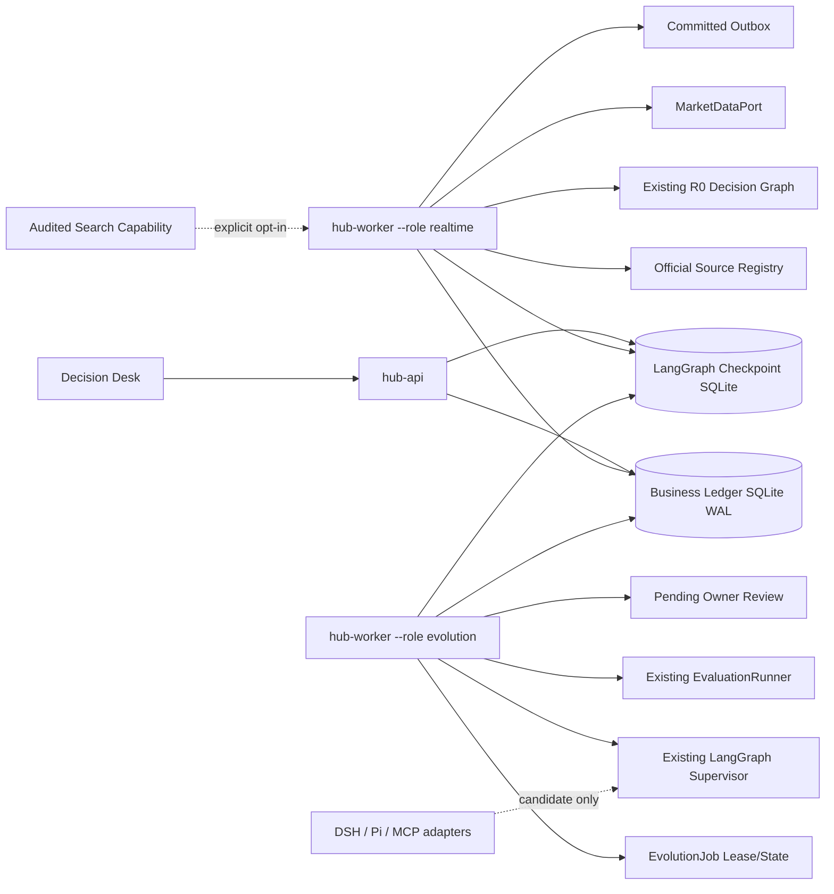
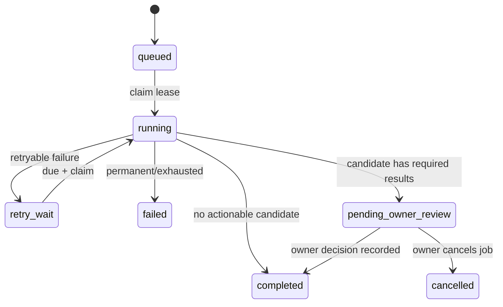

# R2-L Live Observation Pilot Stage Charter

版本：`STAGE-R2-L-2026-08-29.v2`
状态：`done (offline + local process acceptance) / observation`
前置：R0 Core、R1 Realtime Event Engine、R1-L Pilot Readiness、R2 Workbench/Evolution 离线 U2 均已完成
产品形态：单 owner、本机优先、持续进程与来源轮询骨架、可恢复、可观察、只产生演进候选且人工晋级的 Decision Hub

> 本阶段解决“组件都写了，但 Web、实时 worker 和演进引擎没有组成一个持续运行产品”的问题。阶段完成不自动开启 R3，不承诺盈利，也不允许自动交易或自动 Promotion。

> 2026-08-29 事后验收说明：R2-L 完成的是三逻辑进程、Evolution Job、Search 权限 seam 和 Operations 骨架。Search 默认关闭且未接入正式 decision graph，Evolution Supervisor 也不是实时研究 Supervisor；因此本阶段不能作为 Agentic Research 已完成的证据。纠偏方案见 proposed [R2-R](R2_R_AGENTIC_RESEARCH_RUNTIME.md)。

## 0. 最终结果和停止条件

R2-L 完成后，owner 在同一个 Decision Desk 中必须能够确认以下事实：

1. API、实时 worker、演进 worker 是三个独立健康单元，掉线、重启、最近心跳和当前模式清晰可见。
2. 已授权来源按 durable cursor/`next_poll_at` 持续轮询，产生的文本仍走唯一的 R0 主链。
3. 真实 Provider、Fake/Replay、来源和行情状态不会被一个含糊的 `Ready` 混在一起。
4. Forecast 到期后形成 Outcome/Evaluation；失败、owner feedback 和新评测能触发耐久化 Evolution Job。
5. Evolution Job 可以刷新 FailurePattern、生成结构化 Experience/Candidate、运行 replay/holdout/shadow，并形成待 owner 审查项。
6. 进程中断后从业务账本和 job lease 恢复，不重复创建 Candidate、Experiment、Result、Artifact 或通知。
7. Agent、DSH、Pi、MCP 或任意插件只能提出候选；确定性 Gate 和 owner 是唯一发布/晋级裁决者。

本阶段的停止条件是：`R2-L-00` 至 `R2-L-06` 全部通过离线质量门和本机进程 smoke，Decision Desk 能展示真实运行模式与 evolution queue，文档准确区分 live canary 与离线证据。本次离线质量门、本机三进程 acceptance 和前端验证已通过；Compose 镜像构建仍受 Docker Hub/GHCR registry 超时阻塞，未将其误写为代码失败。阶段完成后进入 observation，不自动增加第二领域、ASR、公共插件市场、多用户或远程高可用。

## 1. 价值目标、非目标和成功口径

### 1.1 价值目标

本阶段要把 R0/R1/R2 的工程资产变成一个每天可运行、可复盘、可积累个人资产的产品，而不是增加新的分析角色：

```text
持续来源 -> 决策 -> Forecast -> Outcome/Evaluation
                     |                 |
                     +---- 反馈/失败 ---+
                                      |
                                      v
                         Evolution Job / Candidate
                                      |
                           replay -> holdout -> shadow
                                      |
                              owner review only
```

产品成功口径分为三层，不能混写：

| 层级 | 本阶段可验收 | 不能据此宣称 |
|---|---|---|
| 工程闭环 | 进程持续运行、状态耐久化、重启恢复、任务幂等、UI 可见 | 真实来源/Provider 长期稳定 |
| Live Observation | 显式授权后，真实来源和 Provider canary 产生可追溯样本 | 预测准确或盈利 |
| 业务效果 | 累积足够前瞻样本后比较 Brier、方向、成本、延迟、覆盖率 | 由一次演示或 fixture 得出收益结论 |

### 1.2 明确非目标

- 不让 Agent 在线修改 Python/TypeScript 源码、数据库 schema、Gate 或权限。
- 不自动 Promotion；即使 candidate 全部门槛通过，也只能进入 `pending_owner_review`。
- 不自动交易，不接交易密钥，不增加扣费权限。
- 不把 DSH/Pi/Codex session、LangGraph checkpoint 或日志当作业务账本。
- 不自研 Agent loop、tool loop、checkpoint、Provider SDK、重试框架或 tracing SDK。
- 不为了三个本机进程引入 Redis、Kafka、Celery、Temporal、DBOS、Kubernetes 或微服务仓库。
- 不把 ASR、音频采集、OCR、第二领域和公共插件市场倒灌进来；它们继续使用已有 Port。
- 不默认抓取未授权网页；开放网络检索只能通过审计后的 Capability 和显式配置启用。

## 2. 最终运行拓扑

三个逻辑进程复用同一代码库、canonical contract 和 SQLite WAL：



| 进程 | 唯一职责 | 禁止 |
|---|---|---|
| `hub-api` | REST/Query/View、人工文本、反馈、owner 命令、静态前端 | 无限循环、后台演进、替 worker 执行重任务 |
| realtime worker | source poll、R0 graph、Outcome due、outbox drain、heartbeat | 创建演进候选、Promotion、修改 Gate |
| evolution worker | trigger scan、durable job claim、failure/experience/candidate/eval/review、heartbeat | 发布 Artifact、自动 Promotion、直接写 source cursor |

首版保持一个 `hub-worker` CLI，通过 `--role realtime|evolution` 选择 composition root；共享基础初始化，但两个 role 不互相调用私有函数。生产/本机守护使用 Docker Compose 或系统进程管理器负责 `restart: unless-stopped`，应用不自写守护线程。

## 3. 唯一正式数据流

### 3.1 实时决策链（复用，不重写）

```text
SourceConnector.poll(cursor)
  -> TextEnvelope
  -> SourceIngestionService / AdmissionService
  -> Event + Observation + durable Run
  -> PIT Snapshot
  -> LangGraphDecisionExecutor
  -> policy/counter/synthesis AgentResult
  -> deterministic Gate
  -> Artifact + Forecast + committed Outbox
  -> DueOutcomeService
  -> Outcome + Evaluation
```

R2-L 只负责把这条链长期启动、公开真实运行状态和补充受控检索 Capability，不复制分析服务。

### 3.2 演进链（本阶段新增 composition）

```text
EvolutionTriggerScanner
  -> deterministic trigger key
  -> EvolutionJobService.enqueue (idempotent)
  -> EvolutionJobService.claim (lease + CAS)
  -> refresh FailurePattern
  -> collect frozen input refs
  -> CandidatePlannerPort / existing Supervisor graph
  -> persist candidate artifact first
  -> register CandidateVersion
  -> build immutable Dataset/Experiment manifests
  -> existing EvaluationRunner
  -> persist raw reports then ExperimentResult
  -> existing Promotion review
  -> pending_owner_review
```

任何步骤失败只更新 Job 状态、错误码和下一次重试时间；已经提交的业务资产不回滚删除，通过 idempotency key 复用。Promotion 不属于本 graph。

## 4. Durable Evolution Job 契约

R2-L 只新增一个 canonical schema 文件 `contracts/schemas/evolution_job.schema.yaml`，由 codegen 生成 Python/TypeScript/Zod；禁止在 API、Kernel、前端分别手写 DTO。

### 4.1 必备字段

```text
job_id                     deterministic id
schema_version             evolution-job.v1
trigger_key                globally unique/idempotent
trigger_type               scheduled | feedback | failure_pattern | evaluation_batch
domain_pack_ref
status                     queued | running | retry_wait | pending_owner_review |
                           completed | failed | cancelled
stage                      discover | plan | candidate | replay | holdout | shadow | review
input_refs[]               run/feedback/failure/evaluation refs
candidate_id?
experiment_refs[]
result_refs[]
attempt
max_attempts
lease_owner?
lease_expires_at?
next_attempt_at?
last_error_code?
created_at / updated_at / finished_at?
```

### 4.2 状态机与不变量



1. `trigger_key` unique；重复扫描不得创建第二个 Job。
2. claim 使用单条条件更新/CAS；同一 Job 同时只有一个 lease owner。
3. lease 到期可以被另一 worker 回收；未到期不能抢占。
4. 每个 stage 的下游对象使用 `job_id + stage + input hash` 形成幂等 key。
5. `pending_owner_review` 不会自行转成 active；只观察 PromotionDecision。
6. Job 不保存 API key、raw provider response、完整 prompt 或 DSH session。

### 4.3 重试语义

- 只重试固定的临时错误：Provider timeout/rate limit/unavailable、受控 source/search 暂时失败、worker lease 丢失前未提交的步骤。
- schema invalid、PIT leakage、permission denied、Gate violation、未知 capability 和预算超限永久失败或转人工审查。
- 重试次数和 backoff 由一个 `EvolutionJobPolicy` 配置，业务步骤不得各写一套循环。
- `attempt` 是 Job 尝试次数；Provider/Graph 内部调用重试仍由现有 Runtime/LangGraph 负责，两者不能叠成无上限重试。

## 5. 触发策略和候选生成

触发器只决定“是否建立 Job”，不决定如何晋级：

| 触发 | 默认条件 | trigger key |
|---|---|---|
| schedule | 每日扫描；只有存在尚未消费的新证据才 enqueue | pack + UTC date + latest input watermark |
| feedback | 新的 `incorrect/not_useful/needs_review` feedback | feedback id |
| failure pattern | occurrence 达阈值或 closed/mitigated 后 regressed | pattern id + occurrence count |
| evaluation batch | 新增达到最小数量的前瞻 Evaluation | pack + max evaluation timestamp + count bucket |

默认阈值写入版本化 policy，不写死在 route/UI。没有新输入时 tick 是 no-op。

R2-L 复用现有 LangGraph Supervisor，而不是新写 workflow engine：

- 输入只包含冻结的引用、FailurePattern/Feedback/Evaluation 摘要、active candidate ref、Domain Pack 和 Capability allowlist。
- Supervisor 最多 8 个任务、最多 replan 一次，沿用 R2 限制。
- planner 输出为严格 CandidateProposal，只允许改变 Prompt/Doctrine/Profile/Strategy/Runtime/ProviderPolicy 资产；不能包含代码 patch、SQL、secret、Gate/permission 修改。
- 结果先写不可变 candidate artifact，再注册 CandidateVersion；若只有经验总结而无有效 candidate，则保存 Experience 并完成 Job。
- 正式运行默认使用 active pointer；新 candidate 只进入 EvaluationRunner。

## 6. 检索 Capability 边界

Fed/BLS/BEA RSS 和 BLS Calendar 继续由 SourceConnector 定时轮询，保留 authority、source URL、published/observed/received 三时间戳、cursor、revision 和 source health。

R2-L 建立 `SearchCapabilityPort` 和 OpenAI-compatible web-search adapter seam，但默认关闭。真实搜索 Provider 必须先有已审计 CapabilityManifest，包含 input/output schema、允许域或 broad-search 权限、只读网络权限、timeout/cost/rate policy、Provider 版本、license 和 audit status。

搜索结果只能转换为带来源 URL、标题、摘要、三时间戳和内容 hash 的 Evidence candidate；不能把模型搜索摘要直接当 canonical fact，也不能绕过 PIT Snapshot。离线测试使用 fake transport；真实搜索是显式 live canary，不进入普通 CI。

DSH、Pi、Codex 或 MCP 插件都通过相同 CapabilityManifest/Port 进入。插件可以提供搜索、ASR、解析、金融 specialist 等能力，但不能互相硬引用私有代码、直接访问 SQL、设置 active pointer 或获得交易权限。

## 7. 可观测性和前端产品面

Decision Desk 新增人可读的 `Operations` 视图，并补强 `Evolution`；不显示整块 raw JSON。

Operations 必须展示：

- API、realtime worker、evolution worker 的 `online/stale/offline`、模式、版本、启动时间、最后心跳和最近错误。
- Provider 的 `fake/replay`、`configured`、`live canary passed` 分离状态。
- 来源 enabled/disabled、cursor、last success、next poll、连续失败和固定错误码。
- Capability 的 discovered/audited/enabled/shadow/rejected、权限、允许域和预算摘要。
- queued/running/retry_wait/pending owner review/failed Job 数量。

Evolution 必须展示 Job 列表和 stage timeline、触发原因、Candidate 与 active baseline 差异、replay/holdout/shadow 指标、Promotion review 检查和 owner 命令。页面在 375/768/1024/1440 视口无横向溢出；空状态说明缺少真实输入、Outcome 或授权，不能用 fake 数据伪装运行。

## 8. 健康、心跳和部署

新增 durable `service_heartbeats`，记录 service id、role、instance id、version、mode、started/heartbeat 时间和最近错误码。Query Service 根据配置阈值计算：

```text
online  = heartbeat age <= 2 * configured interval
stale   = 2x < age <= 5x
offline = age > 5x or no heartbeat
```

heartbeat 是可观测事实，不是分布式锁；Evolution Job lease 才决定任务所有权。API 不通过内存变量猜 worker 状态。

本机运行提供受版本控制的 Docker Compose：`hub-api`、`hub-realtime-worker`、`hub-evolution-worker` 共享 decision-hub-data volume，均使用 `restart: unless-stopped`。Compose 不包含 secret；key 由运行环境注入。SQLite 只允许单机共享卷；跨主机部署必须另立 PostgreSQL ADR。

## 9. 任务卡和允许修改范围

| Task ID | 单一目标 | 主要实现 | 主要测试 |
|---|---|---|---|
| `R2-L-00` | 锁定运行/Job 契约 | canonical schema、codegen、ADR、0016 migration、Repository/Service | contract、migration、状态机/幂等/CAS |
| `R2-L-01` | 耐久化演进调度 | TriggerScanner、JobPolicy、claim/lease/recovery、tick | no-op、重复 trigger、双 worker、lease expiry、retry/permanent |
| `R2-L-02` | 组装候选与评测 | 复用 Supervisor、EvolutionAssetService、EvaluationRunner；candidate artifact | candidate/no-candidate、raw-first、重启幂等、禁止 Promotion |
| `R2-L-03` | 运行三进程 | worker role、heartbeat、preflight、graceful tick、Compose | CLI、fail-closed、restart smoke、API/worker 隔离 |
| `R2-L-04` | 受控网络检索出口 | SearchCapabilityPort、manifest gate、fake adapter/live canary seam | 未审计拒绝、域/预算/timeout、PIT provenance |
| `R2-L-05` | 前端运行与演进可观测 | Operations/Evolution Query View、API、Zod/TanStack UI | 空/在线/失败/待审查、交互、响应式/build |
| `R2-L-06` | 整体退出门 | acceptance、runbook、状态/CHANGELOG/Release evidence | 全量离线门、本机三进程 smoke、停止后恢复 |

每张卡遵守 SDD -> BDD -> TDD Red/Green/Refactor -> 文档同步；禁止跨卡提前创建无调用方基础设施。

## 10. BDD 验收场景

```gherkin
Scenario: 实时 worker 重启后继续来源游标
  Given source cursor 和 next_poll_at 已提交
  When realtime worker 停止并重新启动
  Then 只从已提交 cursor 继续
  And 不重复创建 Event/Run/Artifact

Scenario: 同一反馈只触发一个 Job
  Given 一条 incorrect feedback 尚未消费
  When 两个 evolution worker 同时扫描并 claim
  Then 数据库只有一个 trigger_key
  And 只有一个 lease owner执行

Scenario: worker 中断后回收 lease
  Given Job 在 running 且 lease 已过期
  When 新 worker tick
  Then 新 worker可以 claim
  And 已提交 Candidate/Experiment/Result 不重复

Scenario: 候选不能自动晋级
  Given candidate 的 replay/holdout/shadow 均通过
  When evolution job 完成 review
  Then Job 状态是 pending_owner_review
  And active pointer 保持不变

Scenario: 未审计搜索插件不能联网
  Given capability status 是 discovered
  When Supervisor 请求 search
  Then Tool Gate 返回 capability_not_enabled
  And 不调用 transport

Scenario: 页面不把 Fake Runtime 显示为真实 Provider
  Given DECISION_HUB_LLM_ENABLED=0
  When owner 打开 Operations
  Then runtime mode 显示 fake
  And live provider 状态不显示 passed
```

## 11. TDD 与故障注入矩阵

| 层 | 必测 |
|---|---|
| contract | schema version、extra forbid、Python/TS/Zod codegen 一致 |
| migration | 0015 -> 0016、fresh upgrade、downgrade smoke、历史数据保留 |
| repository | trigger 幂等、CAS claim、lease 回收、状态转换非法拒绝 |
| scheduler | 无输入 no-op、阈值、watermark、重试/backoff、预算停止 |
| orchestration | Supervisor timeout/schema failure、candidate raw-first、评测失败恢复 |
| capability | 未审计/禁用/域越界/预算/timeout/unknown schema 全部 fail-closed |
| API | health/operations/jobs view、owner command、无 raw secret/provider JSON |
| frontend | loading/empty/online/stale/offline/retry/review/failed、移动端 |
| process | API 单独运行、两个 worker 单独运行、SIGTERM、restart、database integrity |
| regression | R0 PIT/Gate/账本、R1 cursor/outbox、R2 Promotion/CAS 全部保持通过 |

普通测试禁止联网。真实 Provider、来源、市场、搜索和通知分别使用显式 live canary，任何一次 canary 通过都不能替代长期 observation。

## 12. 固定验证命令和阶段退出门

```bash
git diff --check
./.venv/bin/python -m tools.contract_codegen check
./.venv/bin/python tools/docs/check_module_docs.py
./.venv/bin/ruff check .
./.venv/bin/pyright
./.venv/bin/pytest -m "not live" -q
pnpm --dir apps/decision-desk test
pnpm --dir apps/decision-desk build
./.venv/bin/python tools/core_acceptance.py
./.venv/bin/python tools/pilot_acceptance.py
./.venv/bin/python tools/live_observation_acceptance.py
```

退出门：canonical contract、迁移、Job/heartbeat 状态机和 Query/View 有测试；本机三进程 smoke 能观察 heartbeat、source tick、evolution no-op/trigger、停止与恢复；没有自动 Promotion/交易、secret 落盘、第二账本、第二 workflow engine 或重复 DTO；R0/R1/R2 回归通过；状态文档列出未运行的 live canary 和未证明的业务效果。

## 13. 变更和回滚

- 数据库升级前使用现有 backup 工具；0016 只新增表/索引，不改历史业务事实。
- 停止 evolution worker 不影响 realtime worker/API；这是首选功能回滚。
- Search Capability 默认 disabled，出现授权/质量问题在 Capability Registry 禁用。
- Candidate/Experiment/Job 是追加事实，不删除；错误候选标记 rejected/retired。
- active pointer 只通过既有 CAS Promotion/Rollback 变化，本阶段不增加旁路。
- 若 SQLite 出现真实写锁/吞吐证据，停止扩容并新立 PostgreSQL ADR，不用 Redis/队列掩盖。

## 14. 完成后的产品边界

R2-L 结束时可以说：Decision Hub 已具备单机持续进程、来源轮询、记录、到期评估、演进候选和 owner review 的可恢复工程骨架。不能说正式主链已经会主动检索、补证或运行真实 DSH Agent Loop；这些属于 proposed R2-R。

仍不能说：系统已证明预测准确或盈利、能自动交易、所有来源长期可靠、Agent 可自主修改和发布自身，或已经是多用户/多领域 SaaS。
